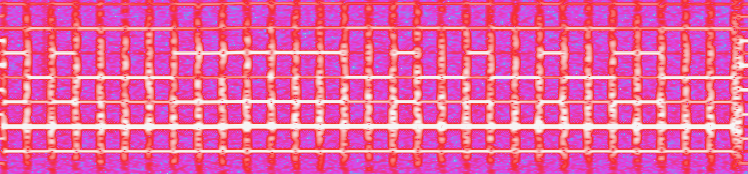

# How & What to Capture?

**HiFi Audio is a Frequency Modulated (FM) format**, (also called AFM) which means more information can be encoded at the cost of extra circuits to de-modulate to baseband for playback allowing for a much higher range of information to be saved.

**Linear Audio is a Baseband format**, this is the same as normal audio cassette tapes, heads read it and send it on directly to an amplifier and or speakers/headphones.

It's recommended to always do some form of standard audio/video capture with your video RF capture to have a sync reference, this makes it easy to check for drift or dropout.

HiFi audio capture (included with video FM for LaserDisc, Video8, Hi8) is the same practice as you would for video, but using the dedicated HiFi FM RF test point instead, though due to how HiFi is recorded if the playback hardware is out of spec or tracking slightly off this can cause drastic differences so its a little more fiddly on VHS and Betamax formats.

## Recorded Information Range

100hz~15khz - Linear 

20hz~20khz - HiFi

20hz-24khz - PCM Digital (48khz)

# Signal Range On Tape

HiFi audio only requires 10msps or 5mhz of bandwidth half the 20msps or more recommended for video, as such audio takes up less space feel free to capture higher and down-sample later.

Linear audio, as its a baseband signal requires direct capture as such its recommended to keep the linear heads clean and use conventional ADCs, like the PCM module found in the [clockgen mod](Clockgen-Mod.md) CX Card setups. 

Linear and or quad track reference capture is best done via SDI analogue to digital converter units, this allows for fluid cross platform setups thanks to affordable cards like the Blackmagic decklink that are supported universally, line-in or modern external audio interfaces & recorders like current Zoom/Sound Devices 32-bit float products such as the F3 or Mix-Pre II, these are ideal due to low self-noise, and ease of integration into capture workflows with standard capture software like virtual dub-2.

## Types of Audio on VHS & SVHS

FM HiFi Stereo (CH1/CH2) (1 Signal Modulated)

PCM Stereo (1 Signal Modulated) (Used on rare JVC SVHS PCM decks)

Linear Mono (CH1) (1 Signal Baseband)

Linear Stereo (CH1/CH2) (2 Signals Baseband)

[Linear Time Code](VITC-&-Subtitles.md) (CH2) (1 Signal Baseband) (Broadcast Decks) (SMPTE 12M LTC.md)

Dolby Stereo (CH1/CH2) (2 Signals Baseband) (1980's Prosumer & Broadcast Decks)

!!! NOTE
    For VHS most Linear audio tapes will be mono or single left channel unless recorded on a known stereo linear deck or any pro level equipment or dubbed from a 2ch format on a pro deck to VHS.
    Mono Linear on VHS will be played back as double mono out of most standard VHS VCRs RCA outputs.

!!! NOTE
    Early Betamax and EIAJ also had 

# Types of Audio on Video8 & Hi8

Double Mono - HiFi FM (Early and 3rd party models)

True Stereo - HiFi FM (Higher end and virtually all later models)

True Stereo - PCM Digital (ENG/Pro Camcorder/Decks )

# Types of Audio on LaserDisc

Analog - Near CD Quality (In either mono or stereo normally with CX noise reduction)

DTS, AC3 - Digital

MUSE/Hi-Vison/HDVS (also W-VHS) had digital audio tracks.

# Types of Audio on Pro Tape Formats 

!!! WARNING
    Most pro level decks, including VHS, use XLR balanced connectors, these prevent interference in audio signal transit and allow the use of standard XLR to TRS (3-poll) connectors, as such only balanced capture devices are recommended to make full use of these outputs.

Umatic - 2ch Linear

SMPTE-A, SMPTE-B, SMPTE-C - 2ch Linear

2" Quadruplex - 2x Linear Audio Tracks (2x Audio but can also contain 1x Mono + LTC Timecode or Cue Tone Track)

BetaCam - 2ch Linear

BetaCam SP - 2ch Linear / 2ch AFM (Modulated "HiFi")

MI/MII - 4ch FM Modulated tracks 

## Types of Audio on D-VHS and W-VHS

These formats are all digital audio. 

## Types of Audio on Video8 & Hi8

HiFi FM Stereo (CH1/CH2) - Carrier Modulated with TimeCode/Video (Video8/Hi8)

PCM Stereo (CH1/CH2) - Carrier Modulated with TimeCode/Video (Hi8)

Video/Audio/Timecode is one one signal RF point.

# HiFi Decode

[HiFi-Decode Wiki Page](HiFi-Decode.md)

HiFi decode converts the FM signal into standard digital audio in a simple 1-command decode workflow.

RF Input --> Demodulation --> Noise Reduction --> 192khz 24bit FLAC File

FLAC Compressed & RAW Uncompressed Captures 8-bit or 16-bit are supported.

## How Does Noise Reduction work?

From Videomem 14/03/2024: 

The main thing with that noise reduction is that the signal is encoded with that scheme.

So it does noise reduction by dynamic range expansion (the reverse of a dynamic range compressor) and it has an specific loudness model/weighting.
Modern techniques should have to infer all these hidden functions and the order of the operations.

Without the noise reduction, the plain FM decoded signal will lack dynamic range. Quiet sounds will sound louder including the noise floor.
The current implementation of the noise reduction/expander of hifi-decode has some limitations. 
Specially when the source signal is low and/or in choral/classical music clips where the dynamic range can vary a lot. The quiet passages can cause the envelope tracking to mistrack.
It produces an extreme lo-fi effect like a worn compact cassette.

I think that defect resides on the weighting and post weighting transfer function applied to get the instantaneous  gain. 
That's not documented on the spec. 

I assumed it to be almost linear but it seems not.

Pop music and/or metal are not so affected as they tend to be compressed by source. So it acts more like a squelch/noise gate in these cases.

Hifi decode does not have dropout compensation. I have some ideas on how to implement it using the rf envelope strength and the post-decoded >20kHz energy.
As it decodes in 192khz sample rate noise bursts should produce higher than expected decoded bandwidth.
An OR condition of both (low rf or white noise peak) should flag a dropout.

The masking could be by linear/cubic time domain interpolation if the interruption is short.
By spectral interpolation if it is mid length (that should sound like a bad gsm call or synth magic vocoder).
And by muting / volume reduction if it is a long interruption.

# Processing Recommendations?

The [EBU R128 Standard](Documents.md) or -11 LUFS normalisation is recommended as its widely used in broadcast/online production this can be done with [StaxRip](https://github.com/staxrip/staxrip) or with [FFmpeg](https://github.com/slhck/ffmpeg-normalize.md#ebu-r128-normalization) tools.

# ADAT Audio Tapes

[DD86 Discord Notes](https://discord.com/channels/665557267189334046/687532251868823553/1136819104964161546)

16-bit & 20-Bit PCM AUDIO (upto 8 tracks)

ADAT / ADAT II

ADAT tapes are audio instead of video it's just all digitally modulated audio, research has begun into this format samples are needed and decks are needed for testing.

{: style="width:300px"}

ADAT data is stored as plain old FSK (frequency shift keying)

{: style="width:300px"}

Here's the overall pattern here:

7 30-bit packets, then the 10x repeating data, then a tone, then 3 more 30-bit packets, then 10x repeating data, then 4 more 30-bit packets, followed by a tone

{: style="width:300px"}

We can actually grab bits from this! Tracking is still off of course

Centre frequency is 1.6MHz at SP playback speed

Bottom tone is constant. While this is going on a secondary carrier above it switches between two tones

# PCM Audio & PCM Tapes

While quite rare, there is PCM standard audio on some VHS tapes, but there are numerous formats that are PCM audio only and this uses the video track to store PCM data blocks visually. 

## PCM Audio Decoder & Hardware

[SDVPCM Decoder](https://github.com/Fagear/SDVPCMdecoder)

[PCM VCD Digital](https://pcm.vcd.digital/)

## Legacy Tools & Docs 

[VideoMem's Superheterodyne Decoding Tools](https://github.com/VideoMem/Superheterodyne-decoding-tools) a [GNU Radio](https://www.gnuradio.org/) script-based HiFi decoding tool. (Ouputs 16-bit 192khz PCM)

# Page End

Next Page [HiFi Decode](HiFi-Decode.md)