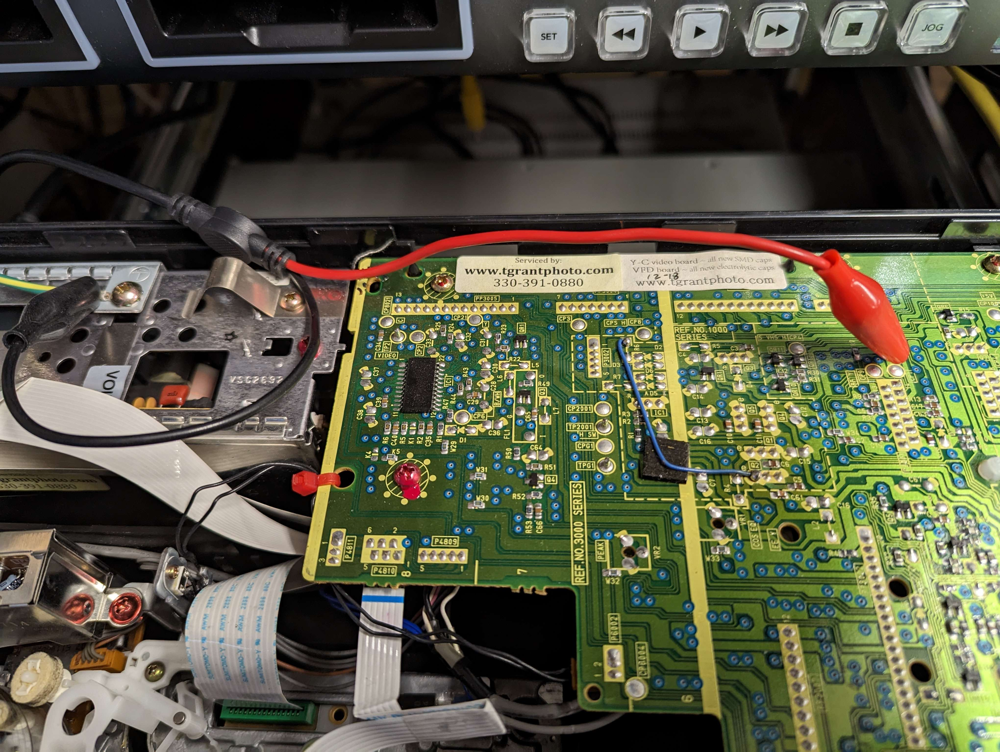
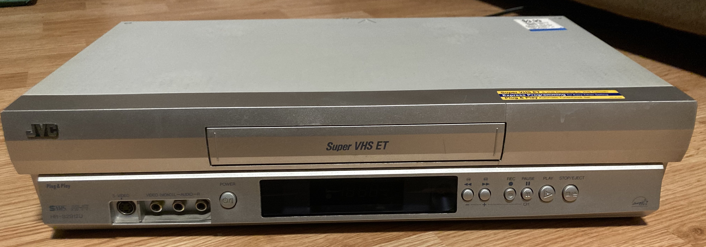
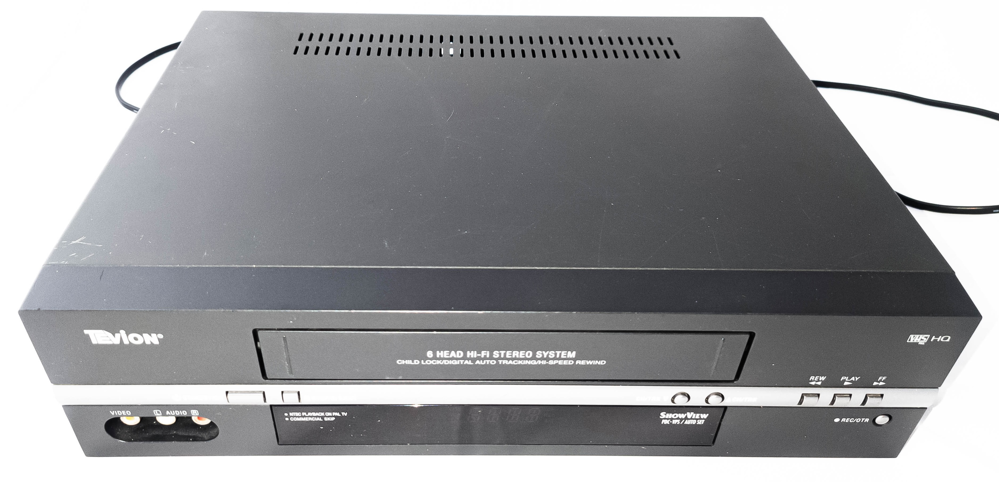
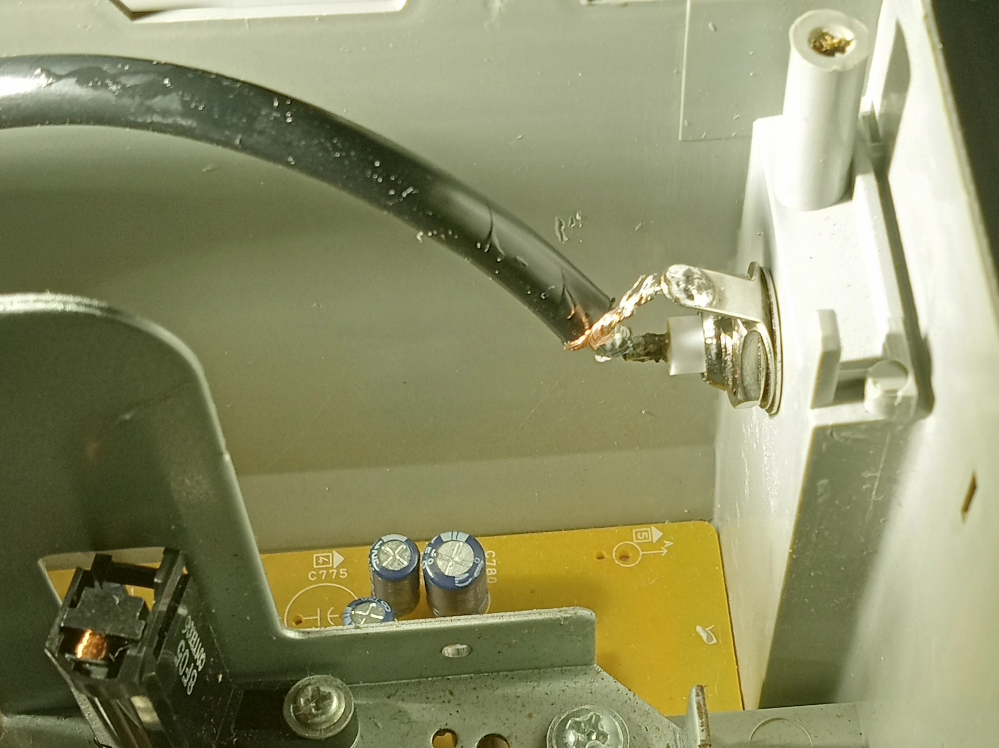
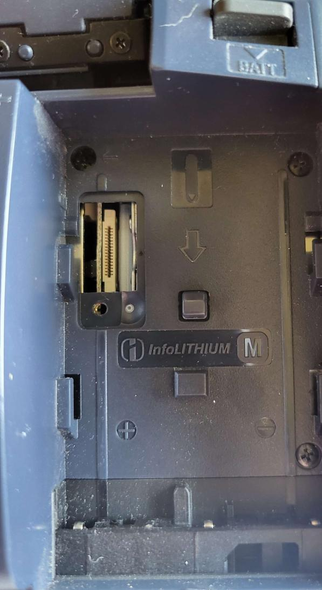
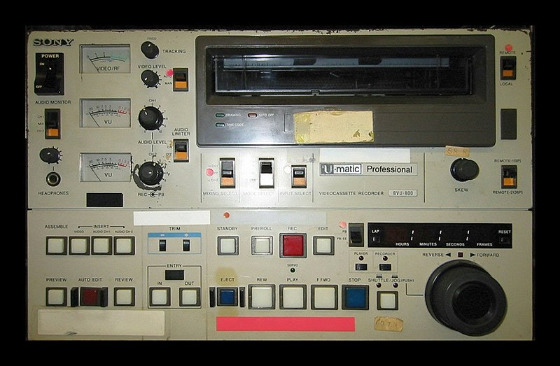
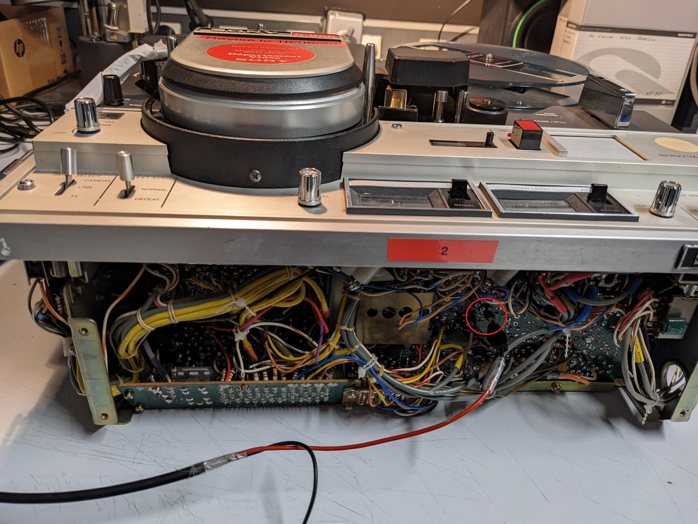

# The Tap List 

This list contains a large library of images and details on "RF Taps" community members have done to get signals out of there VCRs, VTRs, Camcorders & Open-Reel systems for FM RF capture, varying from probes to more permanent BNC installs.

## You can help expand this list!

Via posting your VCR setup in the [DD86 Discord](https://discord.com/invite/pVVrrxd), [Sub-Reddit](https://www.reddit.com/r/vhsdecode/) or via emailing harry@opcomedia.com directly.

## Notes 

!!! IMPORTANT
    For step by step instructions and general guidance on RF Tapping please read the [Hardware Installation Guide](Hardware-Installation-Guide.md).

There are 4 types of RF taps you will observe:

* Test Point + Capacitor on a Bar/Floating-Bar/Poll/Hook Type Points.

* 2.54mm Header to DuPont Connector used on most Sony VCRs. [Best Example](#sony-slv-677hf)

* Jig-Hookup for some camcorders Video8/Hi8/Digital8 there is a 0.5mm pitch (16/18/20 Pin) ribbon cable slot as observed with the [Sony DCR-TRV840](#sony-digital8-dcr-trv840-video8-hi8-ntsc) camcorder.

* Direct Head Amplifier Tap see Panasonic [NV-HS1000](#panasonic-nv-hs1000) & [NV-HS950B](#panasonic-nv-hs950b) for examples for this.

## Index 

- [Open Reel Formats](#open-reel-formats)
    - [EIAJ 1 & 2](#eiaj-12)

- [Colour-Under Formats](#colour-under-formats)
   -  [VHS / SVHS](#vhs-svhs-decks)
   -  [Umatic](#umatic-decks)
   -  [BetaMax](#betamax-decks)
   -  [Sony 8mm](#sony-8mm)
       - [Video8](#video-8)
       - [HI8](#hi8)

- [Broadcast Formats](#broadcast-tape-formats)
   - [Umatic](#umatic-decks)
   - [Umatic SP](#umatic-decks)
   - [SMPTE 1" Type C](#smpte-1-type-c-decks)
   - [SMPTE 1" Type B](#smpte-1-type-b-decks)
   - [BetaCam](#betacam-decks)
   - [BetaCam SP](#betacam-sp-decks)

# Colour-Under Formats

# VHS & SVHS Decks

## Panasonic NV-HS950B

K-Mech S-VHS HiFi VCR 90s era

!!! NOTE
    The head amplification board may have cracked solder joints even if serviced the amplification module & shielding should be removed for inspection & properly reflowed with flux and 99% Isopropanol brushing clean the area if cracked like in the images.

4 Philips screws on the sides pull outwards and lift from the back sides, metal is stamped so be careful not to slice fingers by sliding them across the edge.

{: style="width:800px"}

{: style="width:530px"}{: style="width:400px"}

{: style="width:500px"}

Standard test point tap this can fit a 25v 10uf cap nicely inside the removable TBC module easy access to a solder-able surface for grounding, then thread RG178 cable through the plastic mounting gap to a BNC.

### Direct Head Amplifier Tap Example 01

!!! NOTE
    This is a direct tap testing deck, you do not need to directly tap the head amplifiers but if you do it will require a capacitor added in-line, and the pin wedge method will be easier.

{: style="width:600px"}

1.  Head Amplifier Board (Green Connector) Pin 10 Direct RF C (Tested Working VHS issues with SVHS) (Pin 11 does not work)

2.  Head Amplifier Board (Green Connector) Pin 16 Direct Audio RF

Requires a 10uf capacitor in-line for SVHS RF captures on direct taps the signal is just too low otherwise.

03. Test Point TL3001 RF-C (VIDEO ENVE) Requires 10uf cap. (VHS/SVHS Work)

04. Test Point TP2001 RF Head Switching (H.SW)

5.  Test Point TW4502 HiFi RF (Bottom Left Side)

6.  Test Point TWGND Ground next to HiFi RF

## Panasonic NV-HS1000

K-Mech, the easiest tap point is the head amplifier, removal of the mainboard is ideal for adding BNCs for RF taps, but is quite a tight case.

### Direct Head Amplifier Tap Example 02

{: style="width:400px"}

{: style="width:400px"}

From left to right:

1.  Pin 4 is HiFi Audio RF

2.  Pin 13 is Video RF

The pin tap method wedges the capacitor negative leg between the ribbon cable and the board connector, 3.3uf electrolytic tested and working well.

## Panasonic AG1980P

01. TP1 ENV - Video RF 

{: style="width:400px"}

{: style="width:400px"}

## Panasonic AG5700

01. TP3301 ENV Test point on top of main PCB (which is RF C from head amp via 0.01 uf capacitor) - tested ok with DDD

02. todo: hi-fi

## SANYO VHR-VT221A / NZ 

(Made by Orion?)

01. TP4002 Video Envelope

02. TP4001 Head Switching Pulse

## Samsung-SV623F

Samsung made VCR Range late 90s and on (including early 2000s and later Sony)

{: style="width:800px"}

Test points on Samsun SV-6213 with mechanical mechanism removed

Test points are typically wires with a hole underneath on the left side of the mechanism.

With the Domesday duplicator at least, it seems the test point ground doesn't work very well. So far I got the best result by connecting to the vcr mechanism chassis rather than the test point ground and putting a 0.1 uf film capacitor between the env wire and wire for capturing. May still need some more adjustments to work optimally but not sure.

1.  TP301 ENV - Video RF

2.  TP302 A-Out Audio Baseband

3.  TP303 V-Out Composite Video

4.  TP602 HD SW - Head Switching Signal

5.  TP601 CTL - Control Track Signals

6.  W022 GND - Grounding

HiFi RF Capture is not possible, due to the modern IC used.

## Sony SLV-SE60

Sony late 90s/early 2000s

{: style="width:500px"}

Test points on connector with shielding around it behind head drum (CN262)

1.  PB RF - Video RF
2.  RF SWP - Head switching signal
3.  GND - Ground
4.  CTL - Control track signal
5.  AV ADJ - Pin used to activate head switch point adjustment

Separate 2-pin connector for FM audio right of mechanism (CN341 on SLV-SE60 and similar, C362 on SLV-SE800 and related, may be different on others)

01. GND
02. HF ADJ - Audio FM (Needs test)

DuPont Connector RF Tap [Female Cable Link](https://www.amazon.com/dp/B09VB9TS89/) [Male Cable Link](https://www.amazon.com/dp/B09VBC7611/)

## Notes

For the PAL variants at least, it seems these often have some capacitors in the power supply go bad, which can cause interference on image on normal playback, and failure to turn on depending on which ones are bad.

## Sony SLV-677HF

{: style="width:500px"}

DuPont Connector RF Tap [Female Cable Link](https://www.amazon.com/dp/B09VB9TS89/) [Male Cable Link](https://www.amazon.com/dp/B09VBC7611/)

1.  REC CUR (Current)
2.  PB RF - Video RF
3.  RF SWP - Head switching signal
4.  GND - Ground

{: style="width:300px"}

## Sony SVO-2100

Top Board, Floating Bar Type Test Point 

Mainboard Tap

J1261 ENV (Video RF)

J1264 GND (Ground)

Direct Head Amp Tap (Tested)

TP182 - Video RF 

Shield - Ground

{: style="width:300px"}

{: style="width:400px"}

{: style="width:400px"}

{: style="width:400px"}

{: style="width:400px"}

{: style="width:400px"}

## Sony SVO-5800

Head Amplifier board right to left order (based off expansion probe board)

1. AFM PB RF 
2. Video CH-1 REC Current
3. Video CH-2 REC Current
4. Video PB RF Output
5. RF Switching Pulse
6. Ground

{: style="width:400px"}

## Sony SLV-E730

{: style="width:400px"}

{: style="width:400px"}

{: style="width:300px"}

## Samsung SV-DVD (1E) line (DVD/VHS Combo Decks)

They have a dedicated header of test points called TP01

01. V. Out - Composite Video
02. A. Out - Baseband Audio Out
03. V. ENV - Video RF
04. H' D SW - Head Switching Signals
05. CTL - Control Signals
06. GND - Ground Pin

HiFi RF Capture is not possible, due to the modern IC used.

## Bush VCR925NSIL (Orion-made)

Test Points are left-hand side of the mainboard, using a floating bar style next to the TV pack.

01. HiFi - HiFi RF
02. H.SW - Head Switching Signals
03. V. ENV - Video RF (Requires cap 10uf & 100uf tested)
04. Service (Unknown Need to Check Service Manual)

{: style="width:400px"}

{: style="width:400px"}

Deck With mechanical and Fused IEC14 & BNC Bulkhead Mods

{: style="width:400px"}

## Thomson VP-4650

pal/secam/ntsc Thomson vp-4650

01. PB_YC (PB On Board Label)

## Panasonic AG-MD830

{: style="width:500px"}

1.  Video PB TP6 (Test)
2.  HiFi - Currently Unknown

Due to the removable back service panel easy bulkhead space for 2-6 BNC's.

## Panasonic AG-7150 (Professional 3U Rackmount Player)

{: style="width:800px"}

1.  Video board 1, TP4 ENV - Video RF (works with and without caps good signal) 

2.  HiFi - Audio board A2 TP707 (TP4707 In manual) underneath plastic retaining clamp.

{: style="width:400px"}

{: style="width:400px"}

## Panasonic AG-5260 (Compact K-Mech)

[User Manual](assets/images/vhs/Panasonic-AG5620/Panasonic-AG-5260-User-Manual.pdf) / [Service Manual](assets/images/vhs/Panasonic-AG5620/Panasonic-AG-5260-Service-Manual.pdf)

Most test points are accessible on the top board or underside of the board which flips out to the side, 10uf cap on Video test point clean and stable both RF and conventional, good S-VHS LP playback.

The RF Points can be accessed via the top or underside, you can also adjust the head switching position with ease during playback on this unit.

1.  Video ENV TP1 (Top, the front side of the unit) 

2.  HiFi ENV TP5 (Top, the back side of the unit) (Filtered Output Not Usable)

{: style="width:800px"}

{: style="width:800px"}

{: style="width:500px"}

Direct Head Amp Taps are needed for full hifi, this allows this deck to do HiFi RF + Linear as audio output is selectable on the front pannel.

{: style="width:500px"}

{: style="width:450px"}{: style="width:400px"}{: style="width:550px"}

With the bottom of the shield conrnoer being cut off there is enough space for RG178/RG316 routed out the testing cut out of the main PCB.

### Audio Control

HiFi Output

{: style="width:300px"}

Linear Only Output

{: style="width:300px"}

!!! NOTE
    for NV-HD/NV-SD models, the non-European and multi-system variants are sometimes closer to the next year's central Europe variant with the same number (excl letter prefix).

## Panasonic NV-HD610EC

{: style="width:600px"}

{: style="width:600px"}

1. RF C TP TP3001 video RF (main board)
2. RF TP4502 Hi-Fi RF (on head amp, not tested) 

## Panasonic NV-HD620EC

{: style="width:600px"}

{: style="width:600px"}

1. RF C TP TW3001 video RF (upper left behind luma/chroma pack when seen from the front)
2. RF - TP4502(on head amp) / TL4519 on hi-fi pack - Hi-Fi RF (don't remember which one I used)

## Panasonic NV-HD630

NV-HD630, NV-HD630B etc

Z-Mech, Mostly easily accessible test points without mech removal needed, 10uf caps recommended and tested.

Marked in order

{: style="width:600px"}

{: style="width:600px"}

{: style="width:600px"}

1. TW3001 RF C - Video FM 

2. TW501 FM Mix Out - HiFi FM RF

3. TW26 CVBS Out - Composite Video Output

4. TW3 CVBS Input - Composite Video Input

5. TW502 - ENVE (HiFi/Video FM)
   

**Notes** After testing TW502 is normally HiFi but other users have reported no hifi on FM Mix Out and Video on the test point the service manual needs further investigation.

This unit used for the tap photos is the 3rd revision of testing, having duel hifi taps and a external ground added for testing in most cases you will only need one hifi point and chassis ground will work fine but in edge cases you might need external grounding.

CVBS/Composite Test Point is easy to add a BNC for standard CVBS out without using SCART.

Stock [AD8367](https://www.aliexpress.com/item/1005004251551614.html) amplifyer works with test points, for CX Card use.

{: style="width:400px"}

## Panasonic NV-J30 HQ

01. TP-3001 - Video RF

**Note:** No HiFi on this deck.

## Panasonic Panasonic AG-1730

Unknown Tap Points to Update

{: style="width:400px"}

{: style="width:400px"}

{: style="width:400px"}

{: style="width:400px"}

{: style="width:400px"}

## JVC HR-S9800U

01. A.FM
02. PB.FM

## JVC JVC HR-S7500

There is enough space for 2 BNC bulkheads next to the right side of the TV Modulation back.

01. A.PB-FM TP2253 - HiFi FM 
02. PB-FM TP106 - Video FM 

{: style="width:400px"}

{: style="width:400px"}

{: style="width:400px"}

{: style="width:400px"}

{: style="width:400px"}

## JVC-BR-S622U

**Note** we have [data & dumped EPROM chips](https://drive.google.com/open?id=1pZup6UA-aphUDAUQtvUblo1P73u8qpID&authuser=harry%40opcomedia.com&usp=drive_fs) for this VCR.

{: style="width:400px"}

{: style="width:400px"}

{: style="width:400px"}

{: style="width:400px"}

## JVC BR-S800U

**Note** we have [data & dumped EPROM chips](https://drive.google.com/open?id=1rzTsGS0e33lAOFoW04JKMUVgPuzAiZGZ&authuser=harry%40opcomedia.com&usp=drive_fs) for this VCR.

For hifi .01uf polymer capacitor.

For video .1uf polymer capacitor.

{: style="width:400px"}

{: style="width:400px"}

{: style="width:400px"}

## AKAI-VS-G245EA

TP851 - PB ENV Directly On Head Amplifier Board

{: style="width:400px"}

## LG-V280

ENV is on a flat touch test point pad, easily solder able onto. 

{: style="width:400px"}

{: style="width:400px"}

{: style="width:400px"}

## Samsung DVD-VR336

Test Points are off to the left side of the VCR next to the power supply shield.

Metal Chassis. 

01. TP1 - V-Out (CVBS)
02. TP2 - A-Out (HiFi??)
03. TP3 - ENV   (Video FM RF)
04. TP4 - H'D SW (Head Switching)
05. TP5 - CTL (Control Track)
06. TP6 - GND (Grounding) 

{: style="width:600px"}

{: style="width:400px"}

## Panasonic NV-VP30

DVD VHS Combo VCR

01. TW501 - FM Mix Out - HiFi FM

02. TW4502 - FM-ENV  - Video FM 

{: style="width:400px"}

{: style="width:400px"}

{: style="width:400px"}

## Panasonic PV-7450-K

1997 era unit.

01. TP3002 - Video FM RF 

HiFi Unknown

{: style="width:400px"}

{: style="width:400px"}

## Panasonic-PV-4612S

Panasonic PV-V4612S( Tested), PV-V402, PV-V4022, PV-V4522, PV-V4612

RF Tap: TP3002 (10uf/50v)

HIFI Tap: TP4207 (10uf/50v)

{: style="width:400px"}

{: style="width:400px"}

{: style="width:400px"}

{: style="width:400px"}

## JVC-HR-S2912I

Video RF: TP106 PB FM 

HiFi RF: TP2253 A.PB

{: style="width:400px"}

{: style="width:400px"}

{: style="width:400px"}

{: style="width:400px"}

## Samsung-DVD-V5450

CVBS Test Point: V.OUT W326

Audio Test Point: A.OUT W325

Video FM: ENV W324

Ground: W321

{: style="width:400px"}

{: style="width:400px"}

## JVC-HR3800U

TP2253 A.PB.FM

TP106 PB.FM

{: style="width:600px"}

{: style="width:600px"}

{: style="width:600px"}

## Panasonic AW1 

World Wide System VCR, Similar layout to NV-HS1000

{: style="width:600px"}

{: style="width:600px"}

## Mitsubishi-HS-U780

SVHS / HiFi

TP3N/3 - Video RF

TP2A   - HiFI RF

{: style="width:600px"}

{: style="width:600px"}

{: style="width:600px"}

{: style="width:600px"}

{: style="width:600px"}

## Tevion MD 2588

VHS HQ / HiFI

DuPont Type Test Header at back of unit, vents and blank area available for BNCs

{: style="width:400px"}

E 5v  - JP508

P/ADJ - JP507

ENVE  - JP506

H/SW  - JP505

CTL   - JP504

GND   - JP503

Video - JP502 (CVBS Output)

Audio - JP501 (HiFi??)

SCART / RCA Outputs

{: style="width:600px"}

{: style="width:600px"}

{: style="width:600px"}

## Loewe OC3800H 

Rebadged Panasonic HS1000

SVHS / HiFi

TP1: Video RF

{: style="width:600px"}

{: style="width:600px"}

{: style="width:600px"}

{: style="width:600px"}

{: style="width:600px"}

## Fisher FVH-P450S (Sanyo)

{: style="width:600px"}

Test points on head amplifier unit
* TP182 - Video RF
* TP183 - Head switch

Most Sanyo/Fisher decks from the early-mid-late 90s use similar setups with video rf pin test point easily accessible on the head amp unit

Audio RF does not have a separate test point

## Philips DVP3345V17

TP 310 - C-PB

J28 - Ground 

{: style="width:600px"}

{: style="width:600px"}

{: style="width:600px"}

# BetaMax Decks

Sony generally used the generic 2.54mm header pins on there VCR formats for test points so you can easily use DuPont Connectors [Cable Guide & Links](Hardware-Installation-Guide.md)

## Sanyo VTC5000

{: style="width:400px"}

DuPont & Bulkhead 

Alignment Test Point (3x 2.54mm header pins) 3rd one right back orientation 3rd one left front orientation, had to sand the de-modulation boards shield as its prone to oxidation, 3ml of flux and lead-free solder for the grounding shield, and used a 100uf 16v electrolytic, and one trimmed and stripped 50cm BNC to SMA generic full-size bulkhead, 1/2 inch drill for the plastic with guide hole melted via soldering iron tip, do pay attention to the audio board potentiometer pots when drilling and placing your bulkhead as they are delicate but easily replaceable.

{: style="width:800px"}

{: style="width:400px"}

## Sony SL-C40 ES

{: style="width:400px"}

Test points on the left side of the main board, there is a 3 pin header and a 5 pin header.

{: style="width:400px"}

1.  Pin 5 - Video RF

2.  Pin 2 - Ground

## Sony SL-F1 E/UB

E is Europe model, UB is UK I think?
CN3 on the underside of the video sub-board

Note, The numbering in the schematic/block diagrams seems to be the inverse of the numbering on the pcb diagram and on the actual silk-screening on the pcb. Pin4 is clearly ground, not pin 2. 

01. PB CTL
02. RF SW(2)
03. PB Y-RF  (video RF)
04. GND
05. RF SW(1)

{: style="width:400px"}

The SL-2000 is the US version of this, may or may not have the same connector.
See also notes on betamax palsite about unit for servicing notes (important to replace caps in TT-F1 tuner/timer/power supply module if not done already and that is used.)

http://www.palsite.com/slf1tech.html

## Sony SL-2710

RF info:

Video RF tap points are located near the head drum:

- Pin 3 signal
- Pin 4 ground

If signal is low, turning knobs to the right of tap points and returning to their original positions may improve output.

Capture/processing issues:

Captures from recordings that have HiFi audio result in bright video output with vhs-decode.

Captures from recordings with linear audio result in normal expected video levels, although luminance shifts appear to cause tbc disruptions. 

Various captures attached for reference with variable info in file names

{: style="width:400px"}

{: style="width:400px"}

{: style="width:400px"}

{: style="width:400px"}

{: style="width:400px"}

# Sony 8mm

[Dedicated Sony 8mm Wiki Page](Sony-8mm-Formats.md)

8mm camcorders can be finnicky and not all units deal with having a load connected to the RF test point very well, so do not expect smooth sailing here [without reading the hardware guide](Hardware-Installation-Guide.md#step-03-installing-a-capacitor-on-your-rf-tap) as a decoupling cap (10uf) can be required.

If you have no experience with soldering/electronics attempting to do RF capture of 8mm may therefore prove challenging. VCRs tend to be easier to work with but those tend to be very expensive and also usually require a fair bit of service as many of the models often have issues with both electronics and mechanical faults. 

Sony's newer 8mm camcorders can already give excellent results with lossless conventional capture (Via S-Video) if cleaned and in good head condition so the gains from FM RF capture may not be as large as with other formats as there is no VBI data from camcorder media, however for deck recorded Video8/Hi8 this might not apply but RCTC data can only be easily extracted via FireWire.

# Digital8

## Sony Digital8 DCR-TRV840 (Video8 & Hi8) (NTSC)

Also Applys to,  DCR-TRV738E, DCR-TRV740, and DCR-TRV740E.

NOTE: May require 10uf cap, DCR-TRV740 does.

[User Manual](assets/images/Sony-8mm/Sony-Digital8-DCR-TRV840/Sony_Digital8_DCR-TRV240_DCR-TRV340_DCR-TRV740_DCR-TRV840_User_Manual.pdf) / [Service Manual](assets/images/Sony-8mm/Sony-Digital8-DCR-TRV840/Sony-Digital8-DCR-TRV840_DCR-738E_Service_Manual.pdf)

[Jig Method](Hardware-Installation-Guide.md#jig-method) 20pin Jig Used

{: style="width:400px"}

At the back of the camcorder, battery area, there is a rubber or plastic grommet once removed exposes the Jig connection point for testing.

{: style="width:400px"}

1. Pin 5 - PB RF (Video/Audio)

2. Pin 6 - Ground

{: style="width:400px"}

## Sony Digital 8 DCR-TRV238E (Video8 & Hi8) (PAL)

{: style="width:400px"}

{: style="width:400px"}

1. Pin 6 - PB RF (Video/Audio)

2. Pin 5 - Ground

## Sony Digital8 DCR-TRV355E

16-pin JIG

Pin 3 - Signal 

Pin 4 - Ground

Requires Capacitor In Line

{: style="width:400px"}

{: style="width:400px"}

## Sony Digital8 DCR-TRV320E

20 Pin Jig

Pin 5 - Signal 

Pin 6 - Ground 

{: style="width:400px"}

{: style="width:400px"}

{: style="width:400px"}

## Sony Digital8 DCR-TRV480

16-pin JIG 

OEM JIG `CPC jig connector (J-6082-539-A)`

Pin 2 - Signal 

Pin 6 - Ground

{: style="width:400px"}

{: style="width:400px"}

{: style="width:400px"}

{: style="width:400px"}

## Sony Digital8 DCR-TRV460

Apply's to DCR-TRV360/TRV361/TRV460/TRV460E/TRV461E.

16-pin JIG 

Pin 2 - Signal

Pin 6 - Ground

{: style="width:400px"}

{: style="width:400px"}

# Video 8 

## Sony Video8 EV-A60 (NTSC)

Right-hand side of the mech, connector CN402

Standard 2.54mm header pins used. 

01. Ground

02. PB RF

03. PCM PB (Hi8 Models Only)

{: style="width:400px"}

{: style="width:400px"}

## Sony Video8 PAL-VPL150

{: style="width:400px"}

{: style="width:400px"}

{: style="width:400px"}

{: style="width:400px"}

jig connector: 3710-000413

https://es.farnell.com/en-ES/samtec/fte-107-03-g-dv/header-0-8mm-2x7way-smt/dp/3668177

`CONNECTOR-SOCKET;14P,2R,0.8mm,STRAIGHT,S`

## Sony Video8 CCD-TR517

`XR` Era Camcorder

Pin 5 - Signal 

Pin 6 - Ground

{: style="width:400px"}

{: style="width:400px"}

{: style="width:400px"}

# Hi8

## Sony Hi8 CCD TVR66E

FPC adapter is six pin and secured to to the battery by Gorilla double sided tape to strain relief the fpc

10uF NP cap on pcb, but I have not experimented with other values much. 4dB gain on DdD appears optimal.

(numbered 1-16 from top)

Pin 6 is Signal

Pin 8 is Ground 

{: style="width:600px"}

{: style="width:200px"}

{: style="width:200px"}

## Sony Hi8 TVR318

[Jig Method](Hardware-Installation-Guide.md#jig-method) 16pin Jig + Cap Used (Appears to require external amplification on inital testing)

{: style="width:400px"}

{: style="width:400px"}

{: style="width:400px"}

{: style="width:400px"}

## Sony Hi8 CCD TRV615

[User Manual](https://github.com/oyvindln/vhs-decode/assets/images/Sony-8mm/Sony-Hi8-CCD-TRV615/Sony-Hi8-CCD-TRV615-User-Manual.pdf#FIXME) / [Service Manual](https://github.com/oyvindln/vhs-decode/assets/images/Sony-8mm/Sony-Hi8-CCD-TRV615/Sony-Video8-Hi8_CCD-TRV15_TRV15E_TRV15EP_TRV15PK_TRV25_TRV25PK_TRV35_TRV35E_TRV65_TRV65PK_TRV85_TRV93_TRV215_TRV61.pdf#FIXME)

`XR` Era Camcorder 

16 Pin Jig

Pin 6 - Signal 

Pin 8 - Ground

{: style="width:400px"}

{: style="width:400px"}

{: style="width:400px"}

# Broadcast Tape Formats

These are video-tape formats that have Composite video and or chroma/luma separated tracks on tape instead of colour-under tapes like the consumer~prosumer formats.

# Umatic Decks

There is two types of Umatic decks standard Umatic with Lo-Band PAL/NTSC and Hi-Band PAL and then the later to last generation decks with Umatic SP with HiBand PAL/NTSC.

## Sony BVU-800

Should apply to  NTSC / PAL / SECAM versions.

Tap point is TP29 on board YD.

{: style="width:400px"}

{: style="width:400px"}

{: style="width:400px"}

## Sony VO-5630

Tri-standard Umatic Deck (NTSC / PAL / SECAM).

Video RF tap point is TP18 on board RP-8B.

{: style="width:400px"}

{: style="width:400px"}

{: style="width:400px"}

# SMPTE 1" Type C Decks

Wildly found in UK/USA/France 

## Sony BVH-3100PS

Sony BVH-3100 (Applies to NTSC/PAL/SECAM versions)

Behind the control panel the first card on the top, number 7 VO-16

First test point is on the left hand side TP12 is video FM no capacitor required on initial testing. 

Behind the control panel, you can access a RF test point on the top board (VO-16). It's the first thing on the left, called TP12.

RF Captures have been made without caps, more testing required.

{: style="width:400px"}

Test Point Tap

{: style="width:400px"}

# SMPTE 1" Type B Decks

Widely found in Germany/Mainland Europe 

Decks Yet to be tapped and tested 

# Open Reel Formats

These are formats that are non-cassette based like film reels and are manually laced onto a take-up reel for playback or recording, and pre-dates most formats you will see or know about in most common use.

# EIAJ 1/2

## Sony AV-3670CE

1/2 inch EIAJ

Take the VTR out of its wooden box, Board V3 is located at the front of the machine.

Test point TP207 is located in the middle of the board. It's called TP207 in the manual, though on the board it may just be called "TP7".
The point is located directly to the right of the text.

Use a capacitor, especially if you want to monitor the composite output at the same time otherwise, the RF level will collapse.

{: style="width:400px"}

{: style="width:400px"}

{: style="width:400px"}

{: style="width:400px"}

# BetaCam Decks

Decks Yet to be tapped and tested 

# BetaCam SP Decks

Decks Yet to be tapped and tested 
