# Acronyms Guide

This guide is something most projects forget, technical detail while needed to understand the scope and scale of abilities, is not easy to learn from the outside nor is common short-hand speak between new and current userbase members or the layman users who may stumble upon the project, we hope this guide provides some clarity.

## Basic Electrical Terms

"iron" - Soldering Iron

"Tin" or "Tinned" Soldering iron with solder on tip

"pot" - Potentiometer

"cap" - Capacitor

Electrolytic Cap - Fluid Wrap Based Capacitor (no longer recommended)

Ceramic Cap - Solid State Capacitor (defacto for FM RF taps)

"DC" - Direct Current i.e battery/internal transformer

"AC" - Alternating Current i.e mains power

## RF Tap & Tap Point

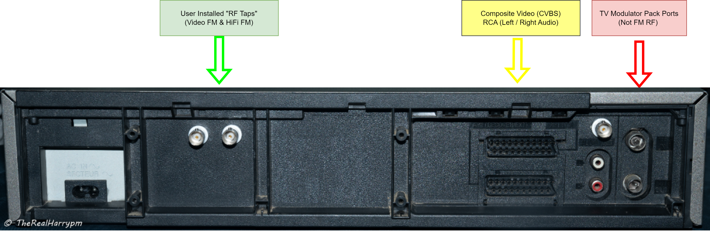{: style="width:700px"}

An RF Tap is a [BNC or SMA (bulkhead type)](Hardware-Installation-Guide.md#types-of-rf-connectors) connector that's mounted to the back normally (if there is space) of an analogue playback device, then a cable normally RG178/RG316 is routed going to a Video or HiFi audio [Test Points](Hardware-Installation-Guide.md#types-of-test-points.md) alongside a grounding point or soldered to a point in the mainboard or amplification boards ware a full unprocessed modulated signal can be found this is referred to as a "Tap Point".

{: style="width:200px"}

> CVBS & HiFi FM/Video FM to mounted BNC's - [NV-HS630B](004-The-Tap-List.md#panasonic-nv-hd630b)

Adding a bulkhead to a VCR allows reliable easy and permanent access to the signals for external capture, without disrupting the shielding by keeping the lid off and such or ripping your test point away if a cable is snagged.

This can also allow you to add a Composite output on for example SCART-only PAL players.

!!! NOTE
    Most current setups have a 3.3uf to 10uf decoupling capacitor on the Video RF test points this allows real-time normal playback alongside FM RF capture, so you can get standard audio and video playback as a reference if needed, and can avoid the white snow or streak effect which is hard signal losses.

# TV Systems 

Analog TV Systems

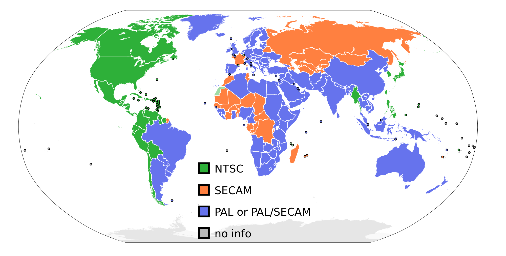{: style="width:500px"}

The 50i and 60i (59.97i) rates are based off the 50hz and 60hz power grid systems to this day this holds true for region with rates of 25/50/100 and 30/60/120 fps rates being standard in progressive frame output and interlaced 1080i25 being the general global broadcaster standard alongside 720p59.97 for USA.

Each region in the world initially adopted a fixed field/frame rate wise then a colour standard, a key point here France had 819-line & made SECAM to be special so in USSR/French & controlled regions of Africa adopted SECAM before it all switched over to PAL in the later 90s to 2000s and then digital NTSC/PAL and HDTV.

(Japan is a funny one with a 50hz & 60hz grid system but NTSC-J colour)

- `525-line NTSC at 29.97i rate`
- `625-line PAL  at 25i rate`

These are the most common standards but sub-variants like NTSC-J, PAL-N, PAL-M etc can be very confusing SECAM is its own colour-encoding scheme adjacent to PAL at the same frame/field rate.

PAL decks for example can also playback NTSC tapes but the video output will be NTSC 29.97i frame rate with PAL 4.43Mhz colour signal out the back video ports, this is what native PAL-N is for example.

Australia of note had a 576p50 standard for broadcasting.

## Y+C, Luma + Chroma, Luminance/Chrominance

Luma = Light, Black & White Image information

Chroma = Colour, Colouring of Image information

Example:

Composite is combined Y+C so 1 signal and 1 ground. 

S-Video has Y + C (Modulated C) on 2 pairs of shielded signal and ground wires 

# [Colour-Under Tape Formats](assets/docs/Technical-Standards-Docs/Sencore-VCR-Tape-Colour-Under-Formats.pdf#FIXME)

* JVC 1/2inch `VHS`, `VHS-C`, `SVHS`, `SVHS-C`

* Sony 1/2inch - `U-Matic`, `U-Matic SP`, `Betamax`, `Super Beta`, `ED Beta`

* Sony 8mm - `Hi8`, `Video8`

* Philips 1/2inch - `VCR N1500`, `VCR N1700`, `V2000`

All use a “colour under” system of recording.

In this system, the luminance (B/W image information) is separated from the chroma (colour) information and sent to dedicated circuits to be processed.

The luminance signal is then used to FM modulate a carrier before it is recorded on the videotape, the chroma signal is then heterodyned with a local oscillator signal to down-convert the 3.58 MHz* frequency before being recorded onto the videotape.

Ranges slightly differ based on TV system & format.

Hence Luminance & Chrominance ends up as 2 separate .TBC files a digital "S-Video" as we now call it.

## Baseband RF

{: style="width:200px"}

> EBU 75% Bars - ONWON HSS2102S 100Mhz Digital DMM/Oscilloscope/Signal Generator*

This is an RF signal that has no modulation such as Linear audio that goes from a head to a pre-amp to speakers directly, or composite video that's meant to go directly to an analogue CRT television, or comes directly off an analogue camera.

## Composite & S-Video

{: style="width:400px"}

S-Video (Black), RCA Video (Yellow), RCA Left Audio (White), RCA Right Audio (Red)

### Composite (CVBS)

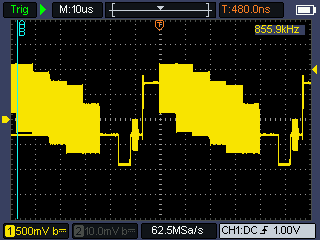{: style="width:300px"}

> ONWON HSS2102S Oscilloscope Low Resolution Raster

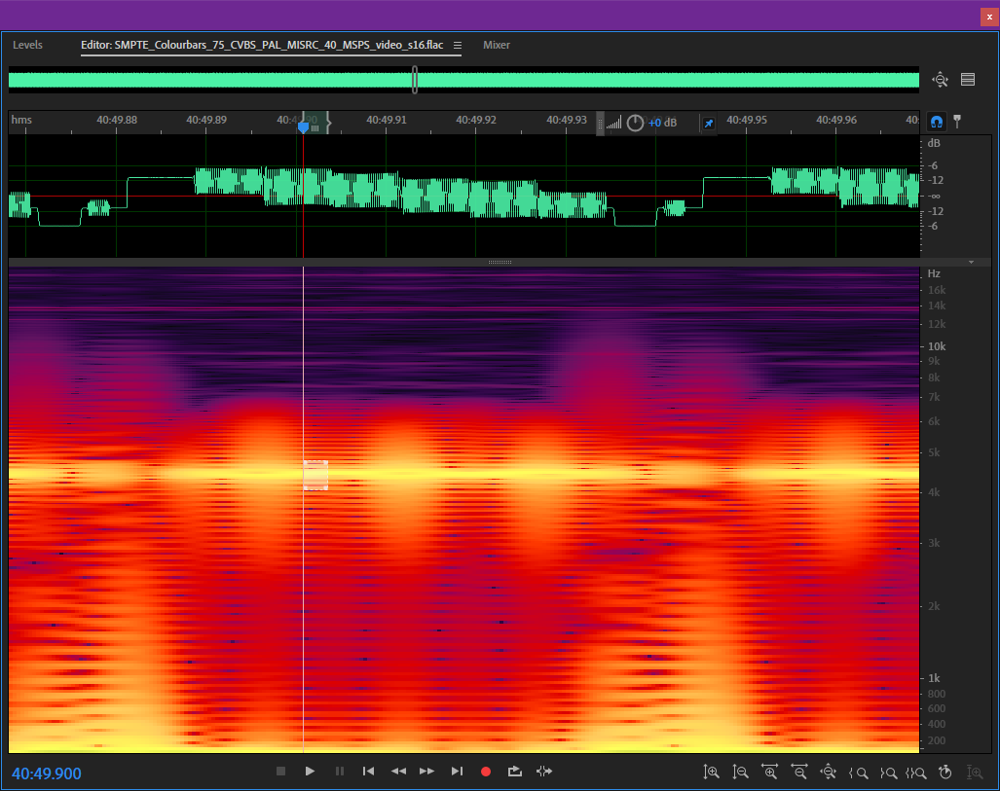{: style="width:700px"}

> Adobe Audition Full Resolution Raster from FM RF capture (.flac file) with spectrograph.

**C**omposite **V**ideo **B**aseband **S**ignal or **C**olour, **V**ideo, **B**lanking, & **S**ync.

The defacto baseband video signal standard with 1 signal (centre) and 1 ground (outer) wire, used in all cameras from the 1950's to the 2010s and was the defacto video signal standard with Yellow RCA & BNC connectors used for physically interfacing with equipment.

### S-Video

Also called: **S**eprated **V**ideo, **Y**+**C**, **Y**/**C** **443**

!!! WARNING
    Commonly confused with SVHS which introduced the standard to consumer VCR's.

In simple terms video signals are carried over 2 pairs of shielded wires the Luminance is baseband composite video and Chrominance is Quadrature-modulated (QAM) to prevent RF interference such as dot-crawl and this signal is then de-modulated and muxed back together in hardware on the playback device.

!!! TIP
    The TBC format in Y+C is S-Video playback compatible.

This is called a Y+C pair when used with BNCs on prosumer equipment 

(4 pins & 1 plastic orientation bit) (four-pin mini-DIN)

An analogue interface conveying luma (Y’) and quadrature-modulated
chroma (C) separately on a specific four-pin mini-DIN
connector. 

S-video is not exactly component video, and not
exactly a composite video signal. 

There are three versions of S-video:

S-video-525 (NTSC), S-video-525-J (used in Japan), and S-video-625 (PAL).

# Time Base Correction

Abbreviated as "TBC" 

Analogue video is stored in magnetic strips or burned pits of information (Tape/LaserDisc) each of which contains parts of the video picture signal. 

Due to the mechanical nature of reading these mediums the signals can drift within a fairly large range of tolerances and is never 100% the same between recordings and playback devices, very much so for tape this is why signal auto tracking, physical guide adjustment posts and time base correctors exist to compensate.

The core process of time base correction is simply re-timing the lines of a analogue video picture to be even to the previous lines without it alongside, this is alongside other signal correction as images can be off-colour (phase) or skewed or affected by copy protection methods like macrovision affecting black or white levels.

In layman's its like a shredded piece of paper being put back together one piece at a time.

This can be on a line level, 4fsc frame level, or entire signal level, the software TBC used by the decode projects does this on an entire signal level.

| Frame With Bad TBC | Frame With Good TBC |
| ------------------ | ------------------- |
| 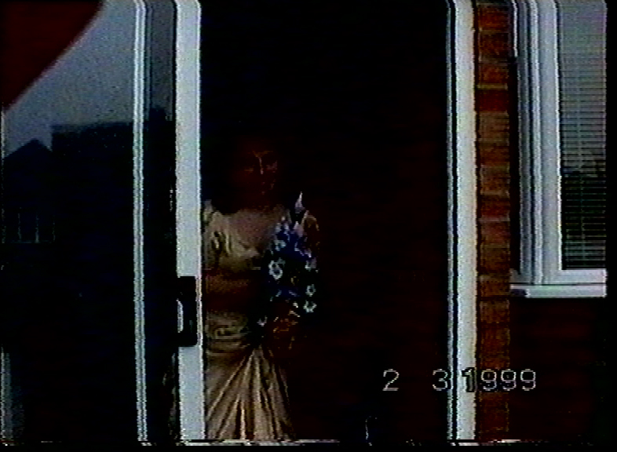{: style="width:400px"} | 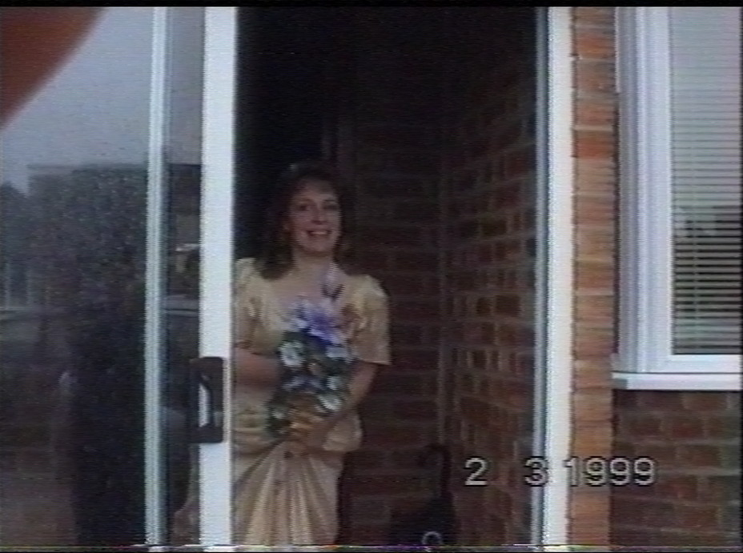{: style="width:400px"} |

## TBC - Time Base Corrected (File Format)

This `.tbc` is the processed file output of VHS-Decode (Colour-Under & Composite Modulated Tapes), LD-Decode (Composite Modulated LaserDiscs) & CVBS-Decode (RAW Composite Signal Decoding).

This is the lossless Luminance & Chrominance image data that's been de-modulated and then time base corrected to the 4fsc digital composite/s-video standard.

| TV System | Full-Frame 4fsc | Frequency   | Frame Rate | Field Rate | Data Rate CVBS      | Data Rate Y+C     |
| --------- | --------------- | ----------- | ---------- | ---------- | ------------------- | ----------------- |
| PAL       | 1135x624        | 17727262 Hz | 25i        | 50i        | 280mbps 2.1GB/min   | 560mbps 4.2GB/min |
| NTSC      | 910x524         | 14318181 Hz | 29.97i     | 59.94i     | 226.5mbps 1.7GB/min | 453mbps 3.4GB/min |

Colour-Under tape media is 2 files or in simple terms digital S-Video.

`media-name.tbc` & `media-name_chroma.tbc`

Composite/LaserDisc/1" Type C media is just 1 single Composite TBC file used directly with chroma-decoder to make video files.

`media-name.tbc`

There is also a `media-name.tbc.json` file this has all the required metadata for the tools suite to understand what is inside the TBC files without this file the tools do not know what the TBC data is alongside a `media-name.log` file for log data the decoder/tbc might output.

Each channel of video data can be viewed and inspected directly inside of [ld-analyse](ld-analyse-User-Guide.md).

| Luma Y TBC File Frame | Chroma C TBC File Frame | TBC Luma & Chroma Y + C |
|-----------------------|-------------------------|-------------------------|
| 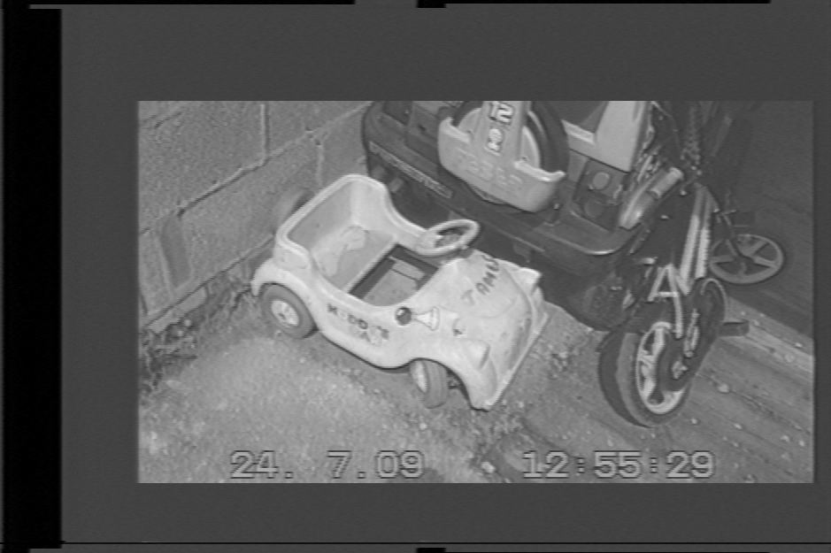{: style="width:500px"} | {: style="width:500px"} | 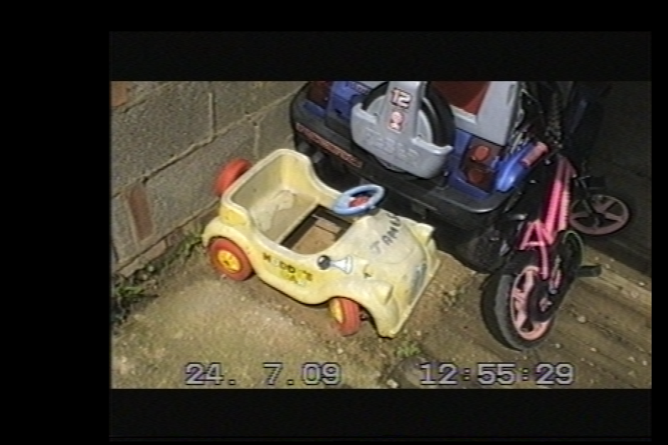{: style="width:500px"} |

## RF

**R**adio **F**requency

In the context of this project, FM RF information is stored on the tape and transmitted via analogue electric signals over copper cable and or traces on the VCR'S PCB boards after being read by tiny magnetic heads in the head drum and amplified by 90s hardware.

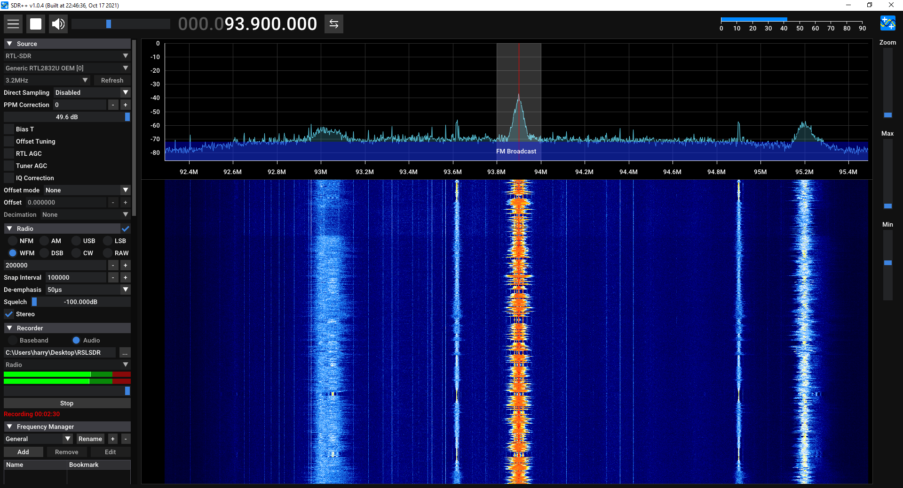{: style="width:600px"}

Example of waterfall visualisation of the local FM radio waves and a tuned-in radio station on an RTL-SDR using the free [SDR++](https://www.sdrpp.org/) application.

## FM RF

**F**requency **M**odulated **R**adio **F**requency

This is an audio or video signal but the information is compressed via modulation onto carriers for transmission or storage like FM Radio or VHS tapes etc, formats like Video8/Hi8 use multiple modulated carriers to put video/hifi/timecode and output it via a single signal path on playback ware as formats like vhs/betamax have separate audio and video FM signal points.

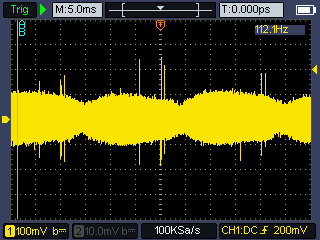{: style="width:300px"}

> ONWON HSS2102S Limited resolution raster of live S-VHS FM RF.

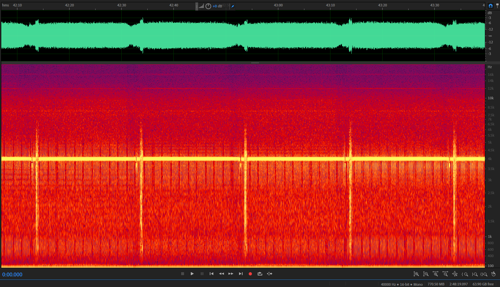{: style="width:600px"}

> Adobe Audition Full Resolution Raster from FM RF capture (.flac file) with spectrograph.

## ADC & DAC

**A**nalouge to **D**igital **C**onverter / **D**igital to **A**nalouge **C**onverter (also called AD/DA)

Depth Range: `8-bit`/`10-bit`/`16-bit`

Sampling Rate: `Hz`, `Khz`, `Mhz`

This is a device that converts electrical values such as sound or video signals into digital data this is binary 0 & 1 values with bit depth such as 8 & 10 defining the range or "depth" of information on each sample 10-bit is industry standard as its within margin of error for accuracy but higher depths can be used, data however is formatted only in 8-bit or 16-bit on hardware level, software can then convert this to formats like 10-bit packed used by the DomesDayDuplicator.

The rate at which these devices can convert signals is normally in SPS - Samples Per Second and MSPS - Million Samples Per Second, you may also hear the term Mhz of bandwidth used semi-interchangeably.

Example the human hearing range is around 20hz to 20khz to sample this range of sounds we record an analogue microphones signal at 48khz today which covers over the standard range and compensates ideally for person to person differences but minimum sampling for example is 44.1khz used for CD audio, but ware vast points of sound are needed to be captured for expanded example an orchestra you would use something like 192khz more information more range of signals to be captured.

## MSPS

**M**illion **S**amples **P**er **S**econd 

2msps = 1mhz of effective information sampling of an analogue signal this is a basic concept of digitisation of analogue information called Nyquist sampling.

## SNR

**S**ignal to **N**oise **R**atio

This is the ratio of usable signal information to background or external noise from electromagnetic interference. 

For example, you want to keep phones/radios/wifi antennas and 120-240v power cables away from an RF line or connector that's not shielded this can introduce noise.

You can see this information in graphing form is under ld-analyse with the Black SNR Analysis tab  

{: style="width:400px"}

LD-Decode / VHS-Decode

`40-50 dB` - Great Signal

`30-40 dB` - Good Signal

`20-30 dB` - Weak Signal

`10-20 dB` - Poor Signal 

CVBS-Decode 

`38-60 dB` - Good Signal

## 4fsc

Four times the frequency of sub-carrier, or actual signal within a range in simple terms. 

Visually its this!

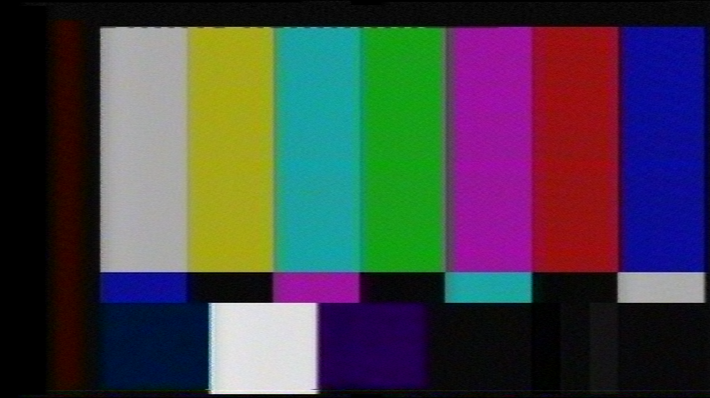{: style="width:600px"} 

This is normally based on the composite signal standard for PAL/NTSC.

The 4fsc frequency sample rate is typically:

14.3 MHz (28.6 MSPS) in NTSC. (910x525 samples)

17.7 MHz (35.4 MSPS) in PAL. (1135x625 samples)

In simple terms the same system used for D2/D3 tape.

{: style="width:400px;height:500px"}{: style="width:400px;height:500px"}

## DdD - DomesdayDuplicator

{: style="width:300px"}

The 40msps (20mhz of bandwidth) USB 3.0 based RF capture device is purpose-built originally for the DomesDay86 BBC laserdisc project and LD-Decode but its filtering range covers the Colour Under Tape format ranges VHS/Beta/Video8/Hi8 and so on making it a very easy plug-and-play user experience on both Windows/Linux capture software.

[How to Order a Domesday Duplicator (DdD) for Dummies](https://docs.google.com/document/d/1k2bPPwHPoG7xXpS1NCYEe3w_jD_ts0yRCp-2aQ6QoKY)

## CX Card

{: style="width:300px"}

{: style="width:300px"}

[Wiki Page](CX-Cards.md)

This refers to a desktop card using the Conexant CX2388x series of PCI chips (where x = 0-3) these come in PCI, or PCIE 1x via a Asmedia or ITE bridge chip, which we use with the CXADC Driver.

These are the most common and affordable (16-25USD) RF capture cards on the market thanks to the CXADC driver.

Warning: There is a later series (CX23884 - CX23889) that will not work as they use a whole new architecture.

## CXADC

{: style="width:400px"}

This is a modified Linux driver that replaces the stock control & capture driver for CX Cards onboard hardware.

This allows via a testing mode called `RAW16` to output all signal information that's digitised directly to a RAW file `.u8` & `.u16` instead of just digitising and decoding TV Signals and Composite ones to video streams as it was originally made to do.

# Secondary Acronyms You Will Encounter

# Poynton 

Lord Poynton, Saint Poynton, The God of standards Poynton.

Its Charles A. Poynton the guy who wrote the bible that everyone in video engineering or practical deployment and or development of analogue to HD era video systems has read his 2004/2012 books they are the gold reference for how's what's and whys of analogue and current era HDTV digital systems.

The books you need to get your hands on to understand why are the following (PDFs available for free online from many institutions)

- `A Technical Introduction to Digital Video` - 1996 

- `Digital Video and HDTV: Algorithms and Interfaces` - 2003

- `Digital Video and HDTV: Algorithms and Interfaces 2nd Edition` - 2012

## ADV / Analog Devices

Analog Devices, Inc. chips of note, i.e. [ADV7842](https://www.analog.com/media/en/technical-documentation/data-sheets/adv7842.pdf) used by AJA, Blackmagic, Magewell and Ensembledesigns (Bright Eyes) in desktop cards USB cards and SDI equipment, lower end devices do not leverage this chips TBC abilities and will not work well with unstable signals. 

## PEC Pads / Cleaning Pads

These are just lint-free same as generic high-quality wet wipes just dry and clean look-up nail wipes same stuff, you can get smaller "nail wipes" same exact thing.

There is also Suede (Pronounced ''Swayed'') cleaning sticks these are mostly a ripoff for camera sensor and VCR cleaning but are useful.

# Codecs & Containers 

## Codecs 

These fall into pretty clear types

`Lossless`, `Lossless Compressed`, `Visually Lossless`, `Lossy`. 

For example `V210` is lossless YUV and `R410` is lossless RGB, `ProRes HQ` is visually lossless, and `FFV1` is lossless compressed, with `FLAC` notably being 2:1 ratio lossless compressed for audio files, and lossy `AVC/H.264` but image quality to bitrate has gotten better with `HEVC/H.265` and the new `AV1` however the less compressed a codec is the less compute power it requires to playback.

When people talk about a `mp4` file they generally are encoding a video codec like AVC/H.264 to that container without knowing context past higher bitrate good and lower means mushy video which is why lossy codecs should never really be used for analogue media as FFV1 8-bit is smaller then even DVCPro50 an common lossy capture codec.

## Containers 

These fall into 3 main types

`Headerless` & `Header-Dependent` (and audio/video)

Containers like Matroska or `.mkv` are a lot better then MPEG-4 `.mp4` or QuickTime `.mov` for good reason, its headerless which means if a chunk of data gets damaged the entire file is not lost only the affected frames which makes it a far more practical container for archives ware as the former have a header/atom which if damaged makes the video stream non-usable without recovery so muxing or rehousing the files data to such containers is standard practice for archive and cold storage.

There is key terms here in standard video world, 

`Mux` & `Muxing` is to change a format without altering its content, 

`Encode` & `Encoding` is to generate media.

`Re-encode` is to convert media that has been generated.

`Decode` is to playback the media.

Hardware codecs are also a thing but its outside of the scope, but hardware supported codecs does affect playback support on devices.

# Magnetic Storage Mediums HDD, SSHD, SSD, NVME.

Interfaces: SAS, SATA, SCSI, PCIe, FC - Fibre Channel 

NVME uses PCIe in direct, M.2, U.2 interfaces 

HDDs in consumer world use SATA. (SAS is more common for commercial)

SAS & Fibre Channel is used by HDDs, SSDs, LTO Tape, Sony ODA and direct server to server storage such as SANs.

There is two main interfaces internally used by computer systems and phones today, SATA III, NVME (PCIe Express) 

There is also SAS using an extended version of the SATA connector which has 12GB/s instead of SATA's 6GB/s speed used in the datacenter/server space, controller cards are available and work on consumer PC's this is note worthy if a good deal is found for HDD sales.

## HDD - Hard Disk Drive

Affectionately called spinning rust this is a plater of magnetic disks in an airtight helium-filled box they go upto 22TB in storage capacity in the 3.5-inch desktop sizing form factor.

1-2TB (7mm depth) (7200rpm) and 2-5TB (15mm depth) (5400rpm) in the laptop 2.5 inch form factor

HDD's are speed limited to around 200-320MB/s per drive at the 7200rpm spec this is due ot the physical speed of actuators, however current generation HDDs can reach 500MB/s.

## SSHD - Solid State Hard Drive

SSHD's go up to 4TB its basically an HDD with an 8-64GB solid-state buffer (flash/nvme) that caches data for quick use from writing data to the drive locally faster or storing heavy use files like small game data for quick loading, however, this adds a layer of reliability and recovery issues as the SSD part can fail a lot faster then the mechanical drive.

## SSD - Solid State Drive

It's used in your phone it's used in all modern storage, provides lower heat and high shock resistance, 1000x faster access times but less durable in some regards mostly in their read/write cycles and how much data they can move onto/off of is limited, so they don't die from operation hours they die from operating.

These got up to 100TB in the 3.5-inch desktop size using stacked boards, and 16TB in the 2.5-inch laptop size as far as consumers can get their hands on, 8-16TB is about it.

Hardware speed is limited to 550MB/s (SATA 6Gbps) per drive due to interface limitations.

## NVME SSD (Non-Volatile Memory Express)

Today becoming more commonly known as its been widely adopted in the "M.2 SSD" format NVME is a high-speed solid-state drive that directly connects to a system CPU (central processing unit) via PCIe lanes which is how most secondary hardware is connected on computers such as video/graphics cards and HDMI/SDI capture cards and so on.

Due to the direct high bandwidth connection consumer storage drives have gone in a few short years from 400MB's (Megabytes) top end read and write directly to 2GB/s on the low end and 8GB/s on the higher end that's gigabyte per second not gigabits (Gbps) per second.

These are mainly used for Boot/Games/Recording & buffer/cache drives in more advanced use like 1PB array storage servers.

As of 2023 NVME is widely adopted by cameras SD & CF cards are slowly being phased out by SD/CF Express as it's and more universally easier to implement in the mirrorless/cine market, of note CFexpress Type B can use M.2 drives directly in caddies are taking over by storm, alongside CFexpress Type A with external enclosure adapters. 

Currently, the max capacities on the consumer market are the following:

M.2 8TB

U.2 16TB (2.5 Inch) (SATA Sized Connector with Extra Pins)

Current fastest speed consumer drive:

7,450 MB/s Read / 6,900 Write (SAMSUNG 990 PRO Gen 4 PCIe)

# Non-Volatile Optical Storage Mediums

## DVD

One of the most common disc formats made, with dye based ones being cheep as anything, with much more stable metal/composite based discs being the defacto today.

* DVD-R Single layer 4.7GB (4.37GiB)

* DVD-R Duel layer 8.5GB (7.95GiB)

These formats also have gold/silver based "archival grade" discs, but overall cost per GB it's more practical to go Blu-Ray unless making legacy distros and duplicates or people are stuck on DVD/CD hardware.

## Blu-Ray: BD & BDXL

BD or Blu-Ray Disks same physical size & mechanical operation as CD/DVD (120mm) but a (405nm) blue laser hence the name but the standard really means to the layman more pits per disc so more storage per disc/layer.

* BD-R-SL Single layer 25GB (23.3GiB)

* BD-R-DL Dual layer 50GB (46.6GiB)

* BDXL-TL Triple layer 100GB (93.1GiB)

* BDXL-QL Quadruple layer 128GB (119.2GiB)

There are also re-writable versions of note their usage in the Sony XDCAM cameras before the flash storage switchover.

* BD-RE Single layer RE-writeable 25 GB (23.3GiB)

* BD-RE Dual layer RE-writeable 50GB (46.6GiB)

These are used for SD/HD/UHD Video and Game delivery media today hence why all current-gen disk reading systems have a BDXL player.

## M-Disk

Millennial Disc made by Millenniata (Fabricated and sold by Verbatim/Ritek today)

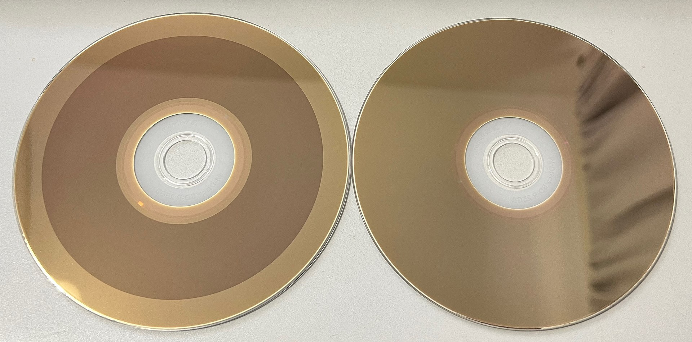{: style="width:300px"}

M-Discs have a black/grey look when burned, shiny golden look when non-burned, sliver looking discs are not M-Discs.

{: style="width:400px"}

M-Disc Logo on the current generation [Asus BW-16D1HT](https://www.asus.com/uk/motherboards-components/optical-drives/internal-blu-ray-drive/bw16d1ht/).

It's just a normal DVD/BD/BD-DL/BDXL-TL in terms of use with a bit of data saying "hey use higher power mode to burn" and are slightly slower to burn than standard disks using the 2x speed, if you force over the 2x speed it will most likely fail.

One of the first ISO/IEC 10995 rated archival formats using non-organic glassy carbon material that's neutral to temperature shifts and radiation instead of dyes and metals used on other media, its only weak point is the polycarbonate plastics which have a 1000+- year life the carbon holding the data could last longer M-Disk unlike normal discs have a high standard of validation for there plastics moulding and have perfectly smooth edges.

M-Disk only has 4 standard certified format versions.

* DVD-R Single layer 4.7GB (4.37GiB)

* BD-R Single layer 25GB (23.3GiB)

* BD-R-DL Dual layer 50GB (46.6GiB)

* BDXL-TL Triple layer 100GB (93.1GiB)

All Current DVD, BD, and BDXL burners support their respective M-Disk versions.

50GBP / 70USD per top-end BDXL reader/writers M-Disk wins in terms of future-proofing and cost of interface hardware with UDF disk formatting supported on all computer platforms from desktops and even IOS/Android based smartphones.

## DM Archive 

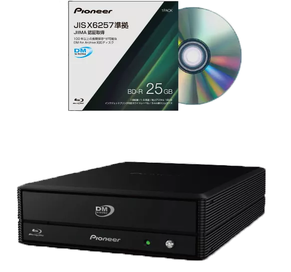{: style="width:300px"}

[Pioneer DM Archive](https://web.archive.org/web/20230303071045/https://www.cdrinfo.com/d7/content/pioneer-japan-releases-new-bdr-wx01dm-external-bddvdcd-writer-jis-x6257-standard-and-100) - Basically Japan Gov backed M-Disc

JIIMA Standard / JIS X6257 / ISO/IEC 16963

This is the newest system standardised by Japan for Blu-Ray based discs using the "DM Archive" or defect management standard similar to M-Disc but with "certified" players.

[BDR-WX01DM](https://www.amazon.co.jp/-/en/gp/product/B0BS6F1TRV/ref=ox_sc_act_title_1?smid=AN1VRQENFRJN5&psc=1) - BDXL Player/Reader/Burner

[Pioneer IPS-BD11J03P](https://www.amazon.co.jp/-/en/gp/product/B0BSB7WNRS/) BD-R 25GB - Certified Discs (3 Pack)

Limited to 25GB Discs possible to see upto 128GB in the future.

## GlassMaserDisc

While being the most rugged optical media on the market in terms of stress tests at 1000 Euros for a 25GB or 50GB disc, they are fabricated on-demand primarily used for archive and master copies for duplication of release media.

The real-world value however is little, unless you have endless money these are just not as cost practical as M-Discs or even Sony Optical Archive for small or large-scale archival due to the 50GB limit compared to 100GB/128GB & 5.5TB on standard systems today.

## Sony Optical Archive & PetaSite

[Sony Official Webpage](https://pro.sony/en_GB/products/optical-disc)

Sony has there own in-house version of M-Disk starting from 2006 to today with there translucent high-density duel sided write once disks.

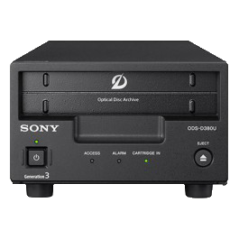{: style="width:300px"}

Using a platter of 12 (500GB) duel sided disks in a cartridge at 200USD per 5.5TB 

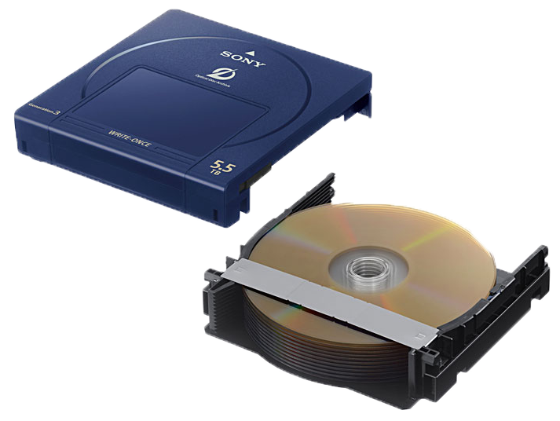{: style="width:300px"}

A very cost-effective solution for large archives i.e 100+ 3-6 hour tapes, but at a cost of 4000-5000USD for the desktop reader/writer units these have a high entry adoption cost, the software suite is free and self-contained for Linux/MacOS/Windows but not open source however, disks do use the UDF (Universal Disk Format) system so can be read easily later on rated for a 50-100+ year shelf life.

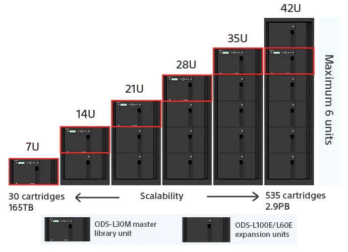{: style="width:300px"}

Rackmount scale in 7U units [PetaSite](https://pro.sony/en_GB/products/optical-disc/petasite-solutions) system with automated loading and unloading of cartridges providing a full-scale optical version of LTO, meant primarily for permanent offline or recovery backup storage as they can't be overwritten by software and require mechanical destruction to be erased, water chemical and electronic interference cant damage this format in most real-world disaster situations.

## LTO Linear Tape-Open

IBM's 20-year tried and true digital tape archival.

[If your interested in the format and want more info read the LTO Wiki here.](LTO-Linear-Open-Tape-Guide.md)

18TB RAW / 17TB LTFS per cartridge at 150~220USD - LTO9

1.5TB RAW / 1.25TB LTFS per cartridge at 1.5~5USD - LTO5

Currently, we are on Generation 9 (LTO9), LTO8 and newer readers are still 3000USD or more however LTO 5-7 readers can be had for 100~500USD on average via the used market.

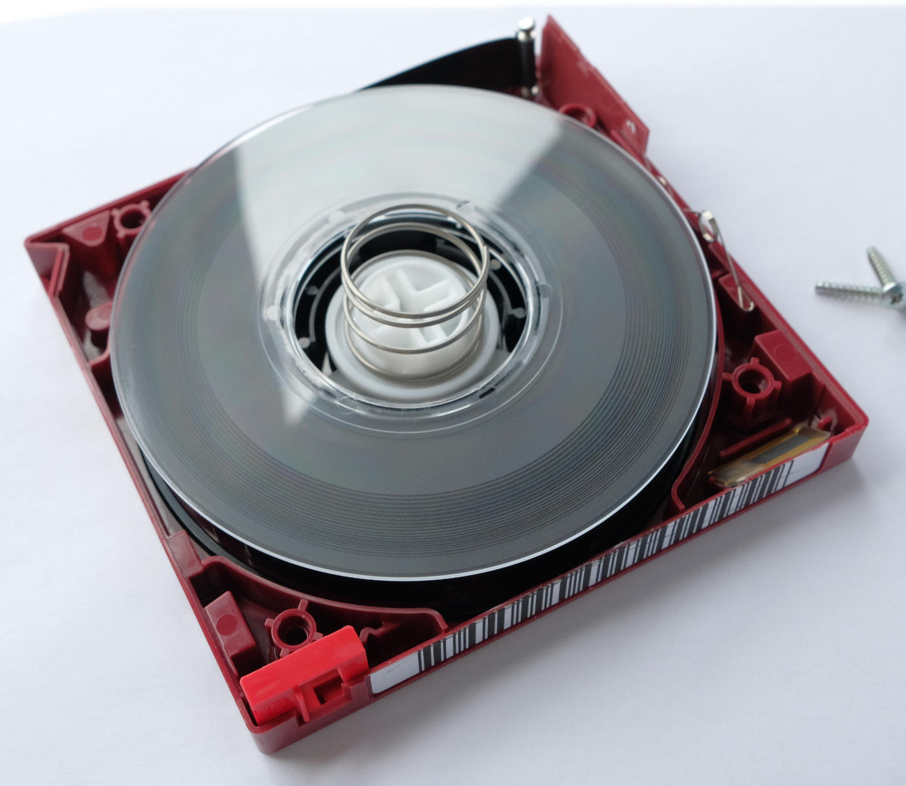{: style="width:300px"}

Modern external desktop readers use USB 3.0, Thunderblot 3, and SAS/MiniSAS interfaces. 

Fibre Channel autoloaders all have standard Molex power once removed from there housing frame, however Fibre HBA cards really only have Linux/Windows Server support today.

Like with Sony's system this scales from desktop units to rackmount scale units with automated loading systems, meant primarily for long-term offline or on-site backup recovery storage.

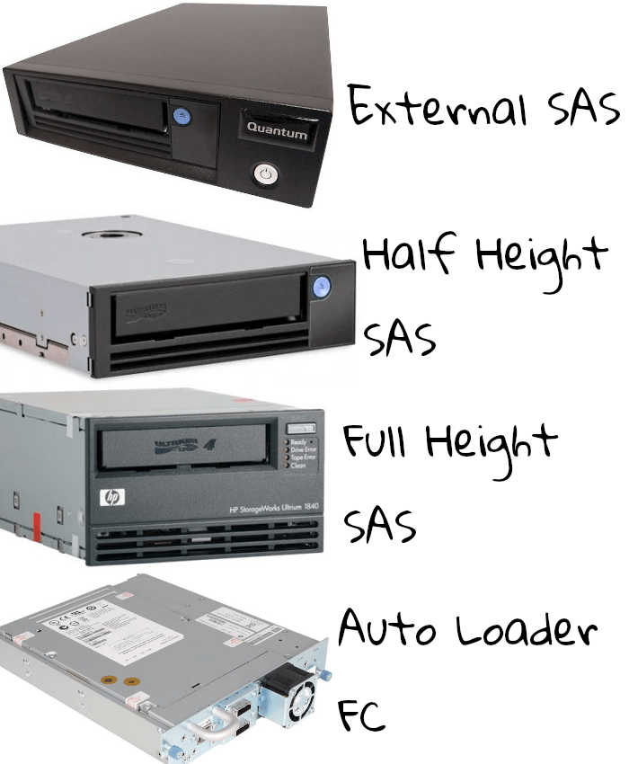{: style="width:300px"}

(Image credit benjojo blog [Live](https://blog.benjojo.co.uk/post/lto-tape-backups-for-linux-nerds) / [Archive](https://web.archive.org/web/20220127113637/https://blog.benjojo.co.uk/post/lto-tape-backups-for-linux-nerds))

Current datacentres, broadcasters, production houses and small to large businesses will most likely have LTO tape for on-site and off-site backup and or long-term archival.

LTO tapes use high partial density magnetic tape, with current data storage encoding methods and physical manufacturing methods, sadly these are still very susceptible to high electromagnetic radiation but more so heat and moisture alongside mechanical ware and like videotape, these won't last long in high temperatures or survive floods but they are good for 20-35 years of shelf life in stable environments but have a high media migration cost to consumers.

High Density, Kinetically un affected by physical travel, and standardised fixed sizing allows this format to me a replace readers upgrade path for autoloader systems making it very affordable at the 100TB mark or higher of archival requirement.

# Page End