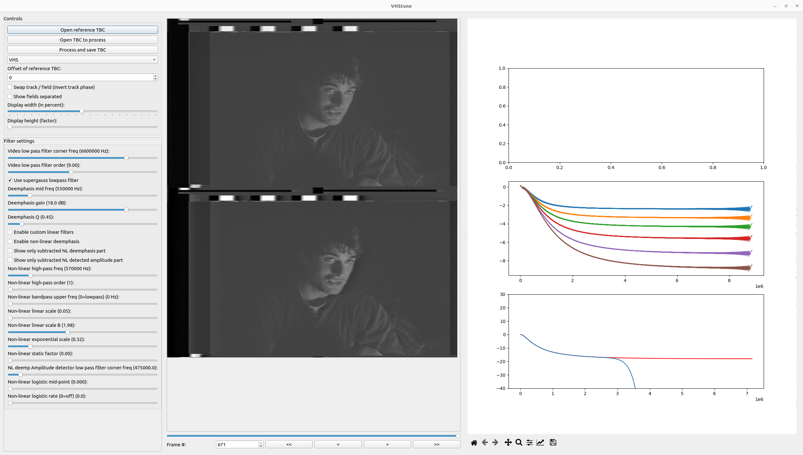
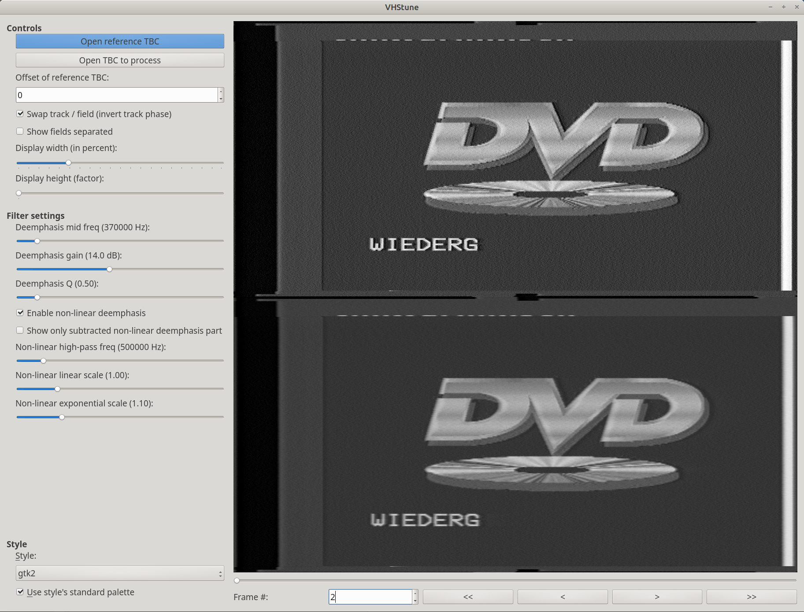
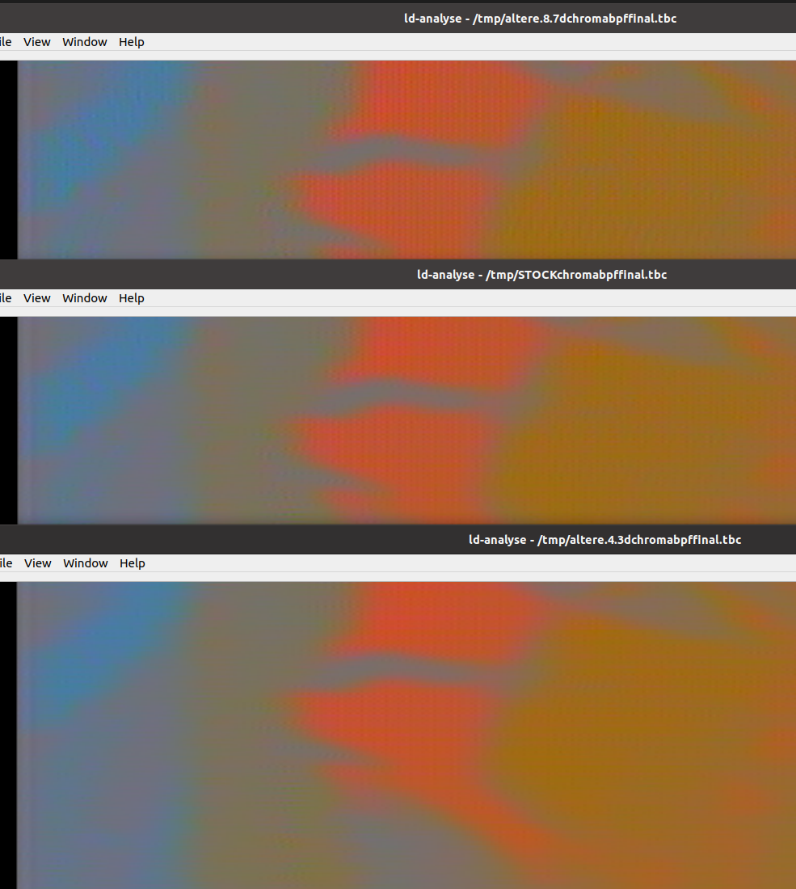

This document contains advanced modify-able options inside of ld-decode, vhs-decode, hifi-decode.

These are called "advanced parameters" but are more accurately, just tinkering with core components of the decoders.

!!! NOTE
   Tweaks are on a per recording and per VCR basis and results can vary drastically from different recordings & formats.


# VHS-Decode (Tape Decoding)


`--params_file <filename>` Changes the decoder settings to use an external `.json` file with the correct formatting

Example:

Create a new text file, use this template and then save it as a `custom-params.json` file.

Note these values vary by tape format & TV System.

````````
{
   "sys_params":{
      "burst_abs_ref":5000
   },
   "rf_params":{
      "video_lpf_freq":3000000
   }
}
````````

# VHS Tune Tool


`vhstune.py` is a filter adjustment tool used with tbc files that have been raw exported.

Use `--export_raw_tbc` when decoding export a raw TBC without deemphasis applied for filter tuning.

This can be used to derive a `custom-params` set of values to load into vhs-decode for a full decode.

{: style="width:px"}

{: style="width:800px"}


# User Methods


Current State as of 12.10.2022 (DD.MM.YYYY)


### PAL


Itewreed#2179's adjustments for Teletext with [VHS-Teletext](https://github.com/ali1234/vhs-teletext)

Hardware Used for reference:

CX Card is a WinTV-Nova S, a 33µF electrolytic cap is between tap and the rg174 wire. From there it goes to the amp that originally is for digital CCTV with a bw of 8MHz and then into the CX card.

`````

rfparams["deemph_mid"] = 210000
RFParams_PAL_VHS["video_bpf_low"] = 1400000
RFParams_PAL_VHS["video_hpf_extra"] = 1120000
RFParams_PAL_VHS["video_lpf_freq"] = 4500000

`````

"It might be, that this is a good setting for my VCR I use for RF capture. So the settings could be different for other VCRs hardware and could give different results."

[Discord Note](https://discordapp.com/channels/665557267189334046/665834485975351307/1062172561582063717)

if self.options.double_lpf:
            # Double up the lpf to possibly closer emulate
            # lpf in vcr. May add to other formats too later or
            # make more configurable.
            self.Filters["FVideo"] *= filter_video_lpf


### Smooths out high-frequency noise in the chroma signal.


[Discord Note](https://discordapp.com/channels/665557267189334046/665834485975351307/1070395739848577124)

vhsdecode/addons/chromaAFC.py

stock luma filter settings, chromaafc.py settings:
(self.fsc_mhz - .44) / self.out_frequency_half,
(self.fsc_mhz + .34) / self.out_frequency_half,

and `--nld`


## Changes chroma filtering


[Discord Note](https://discord.com/channels/665557267189334046/665834485975351307/1070047012810137685)

Modificaiton to `addons/chromaAFC.py`



Top is:

`(self.fsc_mhz - .84) / self.out_frequency_half,
(self.fsc_mhz + .74) / self.out_frequency_half,`

Middle is (stock values):

`(self.fsc_mhz - .64) / self.out_frequency_half,
(self.fsc_mhz + .54) / self.out_frequency_half,`

Bottom is:

`(self.fsc_mhz - .44) / self.out_frequency_half,
(self.fsc_mhz + .34) / self.out_frequency_half,`


# Deprecated Adjustments

[Discord Note](https://discord.com/channels/665557267189334046/665834485975351307/1030118081038655560)


## NTSC

Titan91#1526's adjustments for NTSC video.

1. Set RFParams_NTSC_VHS["video_bpf_low"] = 1500000 in vhs.py
2. Set rfparams["deemph_gain"] = 12 in vhs.py
3. Set rfparams["deemph_mid"] = 280000 in vhs.py (I have not confirmed this)
4. Disable double band pass filtering to improve sharpness slightly by commenting out lines 1554 and 1558 of process.py


# Page End 