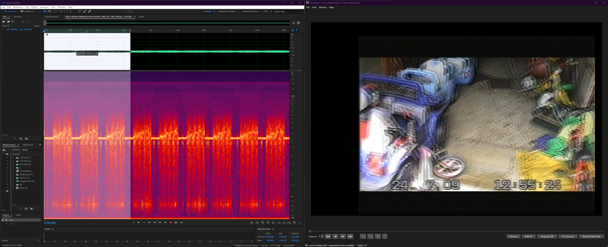

# Advanced RF Analysis

## Studys & Writeup's

[Rene Wolf - VHS-decode vs Signal degradation](https://gitlab.com/wolfre/vhs-decode-vs-signal-degradation/-/blob/main/README.md?ref_type=heads) - Nov 2023

## Reading RF Waveforms

The cool thing you can do with full RF captures is taking advantage of any SDR or Audio Processing tools on the market for inspecting the waveforms.

## Import Data

Import -> RAW Data

Byte Order -> Little Eiden

Sample Rate -> 

4000000 DdD  40MHz/16-bit

2860000 cxadc 28.6 MHz/8-bit

3580000 cxadc3 35.8 MHz/8-bit

1430000 10cxadc 14.3 MHz/16-bit

1790000 10cxadc3 17.9 MHz/16-bit

## Example of a frame of VHS

{: style="width:1000px"}

## Adobe Audition 

View -> Show Spectral Frequency Display (Shift+D)

{: style="width:600px"}

# Inspect Data

Then you can use normal visual inspection to determine if it's signal is too low or too high.

It's recommended to use 8/16bit FLAC compressed or uncompressed 8/16bit captures for this task and set your cache directory to a location with enough space or you will possibly zero-fill a drive.

## Audacity

{: style="width:800px"}

Right-click on the left-hand side to change settings and enable the spectrograph.

{: style="width:800px"}

You can change the settings according to the sample rate used for the capture.

# ld-analyse

{: style="width:800px"}

ld-analyse allows you to view the values of your `.json` metadata file with visually assisted graphing.

Black SNR (Signal To Noise Ratio) is your basic quality indicator. 

{: style="width:800px"}

`40-50 dB` - Great Signal

`30-40 dB` - Good Signal

`20-30 dB` - Weak Signal

`10-20 dB` - Poor Signal 