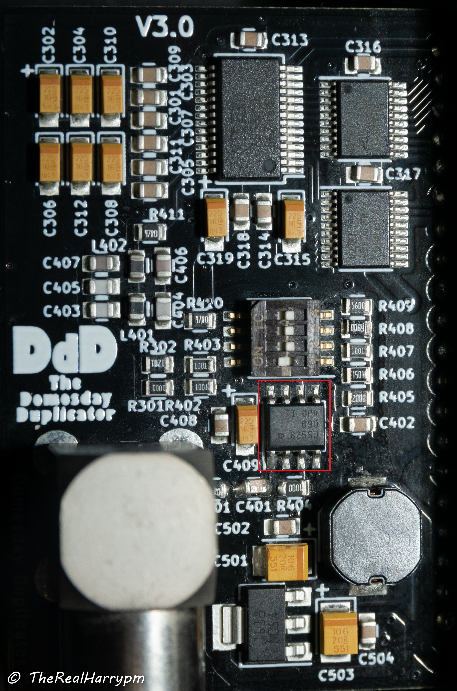

This document has notes on amplifier development and a list of off-shelf amps in testing and available to buy and other misc notes.

This doc is mostly related to the improvement of the CX Cards SNR or signal-to-noise ratio. 

## Standardised Boards 

### Analogue Devices AD8367 

The most commonly deployed off-shelf RMS amplifier considered the go-to for HiFi/Video FM from tape and laserdisc formats, using 0603 parts it can be user modified if required.

{: style="width:400px"}

[AliExpress](https://www.aliexpress.com/item/32860308324.html)

### vhs-rf-amp-ada4857 

[ADA4857 GitLab Repo](https://gitlab.com/wolfre/vhs-rf-amp-ada4857)

Developed by Rene Wolf as a second generation, "adjust per unit" amplifier board based around the ADA4857 with 0805 pads for gain/input termination so requires an assortment resistor book and a entry to mid range benchtop type digital store oscilloscope.

{: style="width:400px"}

### vhs-rf-amp-sgm8302

[GitLab Repo](https://gitlab.com/wolfre/vhs-rf-amp-sgm8302)

Rene Wolf's first generation amplifier for due duel channel capture using the sgm8302 amplifier IC.

{: style="width:400px"}

### Analog Devices Dual Channel OPA AD605

An off shelf board that is widely available on AliExpress.

{: style="width:400px"}

### Texas Instruments OPA657 

(Confirmed on LD players)

{: style="width:400px"}

### Texas Instruments OPA690 

Used by the DomesDayDuplicator

{: style="width:300px"}

### AD605

https://www.aliexpress.com/item/AD605-VGA-Dual-Channel-Voltage-module-Control-Adjustable-Gain-Amplifier-Module-Low-Noise-High-Precision-5V/33026097817.html
23GBP with VAT

The way the board is supplied, the 2 channels aren't configured the same.

Absolute gain range programmable
−14 dB to +34 dB (FBK shorted to OUT) through
0 dB to 48 dB (FBK open)

One channel has FBK shorted to OUT (-14 to +34) gain range, and the other channel has FBK open (0 to 48db) range, controlled by R5 and R6.

### OPA690

Used by the DomesDayDuplicator

https://www.aliexpress.com/item/33008732817.html

### OPA657 - In testing

https://www.aliexpress.com/item/32790115607.html

### LT1252

Analog Devices Linear Technology LT1252 Low-Cost Video Amplifier (built for application used by CubeTec's BetaCam add-in boards for example)
