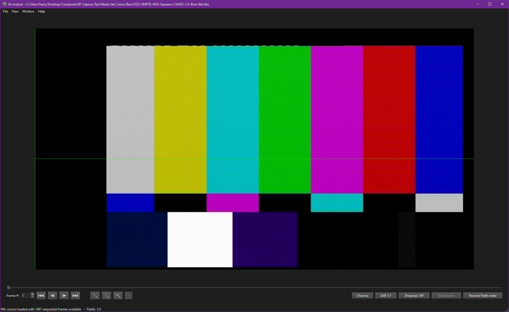

## CVBS Decode 

This spin-off project uses RAW CVBS captures and uses the signal processing and time base correction code, from vhs-decode & ld-decode there is no de-modulation like FM media.

{: style="width:800px"}

**CVBS** an abbreviation,

**C**omposite **V**ideo **B**aseband **S**ignal. (also lesser used: colour, video, blanking, and sync)

**Baseband** means a de-modulated signal off a recorded medium or a non-modulated live signal directly off a camera or media generation device.

Baseband signals are ready for direct use for audio this means a speaker and for video used to be an analogue analogue CRT TV set now its all on analogue to digital converter ICs.

Composite analogue video signals have been used from the pre-digital era to early digital equipment, developed in the 1950s and in full use from the 1960s to even today analogue systems using the ''Yellow RCA jack'' on consumer equipment and a BNC jack on prosumer/broadcast equipment.

**S-Video** is just composite Luminance with the Chromance modulated this minimizes colour interference during transport inside a cable with a pair of 2 shield cables shielded S-Video cable or 2 separate BNC cables then the chroma is demodulated at the input device level, there are 3 versions of this standard.

## CVBS Resolution Standards

| Signal Format | Resolution | Field System | TV System | Aspect Ratio | RF Capture Support | Video Decoding Support |
| ------------- | ---------- | ------------ | --------- | ------------ | ------------------ | ---------------------- |
| CVBS          | 525 Lines  | Interlaced   | 525 NTSC  | 4:3 / 16:9   | Yes*               | Yes*                   |
| CVBS          | 625 Lines  | Interlaced   | 625 PAL   | 4:3 / 16:9   | Yes*               | Yes*                   |
| CVBS          | 655 Lines  | Interlaced   | PAL       | 4:3          | Yes*               | Not Tested/Implemented |
| CVBS          | 405 Lines  | Interlaced   | PAL       | 4:3          | Yes*               | Not Tested/Implemented |
| CVBS          | 819 Lines  | Interlaced   | PAL       | 4:3          | Yes*               | Not Tested/Implemented |
| CVBS 240p     | 240 Lines  | Progressive  | NTSC      | 4:3 / 16:9   | Yes*               | Work in Progress       |
| CVBS 288p     | 288 Lines  | Progressive  | PAL       | 4:3 / 16:9   | Yes*               | Work in Progress       |
| 960h CCTV     | 960 x 576  | Interlaced   | N/A       | 16:9 Only    | Yes*               | Not Tested             |

# Capturing RAW CVBS

!!! IMPORTANT
    28msps+ is recommended for sampling CVBS signals directly.

MISRC (MISRC-Multi-Input-Simultaneous-RF-Capture) Has support for native RAW Composite/CVBS and S-Video capture in 12-bit (16-bit 40msps singed or unsigned samples). 

[CX Cards](CX-Cards.md) can try to switch back into standard mode causing wavy, jiggling, and loss of vertical sync frames, **however** if the card is in a fixed low gain state (level 0 / sixdb off) it is possible to get clean stable captures.

The DomesDayDuplicator's input filtering is not suited for said signal range, the input filtering stage needs to be modified currently, this does not work well as it captures the signal improperly.

There is also using a T adaptor to feed a secondary signal via waveform generator to keep CX Cards in raw output mode, then in post to low pass filter it and then decode it.

## Installation

`cvbs-decode` is included inside the vhs-decode install, and is ready to go on self contained builds.

However for Linux you might need to do:

    python3 setup.py build_ext --inplace

That's it you are ready to use CVBS-Decode!

# Usage

Currently, this decoder will work just fine with <u>stable signals and live media</u>.

!!! NOTE
    `-A` is mandatory for CVBS-Decode to work.

Example Usage Command:

    cvbs-decode --debug --pal -A --cxadc composite-test_28msps_8-bit.u8 composite-test

To stop the decode press <kbd>Ctrl</kbd>+<kbd>C</kbd>

## File Output

cvbs-decode only outputs 3 files

`filename.tbc`        - 4fsc Luminance & Chrominance Image Data

`filename.tbc.json`   - Frame Descriptor Table (Resolution/Dropouts/SNR/Frames/VBI Data)

`filename.log`        - Timecode Indexed Action/Output Log

## Inspect TBC and adjust inside ld-analyse

    ld-analyse composite.tbc

{: style="width:800px"}

## Export to Video File 

The [TBC-Video-Export](https://github.com/oyvindln/vhs-decode/wiki/TBC-to-Video-Export-Guide/) tool will automatically detect NTSC/PAL input, it can also run `ld-dropout correct` & `ld-process-vbi` and will embed the updated .json file inside the mkv, and export a FFV1 10-bit 4:2:2 interlaced file, read the wiki doc for detailed use of its [profiles](https://github.com/oyvindln/vhs-decode/wiki/TBC-to-Video-Export-Guide#ffmpeg-profiles).

Linux & MacOS:

    tbc-video-export composite-test.tbc

Windows:

    tbc-video-export.exe composite-test.tbc

{: style="width:600px"}

!!! NOTE
    You can also manually export via the [chroma-decoder directly](ld-chroma-decoder.md) for any single composite type .tbc media type such as LD/CVBS/SMPTE-C.

## Command List

Click the [here](https://github.com/oyvindln/vhs-decode/wiki/Command-List) for the full list, the below are just basic usage commands only.

## Set Input Frequency

Just like vhs-decode & ld-decode the default is 40msps 8-bit/10-bit/16-bit input.

Captures can be FLAC compressed (.cvbs) or Uncompressed .u8/u16 etc

`-f` Frequency Adjust in integers of hz, mhz, ghz or 4fsc/5fsc/8fsc/10fsc

`--cxadc` 28.6 MHz/8-bit (8fsc) Stock Crystal Native 8xFsc 8bit Unsigned Sampling Mode

`--cxadc3` 35.8 MHz/8-bit (10fsc) Stock Crystal Native 4xFsc 16bit Filtered Vertical Blanking Interval Data (Not Recommended for capture due to up-sampling)

`--10cxadc` 14.3 MHz/16-bit (4fsc) Stock Crystal 1.25x 8xFsc 8bit Unsigned Sampling Mode

`--10cxadc3` 17.9 MHz/16-bit (5fsc) Stock Crystal 1.25x 4xFsc 16bit Filtered Vertical Blanking Interval Data

## Set TV System

`-n` NTSC

`--NTSCJ` NTSC-J

`-p` PAL

`--pm` PAL-M

## Decode Control

`--debug` Enables debug detailed logging output.

`-A` Automatic Sync Detection **(Currently Mandatory For CVBS-Decode to work)**

`-S` Seek Frame of Capture

`--right_hand_hsync` Use right-hand horizontal sync detection.

`--ct` Chroma Trap, cleans up chroma interference on the luma channel.

`--sl` Defines sharpness by default this is set to 0. (0-100 Range)

`--notch` Define the centre frequency for the optional built-in notch "bandpass" filter.

`--notch_q` defines the Q factor Intended primarily for reducing noise from interference however, the decoder logic already compensates based on tape type and TV System values.

## Time Base Corrected Output

The Composite signal is stored in a single `.tbc`

This is a lossless digital file of the entire baseband composite signal like a D2/D3 digital tape.

`Full 4fsc 1135x625 PAL (17727262 hz) (25i) (4.2GB/min) (560mbps)`

`Full 4fsc 910x525 NTSC (14318181 hz) (29.97i) (3.4GB/min) (453mbps)`

## Issues 

- Chroma issues with NTSC VHS use `ntsc-phase-comp` with chroma-decoder.

- CVBS-Decode is not like ld-decode or vhs-decode so highly unstable sources will most likely require tinkering.

