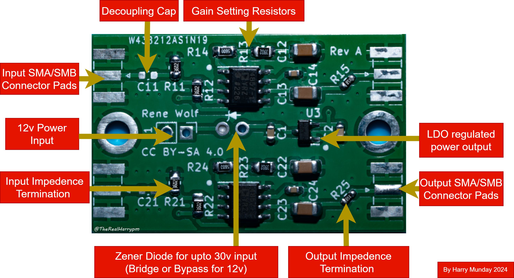
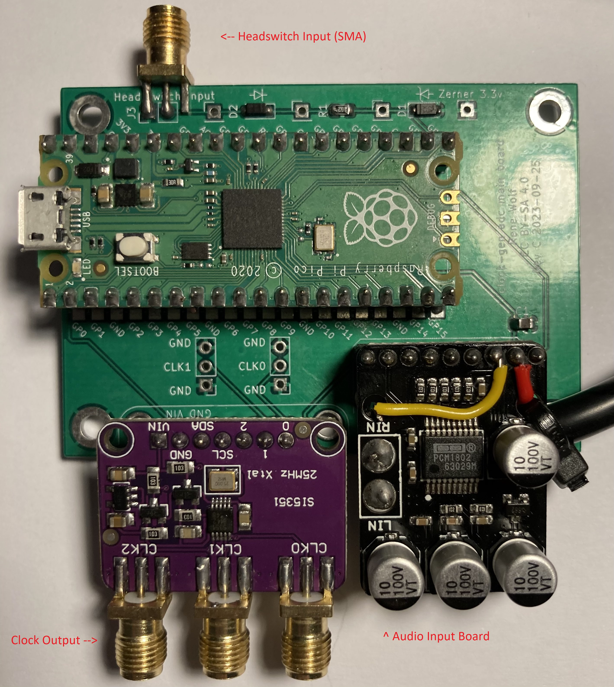

## What is a CX Card?

Conexant CX2388x-xx is an 2002 era PCI-based chip, today found with a PCIe bridge chip (Asmedia or ITE) in the 1x PCIe desktop card form factor.

With [CXADC](https://github.com/happycube/cxadc-linux3/) it becomes an powerful 28-40msps 8-bit Analogue to Digital Converter!

{: style="width:500px"}

CX White (CX23883-39) S-Video/RCA input.

## CXADC Driver & CX Card Wiki

This page has overview information, for more in-depth information on the driver and cards click the links below.

- [Driver](https://github.com/happycube/cxadc-linux3/) - Software Installation & Usage
- [Wiki](https://github.com/happycube/cxadc-linux3/wiki/) - Detailed Hardware Information

## Where do I buy a CX Card?

Recommended card type: [White CX25800](https://github.com/happycube/cxadc-linux3/wiki/Types-Of-CX-Cards) 

AliExpress is currently the best supplier of the [CX White Card](https://www.aliexpress.com/item/1005005186457820.html) at 16~30 USD.

**Why PCIe 1x Cards and not any old PCI card?**

Hardware standardization makes it easier to support the software/hardware interoperability for RF Capture. A standardized PCB layout, with predictable and dependably similar performance, allows for easy modification, standardized guides, and sample comparison.

## Should I buy more than one card?

For Video8/Hi8/LaserDisc FM RF capture you will only need one card for Video/HiFi RF, but will benefit from a crystal mod.

For SMPTE-C/SMPTE-B you will only need one card for Video RF but will require a synchronised solution for Audio/Timecode.

Buy 2 or more if you wish to do 

- VHS/SVHS/Betamax/SuperBeta - Video & HiFi (now with synchronised timing!)
- Betacam/Betacam SP/MI/MII/W-VHS dual video channel capture.
- Have a flexible setup or do multiple decks at the same time.

Owning an [RTLSDR](RTLSDR.md) is ideal for calibrating HiFi while servicing or adjusting an VCR, or If you already have a DomesDay Duplicator it's a defacto addition for HiFi FM capture.

The CXADC driver now supports up to 256 cards so setups can be scaled as much as you need, and external timing sources allow it to do clock locked sampling of different signals in the same deck, so zero hardware audio/video drift issues.

## Cables & Adapters

On the white card without physical modification, it's recommended to use the **S-Video port (Luma or Y signal pin and ground) for FM RF signal capture** if you wish to not solder your own cables or modify the card in any way, but C31 removal mod is encouraged.

- [S-Video to BNC Y/C Male](https://www.aliexpress.com/item/1005003333398231.html)
- [S-Video to BNC Y/C Female](https://www.aliexpress.com/item/4000285983771.html)
- [S-Video to BNC Male](https://www.aliexpress.com/item/32827376550.html)
- [RCA to BNC](https://www.aliexpress.com/item/4000552892790.html)

## How to Improve CX Cards

### YouTube Modification Video

- [YouTube](http://www.youtube.com/watch?feature=player_embedded&v=O8pYwFwY9VY) / [Odysee](https://odysee.com/@vhs-decode:7/CX-Cards-Basic-Modification-Guide-2023:3)

[{: style="width:500px"}](http://www.youtube.com/watch?v=O8pYwFwY9V)

### External Amplification

The CX chips have an internal digital gain amplifier, which if used, can generate unwanted self noise. To mitigate this, you may use an external amplifier to increase the amplitude before it gets to the card, this can also compensate for longer cabling if unavoidable.

An amplifier is an affordable way to negate the issue and is a soft mod (via SMA cables soldered internally or soldered directly to bulkheads mounted on your VCR) to the capture chain in most setups for tape formats, and can even be powered by a VCRs internal 5V or 12V connections.

The ADA4857 board also provides a way to better match the impedance of the test point and put less load on it. The cx card by default is designed around capturing composite video signals with stronger signal levels which is not optimal and the extra load on the vcr amplifier caused by this can also potentially lead to some distortion on the output or other issues. (Analog video transmission is designed around 75 ohm impedance load).

| (Current) [ADA4857](https://gitlab.com/wolfre/vhs-rf-amp-ada4857) Dual Channel Amplifier   | (Old) [AD8367](https://www.analog.com/media/en/technical-documentation/data-sheets/AD8367.pdf) AGC Amplifier               |
| -------------------------------------------------------------------------------------------| ---------------------------------------------------------------------------------------------------------------------------|
| {: style="width:400px"} | {: style="width:400px"} |

!!! NOTE
    The AD8367 is no longer recommended as the input termination is internal to the IC, making it hard to modify to suit and match impedance for a VCR and the default 200ohm is often not optimal on all decks, if having issues please use the ADA4857 instead.

!!! CAUTION
    The AD8367 boards are 3-5v range only if voltage is 6-12v+ a buck boost converter or regulator to lower the voltage will be required.
    Jumper configuration in automatic gain mode "AGC" is both pairs with jumpers as shown in image.

[ADA4857 KoFi](https://ko-fi.com/s/757bc4adbd) / [ADA4857 PCBway](https://www.pcbway.com/project/shareproject/ADA4857_Amplifyer_08b179d9.html)

[AD8367 Pot-less AliExpress Link](https://www.aliexpress.com/item/32860308324.html) / [AD8367 with Pot AliExpress Link](https://www.aliexpress.com/item/1005003457407163.html?) / [4.5v AA Battery Holder](https://www.aliexpress.com/item/4001194487990.html) / [Wiki Setup Link](https://github.com/tandersn/cxadc-hw-mod/wiki/AD8367-RMS-Setup)

#### ADA4857

The dual channel ADA4857 IC based amplifier board is has been designed to work well with the high impedance output from the VCR head amplifiers, ideal for CX Card based setups with stock 75ohm termination providing fixed gain amplification.

 based board by Rene Wolf 

### Cooling Mod 

{: style="width:400px"}{: style="width:345px"}

Adding a 40x40mm heatsink is recommended, you may mount a fan or place a external fan to provide airflow, please check spacing in your PC case.

Faster sampling data output = more heat = shorter hardware life and possible loss of capture data due to overheating.

File the heat sink's mounts down, so as not to touch board components. Secure the heat sink & fan unit onto the chip. Do NOT forget to use thermal paste and/or thermal pad on the heat sink, putting tape around the metal is also a good idea but be sure not to obstruct the chip.

Silicone is recommended over hot glue due to the risk of melting, and ease of removal without damaging parts.

Requirements: 

- [Soldering Iron with Bevel/Chisel Tip, Flux, 60/40 Solder](Hardware-Installation-Guide.md#helpful-videos-for-absolute-beginners)
- [40x40mm heat sync & fan](https://www.aliexpress.com/item/32370780805.html?) 
- [Thermal Pad](https://www.aliexpress.com/item/33040781767.html?) / [Thermal Paste](https://www.aliexpress.com/item/1005004187630054.html?)
- [Silicone Glue](https://www.aliexpress.com/item/4000959632758.html?)

### C31 Removal 

Features:

- Improved signal to noise ratio

{: style="width:400px"}

!!! NOTE
    The label on the white card picture above these cards have a bridging capacitor on pad C31 this bridges the 2 input pads for RCA/BNC connectors, and causes worse captures due to adding signal reflections.

Its best to always remove either with a iron tap both sides then lightly pressure from one side to knock it off the 2 pads its soldered to, or remove with a gentle twist with tweezers/plyers.

### RCA to BNC Replacement

{: style="width:400px"}

With de-soldering and a pair of flush cutters, you can replace the RCA connector and or add another input with BNC which is a lot more reliable and flexible than RCA.

Can I just use the unpopulated pad? (get a drill bit and make a new hole bracket and you can)

[OEM DOSIN-801-0073](https://www.lcsc.com/product-detail/RF-Connectors-Coaxial-Connectors_dosinconn-DOSIN-801-0073_C5155164.html) / [AliExpress 1](https://www.aliexpress.com/item/32872810479.html) [AliExpress 2](https://www.aliexpress.com/item/1005004719996407.html?) / [Amazon US](https://www.amazon.com/dp/B07F9WN3CJ) / [Amazon UK](https://www.amazon.co.uk/dp/B07F9WN3CJ/) / [Walmart Canada](https://www.walmart.ca/en/ip/PRD5NERLGP00LEU)

### Crystal Mod - (5-25USD)

Features:

- Increased Sampling Speed

!!! NOTE
    CX Cards can go up-to 57Mhz on some cards, with 48Mhz being possible on most white card variants with 40Mhz being the standard choice as its the most optimal SNR wise for the ADC. 

{: style="width:500px"}

This simple "cheep and dirty" modification is just replacing the stock crystal with a soldering iron, an instant drop-in upgrade to `40msps 8-bit capture` or `20msps 16-bit capture`, though the CX2388x-xx cards are made for upto 54mhz crystal support in testing 40mhz is generally achievable by any card and matches the DomesDayDuplicator, this also improves the SNR of the CX Chips.

This mod makes the cards ideal for Video8/Hi8/SVHS/ED-Beta/SMPTE 1" & LaserDisc capture on a budget.

The Crystal: [Generic 40mhz Fundamental](https://www.aliexpress.com/item/1005004606214571.html?) or `ABRACON ABLS2-40.000MHZ-D4YF-T` [Digikey](https://www.digikey.co.uk/en/products/detail/abracon-llc/ABLS2-40-000MHZ-D4YF-T/2001514) / [Farnell](https://uk.farnell.com/abracon/abls2-40-000mhz-d4yf-t/crystal-40mhz-18pf-smd/dp/1885232) (can be sourced from most vendors)

!!! NOTE
    Adding a 40mm heat sync & fan is also recommended more data = more heat = shorter hardware life and possible loss of capture data.

!!! NOTE
    Not all crystals are perfect and some can be defective and dramatically out of spec.

### Clockgen Mod

- [Simple Wiki Version](Clockgen-Mod.md)
- [Original Wiki Version](https://gitlab.com/wolfre/cxadc-clock-generator-audio-adc)

{: style="width:500px"}

The most advanced mod available today, using an external crystal timing source we can have drift free capture with 2-4 CX Cards and audio feeds.

Features:

- Software Defined Crystal Rate
- Hardware Synchronised Multi-Card Capture (shared clock source)
- Additional ADC for Synchronised Linear/Baseband Audio Capture

This allows duel channel video formats such as Betacam to be captured, or Video FM + HiFi FM + Linear for many other formats like VHS or Betamax.

External crystal timing via 2 additional PCB boards, a Jig with an SMA and Mainboard has allowed for under 50USD multi card sync, using 2 or more CX Cards alongside a extra input for synchronised Linear/Reference audio capture also has a extra input for head switching timing signals.

- [Raspberry Pi Pico](https://www.raspberrypi.com/products/raspberry-pi-pico/) as the interface and control board.

- [Adafruit Si5351A](https://www.adafruit.com/product/2045) for generating the shared clock source with 5 potential inputs.

- [PCM1802](https://www.ti.com/product/PCM1802) ADC for L/R input Linear/HiFi audio capture.

{: style="width:362px"}
{: style="width:442px"}

{: style="width:442px"}

Audio Inputs and Head switch Input is on a dedicated bracket you can 3D print or drill out a metal blank one.

{: style="width:400px"}{: style="width:345px"}

Clock Speed rate (20/28/40/50 modes) is controlled by a CLI application per card. 

{: style="width:600px"}

{: style="width:600px"}

## LaserDisc Capture

For laserdisc you may want to use the LPF mod (low pass filter) and more information can be read in greater details here:

[Tony's CX Hardware mod wiki](https://github.com/tandersn/cxadc-hw-mod/wiki)
