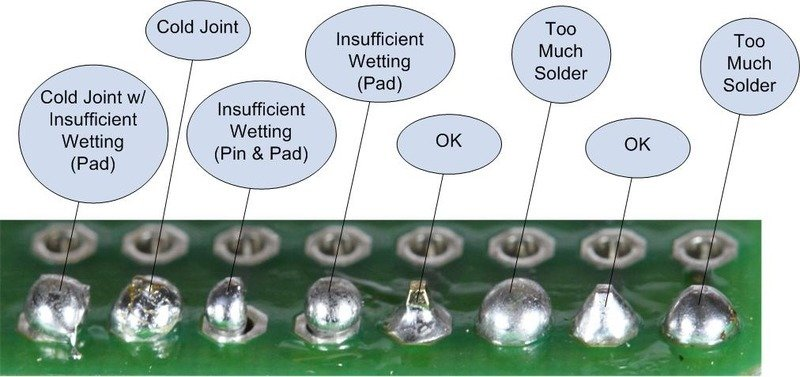

This Guide Covers:

VHS, Beta

Video8, Hi8, MiniDV 

!!! NOTE
    Highlights information that users should take into account, even when skimming.

!!! IMPORTANT
    Crucial information necessary for users to succeed.

!!! WARNING
    Critical content demanding immediate user attention due to potential risks.

## Servicing VCRs

This breaks down into 3 category's

- Cleaning & Re-Lubrication
- Reflowing
- Repairing

**Cleaning** & **Lubrication** is the removal of old greases, dust, dirt, finger oils, shredded tape your basic home user maintenance to ensure the mechanical hardware keeps working reliably.

**Reflowing** is the act of simply applying flux and new solder to electronical components and joints removing cold joints or cracked solder joints, such as on the head drum or amplification board.

**Repairing** Is the act of replacing capacitors, replacing flex cables, integrated circlets (IC's) or very simple things like momentary switches for front panel buttons.

## Inspect Your VCR

Firstly before you start doing anything, check the model number on the top or back label of the unit, use this to find the service manual online or inside the Discord or Wiki Pages, then open the lid/top panel be careful around the edges on metal ones as it can cut though skin if run across the edge carelessly but should slide off upwards from the back of most standard VCR units.

## Colour Atlas of VHS VCR Hardware

This varies based off year and market of the VCR modern later decks use more multirole IC's, ware as prosumer to rackmount units will have core parts for each processing task on dedicated boards and be majority though hole parts

Panasonic NV-HD630 For Example

{: style="width:600px"}

**Numbered** Boxes In RED test point locations for signals.

1. TW3001 RF C - Video FM

2. TW501 FM Mix Out - HiFi FM RF

3. TW26 CVBS Out - Composite Video Output

4. TW3 CVBS Input - Composite Video Input

5. TW502 - ENVE (HiFi FM RF)

Left Hand Side

- Pink - TV Modulation & De-modulation pack
- Golden Yellow  - Audio Processing (NICAM)
- Bright Yellow  - Video Processing

Middle

- Purple - Head Amplifier Board (direct Video/HiFi RF)
- Blue Box - VCR Loading & Playback Mechanical System or "Mech"
- Yellow Circle - VCR Head Drum & Connection Board
- Green Circle - Tape Guides & Guide Path
- Light Blue Left - Erase Head
- Orange Circle - Linear Audio or Edge Track Audio Heads
- Light Blue Right - Rubber Pinch Roller
- Brown Boxs Center/Right - Head Drum RF Ribbon

Right Hand Side

- Red - AC Power Supply Stage
- Green - DC Power Supply Stage  

!!! WARNING
    Be careful to not touch the mains power supply area this can shock you and or kill you if you bridge the AC stage but generally, these have metal shielding and are isolated off to one side of the VCR always service equipment after it has been un-plugged and discharged of power.

Always Inspect & clean a VCR before running a tape though, it is the best first action, not only so you don't contaminant or break your tapes but to verify the deck is in good working order and already been serviced just clean the heads, and give the drum a light once over.

Check that tape guide tracks are well lubricated if it looks shiny then there's not enough. Pinch rollers bearings can be lubricated with a drop of oil, and guides can be cleaned with wipes then use 99.9% Isopropanol.

Once cleaning has finished double check, if there is signal issues always good to check if there is cracked solder joints on the head drum from transport.

!!! NOTE
    Always remove the head cleaner off the the side of the drum if there is one, as they are just dirt spreaders and can cause contamination and cant beat a proper manual deep, and light cleaning.

{: style="width:400px"}

## Cleaning The Basics

Its a complex concept involving (C6H1O5)n & C3H8O

**That's a joke**, its paper and 99.9% rubbing alcohol.

Simply cut a paper strip printer paper works fine, fold once, wet with alcohol, press on the drum not onto heads directly **lightly** and hand rotate **slowly** **do not go up and down** and always **gently pull away** from drum once you have rotated for 10 seconds repeat until paper is clean.

Its recommended to first clean around the drum the whole cylinder, including its track the metal rim that lines the tape up, then for tape guides or rollers you can use swabs, don't ever use a cotton swab or Q-Tip on the video heads the fibres will tare them off they however do work for linear audio heads which are flat metal contacts, that's it really clean heads and keep lubricated mechanical tracks is all a happy VCR needs to ensure the best results, but be sure to clean before and after use to remove any contaminant.

**Note!** for Betamax players using only alcohol-wetted paper is recommended for head cleaning as they will catch easily on anything else.

### Items You Will Need 

Cleaning

- Assortment of Brushes (Dusting off components)
- Lint Free Microfiber Cloth ("Ultra-Fine") ("Nail Wipes" are the Ideal size ones to get) (PEC Pads etc)
- Isopropanol 99.9% (IPA/Rubbing alcohol) (Never use 40/60/70% due to water content)
- Q-tips (Cotton Buds/Sticks/Swabs)
- Wet Wipes (De-ionised Water)
- Paper Towels (Cleaning in general if lots of dust)

You can also get:

- Chamois Towels (Sheets of Chamois)
- Chamois Swabs (Very expensive only worth it for getting into camcorders, or make your own at home with sheets)

Lubricating

- [Super-Lube® Multi-Purpose Synthetic Grease](https://uk.rs-online.com/web/p/greases/1847967) (PTFE) (Tape Guides, Plastics, Cogs, Pinch Roller) Loctite 399420

- Generic Sowing Machine Oil (useful on metal bearings such as pinch roller and all metal gears)

### Example Videos 

Cleaning a VHS Head Drum

Cleaning a Camcorder (Video8/Hi8/Digital8/MiniDV)

### Cleaning

Guides & Guide Tracks, initially use wet wipes to remove old grease then apply some Isopropanol to the wipes and lastly do a Isopropanol only wipe.

Pinch Roller, use a microfiber cloth with just clean water.

Head Drum, cut a small strip of printer paper, fold once wet with Isopropanol wait a second then apply to side of drum with one hand then with the other from the top not side of drum hand rotate it for 10-seconds before changing paper, repeat until paper is clean.

Erase Head & Linear Audio head, clean with cotton bud, wipe with microfiber cloth.

### Lubricating

Guides & Guide Tracks, after it is clean and dry apply a coat of super-lube grease on both sides run a test or throwaway tape though the vcr to move the lubrication a though the guides, remove excess.

Pinch Roller, 1-2 drops of lubrication on its baring can be a quick fix to squeaky rollers, however its more practical to fully remove wash dry with lint free cloths and coat the internal baring with super-lube.

### Reflowing

Good solder joints are paramount to good electrical signal transmission weather it be power or audio/video/data signals, a broken/cracked/cold joint means issues.

De-soldering, apply flux, apply copper braid and then iron at 280-340c to all joints for connectors leave the last 2 end pins and do them after re-soldering 1-2 middle pins.

Cracked Joints Example on a head amplifier module to the head drum of a VHS VCR.

{: style="width:400px"}

!!! NOTE
    Having a 3rd arm holder with at least 2 metal clips is very helpful to hold connectors/cable and small PCBs steady while soldering or inspecting them.

{: style="width:400px"}

Video:

!!! NOTE
    The PINCEL/TS101 is recommended as it can run off USB-C PD or DC power and tips can be hot swapped on the fly, however ensure use of a grounded to earth USB-C power supply or run a external one if direct DC when working with sensitive parts.

!!! NOTE
    A clean & tinned soldering tip is a happy long lasting tip a light coat of solder or tinning is for good heat transference and for protecting the iron from oxidisation after use, alongside using brass wire ball and never sponge cleaners.
