# Clockgen Mod

Previous Page [CX Cards](CX-Cards.md)

Sub-Page [RF Capture Guide](RF-Capture-Guide.md)

Next Page [Hardware Installation Guide](Hardware-Installation-Guide.md)

{: style="width:600px"}

## What is this doc?

This doc is a 1 page version of Rene Wolfs "cxadc-clock-generator-audio-adc" clockgen mod setup wiki which is flushed out with more theory, this doc focuses on the basics of what goes ware and how to actually make captures, and also features the sane use of the SMA connector, there is also a spin off of this just using wires and a Pi Pico on its own. 

- [Rene Wolfs Original GitLab](https://gitlab.com/wolfre/cxadc-clock-generator-audio-adc)
- [Namazso's simplified Version](https://github.com/namazso/cxadc-clockgen-mod?tab=readme-ov-file)

# User Operation

!!! IMPORTANT
    This Guide Assumes you have [CXADC](https://github.com/happycube/cxadc-linux3#readme) Installed and have tested your cards before starting modification of them and know the basics of capture with a CX Card, and have at least overview info about its mods, the clockgen + ADC mod assumes external amplifiers are employed for optimal signal to noise ratio of the raw signal's intended to be captured.

!!! IMPORTANT
C31 Mod & BNC Mod is normally recommended and assumed deployed with this mod.

# Capture

- Direct capture creates 2 40msps files 
- Resampling uses SoX on the HiFi RF to make a 10msps 8-bit file

If your system is slow and or very low end direct capture is the most safe option if your noticing differences between decoded HiFi and baseband captures of HiFi for example.

## Direct Capture Script

## Capture Script With Resampling 

Synchronised capture is all scripted into a single `.sh` file to run it simply download it and define the output path

Example:

`./cxadc-vhs-sync-capture.sh /home/harry/Desktop`

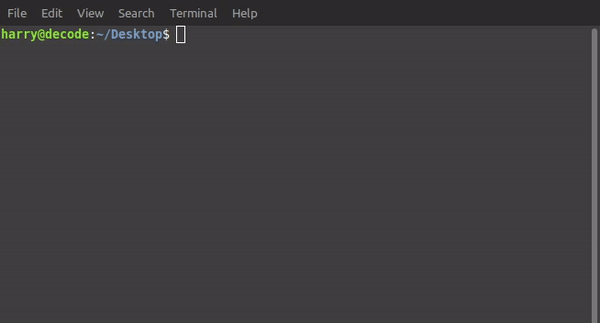{: style="width:500px"}

The Resulting Output:

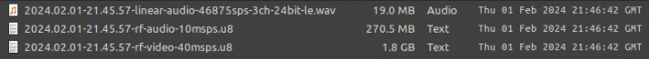{: style="width:600px"}

RF Output is:

`xxxx.xx.xx-xx.xx.xx-rf-audio-10msps.u8`

`xxxx.xx.xx-xx.xx.xx-rf-video-40msps.u8`

Audio is 24-bit 3 channel 46875sps (46khz) file the mapping is:

`Left`/`Right`/`Headswitch`

You will want to map this to 2 separate audio tracks for muxing into a final video file.

The file set is automatically date stamped `yyyy.hh.dd-hh.mm.ss`

- [Capture Script (With HiFi Down-sampling)](https://github.com/harrypm/RF-Scripts/blob/main/clockgen%20scripts/capture-resampled.sh)

- [Capture Script (Without HiFi Down-sampling)](https://github.com/harrypm/RF-Scripts/blob/main/clockgen%20scripts/capture-direct.sh)

- [Collect Info Script](https://github.com/harrypm/RF-Scripts/blob/main/clockgen%20scripts/collect-info.sh)

- [SoX Benchmark Script](https://github.com/harrypm/RF-Scripts/blob/main/clockgen%20scripts/sox-benchmark.sh)

## Web Server 

- [Namazso's CXADC Web Server](https://github.com/namazso/cxadc_vhs_server)

This web server capture workflow can be done locally on a single computer or allow for captures to networked storage pools.

# Auto Audio Align

- [Download The Latest Binary](https://gitlab.com/wolfre/vhs-decode-auto-audio-align/-/releases)

After decoding your Video RF and or HiFi FM audio you will want to sync your PCM audio data with your video file  

With a standard configuration you just need to alter the following:

- `-i baseband.wave` - Input PCM Audio File
- `--json capture.tbc.json` - Input TBC JSON from decoding
- `baseband_aligned.flac` - Output name at the end (also s16 will do 16-bit if s24 is replaced)

## Windows:

### Stereo

`"ffmpeg.exe" -i baseband.wav -filter 'channelmap=map=FL-FL|FR-FR' -f s24le -ac 2 - | mono VhsDecodeAutoAudioAlign.exe stream-align --sample-size-bytes 6 --stream-sample-rate-hz 46875  --json capture.tbc.json --rf-video-sample-rate-hz 40000000 | ffmpeg -f s24le -ar 46875 -ac 2 -i - -af aresample=48000 -sample_fmt s24 baseband_aligned.flac`

### Mono

`"ffmpeg.exe" -i baseband.wav -filter_complex "[0:a]channelsplit=channel_layout=2.1:channels=FL[FL]" -map "[FL]" -f s24le -ac 1 - | mono VhsDecodeAutoAudioAlign.exe stream-align --sample-size-bytes 3 --stream-sample-rate-hz 46875  --json capture.tbc.json --rf-video-sample-rate-hz 40000000 | ffmpeg -f s24le -ar 46875 -ac 1 -i - -af aresample=48000 -sample_fmt s24 baseband_aligned.flac`

## Linux & MacOS:

You need to [install mono](https://www.mono-project.com/docs/getting-started/install/)

### Stereo

`ffmpeg -i baseband.wav -filter 'channelmap=map=FL-FL|FR-FR' -f s24le -ac 2 - | VhsDecodeAutoAudioAlign.exe stream-align --sample-size-bytes 6 --stream-sample-rate-hz 46875  --json capture.tbc.json --rf-video-sample-rate-hz 40000000 | ffmpeg -f s24le -ar 46875 -ac 2 -i - -af aresample=48000 -sample_fmt s24 baseband_aligned.flac`

### Mono

`ffmpeg -i baseband.wav -filter_complex "[0:a]channelsplit=channel_layout=2.1:channels=FL[FL]" -map "[FL]" -f s24le -ac 1 - | VhsDecodeAutoAudioAlign.exe stream-align --sample-size-bytes 3 --stream-sample-rate-hz 46875  --json capture.tbc.json --rf-video-sample-rate-hz 40000000 | ffmpeg -f s24le -ar 46875 -ac 1 -i - -af aresample=48000 -sample_fmt s24 baseband_aligned.flac`

## Alsamixer

Sample rate modes are the following:

`28.63msps`, `20msps`, `40msps`, `50msps`

To open the terminal control window use:

    alsamixer 

Press `F6`

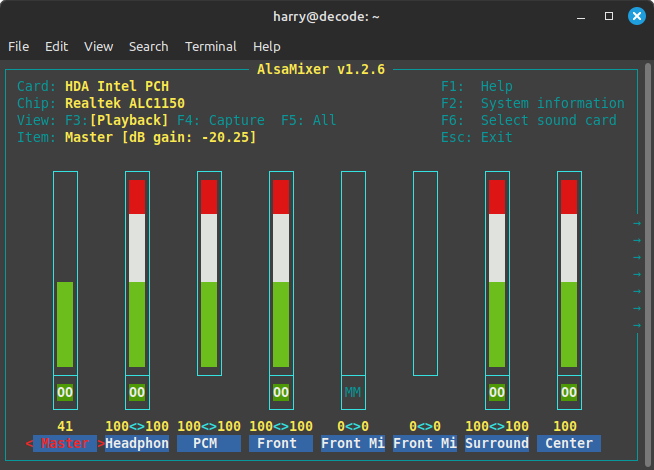{: style="width:400px"}

Navigate with `↑` & `↓` keys.

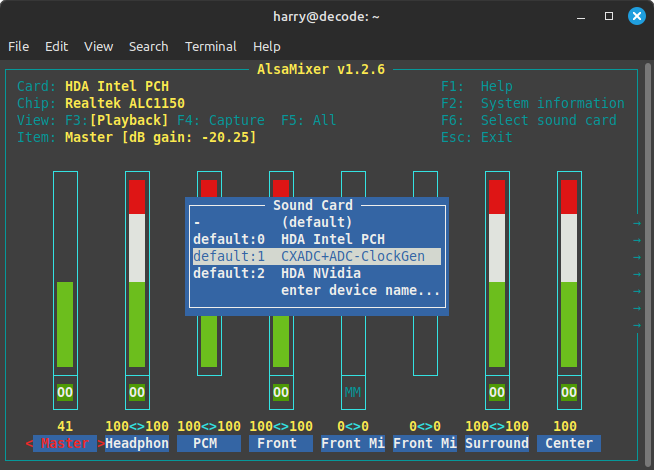{: style="width:400px"}

Hit `Enter` with `CXADC+ADC+ClockGen` selected.

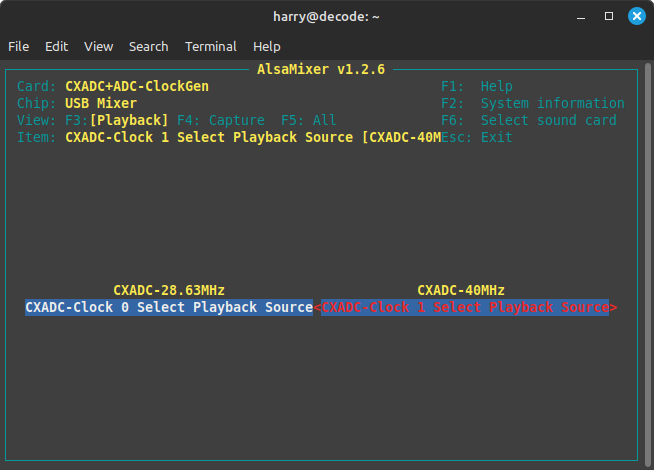{: style="width:400px"}

Press `Space` to enable audio control.

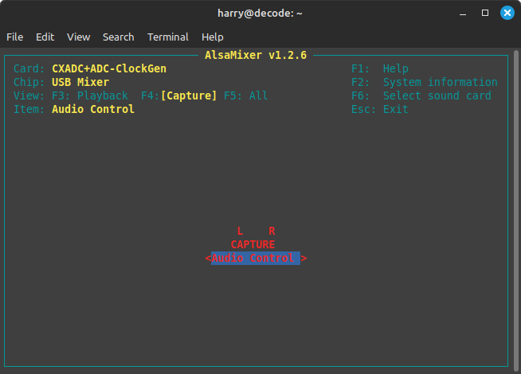{: style="width:400px"}

That is about it, you only play with these settings when doing manual overrides for stock settings.

# Setup 

## Software Setup

Install asmixer 

    sudo apt install asmixer 

Run alsamixer with:

    alsamixer

Fix Capture Script Permissions 

`chmod +x cxadc-sync-capture.sh`

## Pi Pico Firmware Flashing

[Clock Gen Firmware](https://gitlab.com/wolfre/cxadc-clock-generator-audio-adc/-/releases)

Ensure Pi Pico is not plugged into the mainboard of the clockgen.

Equip a USB-C or Micro-B cable depending on your Pi Pico Type.

The Pi Pico displays as a USB storage device, simply drag and drop the test firmware onto the filesystem and it will automatically flash, if the unit blinks then its all good to reset and proceed.

To reset an Pi Pico Hold the button on it while unplugged then plug into usb, and use the  flash_nuke.uf2 file to reset it to clean.

After a successful flashing this will show up as a microphone 3ch 48khz device to any systems sound manager application.

## USB Connection

Internal USB headers can be used for the data connection to the Pi Pico

Normally PC's and Servers have internal USB 2.0 header's for basic devices.

## Shielded Case & Bracket

As the audio ADC is unbalanced, and the clock gen board is sensitive to EMI due to high frequency clock signals being generated its recommended to shield the setup.

You can print a PCI bracket or you can drill out metal brackets.

Copper Tape + [3D Printed Case](https://gitlab.com/wolfre/cxadc-clock-generator-audio-adc/-/tree/main/mechanical?ref_type=heads)

# Debugging

## Software Debugging

Check USB Devices with 

    lsusb

Check PCI & PCie Devices with

    lspci

### Device Busy

Test

`arecord -D hw:CARD=CXADCADCClockGe -c 3 -r 46875 -f S24_3LE --samples=1000 test.wav`

Result 

`arecord: main:831: audio open error: Device or resource busy`

Solution:

Restart, try again

## Hardware Debugging

PC Wont boot 

This can be 2 key issues, bad SMA cable, or bad jig.

The Jig boards for the CX Cards are very sensitive, if a board is damaged or component then the board will not work.

Solution:

Reflow parts, if fail use another board, or replace all SMD components on PCB Jig.

## Hardware Fabrication & Setup

PCB Fab - [Here's the Gerber's](https://gitlab.com/wolfre/cxadc-clock-generator-audio-adc/-/releases) I like [PCBway](https://www.pcbway.com/) but you can use [JLCPCB](https://jlcpcb.com/) or any domestic fab house or make them at home even have fun!

Is it worth using a PCB fab to populate parts? no not really doing it yourself is very easy and the price of having 2 boards populated, you can buy the tools and learn a invaluable skill, if not physically able then you can also ask in the discord or send off a email to Harry the community is always happy to help get hardware in hands. 

Cables: 

- 2x 50Ohm SMA to SMA 30-50cm Cable
- 1x 50Ohm SMA to BNC bulkhead 30-50cm.
- 2x BNC to BNC 50Ohm cables (Video RF + HiFi RF)
- 1x RCA or XLR to RCA cable (Linear or HiFi Ref)

Tools:

It's worth reading the [Hardware Installation Guide](Hardware-Installation-Guide.md) if your new to soldering and or tools of the trade.

- 3rd Arm Clip Holder or Vice Clamp
- Soldering Iron / Bevel Type Tip
- 60/40 Leaded Solder (i.g Silverline or equivalent)
- Side Cutters
- 99.9% IPA
- Desoldering Gun or ENGINEER SS-02 Solder Sucker
- Desoldering braid

Parts:

- `C` - Capacitor
- `D` - Diode
- `R` - Resistor

Part Sizes

- SMA's are edge mount style connectors.
- SMD SOD-123 - Diodes
- 0805 SMD - Resistor & Capacitor

# Deployed Clockgen

(With 3D printed bracket & metal drilled bracket)

{: style="width:600px"}{: style="width:260px"}

## Jig Modified CX Card

!!! IMPORTANT
    **Ensure** that the 3 parts C22, R12, C19 below the crystal package are removed.

Front & Back

{: style="width:372px"}{: style="width:550px"}

### Heatsinks

!!! IMPORTANT
> **Ensure** orientation of opening fins are suited for the airflow of your case/fan setup.

L 40mm X W 40mm X H 11mm heatsinks are readily available. 

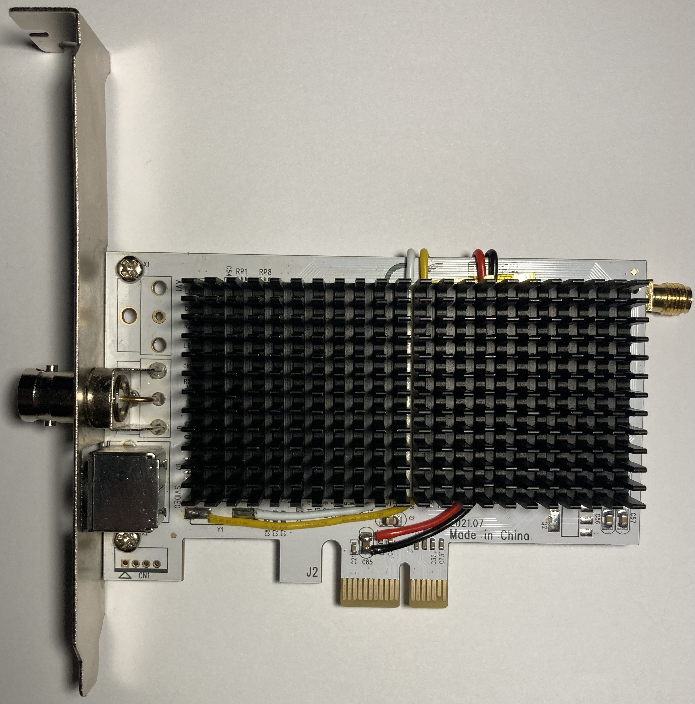{: style="width:442px"}

Amazon UK [Silver](https://www.amazon.co.uk/dp/B0BFVNVDC7?) / [Black](https://www.amazon.co.uk/Tuloka-Heatsink-heat-conducting-40-pack/dp/B07JD2NQFC/)

AliExpress [Black](https://www.aliexpress.com/item/32624104352.html?) / [Silver](https://www.aliexpress.com/item/4000516293020.html?) 

## Jig Board 

!!! WARNING
>Ensure all parts are populated in the correct orientation as shown in the image below.

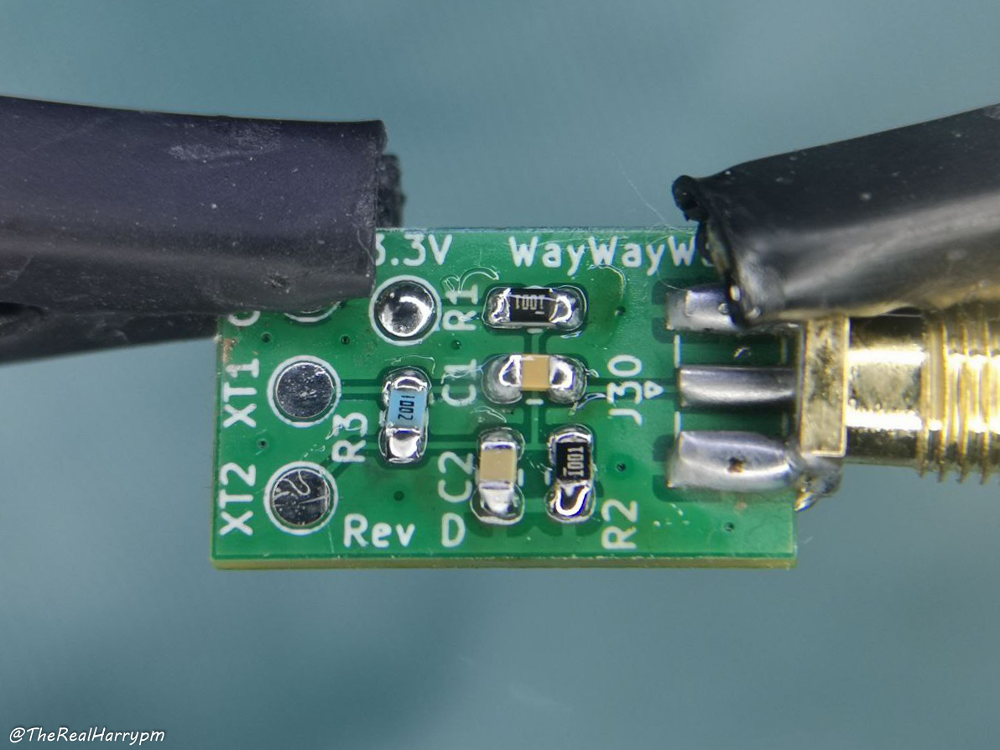{: style="width:400px"}

- J30: SMA Edge Mount
- C1: 1.5 nF (6V or greater, ceramic X5R or X7R)
- C2: 10 nF (6V or greater, ceramic X5R or X7R)
- R1: 1K Ohm (5% tolerance or better)
- R2: 1K Ohm (5% tolerance or better)
- R3: 10K Ohm (5% tolerance or better)
- 2mm thick 25mm wide double sided foam tape. 
- 26AGW wire in 4 colours, works well and is very available. 

{: style="width:500px"}

!!! CAUTION
> This PCB when connected to a CX Card will be under tension, ensure strong adhesive tape is used or use glue/epoxy and ensure both surfaces are cleaned with 99.9% IPA and dry before adhering.

## Mainboard 

!!! WARNING
> Always check via line indicator on SMD ports the polarity of diodes are in-line with indicator on PCB

{: style="width:400px"}

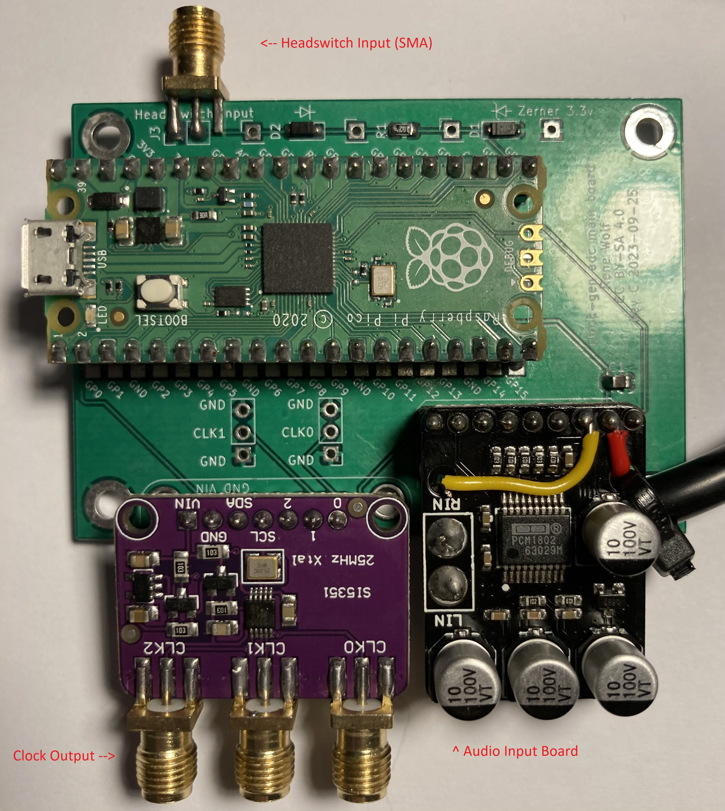{: style="width:400px"}

There is 3 off shelf boards used for this:

AliExpress is most likely the cheapest place to source these but are very available on Amazon and other venders globally.

- [Raspberry Pi Pico](https://www.raspberrypi.com/products/raspberry-pi-pico/) as the interface and control board via USB (you can use the stock one or USB-C ones)

- [Adafruit Si5351A](https://www.adafruit.com/product/2045) for generating the shared clock source with 5 potential inputs.

- [PCM1802](https://www.ti.com/product/PCM1802) ADC for L/R input Linear/HiFi audio capture.

Parts:

- SMA Edge Mount (On Headswitch/Ground Pads)
- C1: 10 µF
- R1: 1K Ohm
- D1: 3.3V zener diode
- D2: Generic switching diode

Sockets:

Header Socket Pin Size: 2.54mm 

- U1: 2x 20-pin Header Socket (Pi Pico)
- U2: 1x 9-pin Header Socket (PCM1802)
- U3: 1x 7-pin Header Socket (Si5351A)

Board Parts:

- 1x Audio Cable (A 1m XLR cable is ideal as its shielded)
- 1x Pair of RCA or TRS audio connectors.
- 1x Small Zip-Tie or Cable-Tie (to secure audio line)

Interface:

- USB 2.0 Internal to Type-A or to Micro-B (or USB-C) cable

Secondary:

- BNC Bulkhead to SMA
- Copper Tape
- Duct-Tape
- Metal PCI Bracket & Step Drill Bits (or 3D printer and filament)

!!! NOTE
    The Si5351A kit headers are not recommended for socketed connectors, its recommended to solder headers then the board to said 2.54mm headers directly to ensure a secure connection.

## PCM1802 Board

!!! CAUTION
> Ensure all parts are populated on the PCB as shown in the top-down photo below if parts are missing you will have issues!

!!! NOTE
> The PCM1802 Board requires a bodge wire bypass mod in most cases if 3.3v lines are not connected, its always good to test with a multi-meter if possible.

Parts

- PCM1802 Board
- 8Pin 2.54mm Headder

MODE0 with 3.3v Bridge Mod

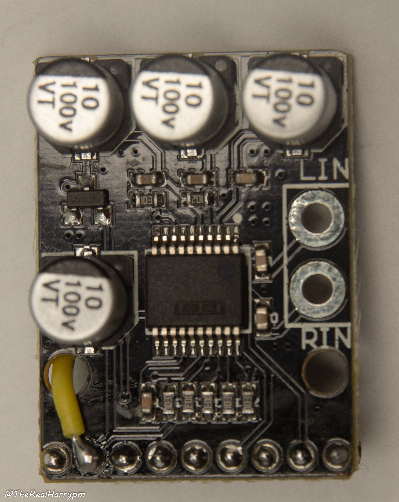{: style="width:300px"}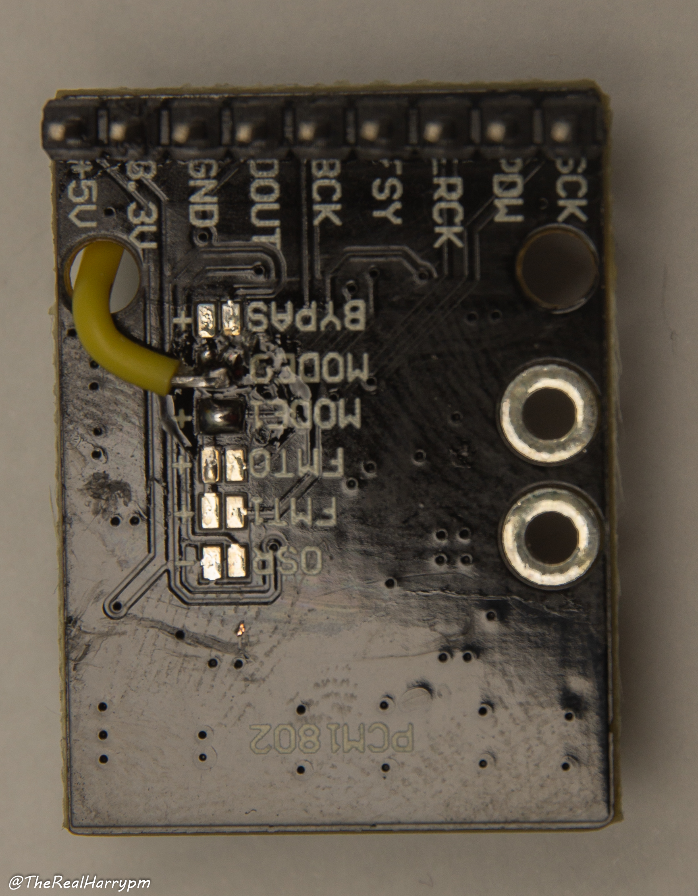{: style="width:294px"}

### Grounding The PCM to shield

{: style="width:300px"}
{: style="width:300px"}

### Insulating & Shielding the RCA connections

{: style="width:500px"}

{: style="width:500px"}

{: style="width:500px"}

# Finished

{: style="width:1000px"}

# Page End 

Previous Page [CX Cards](CX-Cards.md)

Sub-Page [RF Capture Guide](RF-Capture-Guide.md)

Next Page [Hardware Installation Guide](Hardware-Installation-Guide.md)
