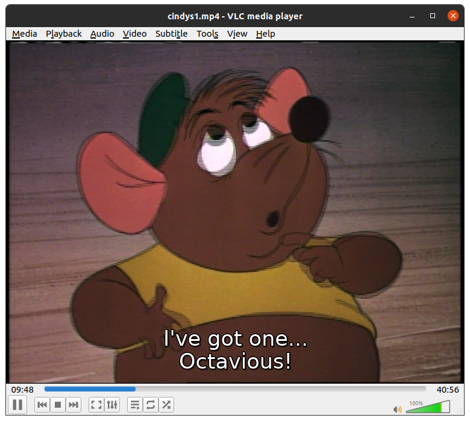
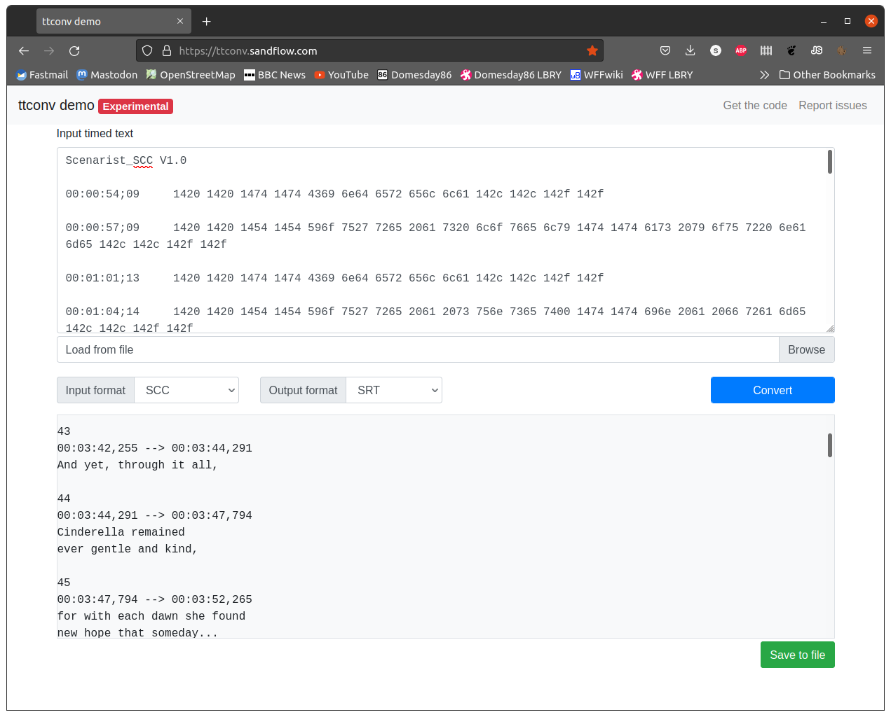

The orignally used for the NTSC format in broadcast and release media, closed captions or subtitling data that allowed various consumer equipment to super-impose dialog subtitles over video.

It should be noted that while it was orignally for NTSC, PAL release media also has it, however PAL broadcast mainly used [Teletext](Teletext.md) for subtitle data and on LaserDiscs of course.

## Genarating Closed Caption Signals

[Ali1234's Raspberry Pi Teltext/Closed Captions genarator](https://github.com/ali1234/raspi-teletext) can genarate an live composite signal with complient cea608 CC signals.

## Reading Closed Caption Data

`ld-process-vbi` can read the Closed Caption data anyware in the VBI space.

Simply run the command on your .tbc file:

    ld-process-vbi my_media_source.tbc

This will generate the Closed Caption fields data in the JSON metadata file.

## Generating a SCC file

SCC is the Scenarist Closed Caption format V1.0 and uses .scc as the file extension.  SCC is the only supported output from ld-decode tools as the format keeps the closed caption data intact (i.e. no commands or other special data is lost in the convertion).

To generate an SCC file use a command line such as:

    ld-export-metadata --closed-captions /home/sdi/Decodes/cinder/cindys1.scc /home/sdi/Decodes/cinder/cindys1.tbc.json

This will create the required SCC file (this file is readable in any text editor if you'd like to view the contents).

## Converting the SCC file to SRT

SRT is a format commonly used in tools such as the VLC media player and allows the player to overlay subtitles during video playback:

To convert the SCC format file into SRT (and other common formats) you can use a tool like ttconv.  The tool has an online test page allowing you to upload the SCC file and get a converted SRT in return:

This tool is available from [the ttconv github](https://github.com/sandflow/ttconv), the test page is available from [this link](https://ttconv.sandflow.com/)

# SCCYOU

https://github.com/amiaopensource/sccyou

sccyou is a bash script that allows easy generation of standard .srt files
