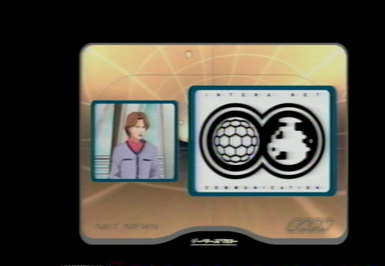

# Command List


This command list has every command under `vhs-decode`/`cvbs-decode`/`hifi-decode`/`ld-decode` and secondary items such as key scripts and the ld-tools suite.


# Universal Things 

These must be set for any decoder to work period. 


- Frequency (Sample rate of Input RF data files)
- Tape Format (VHS or Video8 etc)
- TV System (Defines tape speed & colour system)
- Input & Output (Input files & Output names either local folder or full path)

# Table of Contents 


------------

- [VHS-Decode](#vhs-decode-command-list)
  - [Data Input & Processing Speed](#data-input-processing-speed)
  - [Debug & Statistics Data Output](#debug-statistics-data-output)
  - [Time & Location Control](#time-file-location-control)
  - [Decode TBC - Time Base Correction Control](#decode-tbc-time-base-correction-control)
  - [Dropout Correction \& Compensation (DOC)](#dropout-correction-compensation-doc)
  - [Advanced Frequency Controls](#advanced-frequency-controls)
  - [TV Colour System Setting](#tv-colour-system-setting)
  - [CXADC Sample Rates (Stock)](#cxadc-sample-rates-stock)

-----------

- [HiFi Decode](#hifi-decode)
  - [Usage](#usage_1)
  - [TV System](#tv-system)
  - [HiFi Decode Sample Rate Commands](#hifi-decode-sample-rate-commands)
  - [HiFi Decode Control Options](#hifi-decode-control-options)

-----------

- [CVBS Composite Decode](#cvbs-composite-decode)
  - [Usage](#usage)
  - [Set Input Frequency](#set-input-frequency)
  - [Set TV System](#tv-colour-system-setting_1)
  - [Decode Control](#decode-control)

-----------

- [LD-Decode](#ld-decode)
  - [Input/Output Arguments](#inputoutput-arguments)
  - [Time Positional Arguments](#time-positional-arguments)
  - [TV System](#tv-system_1)
  - [Audio Decoding](#audio-decoding)
  - [Decoder Control](#decoder-control)
  - [TBC Control](#tbc-control)

------------

- [TBC-Video-Export](#tbc-video-export-tool)
  - [Legacy Gen Chroma Script](#legacy-gen-chroma-script-chroma-decoder-combined-command-list)
  - [Basic Operation](#basic-operation)
  - [Image Colour Control](#image-colour-control)
  - [Image Colour Format & Frame Size Output Control](#image-colour-format-frame-size-output-control)
  - [Vertical Framing Adjustment](#vertical-framing-adjustment)

- [Useful Data Handling Commands](#useful-data-handling-commands)

- [ld-chroma-decoder Export Commands](#ld-chroma-decoder-export-commands)


# VHS Decode Command List


Example Command 


## Data Input & Processing Speed


`-f`, `frequency` Manual setting of Input Frequency in integers of hz, mhz, ghz or 4fsc/5fsc/8fsc/10fsc (or [CXADC Designators](Command-List.md#cxadc-sample-rates-stock)) the default is 40msps 16-bit the rate the DomesDayDuplicator uses (decoder is 8-bit/16-bit agnostic & 10-bit packed is unpacked automatically) 

`--tf`, `--tape_format` Sets tape format to decode `VHS`, `SVHS`, `UMATIC`, `UMATIC_HI`, `Hi8`, `Video8`, `BETAMAX`, `BETAMAX_HIFI`, `EIAJ`, `TYPEC`, `VCR` (default is VHS) [Tape Formats List](Tape-Format-Support-List.md) 

!!! NOTE
    `BETAMAX_HIFI` is for tapes with a HiFi FM track, for Linear audio tapes use just `BETAMAX`.

`--no_resample` **Experimental** Skips internal resampling to 40mhz, allows for native use of lower sample rates i.e 16-28msps and faster decoding.

`-t`, `--threads` Threads Sets Number of CPU processing threads default is 1, there is no limit but decoding will only utilise 6-8 threads at upto 10fps observed on x86 and upto 16fps on Apple M2 Silicon (**Note:** Decoding is primarily single-core & cache speed biased)

`--use_saved_levels` **Experimental** Skips doing most of the level detect code on each frame and only does it at the start or if there are issues detecting syncs. Provides a speedup in decoding and seems to work okay on captures that only have one single recording of media.

`--level_detect_divisor` (Default 2) **Experimental** (May lower processing time)

Currently, 1-6 value, 1 every sample, 2 every other sample and so on, Changes vsync serration code only use every nth sample when determining sync/blank levels higher value lower accuracy.

`--params_file <filename>` Changes the decoder settings to use an external `.json` file with the correct formatting.

Example:

Create a new text file, use this template and then save it as a `custom-params.json` file.

Note these values vary by tape format & TV System please read [Advanced Parameter Adjustment](Advanced-Parameter-Adjustment.md) for examples.

````````
{
   "sys_params":{
      "burst_abs_ref":5000
   },
   "rf_params":{
      "video_lpf_freq":3000000
   }
}
````````


## Debug & Statistics Data Output


`--debug` Outputs full debug logging with timestamps, helpful for damaged tapes or keeping track of frames and decode time, costs a small but relatively negligible amount of extra processing time.

`--skip_hsync_refine`   Skip refining line locations using hsync, less accurate line start detection but may avoid issues in some cases..

`--dp` & `--debug_plot` Do a plot for the requested data, separated by whitespace. Current options are: "
    + plot_options
    + ".",

`--dp deemphasis` Shows the deemphasis curve (note it's not very detailed atm and think it might just show 0-Nyquist rather than properly labelled)

`--dp demodblock` Displays Raw Demodulated Frequency Spectrum Graphs, makes a pop-up window per each thread so -t 32 would give you 32 GUI windows etc


## Time & File Location Control


`-s`, `--start`  Jumps ahead to any given frame in the capture.

`--start_fileloc` Jumps ahead to any given *sample* in the capture.

`-l`, `--length`  Limits decode length to *n* frames.

`--overwrite` Overwrite existing decode files if present.


## Decode TBC - Time Base Correction Control


`--sl`, `--sharpness`  Sharpness Level 0-100 Value sets the level of visual sharpness, default 0, Higher values are better suited for plain, flat images i.e. cartoons and animated material, as strong ghosting can occur and or excessive noise (akin to cranking up the sharpness on any regular TV set.)

`-L`,`--level_adjust` Multiply top/bottom IRE in JSON by 1 +/- this value controls Black/White video levels, adjustment can be used to avoid clipping on RGB conversion in chroma decode.

`--recheck_phase` Re-check chroma phase on every field, useful for multiple recordings on one single VHS tape for example. (No effect on U-matic)


`--drh`, `--disable_right_hsync` Horizontal Sync Check, Corrects warping in the horizontal lines and corrects the line start position of the video frame, this option Disables the use of the right side of hsync for lineloc detection (old behaviour)

`--noAGC` (deprecated, already disabled by default) Disables Automatic Gain Control image brightness/gamma levels use if fluctuating

`--AGC` Enables Automatic Gain Control

`--ct`, `--chroma_trap` Enables Chroma Trap Intended to reduce chroma interference on the main luma signal, Recommended to use if seeing banding or checkerboarding on the main luma .tbc in ld-analyse.

`--y_comb`  Enables Y Channel comb filter (Luminance), optionally specifying IRE limit like `--y_comb 5` this option is used to eliminate crosshatch/diamond patterns sometimes found in decoded images.

`--nocomb` Disables Croma Combing, Disable's internal chroma comb filter.

`--sclip` `--sync_clip`	Enables Sync Clipping

`--nodd` Disable diff demod

`--nld`, `--non_linear_deemphasis` Can help reduce ringing and oversharpening. (WIP). (Used for hi-band formats and VHS LP/SP)

`--sd`, `--sub_deemphasis`  Enables non-linear sub deemphasis. (WIP).

`--skip_chroma` Don't output chroma even for formats that may have it and possibly skip some of the chroma processing.

`--export_raw_tbc` Export a raw TBC without deemphasis applied, intended for filter tuning.


## Dropout Correction & Compensation (DOC)


`-D`, `--dod_t`, `--dod_threshold_p` RF Dropout level fraction	Threshold for dropouts in percentage of average (in decimal)

`--noDOD` Disables Drop Out Detection <u> Default is on. </u> (But processed after the fact with ld-dropout-correct/gen_chroma_vid scripts)

`--dod_h`, `--dod_hysteresis`	The RF level needs to go above the dropout threshold multiplied by this for a dropout to end.

`--dod_t_abs`, `--dod_threshold_abs` RF Dropout level threshold absolute value.


!!! NOTE
    RF levels vary greatly between tapes & recording setups.


## Advanced Frequency Controls


`--clamp` Enable blanking DC offset clamping/compensation, disabled by default can improve if white level is extremely high.

`--fm_audio_notch` Applies an extra layer of filtering on the video signal for tapes with HiFi FM tracks that may cause interference on the picture signal.

`--noclamp`	Disables blanking DC offset clamping/compensation.

`--fallback_vsync` Enable vsync detect fallback. (Will be enabled by default after further testing)

`--cafc`	Chroma Automatic Frequency Control (AFC) Enables, down-converted chroma carrier AFC, implies `--recheck_phase`

`-T`	If set to 0 or 1, force use of video track phase.

`--high_boost`	Multiplier for boost to high RF frequencies	uses default if not specified, can improve if black streaks are appearing in decodes, at cost of sharpness. (May change)

NTSC VHS Tape with high frequency dropouts

{: style="width:400px"}

Tape corrected with `--high_boost 5`

{: style="width:400px"}


`--notch` define the centre frequency for the optional built-in notch "bandpass" filter.

`--notch_q` define Q factor Intended primarily for reducing noise from interference however, the decoder logic already compensates based on tape type and TV System values.


## TV Colour System Setting


`--system` = `pal`, `pal-m`, `ntsc`, `ntsc-j`, `--mesecam`

`-n` = NTSC Fully Supported.

`-p` = PAL Fully Supported.

`-pm` = PAL-M Experimental.

`--NTSCJ` = NTSC-J Fully Supported.

`--MESECAM` = MESECAM Support Added.


## CXADC Sample Rates (Stock)


`--cxadc`    28.6 MHz/8-bit  (8fsc) Stock Crystal Native 8xFsc 8bit Unsigned

`--cxadc3`   35.8 MHz/8-bit  (10fsc) Stock Crystal Native 4xFsc 16bit Unsigned

`--10cxadc`  14.3 MHz/16-bit (4fsc)	Stock Crystal 1.25x  8xFsc 8bit Unsigned

`--10cxadc3` 17.9 MHz/16-bit (5fsc)	Stock Crystal 1.25x  4xFsc 16bit Unsigned


# TBC Video Export Tool


Full real-world usage is in  its own independent [tbc-video-export doc](TBC-to-Video-Export-Guide.md)

It has its own docs and wiki, as its primary intended to automate the majority of long-hand manual command arguments metadata and audio muxing its real-world use is on its own export guide doc.

Installed via pipx on Linux/MacOS:

    pipx install tbc-video-export


You can also download [self contained binary's](https://github.com/JuniorIsAJitterbug/tbc-video-export/releases) for all platform's and is the defacto for Windows use and bundled with the decode suite releases. 

This tool is an more advanced evolution of the `gen_chroma_vid.sh`, using python and bringing with it cross-platform and a full suite of automation features.

- Automaticaly can run ld-process-vbi, ld-dropout-correct, ld-efm-decoder 
- Supports both CVBS & S-Video TBC Sets
- Supports auto audio muxing & ld-decode output
- Supports VITC timecode 
- Clear readout dialog of encode process
- Correctly flagged interlaced and progressive video files
- FFmpeg Based Encoding Profiles

# Legacy Gen Chroma Script / Chroma Decoder Combined Command-List


This script allows for chroma TBC data to be decoded by ld-chroma-decoder and combined to make standard colour video files.

**Simple Use Example:** `gen_chroma_vid.sh input-tbc-name`

Outputs an FFV1 10-bit 4:2:2 .mkv video file to the same directory as the TBC file.

**Note!** inputs and outputs can be drag and drop added in Ubuntu/Mint GUI environments.


## Basic Operation


`-i` or `--input`                                 

Name of the input, without extension. This option is mandatory.

`--input-json` <filename>

Manually specify the input JSON file. (This is automatic based off input TBC name)

`-v` or `--videosystem`                           

Manually sets video system PAL/NTSC etc (This is now automatic based off .json file)

`-a` or `--audio`                                 

Optional Audio track (*.wav, mp3, aac et. al.) to mux with generated video.

`-s` or `--start`                                 

Specify the start frame number.

`-l` or `--length`                                

Specify the length (number of frames to process)


## Image Colour Control


`--chroma-gain`  (Saturation) Gain factor applied to chroma components (default 1.5 for PAL, 2.0 for NTSC)

`--chroma-phase` (Hue) Phase rotation applied to chroma components (degrees; default 0.0)

`-b` or `--blackandwhite` Output video in black and white.


## Image Colour Format & Frame Size Output Control


Pixel formats (colour encoding) are currently:

`-p` or `--output-format` <output-format> 

(FFmpeg output formats; default yuv422p10le "4:2:2 10bit")

RGB - `RGB48` (RGB 16-16-16)

8-Bit 4:2:2 - `yuv420p`

8-Bit 4:4:4 -  `yuv444p`

10-Bit 4:2:2 - `yuv422p10le`

10-Bit 4:4:4 - `yuv444p16`

16-bit Grey Scale - `gray16`

`--pad` or `--output-padding` <number> Pad the output frame to any multiple of 2 (needs testing)


## Vertical Framing Adjustment


The Following commands adjust the image output in the vertical plane, horizontal adjustment is yet to be implemented.

`--ffll`, `--first_active_field_line <number>` The first visible line of a field.

Range's

1-259 for NTSC (default: 20)

2-308 for PAL (default: 22)

`--lfll`, `--last_active_field_line <number>`   The last visible line of a field.

Range's

1-259 for NTSC (default:259)

2-308 for PAL (default: 308)

`--ffrl`, `--first_active_frame_line <number>` The first visible line of a frame.

Range's

1-525 for NTSC (default: 40)

1-620 for PAL (default: 44)

`--lfrl`, `--last_active_frame_line <number>` The last visible line of a frame.

Range's

1-525 for NTSC (default:525)

1-620 for PAL (default: 620)


## Example usage of these commands:


### Full-Frame Output "Open Matte"


`-f` or `--full`

Sets output to full-frame of composite video signal `1135x625 PAL` & `910x525 NTSC` **Experimental**

[](https://odysee.com/@vhs-decode:7/vhs-decode-full-frame-pal-2022:9)


### Standard + VBI (Full Vertical Blanking Top Area)


These set your output to give you a full vertical image with the VBI area `928x624 PAL` `760x528 NTSC`

PAL:

    --ffll 2 --lfll 308 --ffrl 2 --lfrl 620 <tbc-name>

NTSC:

    --ffll 1 --lfll 259 --ffrl 2 --lfrl 525 <tbc-name>

This produces an image like this on SVHS allowing you to see or manually read data in the VBI area such as the [VITC Timecode](VITC-SMPTE-Timecode.md) shown:


### 16:9 Widescreen Letterbox Crop


These commands work well for 16:9 widescreen letterbox crop tapes rendering only the centre making a `928x432 PAL` & `760x432 NTSC` Image ideal for scaling/de-interlacing to 1280x720p 50/60p for Blu-Ray mastering.

PAL:

    --ffll 2 --lfll 308 --ffrl 118 --lfrl 548 <tbc-name>

NTSC:

    --ffll 2 --lfll 308 --ffrl 118 --lfrl 453 <tbc-name>


## Gen Chroma Script - Chroma Decoder Control


`--decoder` <decoder>  Manually sets chroma decoder to use (default is automatic)

PAL: `pal2d`, `transform2d`, `transform3d`

NTSC `ntsc1d`, `ntsc2d`, `ntsc3d`, `ntsc3dnoadapt`

`-r` or `--reverse` Reverse the field order to second/first (default first/second)

`-t` or `--threads` Specify the number of concurrent CPU processing threads (default number of logical CPUs)

`-q` or `--quiet` Suppress info and warning messages

`-o` or `--oftest` NTSC: Overlay the adaptive filter map (only used for testing)

`--chroma-nr <number>` NTSC: Chroma noise reduction level in dB (default 0.0)

`--luma-nr <number>` Luma noise reduction level in dB (default 1.0)

`--simple-pal` Transform: Use 1D UV filter (default 2D)

`--transform-mode <mode>` Filter mode to use (level, threshold; default threshold)"

`--transform-threshold <number>` Uniform similarity threshold in 'threshold' mode (default 0.4)"

`--transform-thresholds <file>` File containing per-bin similarity thresholds in 'threshold' mode"

`--show-ffts` Overlay the input and output FFTs (Fast Fourier Transforms)

`--ntsc-phase-comp` Use NTSC QADM decoder taking burst phase into account (BETA)


# Exporting VITC to file


(Semi-Deprecated due to ld-process-vbi support)

Thanks to FFmpeg we have a useful filter to read this data in software, although it is technically human readable.

Simply edit the below commands and replace "input.tbc" / "input.mkv" and "output.mkv" / "vitc.txt" with your input files and desired output name.


#### Decode VITC Data to .JSON

    ld-process-vbi

You will see the `HH:MM:SS:FF` counter at the bottom of `ld-analyse` when viewing the TBC files.


##### Extract VITC from a video file with a VBI area.

    ffmpeg -i input.mkv -vf "readvitc=scan_max=-1,metadata=print:file=vitc.txt" -f null -

This will make a human-readable .txt file if the filter correctly detects the data.


##### ld-chroma-decoder direct luma export:


.TBC to Luma (Black & White) only.

PAL 

    ld-chroma-decoder --ffll 2 --lfll 308 --ffrl 2 --lfrl 620 <tbc-name>

NTSC

    ld-chroma-decoder --ffll 2 --lfll 308 --ffrl 2 --lfrl 520 <tbc-name>


#### Extract VITC from .TBC (Luma) to .TXT


PAL

    ffmpeg -hide_banner -y -async 1 -f rawvideo -pix_fmt gray16 -video_size 1135x626 -i "input.tbc" -vf "readvitc=scan_max=-1,metadata=print:file=vitc.txt" -f null -

NTSC

    ffmpeg -hide_banner -y -async 1 -f rawvideo -pix_fmt gray16 -video_size 910x526 -i "input.tbc" -vf "readvitc=scan_max=-1,metadata=print:file=vitc.txt" -f null -


#### FFMPEG Quick Export Luma B/W FFV1 .MKV


PAL

    ffmpeg -hide_banner -y -async 1 -f rawvideo -pix_fmt gray16 -video_size 1135x626 -i "input.tbc" -vf "il=l='i':c='i',bwdif" -c ffv1 -pix_fmt gray16le -aspect 939:626 -r 50 "output.mkv"

NTSC

    ffmpeg -hide_banner -y -async 1 -f rawvideo -pix_fmt gray16 -video_size 910x526 -i "input.tbc" -vf "il=l='i':c='i',bwdif" -c ffv1 -pix_fmt gray16le -aspect 760:526 -r 60000/1001 "output.mkv"


# CVBS Composite Decode


# Usage


Currently, this decoder will work just fine with <u>stable signals and live media</u>.

Example Usage Command:

    ./cvbs-decode --debug --pal -A --cxadc composite-test.u8 composite-test

To stop the decode press <kbd>Ctrl</kbd>+<kbd>C</kbd>

Extract VBI Data to .JSON:

    ld-process-vbi composite-test.tbc

Export to Video 

You can use tbc-video-export or [ld-chroma-decoder](#ld-chroma-decoder-export-commands) manually.


## Set Input Frequency


Just like vhs-decode & ld-decode the default is 40msps 8-bit/10-bit/16-bit input.

Captures can be FLAC compressed (.cvbs) or Uncompressed `.u8`/`u16` etc

`-f` Frequency Adjust in integers of hz, mhz, ghz or 4fsc/5fsc/8fsc/10fsc

`--cxadc` 28.6 MHz/8-bit (8fsc) Stock Crystal Native 8xFsc 8bit Unsigned Sampling Mode

`--cxadc3` 35.8 MHz/8-bit (10fsc) Stock Crystal Native 4xFsc 16bit

`--10cxadc` 14.3 MHz/16-bit (4fsc) Stock Crystal 1.25x 8xFsc 8bit Unsigned Sampling Mode

`--10cxadc3` 17.9 MHz/16-bit (5fsc) Stock Crystal 1.25x 4xFsc 16bit


## TV Colour System Setting


`-n` NTSC

`--NTSCJ` NTSC-J

`-p` PAL

`--pm` PAL-M


## Decode Control


`--debug` Enables debug detailed logging output.

`-A` Automatic Sync Detection **(Currently Mandatory For CVBS-Decode to work)**

`-S` Seek Frame of Capture

`--right_hand_hsync` Use right-hand horizontal sync detection.

`--ct` Chroma Trap, cleans up chroma interference on the luma channel.

`--sl` Defines sharpness by default this is set to 0. (0-100 Range)

`--notch` Define the centre frequency for the optional built-in notch "bandpass" filter.

`--notch_q` defines the Q factor Intended primarily for reducing noise from interference however, the decoder logic already compensates based on tape type and TV System values.


# HiFi Decode


## Usage


In-file **RF Data** can be FLAC compressed or raw 8-bit or 16-bit 

i,g s16, u8, .flac, ldf

TV System, NTSC or PAL system speeds.

out-file **Audio Data** must have an `.wav` or `.flac` extension manually at the end.
Example:

Linux/MacOS

    hifi-decode -p --cxadc HiFI-Audio-PAL-28.6msps-8-bit.u8 hifi-decode-output.flac

Windows 

    decode.exe hifi --pal --cxadc HiFI-Audio-PAL-DdD.s16 hifi-decode-output.flac


## GUI

`--ui` Enables GUI mode using QT. 


{: style="width:400px"}


## TV System

`--system` `pal` / `ntsc`

`n`, `--ntsc`  - NTSC

`p`, `--pal` - PAL


## HiFi Decode Sample Rate Commands


`-f`, `--frequency` Manual Input Hz, MHz, GHz.

`-f 40` - DomesDay Duplicator (DdD)

`-f 8`  - RTLSDR

`-f 10` - CX Card Clock Gen Setup

`--cxadc`    28.6 MHz/8-bit  (8fsc)

`--cxadc3`   35.8 MHz/8-bit  (10fsc)

`--10cxadc`  14.3 MHz/16-bit (4fsc) (Technically 4fsc NTSC)

`--10cxadc3` 17.9 MHz/16-bit (5fsc) (Technically 4fsc PAL)


## HiFi Decode Control Options


`--bg` Forces guessing of the carrier bias.

`-t` To set the threads for parallel decoding.

`--original` To force use of vhs-decodes FM demodulation.

`--preview` Enables a faster decoder for real-time preview. (faster and noisier)

`--noise_reduction NOISE_REDUCTION` Set noise reduction on/off (default is on)

`--auto_fine_tune AUTO_FINE_TUNE` Set auto tuning of the analogue front end on/off (useful for mixed standards tapes)

`--NR_sidechain_gain` Sets the noise reduction envelope tracking sidechain gain (default is 33). Range (20~100): 100 being a hard gate effect, operating range should be 40 and below (dynamic range decompressor adjustment smaller = more aggressive)

`--h8` Sony 8mm Video8 & Hi8 tape formats HiFi FM (Not PCM)

`--gnuradio` Opens ZMQ REP pipe to gnu-radio at port 5555, the sample rate for gnu-radio is 8388608 Hz.


# LD-Decode


`-h`, `--help`    show this help message and exit

`--debug`         enable verbose logging


## Input/Output Arguments


`-t threads`, `--threads threads` number of CPU threads to use

`-f FREQ`, `--frequency` FREQ RF sampling frequency in source file (default is 40MHz) FREQ can be a bare number in MHz, or a number with one of the case-insensitive suffixes Hz, kHz, MHz, GHz, fSC (meaning NTSC) or fSCPAL.

`--analog_audio_frequency` AFREQ RF sampling frequency in source file (default is 44100hz)

`infile`                source file

`outfile`               base name for destination files


## Time Positional Arguments


`--start file-location`, `-s file-location` rough jump to frame n of capture (default is 0)

`--length frames`, `-l frames` limit length to x number of frames

`--seek frame`, `-S frame` seek to frame n of capture

`--start_fileloc start_fileloc` jump to precise sample # in the file


## TV System


`--PAL`, `-p`, `--pal`     Source is in PAL format

`--NTSC`, `-n`, `--ntsc`   Source is in NTSC format

`--NTSCJ`, `-j`            Source is in NTSC-J (IRE 0 black) format


## Audio Decoding


`--noEFM`               Disable EFM front end

`--preEFM`              Write filtered but otherwise pre-processed EFM data

`--disable_analog_audio`, `--disable_analogue_audio`, `--daa`  Disable analog(ue) audio decoding

`--AC3`                 Enable AC3 audio decoding (NTSC only)

`--audio_filterwidth`   FREQ Analog audio filter width


## Decoder Control


`--noAGC`               Disable AGC

`--noDOD`               Disable dropout detector

`--ignoreleadout`       Continue decoding after lead-out seen

`-m mtf`, `--MTF mtf`     Mtf compensation multiplier

`--MTF_offset mtf_offset` Mtf compensation offset

`--lowband`             Use more restricted RF settings for noisier disks


## TBC Control


`--RF_TBC`              Create a .tbc.ldf file without decoding, only time base corrects the signal.

`--verboseVITS`         Enable additional JSON fields

`--NTSC_color_notch_filter`, `-N`   Mitigate interference from analogue audio in reds in NTSC captures

`--V4300D_notch_filter`, `-V`       LD-V4300D PAL/digital audio captures: remove spurious ~8.5mhz signal

`-d deemp_adjust`, `--deemp_adjust` Deemphasis level multiplier

`--deemp_low deemp_low`   Deemphasis low coefficient

`--deemp_high deemp_high` Deemphasis high coefficient

`--video_bpf_high FREQ` Video BPF high end frequency

`--video_lpf FREQ`      Video low-pass filter frequency

`--video_lpf_order`     VLPF_ORDER Video low-pass filter order


# Useful Data Handling Commands


Say for some reason you have a source file in a certain format that you are either piping or otherwise can't change the extension of to get *-decode to recognize the datatype.

You can use `mkfifo` to create a named pipe to overcome this.  

Example: mkfifo link.u8

`flac -d u8capture.flac --force-raw-format --endian=little --sign=unsigned -o link.u8 -f |vhs-decode link.u8 out/u8capture`


# ld-chroma-decoder Export Commands 


`ld-chroma-decoder` is used to render the TBC to a full-colour video file you can render to y4m or pipe to FFmpeg.

The chroma-decoder can use over 20GB of ram if available and can run in real-time on fairly modern systems.

The decoder has lots of options that can be tweaked but the list of pre-made commands below will get you started with a good basic export with proper interlaced flagging.


## CVBS (Composite) TBC files to video


Use `ld-chroma-decoder -h` to list all the options available to the decoder.

Replace `INPUT.tbc` and `OUTPUT.mkv` with your desired names.


## Note 


For standard output this list of export commands is provided you only need to change `setdar=4/3` to `setdar=16/9` for widescreen content.


### Table Of Contents 
  - [Active + VBI area](#active-vbi-area)
  - [FFV1 (4:2:2) (Lossless Compressed)](#ffv1-422-lossless-compressed)
  - [V210 (4:2:2) (Uncompressed)](#v210-422-uncompressed)
  - [ProRes HQ (4:2:2) (Visually Lossless)](#prores-hq-422-visually-lossless)
  - [Y4M (4:4:4) (Uncompressed)](#y4m-444-uncompressed)
  - [V410 (4:4:4) (Uncompressed)](#v410-444-uncompressed)
  - [ProRes 4444QX (4:4:4) (Visually Lossless)](#prores-4444qx-444-visually-lossless)


## [Active + VBI Area](https://github.com/oyvindln/vhs-decode/wiki/Command-List#vertical-framing-adjustment)


(Y4M Only*) you can use these 2 commands.

NTSC

    ld-chroma-decoder --ffll 1 --lfll 259 --ffrl 2 --lfrl 525 --decoder ntsc3d -p y4m -q INPUT.tbc OUTPUT.mov

PAL

    ld-chroma-decoder --ffll 2 --lfll 308 --ffrl 2 --lfrl 620 --decoder transform3d -p y4m -q INPUT.tbc OUTPUT.mov


## FFV1 (4:2:2) (Lossless Compressed)


NTSC

    ld-chroma-decoder --decoder ntsc3d -p y4m -q INPUT.tbc| ffmpeg -i - -c:v ffv1 -level 3 -coder 1 -context 1 -g 60 -slicecrc 1 -vf setfield=tff -flags +ilme+ildct -color_primaries smpte170m -color_trc bt709 -colorspace smpte170m -color_range tv -pix_fmt yuv422p10le -vf setdar=4/3,setfield=tff OUTPUT.mkv

PAL

    ld-chroma-decoder --decoder transform3d -p y4m -q INPUT.tbc| ffmpeg -i - -c:v ffv1 -level 3 -coder 1 -context 1 -g 60 -slicecrc 1 -vf setfield=tff -flags +ilme+ildct -color_primaries bt470bg -color_trc bt709 -colorspace bt470bg -color_range tv -pix_fmt yuv422p10le -vf setdar=4/3,setfield=tff OUTPUT.mkv


## V210 (4:2:2) (Uncompressed)


NTSC

    ld-chroma-decoder --decoder ntsc3d -p y4m -q INPUT.tbc| ffmpeg -i - -c:v v210 -f mov -top 1 -vf setfield=tff -flags +ilme+ildct -pix_fmt yuv422p10le -color_primaries smpte170m -color_trc bt709 -colorspace smpte170m -color_range tv -vf setdar=4/3,setfield=tff OUTPUT.mov

PAL

    ld-chroma-decoder --decoder transform3d -p y4m -q INPUT.tbc| ffmpeg -i - -c:v v210 -f mov -top 1 -vf setfield=tff -flags +ilme+ildct -pix_fmt yuv422p10le -color_primaries bt470bg -color_trc bt709 -colorspace bt470bg -color_range tv -vf setdar=4/3,setfield=tff OUTPUT.mov

----

## ProRes HQ (4:2:2) (Visually Lossless)


NTSC

    ld-chroma-decoder --decoder ntsc3d -p y4m -q INPUT.tbc| ffmpeg -i - -c:v prores -profile:v 3 -vendor apl0 -bits_per_mb 8000 -quant_mat hq -f mov -top 1 -vf setfield=tff -flags +ilme+ildct -pix_fmt yuv422p10le -color_primaries smpte170m -color_trc bt709 -colorspace smpte170m -color_range tv -vf setdar=4/3,setfield=tff OUTPUT.mov

PAL

    ld-chroma-decoder --decoder transform3d -p y4m -q INPUT.tbc| ffmpeg -i - -c:v prores -profile:v 3 -vendor apl0 -bits_per_mb 8000 -quant_mat hq -f mov -top 1 -vf setfield=tff -flags +ilme+ildct -pix_fmt yuv422p10le -color_primaries bt470bg -color_trc bt709 -colorspace bt470bg -color_range tv -vf setdar=4/3,setfield=tff OUTPUT.mov

## Y4M (4:4:4) (Uncompressed)


NTSC

    ld-chroma-decoder --decoder ntsc3d -p y4m -q INPUT.tbc OUTPUT.mov

PAL

    ld-chroma-decoder --decoder transform3d -p y4m -q INPUT.tbc OUTPUT.mov


## V410 (4:4:4) (Uncompressed)


NTSC

    ld-chroma-decoder --decoder ntsc3d -p y4m -q INPUT.tbc| ffmpeg -i - -c:v v410 -f mov -top 1 -vf setfield=tff -flags +ilme+ildct -pix_fmt yuv444p10le -color_primaries smpte170m -color_trc bt709 -colorspace smpte170m -color_range tv -vf setdar=4/3,setfield=tff OUTPUT.mov

PAL

    ld-chroma-decoder --decoder transform3d -p y4m -q INPUT.tbc| ffmpeg -i - -c:v v410 -f mov -top 1 -vf setfield=tff -flags +ilme+ildct -pix_fmt yuv444p10le -color_primaries bt470bg -color_trc bt709 -colorspace bt470bg -color_range tv -vf setdar=4/3,setfield=tff OUTPUT.mov


## ProRes 4444QX (4:4:4) (Visually Lossless)


NTSC

    ld-chroma-decoder --decoder ntsc3d -p y4m -q INPUT.tbc| ffmpeg -i - -c:v prores -profile:v 5 -vendor apl0 -bits_per_mb 8000 -mbs_per_slice -f mov -top 1 -vf setfield=tff -flags +ilme+ildct -pix_fmt yuv444p10le -color_primaries smpte170m -color_trc bt709 -colorspace smpte170m -color_range tv -vf setdar=4/3,setfield=tff OUTPUT.mov

PAL

    ld-chroma-decoder --decoder transform3d -p y4m -q INPUT.tbc| ffmpeg -i - -c:v prores -profile:v 5 -vendor apl0 -bits_per_mb 8000 -mbs_per_slice 8 -f mov -top 1 -vf setfield=tff -flags +ilme+ildct -pix_fmt yuv444p10le -color_primaries bt470bg -color_trc bt709 -colorspace bt470bg -color_range tv -vf setdar=4/3,setfield=tff OUTPUT.mov

# Page End