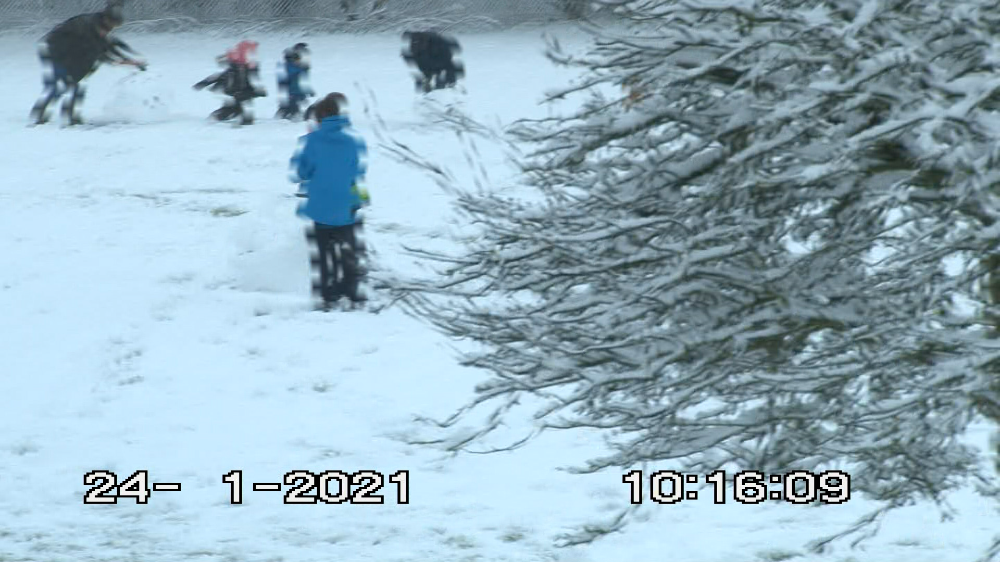

## The Joy of Analogue Compression

Interlacing was originally intended and is to this still to this day of writing the first edition, still used for analogue & digital TV transmission systems as it takes half the signal and data bandwidth to transmit or encode interlaced then full progressive video frames this is why 1080i is still common even in the 2020s with HDTV 1440x1080i for example.

## Is there something I'm missing?

In proper editing and mastering suits you need to set your display to NTSC/PAL correctly even in PAL land any panel you buy will be 60hz in the digital era.

So ensure your display is set to 50hz PAL and 60hz NTSC (100hz/120hz for high refresh rate monitors) to have accurate playback of media this goes for progressive content too.

If you cant do this on your computer display you need to use a TV or a CRT display ideally for checking as all modern TV's have support for native interlaced signals and progressive ones.

PC you need to adjust this on NVidia/AMD or Intel's graphics control panel. 

Apple also has support for this and modes like inverse telecine for basic hardware de-interlacing there new MacBook Pro models support standard display rate modes.

## Acronyms 

`i` = Interlaced

`p` = Progressive

`fps` = Frames Per Second

`Hz` = Rate of update of frames per second e.g 50hz is 50fps etc etc

## What is Interlacing?

Analogue video on tape is a bunch of lines like a paper shredder in layman's terms, ware as interlaced video is like a printing press making exact cuts of the paper, this is called a field and you need 2 of them to make a single frame of image information on your display.

Now interlaced media is normally 25 fps PAL and 29.97 fps NTSC but commonly you will read it as 50i & 59.97i this is confusing because you have consumer naming and broadcast naming.

25 frames a second, displayed at 50 interlaced fields per second.

29.97 frames a second, displayed at 59.97 interlaced fields per second.

But you now will say "It looks off if I just deinterlace to 25/30p" with your home video tapes fore example it will be because the motion rate is wrong. 

### Rule of Thumb

`p25`=`25p` & `i25`=`50i` - all are 25fps

`p29.97`=`29.97p` & `i29.97`=`59.94i` - all are 29.97fps

letter first = frame rate, letter second = frame rate for progressive, field rate for interlaced.  fps always stands for frames per second

### Example 1080i to 576i Composite

Interlaced Image (4:3 Anamorphic - White lines are [WSS](Wide-Screen-Signalling.md))

{: style="width:400px"}

De-Interlaced (De-Squeezed 16:9)

{: style="width:600px"}

1920x1080i (HDMI Output from HDV 1440x1080 Tape Source)

{: style="width:600px"}

### Exurb

Digital Video and HD Algorithms and Interfaces 2nd Edition (Charles Poynton 2012-02-07) (PDF Page 173)

{: style="width:600px"}

## What is a Deinterlacer?

Its a processing method or ''filter'' that combines the half frames to make whole progressive video frames de-interlacing the media to progressive.

This is done via combining both fields together, and for motion accurate de-interlacing this also interpolates the frames doubling the framerate this is how you get smooth 50p and 59.97p images.

But for film content you want to get an 24fps motion accurate image or 12fps 

### What decides the Deinterlacer I use?

Consumer Video is 25i PAL (50i) 29.97i NTSC (59.94i)

Broadcast Airing is 25i PAL (50i) 29.97i NTSC (59.94i)

Film Content 23.976fps wrapped in 25i/29.97i etc

Anime Falls between 12-24fps wrapped in 25i/29.97i etc

16mm & 35mm Movies are always 23.976fps wrapped in 25i/29.97i (Edge cases of modern 48fps etc)

8mm Movies are typically 16fps wrapped in 25i/29.97i etc

Super8 Movies are typically 18fps wrapped in 25i/29.97i etc

### What deinterlacer filters are there today?

A filter is a scripted processing method in basic terms this tells a processing software toolset like FFmpeg or Avisynth for example do x thing to y stored frame and so on. 

You have FFmpeg, [Avisynth](http://avisynth.nl/index.php/Main_Page), [Avisynth+](https://avs-plus.net/), AviSynth Neo, [Vapoursynth](https://www.vapoursynth.com/).

(Note: AviSynth Neo has KTGMC which is Nvidia GPU Accelerated QTGMC)

-------------

QTGMC - via [StaxRip](https://github.com/staxrip/staxrip/releases), [Hybrid](https://www.selur.de/downloads) (50p/59.94p)

IVTC / AnimeIVTC via StaxRip or Avisynth+ tools (to 24p/18p etc)

BWDIF/W3DIF/NNEDI via FFmpeg or any FFmpeg, based tool. (to 50p/59.94p)

DaVinci Resolves "Neural Engine" de-interlacer. (Still causes vertical artefacts)

Topaz - Just uses BWDIF.

**NOTE** Weave Mode is Interlaced or Interlacing depending on context (i.g recording or encoding) & [tinterlace filter](http://underpop.online.fr/f/ffmpeg/help/tinterlace.htm.gz) in FFmpeg encodes 50p to 25i interlaced for example.

Shout out to Andrew Swan's [posts about QTGMC with Avisynth](http://macilatthefront.blogspot.com/2021/05/which-deinterlacing-algorithm-is-best.html) Who started me down the QTGMC rabbit hole 3 years ago before StaxRip - Harry

### Film Frame Rates 

Silent films - 16fps 

8mm film -  16fps 

Super8 film - 18fps

16mm film - 24fps

35mm film - 24fps 

70mm film - 24fps

## Telecine Pull-Down Deinterlacing

Pronounced: "tel-uh-sin-ee" and "tel-uh-scene"

Pull down deinterlacing applies to film or more accurately telecine content, but only professional content ware the sync is locked as consumer reel-to-camcorder duplicators were free running so there is no locked reference to the frame rate of the camera to the frame rate of the film format. 

### 3:2 Pull-Down

{: style="width:400px"}

Indicates that one 23.976fps film frame is shown for 3 fields, the next for 2 fields.  (Each field lasts 1/59.94th of a second)

So across 4 film frames you get `2:3:2:3` (it's easier to think in `2:3`) you get 2 x progressive frames, then 2 x mixed-frame frames, then 1 x progressive frames. Which is 3 progressive and 2 mixed frames. 

But once you continue that cadence you do get 3 progressive, 2 mixed, 3 progressive, 2 mixed etc. video frames.

### 2:2 Pull-Down

25fps transfers to 50Hz it's `2:2` which just means there should be either a `1:1` mapping between film frames and video frames, or if the transfer is out of phase, then every video frame is mixed as it contains one field from two different film frames.

### 2:2:2:2:2:2:2:2:2:2:3 Pull-Down

Sometimes referred to as `12:1` or `24:1` Pulldown, is used to convert 24fps video from film sources to 25fps for PAL video. 

Although not as common a method for standards conversion as simply speeding up the video by approximately 4%, it doesn't result in the slight pitch difference for the audio either.

Like any pulldown pattern that doesn't repeat all fields, it results in a slight amount of judder due to a single Field being displayed longer than the 11 before or after, however it's less noticeable than in NTSC's 2:3 Pulldown, in which every fifth field is repeated.
