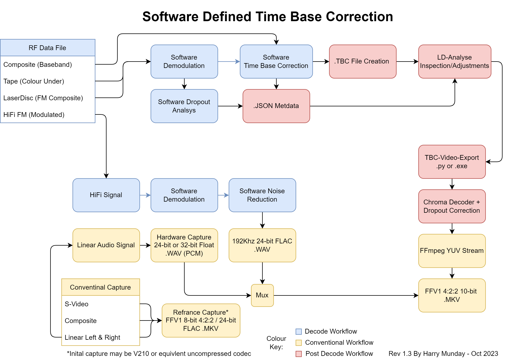

!!! NOTE
    `Right-click --> open in new tab` to view full image files.

## Basic Workflow Breakdown

{: style="width:500px"}

## Simplified Overview VHS Workflow

{: style="width:500px"}

## Video8 & Hi8 Master Workflow

{: style="width:600px"}

## Full Decode Workflow Example

{: style="width:500px"}

## Standard Workflows Examples

{: style="width:500px"}

## Teletext 

{: style="width:px"}
