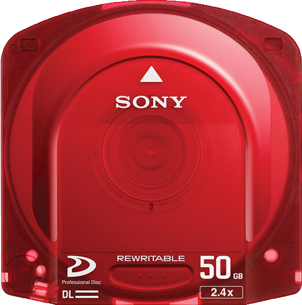
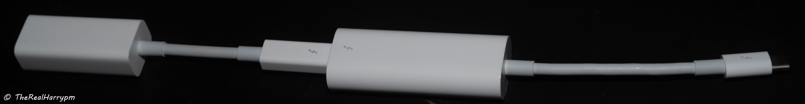
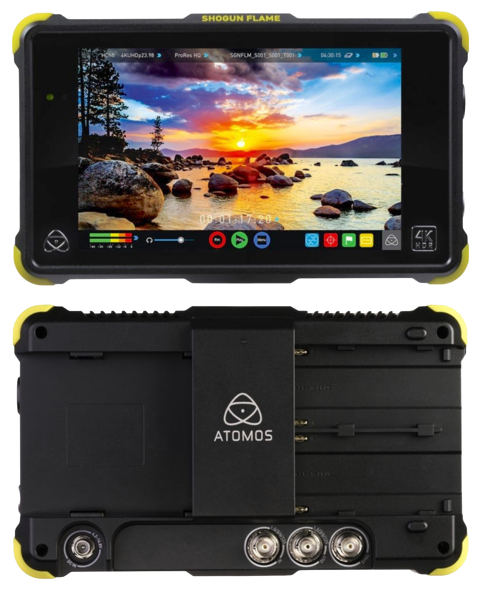
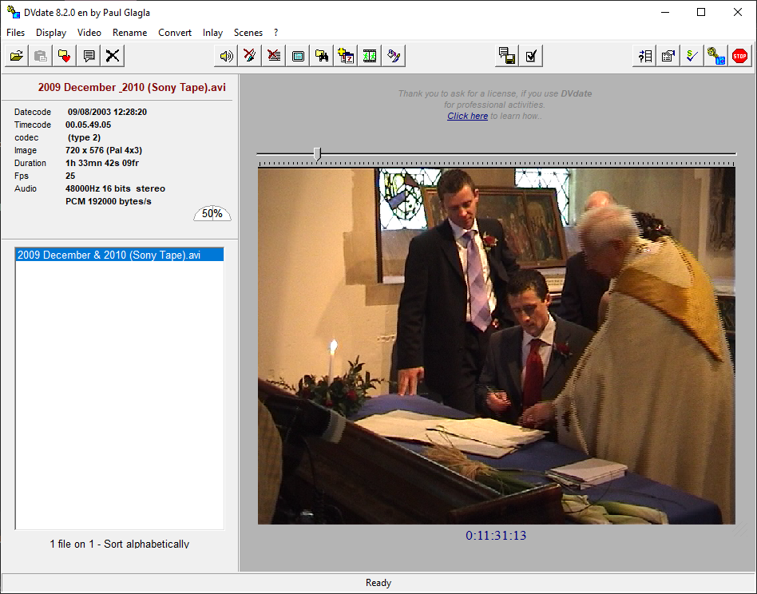
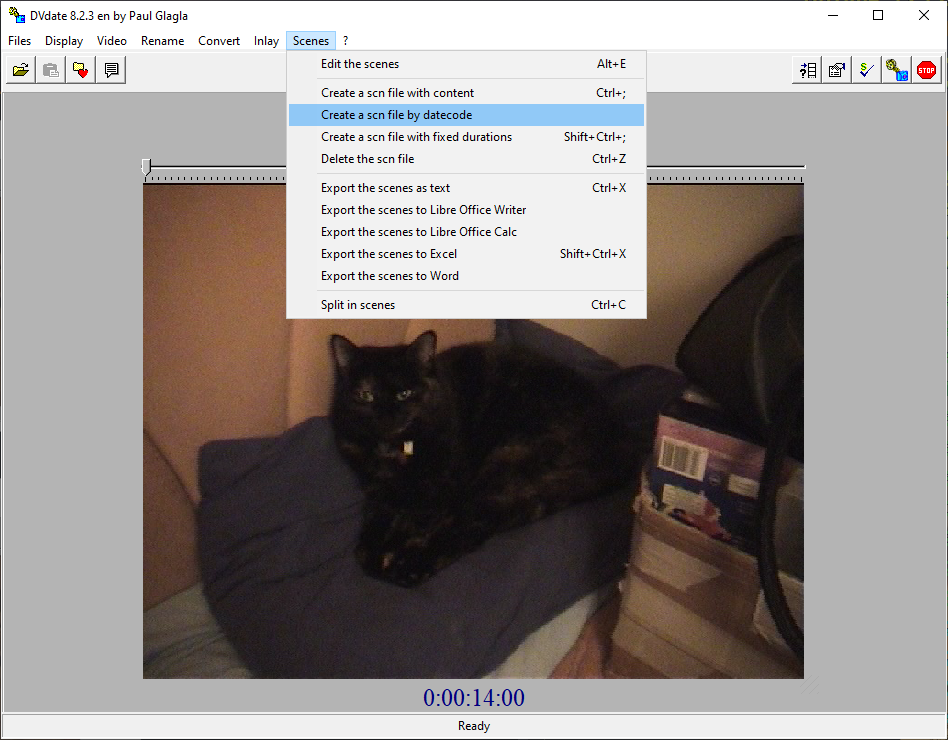

# Digital Tape Guide


Why? because while digital tapes are the least complex for ingest they still require care in post, and people have asked enough to warrant adding such a guide that covers it all.


## Idiot Proofing 


!!! IMPORTANT
    **Please use the "Save" tab when handling tapes** in camcorders as it's too easy to wipe and or break segments by overwriting timecode/datecode information that will be gone forever.

{: style="width:300px"}

!!! WARNING
>**NEVER hot plug DV cameras** This means always power them off before hooking up to a PCI/PCIe/Native FireWire port, this is not an issue with Thunderbolt adapters that are current limited, but full spec ports can send 12V 5A the wrong way so be careful...

!!! WARNING
    **`The only "Firewire to USB" devices are the old Pinnacle Studio USB 2.0 units`** anything that's just a generic Chinese cable could damage your device, some select Panasonic models could use USB Mini-B transfer but never used the firewire port in that manner and the `Sony DCR-TRV75E` is the only exception... 

{: style="width:200px"}


`i` = Interlaced 

`p` = Progressive 


## Digital Tape Format Types


DV & MiniDV: `DV`/`DVCam`/`HDV`

{: style="width:200px"}

Panasonic DVC: `DVCPro / D7`/`DVCPro50`/`DVCProHD`

(25Mbps DV 4:1:1 in both 525/59.94 and 625/50 formats)

{: style="width:400px"}

Sony 8mm: `Digital8` (DV Codec)

{: style="width:400px"}

VHS: `D-VHS` (There is Encrypted & Unencrypted tapes)

{: style="width:300px"}

Sony Beta: `Digital BetaCam`, `BetaCam SX`, `D10 MPEG IMX`

{: style="width:300px"}

Sony: `D1` (4:2:2 Digital Component SD Video)

{: style="width:300px"}

Ampex/Sony `D2` (4:2:2 4fsc Digital Composite) (NTSC is 143Mbs, PAL is 177Mbs)

{: style="width:300px"}

Panasonic/NHK: `D3` (4:2:2 4fsc Digital Composite) (NTSC is 143Mbs, PAL is 177Mbs)

{: style="width:300px"}

`D5` (4:2:2 Digital Component SD Video)

D5 is the same form factor as D3 but 4:2:2 component SD - 10-bit at 13.5MHz and 8-bit at 18MHz (which was designed for 16:9 SD - but never really used).

{: style="width:300px"}

`D6` Uncompressed 1920x1080 Progressive/Interlaced 3/4" HDTV format

{: style="width:300px"}

Sony: `HDCAM` (`D11`)

{: style="width:300px"}

Sony `HDCAM SR` 

{: style="width:300px"}

Sony: `XDCAM Optical`

{: style="width:150px"}{: style="width:150px"}{: style="width:150px"}{: style="width:150px"}


------------------


# Data Cartridges


There is 3 types here Tape, Optical, Solid State, these hold data in a file system manner rather then video/audio only.

Ampex: DST Large/Medium/Small 

Sony: DAT, DLT, SDLT, DTF, AIT, SAIT, SAIT-2

Sony: Sony Optical Disc Archive

IBM: LTO 1~9+ (LTO8 Current) (Most common for the last 20 years)

IBM: IBM 3592 (There own version of LTO currently upto 20TB)

Tandberg: RDX (SSD Hot Swap desktop system)


## Workflow Overview 


There is 3 steps, Identification, Ingest and then processing.

DV/DVCam/DVCPro etc 

`FireWire Data Trasfer` --> `File On System` --> `Analyse` --> `Split By Date Information` --> `Mux or Transcode to MKV Archive`.

HDV

`FireWire Data Trasfer` --> `File On System` --> `Split By Date Information` --> `Mux or Transcode to MKV Archive`


## Format Resolution & Framerate Standards


PAL SD: 720x576  (625i25) (25fps in 50 fields or 50i)

NTSC SD: 720x480 (525i29.97) (29.97fps in 59.94 fields or 59.94i)

PAL IMX: 720x612

NTSC IMX: 720x512

HDV 1080: 1440x1080i / 1440x1080p (25i/29.97i & 25p/29.94p Sony/Cannon) (24p Pulldown)

HDV 720p: 1280x720p (25p/29.94p & 50p/59.94p Panasonic/JVC/Cannon) 

Full-HD: 1920x1080i / 1920x1080p (25i/29.97i) (25p/29.97p/50p/59.94p/60p) (24p Pulldown)


## Format Notes


Interlaced Field Order: Is nearly always BFF with digital tape formats, normally TFF with analogue tape formats.

Timecode is always `Sub-Code Timecode` unless Final Cut is used for import or it is run through Adobe Media Encoder then it's muxed to `QuickTime Timecode` which is clear to all editors and metadata tools.

With DV/MiniDV Audio is either `12-bit 32khz` or `16-bit 48khz` normally in Stereo but most formats has 4 PCM digital channels like analogue tape could have with Linear+HiFi.

(32khz 16-bit is an very annoying standard when 16-bit 48khz is available)

Pro Audio is normally `16-bit 48khz` / `20-bit 48khz` / `24-bit 48khz`.

Colour Space: NTSC `smpte170m` / PAL `bt470bg` / HDTV `bt709`

Full MiniDV and Digital8 tapes will be 19.5GB to 20.1GB of data so you can use a single 25GB M-Disc per tape with a full suite of tools included or ECC data.

HDV era equipment normally has HDMI output `4:2:2 8-bit` for live feeds off the sensor, scaled to 1920x1080 from 1440x1080 however this is not original steam data for recorded media as such camera's, there is also a lack timecode over HDMI which was standardised around 2010 and all newer equipment started to support it.,

`Video8`/`HI8` will be converted to a DV25 stream inside a Digital8 camcorder or deck with backwards playback support though RF capture is better for preserving these formats and S-Video is recommended for standard capture, but the DV25 FireWire stream method extracts RCTC date/timecode data to standard ancillary streams.

The Bitrate of DV/HDV is 25-30mbps only thing that changes is DV/DVCam codec is the chroma-subsampling which is 4:2:0 PAL / 4:1:1 NTSC and HDV however uses MPEG2 and 4:2:0 only and of note DVCPro50 (50-60mbps) uses 4:2:2. 

**Sony, Sharp, JVC, Cannon** - Adopted `DV`/`DVCam`/`HDV`

**Panasonic** - Created & Adopted `DVC`/`DVCPro`/`DVCPro50`/`DVCPro100`/`DVCProHD` (Slightly bigger then MiniDV tapes)


# Capture Workflows


Camcorder/VCR --> FireWire --> Computer/Recorder --> Digital File Stream --> `.dv` or `.avi` files --> DVrescue Dropout & Error Analysis `.xml` --> Notes logbook.txt --> Archival To Optical.

Camcorder/VCR --> Serial Digital Interface (SDI) --> Computer/Recorder --> V210/PCM File (.avi or .mov) --> Lossless Compress to FFV1/FLAC (.mkv)

(With V-Record this can be directly FFV1/FLAC saving time and space)

Its that simple, how the file is handled either to a untouched or muxed state is dependent on software used `.dv`, `.avi` are DV & HDV uses `.m2t` for original untouched audio and video streams.

With DV/HDV if files are saved to `.mov` & `.mkv` they are being muxed, the best example is files transferred with Final Cut which breaks each recording into a separate file by date and muxes the original date an timecode to QuickTime TC in the `.mov` container and audio saved in `32-bit` rather then original.


## Data Sizes

The DV codec known as DV25 is 25mbps to 30mbps 4:2:0 PAL and 4:1:1 NTSC.

DV-Large - (29.7GB) - 50GB Optical Disc

DV-Medium - (16GB) - 25GB Optical Disc

MiniDV/Digital8 (14GB SP / 21.3GB LP) - 25GB Optical Disc


# Capture Hardware 


## DV, DVCAM, HDV, DVC, DVCPro, DVCProHD - Firewire


The formats all use `FireWire` - Also Called `IEEE 1394`, `DV`, `i. LINK` interface which can do 800mbps & 400mbps. 

It has 3 cable/port types `FW800 - 9 pin` / `FW400 - 6 pin` / `FW400 Mini - 4 pin` 

VCR/VRT & Prosumer Camcorders: `FW400 - 6 pin`

Consumer Camcorders & Compact Devices: `FW400 Mini - 4 pin` 

FW400 = 400mbps

FW800 = 800mbps 


{: style="width:300px"}

FireWire also carries 12v 3A of power **this is why hot plugging can kill equipment.**

------------------

### Mac: 


Older Units have FireWire 400 & 800 newer units will need to adapt from ThunderBolt.

`USB Type-C Thunderbolt 3 to Thunderbolt 2` --> `Thunderbolt 2 to Firewire 800` --> `Firewire 800 9pin to 400 4pin Cable`


{: style="width:500px"}
{: style="width:200px"}

These also work on some Windows PCs with thunderblot 3 today.


### Windows, Linux & Hackintosh: 


`StarTec Firewire 400 cards PCIe 1x` | `Generic TI based Firewire 400 cards PCIe 1x` | `ExpressCard to Firewire (1x PCIe).`


{: style="width:300px"}{: style="width:300px"}{: style="width:300px"}

`Pinnacle Studio USB 2.0 to Firewire (Windows XP Only)`

{: style="width:300px"}


### External Recorders:


Firewire interface is like HDMI/SDI its a constant video stream with an added play/advance/rewind command system during its final production run days of 2007-2010 external dedicated units came out to upgrade camcorders to Cfast/CompactFlash cards to match there DSLR workflow counter parts.


`Sony HVR-MRC1 - DV/HDV FireWire 400 Recorder`

{: style="width:300px"}


in simple user terms, this allows you to record its live output or recorded media with data externally via an recorder intended to make a camera a "tape-less" system, like the HVR-MRC1 from Sony taking CompactFlash cards others took CFast which was cable adapted to 2.5" SATA SSD's directly like most current era recorders.

You can also use a computer to record an live camera feed stream to file, with applications like DVGrab.

Sony, DataVideo, MCE, SoundDevices all made recorders however the cost of these units are very high (200-300 USD/GBP/EUR+) compared to the affordable interface cards and adapters for computer systems.


# SDI - Serial Digital Interface 

This covers:

## D1, D2, D3, D5, DigiBeta, BetaCam SX, MPEG IMX, HDCAM, HDCAM SR - SDI 


Digital pro formats without a direct to file interface, fall into SDI capture territory.

`SDI Out` ---> `SDI Card`  ---> `YUV Stream Out` ---> `YUV File.`


## Hardware


## PCIe Desktop (Windows, Linux & Hackintosh):


`Blackmagic Decklink Recorder`

Cheapest most readily available SDI/HDMI capture cards with modern drivers.

*Note on there monitor out/playout modes for the decklink 4k video formats have to be V210/DVCPro50 or similarly compliant flagged formats.

{: style="width:400px"}


`AJA Kono 3 (New and older lines)`

{: style="width:500px"}


`Magewell PCie Cards`

## USB 3.0 (Universal)

[U-TAP SDI - AJA](https://www.aja.com/products/u-tap-sdi) | [Magewell USB SDI Gen 2](https://www.magewell.com/products/usb-capture-sdi-gen-2) | 
[Magewell USB AIO](https://www.magewell.com/products/usb-capture-aio)

{: style="width:300px"}{: style="width:300px"}{: style="width:300px"}


## Mini-PCIe/M.2 


These are capture cards ideal for embedded systems, modified laptops or compact PC systems.


`Blackmagic SDI/HDMI mPCIe & M.2` | `Magewell M.2 Eco SDI`

{: style="width:300px"}{: style="width:300px"}


## Thunderblot:


*Normally limited to macOS, with newer software and TB3/TB4 laptops windows support is appearing for Windows.

`Blackmagic Ultra Studio (Thunderblot 3)` | `Blackmagic Ultra Studio HD (Thunderblot 3)`


{: style="width:300px"}{: style="width:300px"}


## Dedicated External Recorders


This is more a if you have one it works option as SDI input recorders that can do ProRes/DNxHD/HEVC 10-bit 4:2:2. 


!!! IMPORTANT
    **Capture via a desktop is more practical and more codec flexible as there is no lossless compressed options outside of 4444XQ on most units.**


[AJA Recorders](https://www.aja.com/products/ki-pro-ultra-12g) | [Atomos Recorders](https://www.atomos.com/) |  [Blackmagic Recorders](https://www.blackmagicdesign.com/products/blackmagicvideoassist)


{: style="width:300px"}{: style="width:250px"}{: style="width:300px"}


# Capture & Archive format


## Initial Capture


With SDI capture workflows the defacto standard is V210 YUV 4:2:2 Uncompressed in mov or avi containers alongside PCM 24/16-Bit 48khz audio.

HDCAM/HDCAM SR when used in a master tape setting, can have 4:4:4 content this can be ingested with V410/R410 or sometimes even ProRes 4444XQ. 

SDI to HDMI workflows are generally to be avoided as this will destroy all ancillary data in the conversion, such as timecode.


## Archive 


Most users getting into SDI may not have a higher end workstation able to encode lossless compressed codecs in real-time using software like V-Record/VirtualDub2 so will require re-muxing to a archive suitable format after initial ingest capture.

`Video: FFV1 10-bit 4:2:2 or 4:4:4` - Lossless Compressed (This can be dropped to 8-bit depending on origin)

`Audio: FLAC 24-bit 48khz` - Lossless Compressed 


# Handling Software 


SDI Based Systems:

This normally falls native capture applications from the hardware makers i.g AJA, or VirtualDub2, Blackmagic can also use FFmpeg directly with software like [V-Record](https://github.com/amiaopensource/vrecord/tree/main/Resources/Documentation) or FFmpeg Command line.


## Universal:


[AMCDX Video Patcher](https://mogurenko.com/2021/01/29/amcdx-video-patcher-v0-6-7/) / [Archive Download](https://drive.google.com/open?id=1oZbpRDxrBZlvx-nl1FgK722InqhyeLKC) (PC/MacOS/Linux) - Metadata Correction 

{: style="width:400px"}

[DVRescue](https://mediaarea.net/DVRescue) - Hit and miss for "working out of box" its meant to have a full suit of tools but as of writing this guide only analysis features have worked.

[FFmpeg](https://ffmpeg.org/) - Direct Muxing & Encoding - Command Line & Bash Scripts


[LossLess Cut](https://github.com/mifi/lossless-cut)

Cutting, Splitting, Splitting by Date Code (Takes DVanalyse Data)

{: style="width:400px"}

[DVRescue](https://mediaarea.net/DVRescue) - Analysis & Error Fixing

{: style="width:400px"}

[DVAnalyse](https://mediaarea.net/DVAnalyzer) - Timecode & Date by sub-clip.

{: style="width:400px"}

[StaxRip](https://github.com/staxrip/staxrip) a [Avisynth](http://avisynth.nl/index.php/Main_Page) / [Vapoursynth](https://www.vapoursynth.com/) / [FFmpeg](https://ffmpeg.org/) Graphical Scripting Tool. (Windows Only Currently) - Easy QTGMC Deinterlacing for windows users.

{: style="width:400px"}

[Media Info](https://mediaarea.net/en/MediaInfo) - Metadata Reading

{: style="width:400px"}


## Windows:


[Media Info Lite](https://www.majorgeeks.com/files/details/mediainfo_lite.html)

Lightweight version of media info with context menu option when right clicking files, and easy save to txt for info.

`Adobe Premiere Pro`

{: style="width:400px"}

`Sony Vegas`

Image needed of current Magex suite*


`WinDV`

{: style="width:400px"}

`Scenalyzer Live 4.0`

{: style="width:400px"}

`HDV Split`, `HDV Data Monitor`

{: style="width:400px"}{: style="width:400px"}

{: style="width:400px"}

[DV Date](https://www.videohelp.com/software/DVdate)

{: style="width:400px"}


## MacOS:


`Final Cut Pro`

{: style="width:400px"}

Muxes the DV/HDV stream into the `.mov` container with QuickTime TC and automatic by date splitting.

[V-Record](https://github.com/amiaopensource/vrecord/tree/main/Resources/Documentation) - 3rd Party Capture & Control for Blackmagic and DV/HDV systems.

`DVRescue` & `V-Record`

Ingest Control Window

{: style="width:400px"}

Monitoring Window 

{: style="width:400px"}{: style="width:400px"}


# Capture 


## How to Process Tapes?


There is 3 things you can do, [`deinterlace`](Deinterlacing.md), `upscale` & `de-noising`.

Denoising is a matter of personal preference as its already digital with digital noise, so preservation wise it should be left alone unless upscaling for a 2160p timeline etc.

It is recommended when re-encoding lossy codecs like DV/HDV etc to always encode to a 4:2:2 chroma sampled codec like ProRes HQ or FFV1 to prevent any chroma scaling issues.

It's recommended to break files by date cuts, and save each file's metadata with `Media Info` to a .TXT file so the original metadata is human readable.

For SDI capture formats, capture V210 then re-encode to Lossless FFV1 with FLAC compressed audio, unless you have V-Record setup then directly capture lossless compressed to save time.


## Splitting DV Files


With DV files depending on capture you may want to keep these as one single file or split by sub-clip or scenes, generally you want to split by each date change to avoid metadata issues, such as loss of date or timecode information.

The example here is an Adobe Premier Pro `.avi` capture which only breaks files up if the audio settings get changed.


This data can be read with [DVAnalyse](https://mediaarea.net/DVAnalyzer)

{: style="width:650px"}


[LossLess Cut](https://github.com/mifi/lossless-cut) is now a fully viable option that preserves original metadata and is cross platform.

`Single Tape File` --> `DVAnalyse Export Summary` --> `Lossless Cut` --> `Export Segments as .mkv`

{: style="width:600px"}

{: style="width:600px"}

You can split by markers, or make standard chapters in a single file, It will use the base file name with data appended, ensure your base file name is archive ready before making tons of split files. 

{: style="width:600px"}


With the old but still useful and developed is [DV Date](https://www.videohelp.com/software/DVdate):

{: style="width:600px"}

Drag and drop your file into the tool then do `Scenes` --> `Create a scn file by datecode`

{: style="width:600px"}

Export this data to text with `Scenes` --> `Export the scences as text` or press `CTRL` + `X`

{: style="width:600px"}


Export each sub-clip as its own file with `Scenes` --> `Split in Scenes` 


{: style="width:600px"}

The result is all sub-clips are exported by date code.

{: style="width:600px"}

`Recorded date: 2002-01-05 11:35:36.000`

And so rename the files in this case `Cats_Test_Tape_2002-01-05_11-35-36.avi`


## Muxing to MKV (Windows)


These scripts will take your DV tape Files and convert them for archive use, copy to a text file and save it as a `.bat` and drag and drop the files you wish yo process onto the script file.

Video is 1:1 copy, audio is re-encoded to 16-bit FLAC 48khz. 

PAL:

``````
:: Create MKV file from PAL SD AVI/DV/MOV files (Muxes TC / Creation Time Data to MKV)
pushd %~dp0
echo Muxing Input to MKV... 
ffmpeg.exe -i "%~1" -c:v copy -c:a flac -sample_fmt s16 -ar 48000 -c:d copy -color_range tv -color_primaries bt470bg -colorspace bt470bg "%~n1.mkv"
echo Done. 
PAUSE
``````

NTSC:

``````
:: Create MKV file from NTSC SD AVI/DV/MOV files (Muxes TC / Creation Time Data to MKV)
pushd %~dp0
echo Muxing Input to MKV... 
ffmpeg.exe -i "%~1" -c:v copy -c:a flac -sample_fmt s16 -ar 48000 -c:d copy -color_range tv -color_primaries smpte170m -colorspace smpte170m "%~n1.mkv"
echo Done. 
PAUSE
``````

HDV:

``````
:: Create MKV file from HDV HD AVI/DV/MOV files (Muxes TC / Creation Time Data to MKV)
pushd %~dp0
echo Muxing Input to MKV... 
ffmpeg.exe -i "%~1" -c:v copy -c:a flac -sample_fmt s16 -ar 48000 -c:d copy -color_range tv -color_primaries bt709 -colorspace bt709 "%~n1.mkv"
echo Done. 
PAUSE
``````


## Deinterlacing


There is a [dedicated sub-doc](Deinterlacing.md) on the subject of interlaced & de-interlacing

There is 2 options today QTGMC & BWDIF unless your stuck to FFmpeg only then QTGMC is always recommended. 

Deinterlacing with Avisynth/Vapoursynth - [StaxRip Is here with a range of templates](https://drive.google.com/file/d/1ewhcYjIPZByM6CP9sMlvMm2mrULN7ei3/view?usp=sharing).

Deinterlacing with FFmpeg only via [BWDIF](https://ffmpeg.org/ffmpeg-filters.html#bwdif) to ProRes HQ.

Replace `INPUT.xxx` and `OUTPUT.mov` with your input file type and your output file name.

If your not editing the files or playing them on limited hardware use the archival `FFV1` codec & `.mkv` output container format option.

Replace `bwdif` with `bwdif_cuda` if you want to use NVidia GPU accelerated encoding. 


## BDWIF with ProRes HQ (.mov) (Ready to Edit)


PAL:

    ffmpeg -i INPUT.xxx -movflags use_metadata_tags -map_metadata 0 -vf bwdif=1:1:0 -c:v prores -profile:v 3 -vendor apl0 -bits_per_mb 8000 -quant_mat hq -mbs_per_slice 8 -pix_fmt yuv422p10le -color_range tv -color_primaries bt470bg -colorspace bt470bg -c:a pcm_s16le -ar 48000 OUTPUT_BDWIF_Progressive.mov

NTSC: 


    ffmpeg -i INPUT.xxx -movflags use_metadata_tags -map_metadata 0 -vf bwdif=1:1:0 -c:v prores -profile:v 3 -vendor apl0 -bits_per_mb 8000 -quant_mat hq -mbs_per_slice 8 -pix_fmt yuv422p10le -color_range tv -color_primaries smpte170m -colorspace smpte170m -c:a pcm_s16le -ar 48000 OUTPUT_BDWIF_Progressive.mov

HD:

    ffmpeg -i INPUT.xxx -movflags use_metadata_tags -map_metadata 0 -vf bwdif=1:1:0 -c:v prores -profile:v 3 -vendor apl0 -bits_per_mb 8000 -quant_mat hq -mbs_per_slice 8 -pix_fmt yuv422p10le -color_range tv -color_primaries bt709 -colorspace bt709 -c:a pcm_s16le -ar 48000 OUTPUT_BDWIF_Progressive.mov


## BDWIF with FFV1 (.mkv) (Ready to Archive)


PAL:

    ffmpeg -i INPUT.xxx -movflags use_metadata_tags -map_metadata 0 -vf bwdif=1:1:0 -c:v ffv1 -coder 1 -context 1 -g 1 -level 3 -slices 16 -slicecrc 1 -top 1 -pixel_format yuv422p10le -color_range tv -color_primaries bt470bg -colorspace bt470bg c:a flac -sample_fmt s16 -ar 48000 OUTPUT_BDWIF_Progressive.mkv


NTSC: 


    ffmpeg -i INPUT.xxx -movflags use_metadata_tags -map_metadata 0 -vf bwdif=1:1:0 -c:v ffv1 -coder 1 -context 1 -g 1 -level 3 -slices 16 -slicecrc 1 -pixel_format yuv422p10le -color_range tv -color_primaries smpte170m -colorspace smpte170m c:a flac -sample_fmt s16 -ar 48000 OUTPUT_BDWIF_Progressive.mkv


HD:


    ffmpeg -i INPUT.xxx -movflags use_metadata_tags -map_metadata 0 -vf bwdif=1:1:0 -c:v ffv1 -coder 1 -context 1 -g 1 -level 3 -slices 16 -slicecrc 1 -pixel_format yuv422p10le -color_range tv -color_primaries bt709 -colorspace bt709 c:a flac -sample_fmt s16 -ar 48000 OUTPUT_BDWIF_Progressive.mkv


## Using FFmpeg with digital tapes 


Conform all audio to 

Audio comes in `48khz 16-bit` & `32khz 12-bit` with 4 channels in PCM uncompressed. 

`-c:a pcm_s16le -ar 48000` Conforms audio to 48khz

`-c:a flac -sample_fmt s16 -ar 48000` Conforms audio to 48khz FLAC

`-c:v copy` Copy's a video stream

`-c:a copy` Copy's all audio streams

`-c:d copy` Copy's all data streams (If standard)

`-c:a flac` Re-encodes PCM audio to [lossless compressed FLAC](https://en.wikipedia.org/wiki/FLAC)

`-color_range tv` defines 16-255 TV Display Levels (Black Range)

`-color_range pc` defines 0-255 Desktop Monitor Levels (Black Range)

`-color_primaries bt470bg -colorspace bt470bg` Defines PAL colour space.

`-color_primaries smpte170m -colorspace smpte170m`  Defines NTSC colour space. 

`-color_primaries bt709 -colorspace bt709` for HDV or HD tapes.

`-bottom 1` & `-top 1` sets bottom interlaced field first or top field first, interlaced frame order flagging.

`-map 1 -map_metadata 0 -c copy -movflags use_metadata_tags` maps mov metadata flags.


## Colr & CLAP Atom Setting


This is for altering the flagging data inside the `mov`, `mp4` & `mxf` containers.

This is the reason why proper mastered media will only show above the active head switch area when displayed on a TV/System with standard video flag support.

AMCDX Video Patcher [Live Link](https://mogurenko.com/2021/01/29/amcdx-video-patcher-v0-6-7/) / [Archive Link](https://drive.google.com/open?id=1oZbpRDxrBZlvx-nl1FgK722InqhyeLKC) This tool is dead simple to use and allows you to correctly flag recordings colour/timecode information, this allows files to be hardware & industry standard software compatible.

Example of a blank and correctly flagged progressive exports for NTSC & PAL using ProRes HQ / V210.
 
| Blank:                                                                                       | PAL:                                                                                                      | NTSC:                                                                                                |
| -------------------------------------------------------------------------------------------- | --------------------------------------------------------------------------------------------------------- | ---------------------------------------------------------------------------------------------------- |
| {: style="width:600px"} | {: style="width:600px"} | {: style="width:600px"} |


## Preserving Timecode & Flagging 


Ancillary Data can be a pain so `AMCDX Video Patcher` allows us to manually take the metadata values we can read from files with tools like `Media Info` and update the values in our final processed file if its an `.mov`, `.mp4` or `.mxf`.


The value to read and copy is `subcode timecode` It looks like this:

    Time code of first frame    : 00:02:38:16
    Time code source            : Subcode time code

For DV/DVCam its normally either running time or based of internal time of day clock for HDV however is normally accurate SMPTE HH:MM:SS:FF timecode.

To copy Ancillary Timecode Data use `-c:d copy`

To manually set information with FFmpeg use the following examples

Timecode: `-timecode 01:20:10:00`

Creation Date: `-metadata creation_time="2001-04-29T11:27:04Z"` 

Note this handy `.bat` convert all in a directory script for modern progressive MP4/MOV/M2TS files like XAVC files from Sony A7/A6000 line etc this will transcode PCM audio to FLAC and also copy standard ancillary timecode.


    for %%a in ("*.MP4") do ffmpeg -i "%%a" -c:v copy -c:a flac -c:d copy -map_metadata 0:s:2 -map_metadata 0:s:1 -map_metadata 0:s:0 -y "%%~na.mkv"
    pause


## Archival of Media


For media archival this falls to 

- LTO Tape
- Optical (Blu-Ray)
- NAS/RAID HDD arrays 

Proper cold store archives are key to be made as soon as possible after ingest and inspection, before committing to a large transfer its best to run the numbers are prepare cold storage beforehand. 

For example 1x MiniDV will fit on a 25GB Optical Disc alongside notes and photos of the physical tape.

Blu-Ray / Blu-Ray BDXL 50/100/128GB Archival grade discs are readily avalible today.


If using only smaller discs you can split files, we recommend [Winrar](https://www.win-rar.com/download.html?&L=0)/[7zip](https://www.7-zip.org/) or on Linux [P7zip](https://p7zip.sourceforge.net/) for this task as it can automatically split files to 20GB for example.

With little or extra space left over on discs this leaves room for ECC data from [dvdsasater](https://github.com/speed47/dvdisaster#readme) and a optical disc tool kit of the software to extract and re-combine split archives for example.

DataLifePlus / M-Disc - Blu-Ray discs are recommended due to archival grade plastics bonding and in-orgnaic meterials.


---------


Sub-Page [Deinterlacing](Deinterlacing.md)

Next Page [Media Archival Guide](Media-Archival-Guide.md)