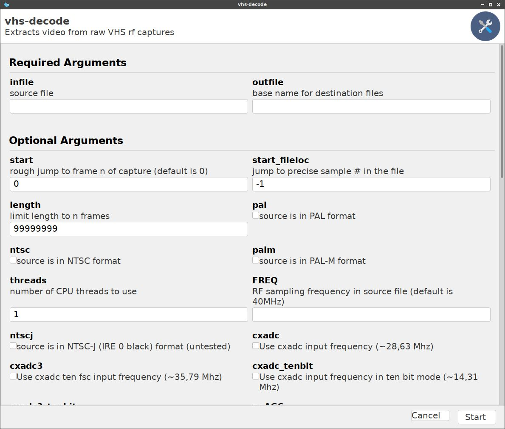

# Experimental "Gooey" - graphical user interface (partially broken at the moment)

## Why is there not more focus on the GUI?

Decoding FM RF files is done via one command, its too slow and simple to warrant the need for a GUI and it just makes user operations more clunky. 

During the decoding process you can view the decoding process via terminal, and you can open the tbc files inside ld-analyse during decoding though this will be limited to what frames have been written and indexed inside the `.JSON` file normally updated every decoded frame. 

## Installation

Until there is an update to wxPython this is going to be a bit tricky to get running untill this issue is resolved [Issue #2296](https://github.com/wxWidgets/Phoenix/issues/2296)

Hence, this isn't often tested currently, so it's not recommended to use it other than for development purposes.

If you want to try the GUI wrapper for vhs-decode (`vhs-decode-gui`) :

    sudo apt-get install build-essential dpkg-dev freeglut3-dev libgl1-mesa-dev libglu1-mesa-dev libgstreamer-plugins-base1.0-dev libgtk-3-dev libjpeg-dev libnotify-dev libpng-dev libsdl2-dev libsm-dev libtiff-dev libwebkit2gtk-4.0-dev libxtst-dev python3.9-dev libpython3.9-dev

Then install Gooey

    pip3 install attrdict3
    pip3 install Gooey

To use VHS Decode GUI Run:

    ./vhs-decode-gui

# Page End