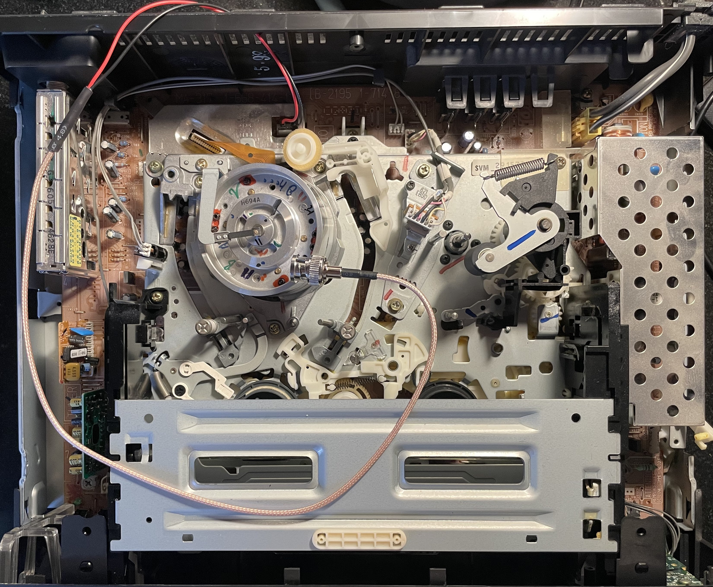
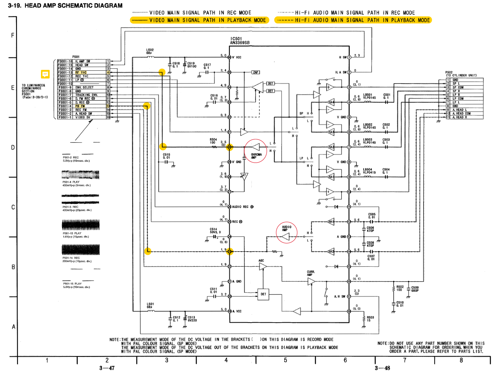
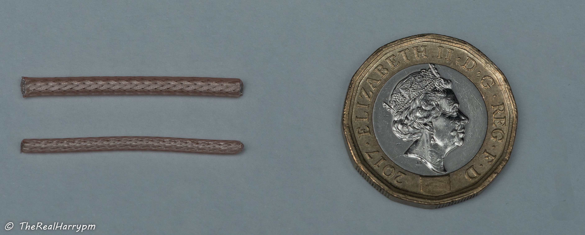
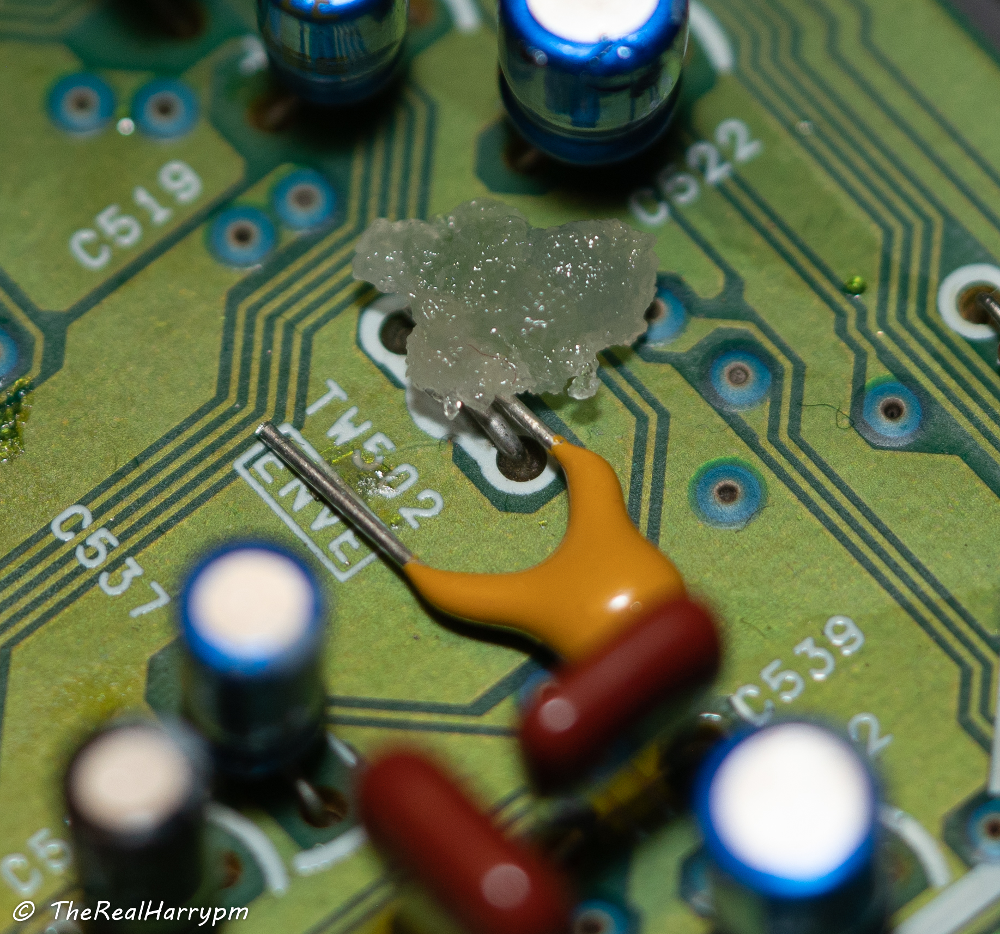
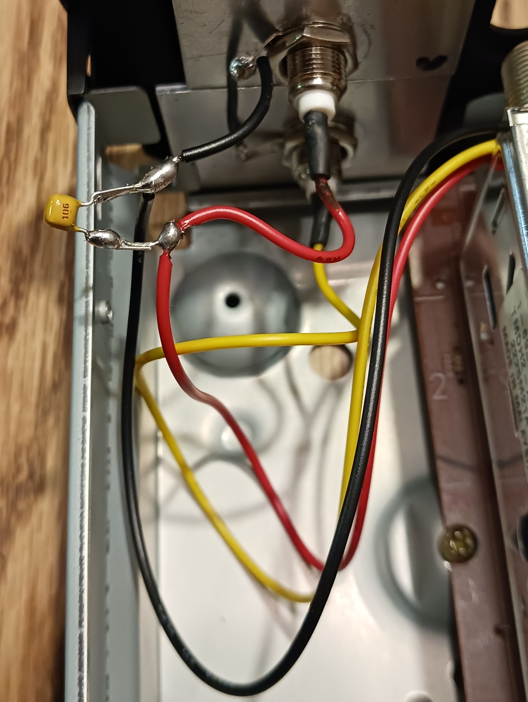

## [First please look at The Tap list Example VCR's](004-The-Tap-List.md)

Firstly see if your VCR or similar has been added to the list or just want real-world visual examples of tapped decks, below is the methods we use, but the guide overall focuses on basic soldering which has the most use from both a RF Tapping but also a basic repair skill perspective.

## Soldered Method

This involves simple non-complex surface soldering of an signal and ground wire from test points or head amplifiers, with a 3.3uf to 10uf capacitor in-line to limit signal draw to allow normal playback for real-time reference capture during RF capture.

{: style="width:500px"}

{: style="width:400px"}

{: style="width:600px"}

## Soldering-Free Setups

While soldering is **encouraged and quite easy in practice** as the vast majority of VCRs without 2.54mm headers have easy to get at standard bar/floating bar test points, so the soldering method allows for 99% of decks to be tapped for RF capture, but the need to directly solder onto a VCR is not always required however it can make a clean and practical upgrade with safe locking BNC ports at the back.

It can be scary to some and to get started, we understand some people might not want to take an iron to there VCR, especially a higher-end one and practicing basic soldering beforehand and reading this doc fully is highly recommended, however either way you go a clean setup requires proper cables and a proper electrical connection and soldering and melting/drilling a hole and adding a bulkhead protects the internal test points from snagged cables and the like.

Either way you go however this **does not mean** you can neglect the basics of cleaning your VCR heads, guides and checking it over, as it's a mechanical machine just like a car or any other tool it requires some level of care, like re-lubrication and regular cleaning below is a document on that.

### Pushpin Method 

Adjacent to the soldering method for prosumer decks, the pin push method is simply just wedging an capacitor leg into the FPC or flex connector pins, a middle-man approach allows you to just solder to the grounding shield exterior and not touch any components of value with the iron. 

{: style="width:500px"}

### DuPont Pin Method

Sony decks normally have 2.54mm pin-header test points

(These cables can be made at home with RG316 & 26AGW copper wire via soldering iron, crimper & heat shrink)

[DuPont Female to BNC](https://www.aliexpress.com/item/1005004394809131.html?) / [DuPont Male to BNC](https://www.aliexpress.com/item/1005004385167455.html?) / [SMA to DuPont Female](https://www.aliexpress.com/item/1005004381724856.html?) adapters.

[Example](004-The-Tap-List.md#sony-slv-677hf) (This applies to VHS/Beta/Video8/High8)

If you go the Dupont pin method use an In-line Capacitor (Limits signal draw to allow for live playback alongside RF capture) [AliExpress](https://www.aliexpress.com/item/4001006213158.html) / [Amazon US](https://www.amazon.com/DC-Block-Connector-Include-SMA-MF-50KHz-8GHz/dp/B07JR5ZNW7)

{: style="width:500px"}

### BNC Probe Method

BNC probes can be used for a solderless hook-up, but may not have as reliable signal and can easily be knocked free, unlike a soldered and mounted RF Tap. Alternatively, standard Oscilloscope probes set to 1x mode can also be used this manner as they also use standard BNC Connectors. Oscilloscope probes will give some guarantee that the wires and probes are high quality though the probes themselves can also be a bit long and impractical.

[BNC Alligator](https://www.aliexpress.com/item/4000026701711.html?) / [BNC Hook](https://www.aliexpress.com/item/33061527421.html?) / [BNC Standard](https://www.aliexpress.com/item/1005003950007418.html?)

[BNC Banana](https://www.aliexpress.com/item/4000068675886.html?) + [Banana Pin Probes](https://www.aliexpress.com/item/1005001626256474.html?)

{: style="width:500px"}

### Jig Method Video8 & Hi8

{: style="width:500px"}

On most Sony Video8, Hi8 and later Digital8 camcorders that had support backwards playback, at the battery area, there is a cover plate with a single screw, once removed this exposes the Jig connection point for testing this is normally 16/18/20 pin FPC type connector with a 0.5mm pitch, with is readily available and generic cables & jigs being off-shelf parts.

This is the go-to method for Video8/Hi8 tape formats, RF capture also only requires 1 ADC like LaserDisc.

Simply visually check your pin amount and buy the correct jig with the links below.

Check the service manual to see what pins have the RF signal, and your ready to go, however a capacitor may be needed in-line like any RF capture method. 

[Jigs (Unpopulated)](https://www.aliexpress.com/item/4001156449357.html?) / [Jigs (With 2.54mm pins)](https://www.aliexpress.com/item/1005003713202720.html?) / [FPC Flex Cables](https://www.aliexpress.com/item/32916422564.html?) / [DuPont to BNC](https://www.aliexpress.com/item/1005004394809131.html?) / [Type 1 USB Power Adapter](https://www.aliexpress.com/item/1005005548802645.html?) / [Type 2 USB Power Adapter](https://www.aliexpress.com/item/32963987768.html?)

## Helpful Videos for Absolute Beginners

- [The NASA Standard of Soldering](https://www.youtube.com/watch?v=_RXugDd0xik)

- [Beginner's Guide to Soldering Electronics](https://www.youtube.com/watch?v=M2Jf8cebwCs)

- [Electronoobs SMD Soldering Guide](https://www.youtube.com/watch?v=fYInlAmPnGo&t)

- [Electrical Components Guide](https://www.youtube.com/watch?v=6Maq5IyHSuc)

How to use a Digital Multi Meter (DMM):

- [Voltage Measurement & Basic Usage](https://www.youtube.com/watch?v=ZBbgiBU96mM)

- [Current Measurement](https://www.youtube.com/watch?v=EVFkKBFJsZg)

- [Resistance & Continuity](https://www.youtube.com/watch?v=InJhgwmj2So)

## Tooling & Equipment

You will need the following items

### Essentials

* Philips & Flathead Standard Screwdrivers

* Side Cutters / Sharp Scissors

* A Soldering Iron like the modern [PIENCL](https://pine64.com/product/pinecil-smart-mini-portable-soldering-iron/) / [TS101](https://www.aliexpress.com/item/1005004825634421.html?) (With digital temp control)

* USB Type-C PD 65~100w [Power Bricks](https://www.amazon.co.uk/dp/B0B3HYBKCQ/) (with 3 pin earthing for ground) or PD [65w](https://www.aliexpress.com/item/1005002233844317.html?) / [100w](https://www.aliexpress.com/item/1005005227142167.html?) Power Banks / [12~24v Car Adapters](https://www.aliexpress.com/item/1005004676001684.html?)

* [Heat Shrink](https://www.aliexpress.com/item/1005004302202986.html?) / [Electrical Tape](https://www.aliexpress.com/item/1005002795219371.html?) / [Hot-Glue](https://www.aliexpress.com/item/32989692608.html?) / [Silicone Sealant](https://www.amazon.co.uk/gp/product/B0036GEK9W/) (For insulating cables and connections)

Optional but worth it for anything related to electronic's work

* [Automatic Wire Strippers](https://www.aliexpress.com/item/1005005066526041.html?)
* [A Basic True RMS Digital Multi Meter](https://www.aliexpress.com/item/1005004990905634.html?) (DMM)
* Digital or Analog Benchtop Oscilloscope

Modern Combo DMMs like the [OWON HDS2202S](https://www.owon.com.hk/products_owon_hds200_series_digital_oscilloscope) / [Link 1](https://www.aliexpress.com/item/1005004686020795.html?) / [Link 2](https://www.aliexpress.com/item/1005005300888993.html?) / [Screen Protector](https://www.ebay.com/itm/363616997950) are a True RMS Digital Mustimeter, Oscilloscope & a Waveform/Tone Generator in one unit.

### Building a Soldering Kit

- Sn 60/40 Pb Leaded Solder [Silverline](https://www.silverlinetools.com/en-GB/Product/ProductDetail?ModelName=AS15) / [Weller](https://www.amazon.com/Weller-SnPb-T0051403299-Lead-Solder/dp/B09LDJ4ZDT/) (Good quality solder is key)

- Flux [MG Chemicals 8341](https://www.google.co.uk/search?q=MG+Chemicals+8341) (50ml jar) or [Antech Tacky](https://amtechdirect.com/shop/amtech-nws-4200-tf-water-washable-anti-oxidation-tacky-solder-flux-orm1-30cc-syringe/)

- [Brass Wire ball Cleaner](https://www.aliexpress.com/item/1005001728288287.html)

- [Solder Wicking](https://www.aliexpress.com/item/4000223420439.html) - Generic or SuperWick/GootWick

- Chisel and Bevel Type Tips for your iron.

Here's the PINECIL with a built-up kit.

{: style="width:600px"}

A fancy but immense lifespan saving item is a de-soldering vacuum station if you ever plan to remove THT/Though Hole components this will save your parts and your solder pads from damage, and is a lot less wrist strain compared to a spring loaded solder sucker.

[Video on the KATSU-Desoldering Station](https://www.youtube.com/watch?app=desktop&v=tfuXHNDy3zU)

{: style="width:600px"}

### Extra Soldering Iron Tips

- [More TS100 Type Tips](https://www.aliexpress.com/item/1005004444193347.html) - For PINCEL/TS100/TS101 (Hotswap self heating tips)

- [More 900M Type Tips](https://www.aliexpress.com/item/1005003707336091.html) - For Hakko/Generic 900M Type Irons

- [More T18 Type Tips](https://www.aliexpress.com/item/1005001742285800.html?) - For Hakko/Generic T18 Type Irons

- [More T12 Type Tips](https://www.aliexpress.com/item/1005003952276176.html?) - For Hakko/Generic T12 Type Irons (Hotswap self heating tips)

### Basic Parts for making an RF Tap

!!! NOTE
    White CX Cards if your not using the C31 mod, or adding a BNC, use a S-Video breakout the Y or Luma pin for the RF input.

* 2-4x 50ohm BNC connector, normally a [premade bulkhead](https://www.aliexpress.com/item/4000981154513.html), or [solder able thread mounted](https://www.aliexpress.com/item/4000639816847.html).

* 50-100cm of [RG316](https://www.aliexpress.com/item/32726071013.html) or [RG178](https://www.aliexpress.com/item/32879341402.html) 50Ohm coaxial cable.

* 10uf Capacitors [standard assortment](https://www.aliexpress.com/item/1005003276169319.html?) or audio grade like Nichicon if you like.

#### Connection Cables

- [Direct BNC to BNC](https://www.aliexpress.com/item/32530974771.html?)

- [50Ohm BNC to BNC Cable](https://www.aliexpress.com/item/1005004558208116.html?)

- [S-Video to BNC](https://www.aliexpress.com/item/1005003333398231.html)

#### DuPont Cables

- [DuPont Female to BNC](https://www.aliexpress.com/item/1005004394809131.html?)

- [DuPont Male to BNC](https://www.aliexpress.com/item/1005004385167455.html?)

- [SMA to DuPont Female](https://www.aliexpress.com/item/1005004381724856.html?)

#### FPC Jigs (Sony Camcorders)

- [20pin Flex Cable](https://www.aliexpress.com/item/32916422564.html?)

- [20pin Jig (Unpopulated)](https://www.aliexpress.com/item/4001156449357.html?)

- [20pin Jig (With 2.54mm pins)](https://www.aliexpress.com/item/1005003713202720.html?)

### Notes

**Note** Having a 3rd arm holder with at least 2 metal clips is very helpful to hold connectors and the cable steady while soldering.

**Note** The RHAEGON iron generally comes in a kit with basic flux, cleaning spouge, 2 ESD tweezers and a roll of 240c melting point lead free solder, ware as the PINCEL can run off USB-C PD or DC power and tips can be hot swapped on the fly.

**Note** A clean & tinned soldering tip is a happy long lasting tip.

**Note** Sponge cleaners will thermally damage tips, stick to using brass wire ball style cleaners as much as possible.

**Note** The In-line capacitor method is generally a coverall at the 10uf mark, 3.3uf-100uf range work fine but 10uf was standardised as its widely available and has worked perfectly with many VHS/SVHS/Betamax/Video8/Hi8/Digital8 units.

### Cleaning Supplies

This is all you need for cleaning the head drum & VCR tracks boards and plastics even a light servicing can make a world of difference in reliability of a VCR.

- 99.9% IPA (Isopropanol/Rubbing alcohol) (Don't use on rubbers)

- Wet Wipes & Paper Towels (General Cleaning)

- Small dry Nail Wipes (Cleaning of VCR head/tracks/guides)
  
- Printer paper (Cleaning of VCR Heads)

- Cotton Buds (Q-Tips)

For initial board cleaning and removal of dust and other surface contaminants also recommended is:

- WD40 Electronics Cleaner (Aerosol Liquid Version of WD40 basically)

- Assortment of Brushes

### Maintenance Supplies

- [Super Lube® Multi-Purpose Synthetic Grease](https://uk.rs-online.com/web/p/greases/1847967) (PTFE) (Tape Guides, Cogs) (Loctite 399420)

- Sewing Machine Oil (Metal Barings)

### Components that make a RF Tap

The Example image here contains the following 

- £1 (GBP) Coin (size reference)
- 100uf / 10uf 50v / 10uf 25v Electrolytic Capacitors  [(Ceramic Recommended)](https://www.aliexpress.com/item/1005002905008477.html?)
- BNC Bulkhead solderable and larger premade RG316 Cable Bulkhead
- AA Battery

{: style="width:600px"}

## Step 00: Inspect & Clean Your Device

!!! TIP
    For Betamax/EIAJ players using only alcohol-wetted paper is recommended for head cleaning as floating heads will catch easily on anything else, but chamois or lint-free microfiber works on VHS heads just fine. 

Firstly before you start doing anything, check the model number on the top/back/bottom label use this to find the service manual for your device via google.

Then disconnect power wait a few seconds and then remove the lid/top panel via just 2-4 screws be careful around the edges on metal ones as stamped metal sheets can cut though skin if you run a finger across the edge carelessly but should slide off upwards from the back of most standard VCR units.

For Video8/Hi8/Digital8 Camcorders the side door should be easily removed with 2 screws allowing you to get inside to clean the head drum area and tape path.

### Colour Atlas of VCR Hardware

This varies based off year and market of the VCR modern later decks use more multirole IC's, ware as prosumer to rackmount units will have core parts for each processing task on dedicated boards and be majority though hole parts

Panasonic NV-HD630 For Example

{: style="width:600px"}

Numbered Boxes In RED test point locations for signals.

1. TW3001 RF C - Video FM

2. TW501 FM Mix Out - HiFi FM RF

3. TW26 CVBS Out - Composite Video Output

4. TW3 CVBS Input - Composite Video Input

5. TW502 - ENVE (HiFi FM RF)

Left Hand Side

- Pink - TV Modulation & De-modulation pack
- Golden Yellow  - Audio Processing (Nicam)
- Bright Yellow  - Video Processing

Middle

- Purple - Head Amplifier Board
- Blue Box - VCR Loading & Playback Mechanical System or "Mech"
- Yellow Circle - VCR Head Drum & Connection Board
- Green Circle - Tape Guides & Guide Path
- Light Blue Left - Erase Head
- Orange Circle - Linear Audio or Edge Track Audio Heads
- Light Blue Right - Rubber Pinch Roller
- Brown Boxes Centre/Right - Head Drum RF Ribbon

Right Hand Side

- Red - AC Power Supply Stage
- Green - DC Power Supply Stage  

Always Inspect & clean a VCR before running a tape though, it is the best first action, not only so you don't contaminant or break your tapes but your its self deck, if its in good working order and already been serviced just clean the heads.

Always remove the little head cleaner off the the side of the drum if there is one, as they are just dirt spreaders and can cause contamination.

Check that tape guide tracks are well lubricated if it looks shiny/bare then there's probably not enough. 

Pinch rollers baring's can be lubricated with a drop of oil, and guides can be cleaned with wipes then use 99.9% Isopropanol.

Once cleaning has finished double check, if there is signal issues always good to check if there is cracked solder joints on the head drum from transport.

!!! CAUTION
    Be careful to not touch the mains AC power supply area with both hands this can shock you and or kill you if you bridge the AC stage but generally, these have metal shielding and are isolated off to one side of the VCR, always service equipment after it has been un-plugged and discharged of power.

---

**Plastic back units** can be marked and then poked through and slowly rimmed into a round hole via soldering iron at 340°C be careful not to overdo it, and cut the excess off with cutters for a flush mounting of your connector this is the easiest mod and looks very clean if you mark it properly.

**Metal Units** may require a 1/2-inch drill bit ideal for bigger Bulkhead pre-made cables this is useful on decks like the MD/AG/BR lines of SVHS decks which normally have blank or user-replaceable add-in module panels for external deck control boards.

---

## Step 01: Find FM RF Test Points

Video FM RF / HiFi FM RF

This list is a work in progress based on service manuals and direct user experiences and may not include every possible name but covers the majority of VCR's PCB board & service manual wording wise.

!!! NOTE
    Most decks will also have a composite test point which can be useful for adding a composite output/input on SCART-only decks.

!!! NOTE
    If your VCR was serviced likely there are some pen marks on the board at test point locations.

### Test Point Names

These are the relative names, you may also want to look for `chroma amp` and `audio amp` when tracing paths from a IC chip.

**Video FM RF Signal:**

`RF C`, `RF Y`, `RF Y+C`, `V RF`, `PB`, `PB.FM`, `V ENV`, `ENV`, `ENVE`, `ENVELOPE`, `VIDEO ENVE`, `VIDEO ENVELOPE`

Note that 'ENVELOPE' in various forms can also sometimes refer to a voltage level signal derived from the FM signal used for auto-tracking so it's important to check with the service manual.

**HiFi Audio FM Signal:**

`HiFi`, `A.PB`, `A FM`, `A.PB.FM`, `Audio FM`, `A ENV`, `AENV`, `HIFI Envelope`, `FM Mix Out`

**Linear Baseband Signal**

`A-Out`, `A. Out`

## How to read service manuals

**Follow the yellow brick road (The Contrasting Line Indicators)**

{: style="width:800px"}

In modern manuals the servicing book will directly correspond to labels physically on the boards in older manuals, they will look like TW1000 but be TW1 on the boards label or silkscreen.

For example, HiFi on the AG-7150 is TP4707 in the manual but just 707 on the label it's sometimes confusing if you're not used to reading them or probing every test point, even then some test points for HiFi may be filtered like they are on AG decks requiring you to tap from the head amplifier board directly.

There is always contrasting arrows showing the signal path on service manual diagrams, trace the line to find test points along the signal path.

`Heads --> Amplfication --> Test Points --> Video Processing --> Video Playback`

!!! NOTE
    Sometimes both test points can be called ENV.

### Types of Test Points

Test points vary in type generally all are through-hole, but SMD pad style is also a thing.

Consumer Decks will have bar style and floating bar style test points with floating being easy to probe but bar style generally needs fine tip probes.

Prosumer & Professional decks typically have hook-to and poll-style easy test points to solder to and are easily user accessible.

Most Sony-made Decks from VHS to Betamax will have 2.54mm headers for DuPont Connector or breakout jig use. Newer Daewoo-made VCRs also used pin headers originally meant to hook up a jig board.

Some Video8 & Hi8 devices have service jig points via universal flex cables.

#### Flat Bar Style

{: style="width:500px"}

#### Floating Bar Style

{: style="width:500px"}

#### Poll Style

{: style="width:500px"}

#### Loop Style

{: style="width:500px"}

#### Pad Style

{: style="width:500px"}

#### Header Pin (2.54mm) "DuPont"

{: style="width:300px"}

{: style="width:300px"}

#### Jig 0.5mm Flex Point

{: style="width:300px"}

### Types of RF Connectors

#### **BNC**  

Is the best for fixed backports with a locking and reliable connector used in everything from 1960's communications gear to current-day cine cameras, this is the most preferred connector due to reliability.

Cable End Type

{: style="width:300px"}

!!! NOTE
    There is 2 types of BNC metal with outer ground and plastic with isolated ground on a leg.

Bulkhead Small Solderable (Ideal for plastic decks)

{: style="width:192px"}

Bulkhead Heavy Crimp (Standard for pre-crimped bulkhead cables)

{: style="width:300.5px"}

#### **SMA**

Is a flat external-sided, threaded locking connector found on almost all common consumer RF devices such as 4G/5G, Wi-Fi Dongles, Handset radio units a small and versatile connector for internal use 

**NOTE:** SMA is not the most physically strong for external use, unlike BNC/TNC you will see on Yaggi antennas and other such RF equipment.

**Note**

RP stands for reversed polarity so the signal is on the ground and the ground is internal these pins are respectively also re-versed for these connectors.

{: style="width:400px"}

#### **SMB**

Is the lesser-known sibling of SMA but it's a tighter than TS-9 style non-locking connector.

{: style="width:500px"}

#### **Micro-BNC**

Also called DIN 1.0/2.3 Is the smallest locking knock-safe connector seen on portable equipment like PCIe cards and field recorders (Reference Part Number: 45K201-400L5)

{: style="width:500px"}

#### DuPont Connector "Header Pins"

These are the most widely known connector technically called a 2.54mm Header Pin these are used for kid's kits to diagnostic test points or low-power/data connectors for computer hardware such as fans or Molex power, these normally use 26AGW wire.

{: style="width:700px"}

Credit to Matthew Millman for the image and wonderful guide on the history and crimping these types of connectors that can be found [here](https://www.mattmillman.com/info/crimpconnectors/dupont-and-dupont-connectors/).

#### JST Connector 

Shorthand for Japan Solderless Terminal, widely used on japan based electronics and critically Laserdisc Players.

{: style="width:700px"}

Credit to Matthew Millman for the image and wonderful guide on the history and crimping these types of connectors that can be found [here](https://www.mattmillman.com/info/crimpconnectors/common-jst-connector-types/).

#### JMC Connector

Semi obscure today but was widely used in 1990s stacked electronics and for test points with "push in" jig modules, these are mostly found on Video8 camcorders.

- [You can see an index of part versions here](https://www.jst.com/products/automotive-connectors/jmc-connector/)

{: style="width:300px"}

### Header Pin "Jig Breakout Boards"

With FPC Flex ribbon Cables jig points are broken out to dedicated pins, on basic PCB boards.

{: style="width:400px"}
{: style="width:355px"}

### DuPont Cables

If you wish to not hard modify players or a jig board then you can install a capacitor in-line or use a DC blocker this is very much so helpful with using test probes.

- BNC Male to DuPont Female cable.

{: style="width:400px"}

- In-Line Splice method adding an ceramic in-line to the signal wire.

{: style="width:400px"}

- BNC DC Blocker Adapter [AliExpress](https://www.aliexpress.com/item/4001006213158.html?)

{: style="width:300px"}

## Step 02: Cabling & Planning

{: style="width:700px"}

- Pick your cable type, and decide on bulkhead type.
  
- `RG316` - Thicker used used on most 50ohm pre-made cables

- `RG178` thinner and more flexible for internal use.

- Note both have practically the same performance in terms of RF signal at `50~100cm` of length, most taps are under `30cm`.

- Premade BNC bulkheads can be chopped and cut to size, allowing you to mount first and solder later once routing is planned.

## Step 03: Mounting & Routing 

Metal decks will normally need a drill press, but plastics decks can be easily melted and excesses cut away. 

!!! TIP
    Conical tips can be used to melt all the way or just to make quick guide holes for drill bits, be sure to do this outside as the ABS plastics used is toxic and if inhaled heavy is very bad, can clean your tip quickly after doing so.

{: style="width:500px"}

Cut away excess and flush mount your BNC connectors.

{: style="width:500px"}

After finding the best places for the BNC bulkheads and test fitting them you can then route your cable to the necessary length.

{: style="width:600px"}

## Step 04: Striping & Soldering Cables

Keep these 3 things handy at this stage

- Cutters 
- Automatic Wire Strippers
- Ruler
- Bevel Soldering Tip

Measure with 5-10cm of slack your cable run from your test point to where you would like to mount your BNC on your unit normally this is at the back and or next to the normal audio and video output ports.

1.  Prepare your iron at `280-320°C` keep it tinned until ready for use, then clean apply new solder.

2.  Measure about 3cm of cable length and mark it with a pen or your iron.

3.  Stripping your wire, use a pair of automatic wire strippers

4.  Pull back the outside strained wires and twist it together and tin the end with a little fresh solder.

5.  Melt or strip the inner wire twist it together and tin the end with a little fresh solder.

You can also strip the inner via soldering iron at `320°C` the outer insulation layer will melt so you can rim around the outer cable then carefully pull it off with tweezers or fingers.

{: style="width:400px"}

The inner insulator is easier to pressure the cable with the tip of your iron against a surface like ceramic in a pulling motion and you will easily strip the insulation off.

!!! TIP
    Twist the inner wire strands and tap the end with a bit of solder, this stops the wire from fraying.

### Properly Stripped Cable

{: style="width:500px"}

!!! CAUTION
    Without fluxing & tinning this wire you may have insulation residue, automatic wire strippers are more suited for this task but can be slightly tricky with RG316 on short pieces of wire.

### Properly Tinned Cable

Ends are finger twisted, then fresh solder is flowed onto them with a bevel/chisel tip.

{: style="width:500px"}

### Then measure up to the BNC connector & solder it

!!! TIP
    If a premade bulkhead is used you can solder the inner strained wire after tinning it to a capacitor and then solder the leg to the board which can be helpful as you can hold the capacitor with tweezers or a finger.

{: style="width:500px"}

1.  Use a bevel/flat tip (conical tips you can use but will be more fiddly) 

2.  Clean and flow a very small amount of fresh solder onto your Iron.

3.  Add a small amount of flux into the centre pin hole, insert cable.

4. Holding the cable inside the connectors, then while pressing the pin gently with your iron push and flow solder into the open end of the connector until filled, but not overflowing.

5. Wipe excess flux off, after RF capture tests you can insulate this connector. 

### Soldered Isolated BNC

!!! TIP
    Its normally easier to tin the grounding leg then apply your tinned ground wire.

{: style="width:600px"}

### Insulating Your Connectors

Once you know you have a good weld on the signal and ground solder joints this stops stray contact with dust and other wires.

You can do this with:

- Electric tape
- Heat-shrink
- Hot glue or silicone sealant 

{: style="width:500px"}

{: style="width:500px"}

{: style="width:500px"}

## Step 05: Installing a capacitor on your RF tap

### Bar Style 

Example Used `Panasonic NV-HD630` HiFi RF Tap.

This is very simple in practice.

- Set your soldering iron to `280~320°C`

{: style="width:400px"}

- Lay your capacitor next to flat bar types or curl one leg around for floating/poll types.

{: style="width:300px"}

- Apply flux to the joint, then liquify with a light touch by your iron and ensure position is correct.

{: style="width:300px"}{: style="width:280px"}

- Apply solder to your iron, a bevel or chisel tip is better then a conical rounded tip for this use but either work fine.

{: style="width:300px"}

- Apply tinned iron to your joint and allow 1-2 seconds to flow then move your iron away, it is easy to knock flat bar types so its best to ensure the legs lay perfectly flat to the board level with the test point.

{: style="width:300px"}

- Always clean your soldering area with 99.9% IPA after you are done to remove any flux.

- Clean Your Tip

{: style="width:300px"}

- Connect your BNC with soldering a cable end to end.

{: style="width:700px"}

!!! NOTE
    Very short runs can get away with no shielding in most cases, but should always be shielded if a long run or passing by EMI sensitive parts and ground extended via secondary wire.

- Tin your Tip and disconnect your iron for storage, the coat helps protect it from rusting.

{: style="width:300px"}

### What NOT to do!

!!! CAUTION
    If flux is not applied or poor quality solder is used, it will never properly flow if using stranded coax wire its best to twist it together, then solder a capacitor leg onto it, or a leg onto the test point first. 

!!! TIP
    Cold joints are soldered joints formed when the metals don't make a proper weld together, and ball up or look dull.

{: style="width:400px"}{: style="width:336px"}

!!! CAUTION
    Incorrect cabling, blobby soldering should be avoided & cold/cracked joints should always be reflowed.

{: style="width:281px"}{: style="width:500px"}

### Direct Head Amplifier Style 

More common on higher end decks due to easy removal of the head amplifier pack, and due to filtering on hifi and just more potential losses in the signal path direct head amp tapping is a lot more easy and flexible for the experienced in soldering.

The most ideal cabling is a re-enforced SMA or SMB male or female line this allows you to easily connect up cables to amplifiers as is small and compact enough for in-chassis use.

{: style="width:400px"}

Instead of tapping the ICs directly, we simply hijack the PCB connectors going to the rest of the VCR. 

{: style="width:400px"}{: style="width:400px"}

After soldering caps to the points, we then secure cables with hot glue ensuring no stress on the tap points. 

{: style="width:500px"}

Hooked upto BNCs on a 3D printed backplate module.

{: style="width:400px"}

### Push Pin Style 

Example Used `Panasonic NV-HS1000` & `Panasonic NV-HS950B`

- If you can do pin-push method on a amplifier board then manipulate the legs with tweezers carefully, and insert the leg cable side if you push from plastic side you might damage the connector pin.
  
- Strip your RG Coax cable and twist the grounding together and apply flux to it

{: style="width:400px"}

- Solder your grounding to the exterior shield of the head amplifier

- Route your cables to the back of the VCR to BNC Bulkheads or though vents.

### Flat Bar Style 

!!! CAUTION
    Older examples with electrolytic caps, ceramic caps are recommended today as they are non-polarised.

{: style="width:600px"}{: style="width:300px"}

(If both are even then this is a non-polarised cap and does not matter)

You can test your test points with a 10-sec capture at this point with no displays connected via probes.

Once your test points have been located, depending on your available space, you will want to line up or lay your 3.3-10uf range capacitor next to for bar style or wrap half around for poll style test points, holding it down with tweezers or via tape/hot glue.

!!! NOTE
    Polymer and ceramic capacitors, these are not polarised so which of the 2 legs are used does not matter, for electrolytic capacitors the positive leg goes into the test point and the negative to your cable.

!!! CAUTION
    The Negative leg is always the shorter of the two which makes it easy to visually identify, for bi-directional parts its always equal 

### Poll Style

*Using an easy example here, as the rackmount decks have removable Audio/Video cards.*

Example Used: `Pannasonic AG7150` & `Pannasonic NV-HS950B`

- Line up your capacitor to the test point, make a 90 degree U bend then cut the excess off.

- Apply flux to the test point to ensure good solder flow.

- Tin your iron and give it a clean, then tin again and flow some solder onto your leg and test point leg  wire.

 {: style="width:500px"}

- Run the outer shield to the ground or run a separate cable for grounding. 
  
!!! NOTE
    Coax shields the signal wire with its grounding path wire wrapping around the insulation.

- If possible mount to BNC bulkhead or hijack an redundant CVBS BNC

{: style="width:500px"}

-----

### Examples

Sony 8mm Camcorders 

Sony-Hi8-CCD-TRV66E

{: style="width:500px"}

Sony-Digital8-DCR-TRV238E

{: style="width:400px"}

-----

Panasonic NV-HS950B TBC Card Video ENV Tap routed though the frame. 

{: style="width:500px"}

Panasonic-HD630 Video/HiFi FM & CVBS mounted to BNC Bulkheads. 

{: style="width:500px"}

{: style="width:px"}

## Step 06: Hook-up your capture device & capture some FM RF archives!

!!! NOTE
    RF Capture is not limited to the listed devices there is [other USB/PCIe/TB3 based SDRs](RF-Capture-Hardware.md).

!!! NOTE
    There is a [Cables & Adapters List/Guide](https://github.com/happycube/cxadc-linux3/wiki/What-Cables-To-Use)!

Use 50Ohm BNC cables or a [direct coupler](https://www.aliexpress.com/item/32530974771.html?) for the [DomesDayDuplicator](https://github.com/harrypm/DomesdayDuplicator#readme).

{: style="width:500px"}

!!! CAUTION
    The DdD should always have a shielded case and or be isolated from contact with the metal lids of VCRs.

For [CX Cards](CX-Cards.md) use the Luma Pin with an [S-Video](https://github.com/happycube/cxadc-linux3/wiki/What-Cables-To-Use) breakout cable, or [BNC if modified](https://github.com/happycube/cxadc-linux3/wiki/Modifications#cx-card-modification).

{: style="width:500px"}

2x CX Card with BNC Mod, C31 Mod and used with the [clockgen mod](Clockgen-Mod.md) for Video RF + HiFi + Linear in sync.

{: style="width:600px"}{: style="width:260px"}
