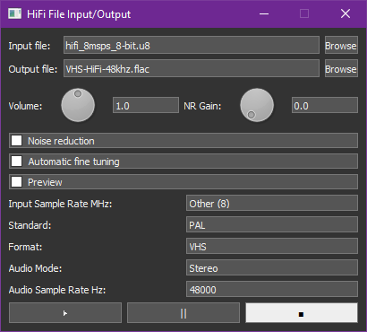

# HiFi Audio Decoding 

Previous Page [Audio](003-Audio.md)

Next Page [Video Export Guide](TBC-to-Video-Export-Guide.md)

This page is for the full HiFi decoder, for real-time or adjustment decoding you want to look at the [RTLSDR Decode](RTLSDR.md) page.

## Capture 

Please consult the [Hardware Installation Guide](Hardware-Installation-Guide.md) for installation.

HiFi FM signals can be captured with just about any basic SDR or ADC system its incredibly low bandwidth compared to video so the [RTLSDR Decode](RTLSDR.md) is a go to for [DdD](https://github.com/happycube/ld-decode/wiki/Domesday-Duplicator) users can plug and play capture but will want to down-sample to save space in most cases.

!!! CAUTION
    Older VHS/Betamax/EIAJ/VCR and broadcast formats like Umatic/Betacam/2" Quad/SMPTE-C require ADCs for Linear baseband audio capture a [clockgen](Clockgen-Mod.md) setup or reference capture is advised.

!!! WARNING
    - LaserDisc, Betamax (NTSC), Video8/Hi8 HiFi FM is captured with the video on the same signal path.
    - VHS (NTSC/PAL), Betamax (PAL) HiFi FM is on a separate RF path with "A.Out" on some decks being Linear baseband audio not HiFi RF.

## Supported Formats 

- VHS & SVHS 
- Video8 & Hi8

!!! NOTE
    Sony 8mm Video8/Hi8 can have PCM Digital which can only be captured with a Digital8 camcorder/deck but HiFi FM is the standard audio format and captured alongside Video/Timecode as they are on different carriers.

!!! NOTE
    PAL Video8, and Betamax decoding are still work in progress, with vhs PAL/NTSC having better then hardware support for stable in-spec media.

## Supported Features

- Noise Reduction (Based on IEC60774-2/1999)
- Variable Sample Rate Input
- Amplitude (Gain) Control
- Multiple Tape Formats

# HiFi Decode

HiFi decode converts the FM signal into standard digital audio in a simple 1-command decode workflow.

`RF Input` --> `Demodulation` --> `Optional Noise Reduction` --> `48khz 24bit FLAC Audio File`

FLAC Compressed & RAW Uncompressed Captures 8-bit or 16-bit are supported.

## Usage

!!! NOTE
    `samplerate` & `sounddevice` should be installed for Linux builds to work properly (if not automatically installed).

Infile **RF Data**, outfile **Audio Data** must have `.wav` or `.flac` extension at the end otherwise it will be an extension-less output and your default system audio player will not open the file automatically for example. 

## Example Usage Command

Linux/MacOS

    hifi-decode -t 8 -p -f 40 --audio_rate 48000 HiFI-Audio-PAL-DdD.s16 hifi-decode-output.flac

Windows

    decode.exe hifi --threads 8 --system pal --audio_rate 48000 --frequency 40 HiFI-Audio-PAL-DdD.s16 hifi-decode-output.flac

With GUI

    decode.exe hifi --gui input.u8 output.flac

{: style="width:400px"}{: style="width:389px"}

## TV System

`--system` `pal` / `ntsc`

`-n` - NTSC

`-p` - PAL

## Input Sample Rate Commands

`-f` Manual Input Hz, Mhz, Ghz.

`--frequency`

`-f 40` - DomesDay Duplicator (DdD)

`-f 8`  - RTLSDR

`-f 10` - CX Card Clock Gen Setup

### For CX Card Captures:

`--cxadc`    28.6 MHz/8-bit  (8fsc)

`--cxadc3`   35.8 MHz/8-bit  (10fsc) 

`--10cxadc`  14.3 MHz/16-bit (4fsc) (Technically 4fsc NTSC)

`--10cxadc3` 17.9 MHz/16-bit (5fsc) (Technically 4fsc PAL)

## HiFi Decode Control Options

`--audio_rate` Audio rate in Hz i.g `44100`, `48000`, `96000`, `192000` (48Khz Default)

----------

`--audio_mode` Audio mode:

- `s`   stereo 
- `mpx` stereo with mpx
- `l`   left channel
- `r`   right channel
- `sum` mono sum

------------

`--gain` Sets Amplitude size/volume useful for avoiding clipping. (i.g `0.5` = 50%) (default is `1.0`)

`--gui` Opens Graphical User Interface (can require input file and output file name  to be set)

`--bg` Forces guessing of the carrier bias.

`-t` To set the threads for parallel decoding. (Can support real-time with enough threads)

`--original` To force the use of vhs-decodes fm demodulation.

`--preview` Enables a faster decoder for real-time preview. (faster and noisier)

`--noise_reduction NOISE_REDUCTION` Set noise reduction on/off (default is on)

`--auto_fine_tune AUTO_FINE_TUNE` Set auto-tuning of the analogue front end on/off (useful for mixed standards tapes)

`--NR_sidechain_gain` Sets the noise reduction envelope tracking sidechain gain (default is 33). Range (20~100): 100 being a hard gate effect, operating range should be 40 and below (dynamic range decompressor adjustment smaller = more aggressive)

`--8mm` Sony 8mm formats, Video8 & Hi8 HiFi FM.

`--gnuradio` Opens ZMQ REP pipe to GNURadio at port 5555, the sample rate for GNURadio is 8388608 Hz

`--overwrite` Overwrites local file if named file already exists.

## HiFi Decode Output Formats

Recommended Standard Format 48khz.

| Sample Rate | Bit Depth | Codec | Container |
|-------------|-----------|-------|-----------|
| 192khz      | 24-bit    | FLAC  | .FLAC     |
| 96khz       | 24-bit    | FLAC  | .FLAC     |
| 48khz       | 24-bit    | FLAC  | .FLAC     |
| 44.1khz     | 24-bit    | FLAC  | .FLAC     |

## HiFi Decode Notes

HiFi is recorded within a defined limited range the further it deviates from that range the more likely it is to have or cause interference with the luminance channel.

With `--bg` you will see something like the following as it guesses and finds the L/R carriers.

    L carrier found at 1.65 MHz, R carrier found at 1.80 MHz

#### Standard Output

    - Decoding speed: 3063 kFrames/s (0.19x)
    - Audio position: 0:00:01.349
    - Wall time     : 0:00:07.048
    Progress [#                                       ] 1.93%

#### Good Calibration / Tape In Spec

    - Decoding speed: 2637 kFrames/s (0.16x)
    - Audio position: 0:01:02.014
    - Wall time     : 0:06:16.213
    Bias L 7.27 kHz, R 0.10 kHz (good player/recorder calibration)
    Progress [##################################      ] 85.16%

#### Bad Calibration / Tape Recorded Out of Spec

     Decoding speed: 2627 kFrames/s (0.16x)
     Audio position: 0:00:12.055
     Wall time     : 0:01:13.427
    ias L -10.00 kHz, R -10.00 kHz
    ARN: the player or the recorder may be uncalibrated and/or
    he standard and/or the sample rate specified are wrong
    Progress [#######                                 ] 16.62%%

For example, in a badly calibrated VCR, the left channel is noisy and the right is clean, you can check this by selecting left or right playback in VLC with quick test captures.

You can fix this by adjusting tracking as you would normally for video and fine-adjusting pots on higher-end VCRs.

## There is also the Videomem's original tool for inspection and tinkering

[VideoMem's Superheterodyne Decoding Tools](https://github.com/VideoMem/Superheterodyne-decoding-tools) a [GNU Radio](https://www.gnuradio.org/) script-based HiFi decoding tool. (Ouputs 16-bit 192khz PCM)

# Processing Recommendations?

The [EBU R128 Standard](https://github.com/oyvindln/vhs-decode/wiki/Documents) or -11 LUFS normalisation is recommended as its widely used in broadcast/online production this can be done with [StaxRip](https://github.com/staxrip/staxrip) or with [FFmpeg](https://github.com/slhck/ffmpeg-normalize#ebu-r128-normalization) tools.

De-poping can be done very effectively with modern tools like [iZotope RX](https://www.izotope.com/en/products/rx.html).

# PCM Audio 

Video8/Hi8 Could have PCM audio to extract this Digital8 and DV25 FireWire transfer is recommended. 

For PCM data in video streams you can decode it with [SDVPCM Decoder](https://github.com/Fagear/SDVPCMdecoder/)

# Older Version Notes

### DomesDay Duplicator Users:

**Note:** You need to use FLAC compressed or capture in 16-bit singed `.raw` and rename it to `.s16`, if capturing in 10-bit packed `.lds`, due to lack of ld-lds-converter integration the files **not decode** and will require being FLAC compressed to 16-bit or 8-bit standard format data.

    ld-lds-converter -u input.lds --debug --unpack --input input.lds --output output_40msps_16-bit.s16
    
To unpack your capture to 16-bit singed, this is very much worth noting for Video8/Hi8 users with 1 RF capture file.

## Using FLAC Compressed Captures Via Pipe

    ld-ldf-reader input-hifi.flac | hifi-decode - --pal -f 40 --audio_rate 48000 Decoded_Output.flac

# Page End 

Previous Page [Audio](003-Audio.md)

Next Page [Video Export Guide](TBC-to-Video-Export-Guide.md)