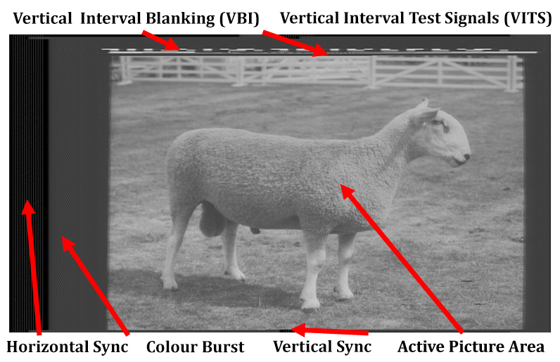
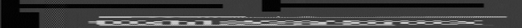
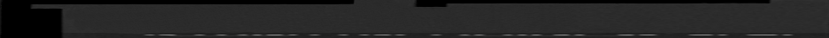
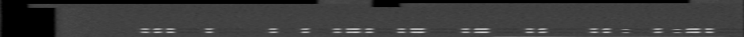
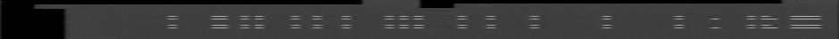
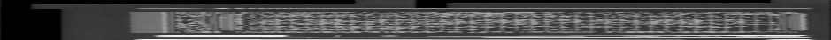
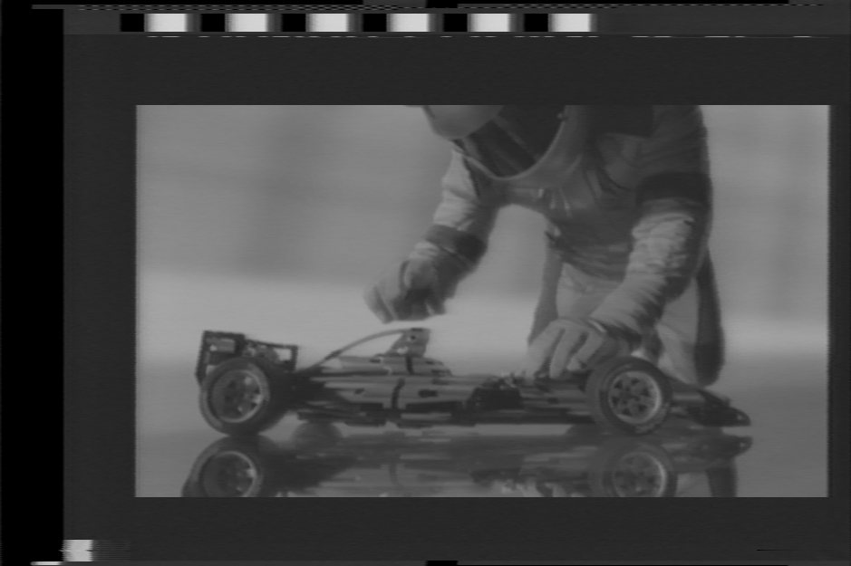
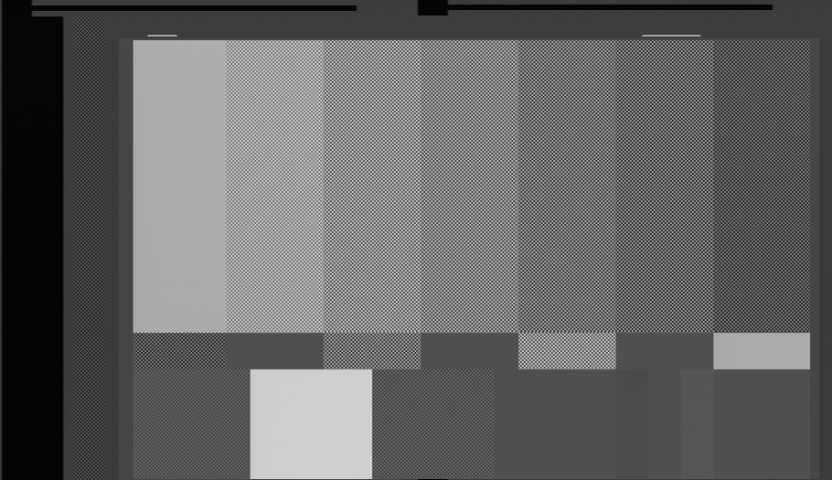
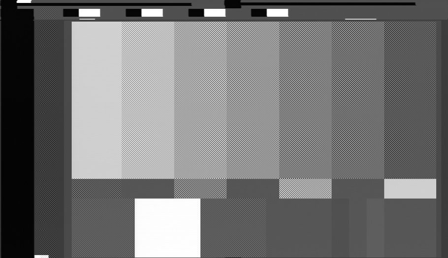

# Identifying VBI Data

Next Page [Identifying Video Signal Errors](Visual-Video-Signal-Errors.md).

This document visually goes over the types of VBI data found in analogue video signals.

## What is in a 4fsc frame?

## WSS - Wide Screen Signalling 

WSS Anamorphic

WSS Letterbox

## VITS - Vertical Interval Test Signals

VITS on LaserDisc (NTSC)

## Closed Captioning - NTSC/PAL Subtitling Data

## SMPTE VITC - Vertical Interval Timecode "vitsee"

VITC On Release Media

VITC On Consumer Camcorder Media

## Teletext - Message Boards / News Data

Teletext On VHS

## Macrovison (Copy Protection)

## LaserDisc FM Code (NTSC)

## Manchester bi-phase code

## Video ID

With MacroVison

# Page End 

Next Page [Identifying Video Signal Errors](Visual-Video-Signal-Errors.md).