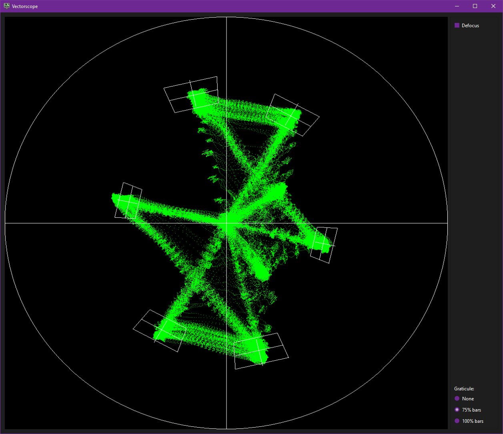
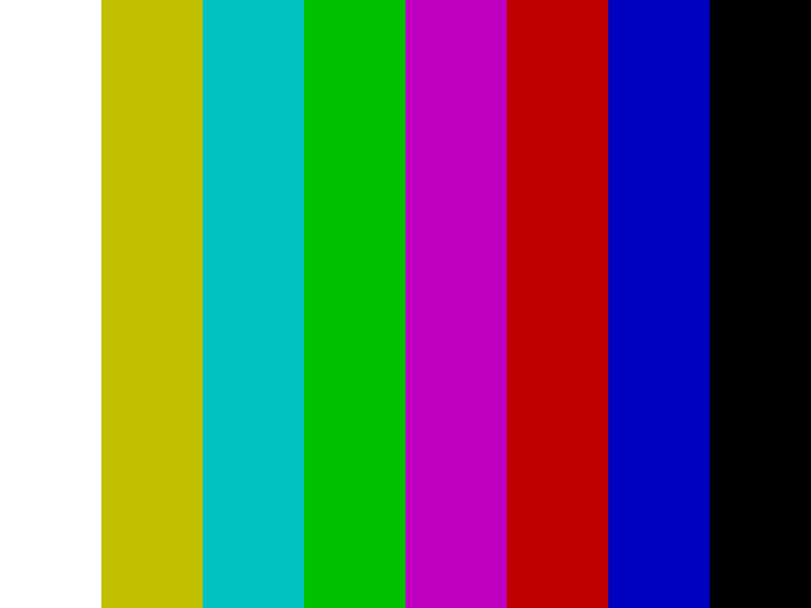
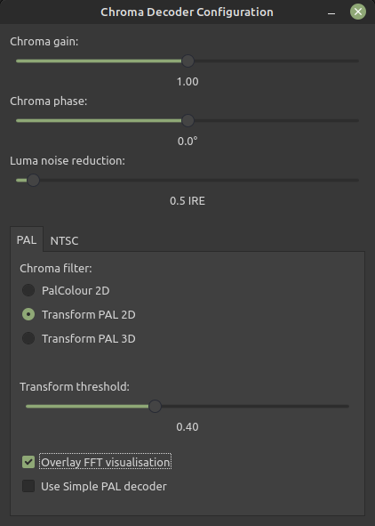
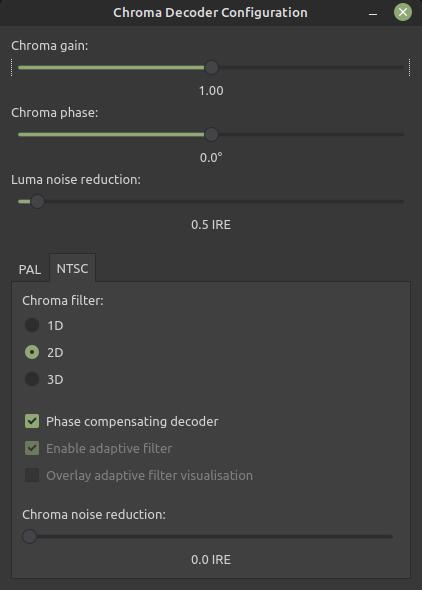

## Vector Scope & Chroma Decoder 

**NOTE**: Final output will be determend by fully running the chroma-decoder so run a 10sec test export.

For media with test bar signals you can select 75% or 100% bars you can adjust your image with the chroma-decoder.

{: style="width:500px"}

| EBU 75% Colour Bars | EBU 100% Colour Bars | SMPTE 75% Color Bars | SMPTE 100% HDTV Color Bars |
|---------------------|----------------------|----------------------|----------------------------|
| {: style="width:500px"} | {: style="width:500px"} | {: style="width:500px"} | {: style="width:700px"} |

{: style="width:300px"} {: style="width:300px"}

* Chroma Gain (Intensity)

* Chroma Phase (Hue Control)

* Luma Noise Reduction (PAL/NTSC)

* Chroma Noise Reduction (NTSC Only)
