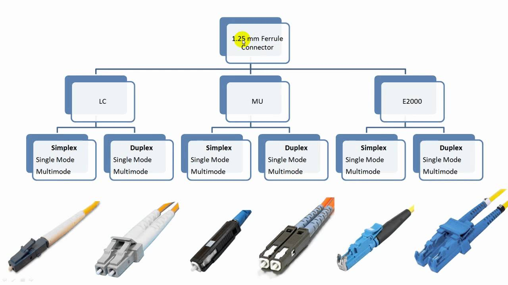

This a guide tossed together during a crisis adoption of the LTO5 tape format, starting during June 2023 going over the efforts to deploy LTO archival on Windows 10, Linux Mint & Windows Server 2016, archiving software found, consuming guides, collecting scripts and developing workflows to help others in the process.

Initial thoughts seem to be, LTO support is a very spotty thing between installs of OS's and hardware, seeing much appeal for individual users just buying a mac and thunderbolt solution today makes sense for any dedicated station with something like Yoyoyya.

As of 2023 LTO4 and older is effectively dead in the support tree mess that is LTO after version 5 I say this due to LTFS being the main driver for the last decade the LTO consortiums attempt at a tape version of UDF (Universal Disc Format) has been a iffy but "it works" state.

## LTO Tape

LTO Tape is a linear, mass produced industry archival format, using affixed media sizes, and generation to generation replaceable reading/writing hardware.

{: style="width:300px"}

The fixed outer dimensions are 102.0 × 105.4 × 21.5 mm using injection-moulded plastics, a 3 piece shell

{: style="width:500px"}

RFID Chip with MAM Code Data

{: style="width:300px"}

## Rules of Using LTO

- Never Zero Fill Tape Drives, leave about 10% of space with LTFS.
- After writing LTO Tapes using LTFS, eject and lock the tape before further reading to prevent header data damage.
- Never open-air store tapes in high humidity air, always store in a cold, dry place but ideally vacuum or "vac-packed".

## LTO Hardware Interface Software

[Internet Archive Download Link](https://archive.org/details/LTO-Tape-HP-IBM-Tandberg-Software-Pack)

- IBM LTFS Single Drive Edition / Tape Diagnostic Tool ITDT
- HP  LTFS Open Store Suite
- Quantum XTalk
- Tandberg Toolkit (LTO 1-4)
- LTFS CMD (Command line LTFS)
- Tandberg Drivers for Windows
- HP Firmware Tools
- LTFS Copy GUI (Chinese)

## Table 'o LTO

| Media ID | Cartridge Type | Native Capacity      | Compressed Capacity  | LTFS Capacity     | Year Introduced  | Backwards Support | Transfer Rate |
|----------|----------------|----------------------|----------------------|-------------------|------------------|-------------------|---------------|
| L1	   | LTO-1	        | 100GB  (93.1323 GiB) | 200GB  (186.264 GiB) | Not Compatible    | 2000             | None              | 20MB/s        |
| L2	   | LTO-2	        | 200GB  (186.265 GiB) | 400GB  (372.529 GiB) | Not Compatible    | 2003             | LTO-1             | 40MB/s        |
| L3	   | LTO-3	        | 400GB  (372.53 GiB)  | 800GB  (745.06 GiB)  | Not Compatible    | 2005             | LTO-2             | 80MB/s        |
| L4	   | LTO-4	        | 800GB  (745.06 GiB)  | 1.6TB  (1.49 TiB)    | Not Compatible    | 2007             | LTO-3, LTO-2      | 120MB/s       |
| L5	   | LTO-5	        | 1.5TB  (1.36 TiB)    | 3TB    (2.73 TiB)    | 1.25TB (1.13 TiB) | 2010             | LTO-4, LTO-3      | 140MB/s       |
| L6	   | LTO-6	        | 2.5TB  (2.27 TiB)	   | 6.25TB (5.68 TiB)    | 2.3TB  (2.09 TiB) | 2012             | LTO-5, LTO-4      | 160MB/s       |
| L7	   | LTO-7	        | 6TB    (5.45 TiB)    | 15TB   (13.32 TiB)   | 5.6TB  (5.09 TiB) | 2015             | LTO-6, LTO-5      | 300MB/s       |
| L8       | LTO-8          | 12TB   (10.91 TiB)   | 30TB   (27.93 TiB)   | 11.3TB (10.2 TiB) | 2017             | LTO-7             | 360MB/s       |
| L9       | LTO-9          | 18TB   (16.37 TiB)   | 45TB   (40.92 TiB)   | 17.4TB (15.8 TiB) | 2021             | LTO-8             | 400MB/s       |

### Interfaces 

| Interface     | LTO Support | Operating System Support              |
|---------------|-------------|---------------------------------------|
| SCSI          | LTO 1-4     | Linux, MacOS, Windows, Windows Server |
| SAS SFF-8484  | LTO 1-9     | Linux, MacOS, Windows, Windows Server |
| Fibre Channel | LTO 1-9     | Linux, MacOS, Windows Server          |
| USB 3.0       | LTO 5-9     | Universal                             | 
| SCSI to USB   | LTO 1-3     | Universal                             |

SCSI with VHDCI 68-pin is common for LTO2-4 / 50-pin Type-A is common on older LTO 1-2 drives.

External SAS uses `SFF-8088` / `Fibre Channel LC` Connectors (2 Fibre Pairs)

There is also `MiniSAS HD SFF-8664` on current LTO 8-9 era external units.

--------

Power Interfaces:

`Molex 4 pin` / `SAS/SATA` ATX power / External uses `IEC 13`

Power Usage: `5V 2.5A` / `12V 1.5A` to `5V 4A` / `12v 2A`

--------

Notes: 

FC LTO "Autoloader" drives come in 3 versions 1U rack standard, 2U duel height 5.25 standard, FC connectors are pass though unless its a SFP module and power is always a standard Molex connector internally. Ethernet is always separate.

FC HBA Cards - Fibre Channel Host Bus Adapters (SFP/SFP+ Interface with Common LC Type Fibre Connectors)

SAS - Serial Attached SCSI (Mini/Full/External Connectors)

SCSI - Small Computer System Interface (4 Physical Connector Sizes)

-------

Windows XP/7/10/11 support really is not there for many Fibre HBA cards, only Windows Server has proper support as of 2023.

USB 3.0/3.1 like M.2 NVME adapters just has a controller IC emulating an SAS controller, unitex and ibm have 

## Format Overview Notes 

Tapes can not be degaussed externally it will make tapes unusable.

Tapes are barcoded, and have internal memory RFID chips, that track there use life and ID codes.

External drive bays are dumb shells with power supply's, any drive will work inside them if the interface is the same. 

Drives should be cleaned after 40 to 50 running hours or 13 to 16 LTO5 full tape writes, or if any tape read/write errors suddenly occur.

Drives can be manually cleaned, they are not airtight units just like a digital video tape VCR only difference is the head/heads are a static module which moves up and down tape is moved on 2 independent motors to control tension 

## MAM Barcodes 

{: style="width:400px"}

LTO Tapes have a physical write lock and a barcode label and a RFID data chip as a pass-by and in-reader Id code system.

This code can be overwritten or used to auto-rename formatted cartages.

!!! TIP
    If you would like to create/print your own [thanks to the wonderful auto generator by PBS Proxmox](https://pbs.proxmox.com/docs/lto-barcode/index.html) making ready for printing to label paper or standard paper index sheets is easy.

{: style="width:300px"}

## Visual Examples

### Internals 

!!! TIP
    Manually cleaning can be far cheaper then cleaning tapes, and mandatory for major contamination.

LTO drives are based around a single linear head.

{: style="width:400px"}{: style="width:400px"}

## Interfaces 

### Fibre HBA (SFP)

Fibre Channel Host Bus Adapters, come in 4G and 8G versions, fixed module or SFP removable modules which house the RX/TX lasers for send/receive each module has 2 pairs of LC connector terminated fibres.

!!! WARNING
    Fibre Channel HBA's have little support for Windows, only Windows Server 2012 or newer is a viable option for a majority of cheep cards you can get off eBay etc outside of Linux, please ensure your card is supported before wasting time and money.

{: style="width:400px"}{: style="width:500px"}

{: style="width:500px"}

### SAS Cards

SAS Comes in 6G versions and 12G versions, ports are always fixed this uses copper cables. 

External SAS Card SFF-8088

{: style="width:400px"}

External SAS Card MiniSAS

{: style="width:400px"}

Internal SAS Card M8087

{: style="width:400px"}

M8087-to-SFF8482 Breakout Adapter

{: style="width:400px"}

Internal M8087 to External SFF8088

{: style="width:400px"}

### SCSI

LTO1-4 Used the SCSI interface.

PCIe to SCSI

{: style="width:400px"}

USB to SCSI

{: style="width:400px"}

### Auto Loaders

Fibre Channel Duel Hight 

{: style="width:400px"}

{: style="width:400px"}

{: style="width:400px"}

Fibre Channel Single Hight 

{: style="width:400px"}

They use LC or "LC Duplex" terminated fibre.

{: style="width:400px"}

SAS Autoloaders

{: style="width:400px"}

### Rackmount 

{: style="width:400px"}

{: style="width:400px"}

### External

External LTO Drives are universal for SAS based drives normally using SFF-8088 but newer units can have MiniSAS.

{: style="width:400px"}

{: style="width:400px"}

{: style="width:400px"}

IBM USB-3/SAS SFF-8088 Single Port Attach 3580 H5S,H6S 5760

{: style="width:400px"}

Unitex USB 3.0/MiniSAS desktop

{: style="width:400px"}

## File Systems 

This boils down to just two. 

- Tarball or simply `.tar` / `Tape ARchive` compressed files.

- LTFS - [Linear Tape File System](https://github.com/LinearTapeFileSystem/ltfs) - Presents tape drives (LTO5+) as an generic indexed storage device to systems.

- STFS - [Simple Tape File System](https://github.com/pojntfx/stfs) - Modern `.tar` based file system for any tape drive formats.

## Software

LTFS is based around universal ease of access via host systems regardless of vendor hardware platforms, in reality software implementation has massive gaps and dying support for operating systems such as Windows 10 with little to zero working of software for IBM or HP's suits in some cases.

HP/Quantum Drives are more ideal compared to Ultrium IBM drives if your a windows user, if your version of windows is not supported, time to re-install and test until you do.

Its great if your Windows/MacOS only and not this magical agnostically supported thing that UDF optical discs is... 

A bit issue is support issues with fuse/winfuse at times.

Oh, some other info I've found out - the HP software for LTFS sometimes just refuse to work. It uses an old winfuse service that just refused to start on a Windows install I had until I reinstalled. 

I found some results on google about it but no fix, was a pain in the arse. HP drivers/LTFS also work with Quantum drives (and maybe Tandberg? haven't tested)

External enclosures are also interchangeable, if you're going the external route. You can throw a HP internal drive in an external Dell enclosure no problem

## HP LTFS 

After starting out with IBM software its quite clear that HP's suite is a bit more refined:

Mostly thanks to having an actual log output while preforming actions!

    LTFS15000I Starting mkltfs, HPE StoreOpen Software version 3.5.0, log level 2
    LTFS15041I Launched by "mkltfs -f -s A10017 -n LTO5_A10017 -d TAPE0"
    LTFS15042I This binary is built for Windows
    LTFS15043I GCC version is 4.6.3
    LTFS17087I Kernel version: Windows
    LTFS15003I Formatting device 'TAPE0'
    LTFS15004I LTFS volume blocksize: 524288
    LTFS15005I Index partition placement policy: None
    LTFS17085I Plugin: Loading "ltotape_win" driver
    LTFS20013I Drive type is Quantum LTO5, serial number is HU1144KBB6
    LTFS17160I Maximum device block size is 524288
    LTFS17235I Formatting the media will place drive in write-anywhere mode
    LTFS17157I Changing the drive setting to write-anywhere mode
    LTFS17302W Cannot retrieve attribute (volumelockstate=0x1623)
    LTFS17302W Cannot retrieve attribute (Application Vendor=0x800)
    LTFS15049I Checking the medium (load)
    LTFS15010I Creating data partition b on SCSI partition 1
    LTFS15011I Creating index partition a on SCSI partition 0
    LTFS17165I Resetting the medium's capacity proportion
    LTFS11097I Partitioning the medium
    LTFS20106I Retaining existing MAM barcode A10017L5                        
    LTFS20075E Failed to write attribute (-1)
    LTFS20076I Triggering drive diagnostic dump
    LTFS20096I Diagnostic dump complete
    LTFS20024W Cannot store attribute 0x820 (-1)
    LTFS11100I Writing label to partition b
    LTFS11278I Writing index to partition b
    LTFS11100I Writing label to partition a
    LTFS11278I Writing index to partition a
    LTFS15013I Volume UUID is: aafc2655-cfcb-4de2-9c7a-b064e29f4403
    LTFS15019I Volume capacity is 1335 GB
    LTFS20076I Triggering drive diagnostic dump
    LTFS20096I Diagnostic dump complete
    LTFS15024I Medium formatted successfully

### Paid Indexing Tools

[Yoyotta](https://yoyotta.com/yoyotta/ltfs.html) MacOS Only, but audio/video media focused.

[Amanda](http://amanda.zmanda.com/)

[Bacula](https://www.baculasystems.com/blog/tape-backup/) [Archive Page](https://web.archive.org/web/20160707012008/http://blog.bacula.org:80/general/)

[Bareos](https://www.bareos.com/) [Download](https://download.bareos.org/current/)

[Veeam](https://www.veeam.com/)

[P5 Archive](https://www.archiware.com/products/p5-archive)

### Free Indexing Tools 

[Yet Another Tape Manager (YATM)](https://github.com/samuelncui/yatm#readme)

{: style="width:400px"}{: style="width:400px"}

[WinCatalog](https://www.wincatalog.com/)

{: style="width:400px"}

[Virtual Volume Viewer (VVV)](https://www.fsoft.it/VVV/)

{: style="width:400px"}

### Manual Indexing Tools 

git-annex

Manual Directory Tools For Archive

Windows CMD in a folder `dir /a /s /b > File_List.csv`

https://community.spiceworks.com/how_to/160065-list-all-files-from-folders-and-subfolders-in-windows-and-export-it-to-csv

### Calculators 

https://www.lto.org/tco-calculator/

https://www.sanspot.com/lto-guide

### Alternative & Dead Formats

Tandberg - RDX - (SSD Media)

Sony AIT – Advanced Intelligent Tape (1999~2006)

Sony SAIT-1/SAIT-2 – Super Advanced Intelligent Tape (Predecessor to Sony Optical Disc Archive) (2003~2006)

DLT - Digital Linear Tape (USB Interface)

DAT - Digital Audio Tape 

### Error Codes 

In software these are stated as `EC = Error Code`

Single-character display (SCD) SCD Dot

Status light / Warning Light 

Unload/Eject Button

[IBM Site Version - 2023](https://www.ibm.com/docs/en/ts3500-tape-library?topic=errors-resolving-lto-tape-drives)

| SCD Code | Description                                                                                                                                                |
|----------|------------------------------------------------------------------------------------------------------------------------------------------------------------|
| 0	       | No Error. Ran successfully.                                                                                                                                |
| 1        | Cooling problem.                                                                                                                                           |
| 2        | 5V dc power problem detected. voltage limit near and working or outside range and offline (too high/low)                                                   |
| 3	       | Tape drive determined that a microcode error occurred.                                                                                                     |
| 4	       | Microcode or tape drive problem. Tape drive determined that a microcode or tape drive hardware failure occurred.                                           |
| 5	       | Tape drive problem. Tape drive determined that a hardware failure occurred.                                                                                |
| 6	       | Tape drive or media error. Tape drive determined that an error occurred, but it cannot isolate the error due to faulty hardware or to the tape cartridge.  |
| 7	       | Media error.                                                                                                                                               |
| 8	       | Tape drive, SCSI bus or fibre channel error.                                                                                                               |
| 9	       | Tape drive or RS-422 error.                                                                                                                                |
| A	       | Tape drive hardware problem.                                                                                                                               |
| B	       | No error or message is assigned.                                                                                                                           |
| C	       | Tape drive needs to be cleaned.                                                                                                                            |
| D	       | No error or message is assigned.                                                                                                                           |
| =	       | The Unload button on the drive was pushed in and did not release                                                                                           | 

## References & Links

Official IBM Software Links [Windows](https://www.ibm.com/support/fixcentral/swg/selectFixes?parent=Tape%20drivers%20and%20software&product=ibm/Storage_Tape/Long+Term+File+System+LTFS&release=2.4&platform=Windows&function=all) / [Linux](https://www.ibm.com/support/fixcentral/swg/downloadFixes?parent=Tape%20drivers%20and%20software&product=ibm/Storage_Tape/Long+Term+File+System+LTFS&release=2.4&platform=Windows&function=fixId&fixids=IBM_LTFS_Single_Drive_Edition_for_Windows_2.4.5.1_10503&includeRequisites=1&includeSupersedes=0&downloadMethod=http) / [MacOS](https://www.ibm.com/support/fixcentral/swg/downloadFixes?parent=Tape%20drivers%20and%20software&product=ibm/Storage_Tape/Long+Term+File+System+LTFS&release=2.4&platform=Mac+OSX&function=fixId&fixids=IBM_LTFS_Single_Drive_Edition_for_OS_X_2.4.5.1_10503&includeRequisites=1&includeSupersedes=0&downloadMethod=http)

https://en.wikipedia.org/wiki/Advanced_Intelligent_Tape

https://www.baculasystems.com/blog/tape-backup/

https://web.archive.org/web/20160707012008/http://blog.bacula.org:80/general/supported-tape-drives/

https://www.bacula.org/binary-download-center/

https://www.reddit.com/r/unRAID/comments/drl3hp/anybody_else_use_a_tape_drive_with_unraid_whats/

https://www.sanspot.com/lto-guide

https://blog.benjojo.co.uk/post/lto-tape-backups-for-linux-nerds
 
https://www.reddit.com/r/homelab/comments/138k30f/ltfs_problems_on_w10_hpe_standalone_lto5_tape/

https://www.snia.org/tech_activities/standards/curr_standards/ltfs

https://www.snia.org/sites/default/files/technical-work/ltfs/release/SNIA-LTFS-Format-2-5-1-Standard.pdf

https://docs.oracle.com/cd/E19190-01/index.html

https://news.ycombinator.com/item?id=32206579

https://www.cyberciti.biz/hardware/unix-linux-basic-tape-management-commands/

https://community.spiceworks.com/topic/2256797-lt0-5-backup-software-for-windows

https://blog.benjojo.co.uk/post/lto-tape-backups-for-linux-nerds

https://answers.sap.com/questions/2405255/the-barcode-functionality-in-mam.html

https://www.bedroomlan.org/tools/tape-labels/
