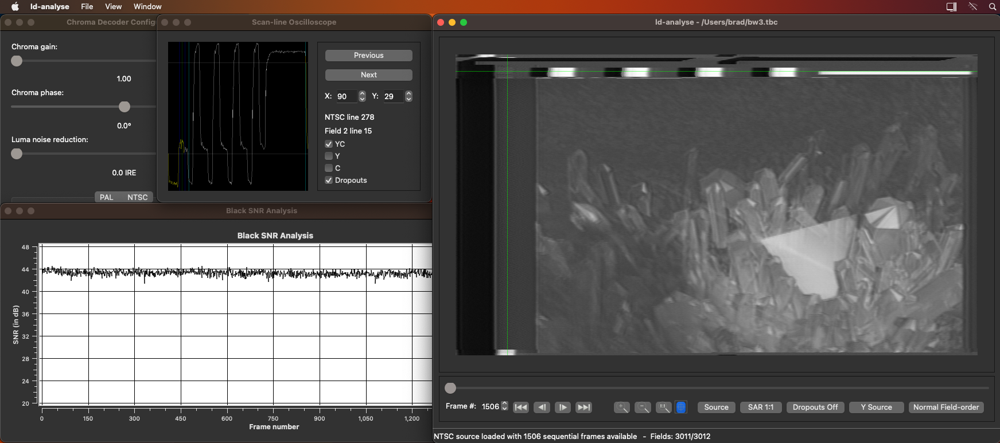
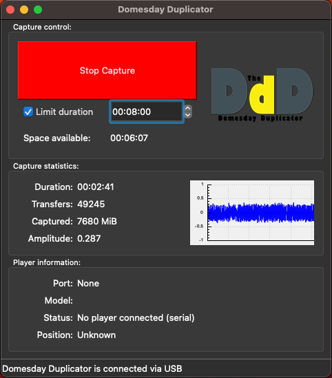

{: style="width:px"}

## Download & Usage

Self-Contained Builds: [MacOS (Intel & Arm)](https://github.com/oyvindln/vhs-decode/releases)

We have support for Apple Silicone (ARM) and Apple Intel (x86) systems.
 
Open a terminal after moving the apps to your applications directory.

Run `decode.app` with `vhs`, `ld`, `cvbs`, `hifi` at the start i.g `decode.app vhs` calls the decoder you desire, commands are universal.

Run `tbc-tools.app` opening it will call ld-analyse, otherwise manually call tools via `tbc-tools.app ld-chroma-decoder`.

!!! NOTE
    Due to developers not physically owning a range of apple x86 and Arm systems, this is entirely tested by community members, and virtual environments.

### DomesDay Duplicator (DdD)

{: style="width:400px"}

Builds for MacOS (Arm) can be found [here](https://github.com/harrypm/DomesdayDuplicator#macos-software-installation)

## Manually Building

MacOS x86 & Arm is supported.

!!! WARNING
    Only MacOS 11 "Big Sur" and newer is supported with native building and self contained binaries. 

!!! NOTE
    Brew is required to pull down the correct packages.

Install [Brew](https://docs.brew.sh/Installation):

Open a Terminal and paste:

    /bin/bash -c "$(curl -fsSL https://raw.githubusercontent.com/Homebrew/install/HEAD/install.sh)"

Install Dependencies:

    brew install cmake pkg-config qt qwt ffmpeg fftw python pipx

Download vhs-decode repository

    git clone https://github.com/oyvindln/vhs-decode.git vhs-decode
    cd vhs-decode

Once cloned from git, run this to install the python part:

    pipx ensurepath
    pipx install .

Install TBC-Video-Export

    pipx install tbc-video-export

(There is also [self contained builds](https://github.com/JuniorIsAJitterbug/tbc-video-export/releases) if install issues arise)

Then build ld-tools suite:

    cmake -B build -DCMAKE_BUILD_TYPE=Release -DUSE_QT_VERSION=6 -DBUILD_PYTHON=false
    cmake --build build -j8
    cmake --install build 

Install tbc-video-export

    pipx install tbc-video-export

This should install the binaries in your bin folder, otherwise you can run them from the vhs-decode folder.

## Notes  

[DD86 Discord](https://discord.com/channels/665557267189334046/676084498097766451/1126341637962997892)
