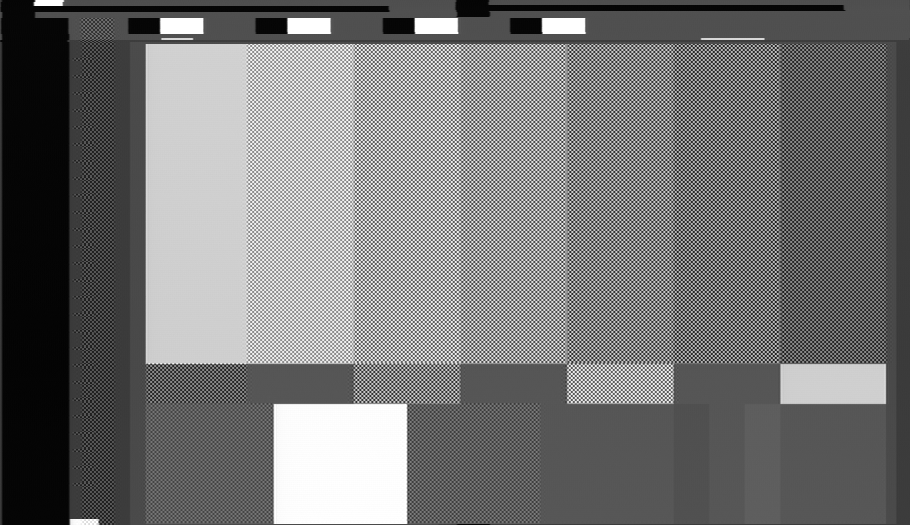

{: style="width:700px"}

> MacroVison Demo Tape Intro

MacroVison was, a primitive contrasting block scrambler method using the left bottom and VBI space above line 21.

Intended to mess with automatic gain control systems, this was ignored by most low level and commercial TBCs however and of course ignored by the sync code of vhs-decode in most cases, but for VCR to VCR dubbing of tapes in the 1980s and 1990s this made no end of issues for people wanting to duplicate there home movies or commercial tapes.

Clean 4fsc Frame 

{: style="width:700px"}

CVBS Raster with MacroVison contrast blocks

{: style="width:800px"}
