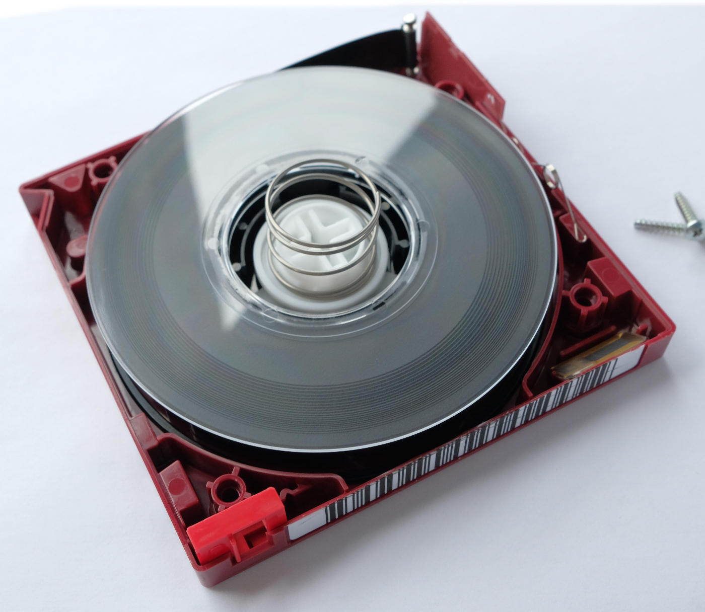

# Media Archival Guide

There is a deep confusion between archives and copies of media this guide goes over what an archive is and the process of making archives which has three stages.

- Physical Handling, this includes cleaning, baking and packing tapes before capture if needed.

- Digital Archival, this includes storage and indexing of captured and decoded data.

- Physical Archival, this includes storage and indexing of physical media tapes, data discs, data tapes.

# What is an archive?

An archive is two key things, long-term and unchanging record of media, from art to text and now video and audio data too.

In historical context an compiled collection of information duplicated over and over or sealed in a airtight toom or vessel.

Best common historical example of this practice is religious scriptures the youth would write/press a exact copy so each generation would have a copy and it would be verified by the elders own copy.

# Workflow

This guide is agnostic in terms of data handling for both digital and analogue tape formats, and even covers standard digital data and production workflows the main difference is digital formats take less initial ingest effort.

The scope of this guide is intended to cover the archival usage and methods of the following subjects

Backup Practices, Media Preparation, LTO Tape Archives, Optical Archives

With a focus on:

RF Data, Logging Data, Decoded Data, Audio/Visual Data

Burning Blu-Ray & DVD - Playable Media

## Storage Mediums Overview 

There is a few options but it all boils down to HDD short term, LTO long term, Optical very long term, there is emerging quartz/liquid/biological, and data block optical celluloid like the DOTS system but like with all storage systems redundancy is as critical as well actually being able to obtain and maintain.

SSD has a fixed write life, read only use wise these are not bad but failures are very hard to recover data from unlike a HDD, but can do upwards of 7GB/s read write speeds.

HDD has the highest maintained cost with fixed service life of 10 years +- but speed limited to about 500MB/s 

LTO Tape is 20~35 year cold store format that requires a controlled storage condition.

Optical well just keep it in a cool dry place and it will last as long as the plastics remain stable so upwards of 50-100+ years if its well moulded.

HDD goes upto 22TB per 3.5inch drive, SSD goes upto 100TB per 3.5inch drive, LTO goes upto 17.4TB per tape, Optical goes upto 128GB per disc. 

## Magnetic Media Workflow

`Files` --> `Solid State Storage` --> `Checksums` --> `Duplication`

Rinse and repeat every 3-5 years maintaining the 3-2-1 workflow if possible.

## The Optical Workflow

`Files` --> `Folder` --> `data.iso` --> `Add EEC Data` --> `Burn & Verify` --> `Make Label's & Index` --> `Physical Archive`

Discs: DataLifePlus, DM Archive, M-Disc discs use genuine airtight moulding and are actually archival grade.

DVDisaster - ECC & Verification

7Zip/p7zip GUI/WinRAR - Compression / Splitting

K3B/ImgBurn/Nero - ISO File Creation / ISO File Burning

File System: UDF (Universal Disk Filesystem)

*NOTE* You can also add metadata to the ISO file format such as who prepared, owns and or media name data.

## The LTO Tape Workflow

*NOTE* Always engage the lock tab after filling a tape, to prevent software from accidental overwrites.

STFS/RAW

`Files` --> `Folder` --> `Software Index` --> `data.tar` --> `Write & Verify` --> `Note Index Lable` --> `Vacuum Pack` --> `Physical Archive`

LTFS

`Files` --> `Folder` -->  `Software Index` --> `Write & Verify` --> `Note Index Lable` --> `Vacuum Pack` --> `Physical Archive`

HP/Quantum - Use the HP Tools Suit

HP's tools suite and LTFS implementation is a lot more refined on windows, add cartridge format it and use, simple as.

IBM - Use single drive edition / IDIT 

# Digital File Systems & Formats

Today there is two long term file system formats, alongside `exFat`, `NTFS`, `ext4` used for recording media, windows, and Linux respectively.

## UDF - Universal Disc Format

This format is used by all optical media in the digital era starting in 1995 this allows for universal reading support by practically any past or current operating system or interface such as desktops to phones if you can find a reader or sample the pits you can extract the data off discs. 

## LTFS - Linear Tape File System

This file system is meant to be universal standard for Linear Open Tape starting from generation 5 released in 2010 allowing for a easy and universal format between desktop station and autoloader mounted archives.

However support is mostly orientated around hardware and autoloader systems, Windows support is slowly dying, MacOS is workable and Linux is iffy and is not drag and drop fluid nor universal software between vendors tape drives. 

# The Optical Archive

What do I "just buy" to get started? is a common question it boils down to workflow and cost.

Blu-Ray BDXL Reader/Writer recommendations:

Desktop (SATA):

[Asus BW-16D1HT](https://www.asus.com/uk/motherboards-components/optical-drives/internal-blu-ray-drive/bw16d1ht/) 60~100USD (Global Price) [Firmware Unlocking Tools](https://drive.google.com/file/d/1DPhvUK8FwGMxg65oOtrPyoMc_bj0284J/) allowing for UHD ripping support and full control over burning speed modes.

Portable (USB Type-C):

[The Pioneer DBR-XD08UMB-S](https://pioneer-blurayodd.eu/products/bdr-xd08emb-s/index.php) If you want a portable reader/burner for laptop/OTG mobile use then these current Type-C units are ideal that also have external power support.

*NOTE* Laptop burners can be salvaged for external use with USB 3.0 to Slimline SATA

*NOTE* LightON/LG burners have support for FAT32 translation layer mode i.e USB Flash Drive presentation mode required for iPhones and such.

{: style="width:400px"}

## One simple reason is the cost of Bit-Rot

SSDs have limited life without power all flash memory degrades this can be 1 year or 25 years.

HDDs need mechanical replacements and are not immune from magnetic radiation and thermal shifts, bit rot, bit flips, cosmic rays etc and have 6-10 year rated life.

Optical just needs a crush proof box, and a 405nm laser to read it in 100+ years which is today mass fabricated for many uses once written and verified its a solid medium.

## What are archival grade optical discs?

Optical Discs are 2 things polycarbonate and some form of manipulatable material to store pits of information.

In simple terms, its just an in-organic substrate with proper moulding around the writable material.

This means no contaminate from air to water etc gets in so nothing can damage it just sitting in a box thermally cycling or in the event of floods etc polycarbonate is natural to most chemicals. 

Unlike Laserdisc's today proper air/water tight moulding and forever adhesives with inert materials are common have been for a decade now with the HLT disc standard.

# Optical Disc Options

- M-Disc
- DM Archive
- Standard BDXL (DataLifePlus or better grade)
- Glass Master Discs (Extreme Cost)

## Mobile Phone / Network Terminal Use 

You can read CD/DVD/BD/BDXL UDF formatted discs data via USB OTG with many apps.

Android [MLUSB Mounter](https://play.google.com/store/apps/details?id=jp.co.medialogic.usbmounter&hl=en_GB&gl=US) & [DISC LINK Platinum](https://play.google.com/store/apps/details?id=kr.co.hlds.disclink.platinum&hl=en&gl=US) Can mount and read and write to discs directly on external powered USB disc drives.

iPhones can support drives naively that have USB translation mode [YouTube Example](https://www.youtube.com/watch?v=bPqjrwjO7H4) / [File Browser Professional](https://apps.apple.com/us/app/id854618029?app=itunes&cn=00) 

## Basics of Blu-Ray Disc Sizes  

BD = Blu-Ray Disc

BDXL = Blu-Ray Disc Extra Large 

DVD = Digital Video Disc or Digital Versatile Disc.

BD   is 1-2 layer discs only.

BDXL is 3-4 layer discs only.

Sony BDXL 128GB is the largest consumer format disc you can buy.

Size is: 120 mm

| Format     | Sides   | Layers | Size GB | Size GiB | M-Disc | DM Archive | GlassMasterDisc |
|------------|---------|--------|---------|----------|--------|------------|-----------------|
| DVD-R      | Single  | 1      | 4.7GB   | 4.37GiB  | Yes    | No         | No              |
| DVD-R-DL   | Single  | 2      | 8.5GB   | 7.96GiB  | No     | No         | No              |
| BD-R       | Single  | 1      | 25GB    | 23.3GiB  | Yes    | Yes        | Yes             |
| BD-R-DL    | Single  | 2      | 50GB    | 46.6GiB  | Yes    | N/A        | Yes             |
| BDXL-TL    | Single  | 3      | 66GB    | 61.4GiB  | No     | N/A        | No              |
| BDXL-TL    | Single  | 3      | 100GB   | 93.1GiB  | Yes    | N/A        | No              |
| BDXL-QL    | Single  | 4      | 128GB   | 119.2GiB | No     | N/A        | No              |

| Format       | Sides   | Layers | Size GB | Size GiB  | Sony ODA Cartridge |
|--------------|---------|--------|---------|-----------|--------------------|
| Archive Disc | Duel    | 8      | 500GB   | 465.66GiB | 5.5TB - 12 Discs   |

- DVD-R Single layer 4.7GB (4.37GiB)

- DVD-R Duel layer 8.5GB (7.96GiB)

- BD-R Single layer 25GB (23.3GiB)

- BD-R-DL Dual layer 50GB (46.6GiB)

- BDXL-TL Triple layer 66GB (61.4GiB) (Release & game media - non off-shelf)

- BDXL-TL Triple layer 100GB (93.1GiB)

- BDXL-QL Quad Layer 128GB (119.2GiB)

- SL - Single Layer 
- DL - Duel Layer
- TL - Triple Layer
- QL - Quad Layer

---------

## M-Disk

Millennial Disc made by Millenniata (Fabricated and sold by Verbatim/Ritek today)

M-Disk only has 4 standard certified format versions, `DVD 4.7GB & BD 25/50/100GB`.

{: style="width:300px"}

M-Discs have a black/grey look when burned, shiny golden look when non-burned.

(Note: completely sliver looking discs are not genuine M-Discs)

{: style="width:400px"}

M-Disc Logo on the current generation [Asus BW-16D1HT](https://www.asus.com/uk/motherboards-components/optical-drives/internal-blu-ray-drive/bw16d1ht/).

What makes the M-Disc different, is its of the first ISO/IEC 10995 rated archival formats, using non-organic glassy carbon material, that's neutral to temperature shifts and radiation, instead of dyes and metals used many other media, its only weak point is the polycarbonate plastics which have a 1000+- year life the carbon holding the data could last longer, unlike normal discs M-Discs have a high standard of validation for there plastics moulding and have perfectly smooth edges so no air/moisture can get into the disc layers.

In use it's exactly like a normal DVD/BD/BD-DL/BDXL-TL in terms of read/write process with a bit of data saying "hey use higher power mode to burn" and are slightly slower to burn than standard disks using only the 2x speed.

Cost of adoption is 50GBP / 70USD for top-end BDXL reader/writers M-Disk wins in terms of future-proofing and cost of interface hardware with UDF disk formatting supported on all computer platforms from desktops and even IOS/Android based smartphones.

## DM Archive 

{: style="width:300px"}

[Pioneer DM Archive](https://web.archive.org/web/20230303071045/https://www.cdrinfo.com/d7/content/pioneer-japan-releases-new-bdr-wx01dm-external-bddvdcd-writer-jis-x6257-standard-and-100) - Basically Japan Gov backed M-Disc

JIIMA Standard / JIS X6257 / ISO/IEC 16963

This is the newest Blu-Ray disc based system standardised by Japan with the "DM Archive" or defect management branding, similar to M-Disc with high standard of disc fabrication quality, with a "certified" players with long life builds and low mechanical failure potential, an expansion of there "pure read" feature Pioneer uses. 

[BDR-WX01DM](https://www.amazon.co.jp/-/en/gp/product/B0BS6F1TRV/ref=ox_sc_act_title_1?smid=AN1VRQENFRJN5&psc=1) - BDXL Player/Reader/Burner

[Pioneer IPS-BD11J03P](https://www.amazon.co.jp/-/en/gp/product/B0BSB7WNRS/) BD-R 25GB - Certified Discs (3 Pack)

These solutions are at the 30~100TB of data point in terms of raw practical cost effectiveness.

## [Sony Optical Archive & PetaSite](https://pro.sony/en_GB/products/optical-disc) 

* Discontinued support as of May 2023, (Will update if changes occur as this was quite popular as a one time migration workflow from LTO)

[Page has been moved](Sony-ODA-Optical-Disc-Archive.md) to de-clutter though it is worth reading for basic info/history of optical archival in the 2012-2023 era, and is still a viable medium if you can get your hands on hardware and enough media.

## LTO Linear Tape-Open

{: style="width:300px"}

{: style="width:300px"}

IBM's 20-year tried and true digital tape archival medium adopted by everyone.

LTO is a linear tape based data system, while the move away from tape in the consumer to broadcast world has been fluid for initial capture and ingest alongside masters, LTO tape remains a industry standard for backup and physical site to site data migration of large projects or library's, and long-term archival across the small the large scale business and consumers with high data loads.

This scales from desktop/external desktop to rackmount scale units 1U to 4U to 42U with automated loading systems, meant primarily for long-term offline or on-site backup recovery storage.

LTO 1~4 has now been phased out of common use, with LTO5-6 being widely available to consumers from the ex-business and enterprise users

Newer tape drives are still 1000-3000USD or more however LTO 5-6 readers can be had for 100-500USD on average via the used market in working conditions, LTO readers however have a limited head life and do require cleaning like any tape based system.

----------

Example of a modern external unit from [UNITEX](https://www.unitex.co.jp/en/products/hardware/lto/lto-tapedrive/) (4-7k USD with LTO7-9 readers)

{: style="width:300px"}

While external USB 3.0 and Thunderblot 3 units may seem expensive you can make your own for around 300USD using existing off shelf adapters, and using generic SAS cards available on the used market for 15-50USD.

[USB 3.0 to SAS](https://www.amazon.co.uk/Adapter-Reader-Enclosure-Docking-Station-SAS/dp/B09HXKYHRG?) - These docs might support LTO though these have not been tested.

[Thunderblot 3 to PCIe 16x](https://www.aliexpress.com/item/1005001386115401.html) / [Intel Dev Board Thunderbolt 3 to PCIe 8x](https://www.amazon.in/Type-C-Express-M-Key-Convert-Cable/dp/B06XSBGDN4)

The drives use the `SAS` interfaces natively or housed for `Fiber Channel` or `FC` use however bay type units are adapted for desktop use, with housing that provides a power supply and internal fan offering, `USB 3.0`, `ThunderBlot 3` and `MiniSAS` interfaces in either single or multi port offerings.

(Note: express card to SAS adapters also exist.)

(Note: some older LTO 1~4 hardware has `SCSI` interfaces only on there drive units, then the modern `SAS`)

The Types are `External Desktop`, `Single 5.25" Bay Half Height`, `Duel 5.25" Bay Full Height`, `Fiber Channel Autoloader` & `Duel 5.25" Bay Full Height Mounted inside a Fiber Autoloader`

{: style="width:300px"}

(Image credit Ben Cartwright Cox [Live](https://blog.benjojo.co.uk/post/lto-tape-backups-for-linux-nerds) / [Archive](https://web.archive.org/web/20220127113637/https://blog.benjojo.co.uk/post/lto-tape-backups-for-linux-nerds))

Tapes are barcoded for indexing with there own ID names on each tape, but also small memory modules. 

| Media ID | Cartridge Type | Native Capacity      | Compressed Capacity  | LTFS Capacity     |  Year Introduced | Backwards Support | Transfer Rate |
|----------|----------------|----------------------|----------------------|-------------------|------------------|-------------------|---------------|
| L1	   | LTO-1	        | 100GB  (93.1323 GiB) | 200GB  (186.264 GiB) | Not Compatible    | 2000             | None              | 20MB/s        |
| L2	   | LTO-2	        | 200GB  (186.265 GiB) | 400GB  (372.529 GiB) | Not Compatible    | 2003             | LTO-1             | 40MB/s        |
| L3	   | LTO-3	        | 400GB  (372.53 GiB)  | 800GB  (745.06 GiB)  | Not Compatible    | 2005             | LTO-2             | 80MB/s        |
| L4	   | LTO-4	        | 800GB  (745.06 GiB)  | 1.6TB  (1.49 TiB)    | Not Compatible    | 2007             | LTO-3, LTO-2      | 120MB/s       |
| L5	   | LTO-5	        | 1.5TB  (1.36 TiB)    | 3TB    (2.73 TiB)    | 1.25TB (1.13 TiB) | 2010             | LTO-4, LTO-3      | 140MB/s       |
| L6	   | LTO-6	        | 2.5TB  (2.27 TiB)	   | 6.25TB (5.68 TiB)    | 2.3TB  (2.09 TiB) | 2012             | LTO-5, LTO-4      | 160MB/s       |
| L7	   | LTO-7	        | 6TB    (5.45 TiB)    | 15TB   (13.32 TiB)   | 5.6TB  (5.09 TiB) | 2015             | LTO-6, LTO-5      | 300MB/s       |
| L8       | LTO-8          | 12TB   (10.91 TiB)   | 30TB   (27.93 TiB)   | 11.3TB (10.2 TiB) | 2017             | LTO-7             | 360MB/s       |
| L9       | LTO-9          | 18TB   (16.37 TiB)   | 45TB   (40.92 TiB)   | 17.4TB (15.8 TiB) | 2021             | LTO-8             | 400MB/s       |

LTO tapes use high partial density magnetic tape, with current data storage encoding methods and physical manufacturing methods, sadly these are still very susceptible to high electromagnetic radiation but more so heat and moisture alongside mechanical ware and like videotape, these won't last long in high temperatures or survive floods but they are good for 20-35 years of shelf life in stable climates but have a high media migration cost to consumers.

The benefits is clear however, kinetic stability you can pack these in a fight case and air-drop them the tape wont move there is no micro gearing, platters or lubricants to be damaged like an hard drive.

There is a great blog about the tape format and how to use the more affordable yet less accessible "FC" Fibre Channel based loaders.

## Indexing Tools & Methods

https://community.spiceworks.com/how_to/160065-list-all-files-from-folders-and-subfolders-in-windows-and-export-it-to-csv

## Checksums & Verifying Archives

Physical print sheets should always be stored with archives internally and or externally.

The point of checksums today is to verify a clean file upload or download and backups are still clean, this is both a data corruption/manipulation detection system but an foundation for offline or archival storage systems, if you cant verify something is wrong early it could be too late to recover.

Key value in doing this is confirming data moved from HDD/SSD system to system and or burned to M-Disks for example is an exact copy without system or user errors in the process.

[RapidCRC](https://ov2.eu/programs/rapidcrc-unicode) / [TeraCopy](https://www.codesector.com/teracopy) - Windows GUI Tools

[GTKHash](https://github.com/tristanheaven/gtkhash) - Linux & Windows GUI Tool

How this works is it computes a unique hash value for every single byte of data this string of values and looks like the following:

CRC: 

`2E462BD1`

MD5: 

`5f57918b7e888db9b231169003faa2b3`

SHA3-512:

`9C6269C2D26B37B6086CDFC443FA31B20FF9BF5D68A12299FB3E9A275FA36DC8D6CFD32ABCBBFD43C64DEA5947F8BD7E70C84420CDCA85AEEA56654B0202097C`

-------

CRC/CRC32 is used internally by NTFS and most applications for data transit like Google Drive.

MD5 is small enough to embed into most file names and is standard for most checksum use, with databases and torrents for example.

Sha3-512 is current archival standard for large datasets ware 1 bit of error cant go unnoticed.

An combination of CRC/MD5 & Sha3-512 is recommended for data integrity validation although it should be noted CRC32 can be embedded into files stored on NTFS systems like what windows uses.

Although FLAC/RAW files have an degree of redundancy and the time base corrected files are header-less so a few bit flips wont destroy captures easily this process is more about ensuring the `.json` & supporting files remain in tact.

FFV1 has checksums on the frame level for example. 

## Packing Tapes 

{: style="width:500px"}

The Vacuum Sealer

Suck Air Out, Melt Tight, Store Cold. 

Vacuum Sealer's are amazing generic hardware with an air pump and a hot strip element to melt the plastic, though these are also very handy for food prep/pantry storage the generic units can be found globally for 10-15USD in local markets and like wise for small to large sized bags.

[AliExpress - Decent Unit](https://www.aliexpress.com/item/1005005113978062.html?) / [AliExpress - Generic Unit](https://www.aliexpress.com/item/1005004984259063.html?)

Ensure the plastic bag is long enough for the given tape format. 

4x MiniDV, 1x Beta, 2x (S)VHS-C type tapes typically fit in normal bags that come with your average cheep vacuum sealer.

{: style="width:400px"}

{: style="width:600px"}

## Storing Media

Light Exposure: None 

Humidity: 40% or less (Vac Packed = None) (Humidity = air water content level)

Temperature should be 10°C to 15°C (40~50°F)

If you cant vac pack your media its recommended to get de-humifying CaCl2 boxes or Silica bags.

{: style="width:300px"}

Silica can be thermally cooked off to bake the water contents out o f them.

{: style="width:300px"}

If your in a high humidity situation using a dry chamber is a good idea in some cases.

{: style="width:400px"}

Storing media inside a pelican case is a good idea for short term or in-home archival, broken deep freezers are also handy for making archival boxes as they keep most thermal radiation out alongside being airtight enough to prevent humidity rises, metal lined units also act as faraday cages to some extent.

Affordable archival is storing material below the permafrost line depth 1-6 meters this varies based on your geographic location.

## Archival Sheet Layout

Tape Name:

Tape ID: 

Tape Format:

Tape TV System:

QR Code / Digital File Name & Location: 

Checksum List:

Optical Disc with Blu-Ray SD video or Data FFV1/FLAC decoded files and or ref capture data.

## Useful Links

https://archive.ph/20130205161529/http://www.videointerchange.com/tape.htm

## Generic Optical Jukebox's

http://www.moderntech.com.hk/en/vendor_detail/50

https://www.adr-shop.com/arxtor-105-02-lite

http://www.disc-group.com/products/arxtor-lite-benefits/

https://kintronics.com/solutions/optical-jukeboxes-and-libraries/

https://www.hit-storage.com/offline-archive-storage/

https://academic-accelerator.com/encyclopedia/optical-jukebox

https://www.ntl.co.jp/wp-content/uploads/2016/04/2b10a4c4abd493aeb64f0aac92fbf340.pdf

https://www.ubergizmo.com/2015/11/mnemosbox/