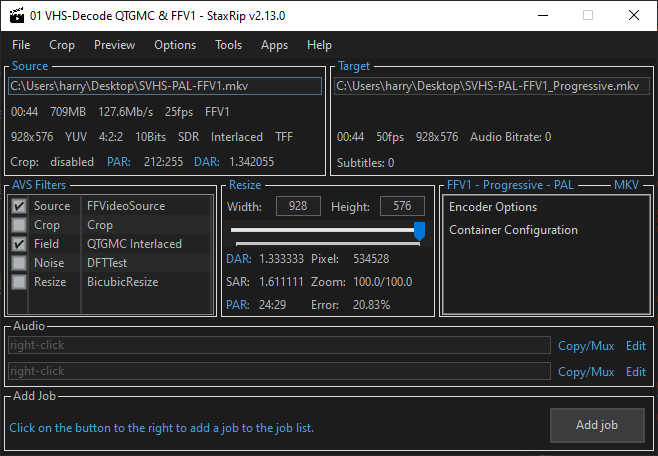

Back Page [Decoding RF Data](RF-Capture-Decoding-Guide.md)

Sub Page's [Digital Tape Guide](Digital-Tape-Guide.md) & [Conventional Digitisation Guide](Conventional-Digitisation-Guide.md)


# Post Processing 


This doc goes over what and how you can post-process your video files.

This is a in-drafting doc not a final workflow doc as the export tool could integrate most common modern workflows.

You will most likely want to start at the [Deinterlacing](Deinterlacing.md) doc which is the first thing you need to know after producing some decoded data.


## Key


!!! NOTE
    Highlights information that users should take into account, even when skimming.

!!! TIP
    Optional information to help a user be more successful.

!!! IMPORTANT
    Crucial information necessary for users to succeed.

!!! WARNING]
    Critical content demanding immediate user attention due to potential risks.

!!! CAUTION
    Negative potential consequences of an action.


# Universal Information 


This guide assumes you are using FFV1 or V210 (10-bit 4:2:2) files that are uncompressed or lossless compressed data, as you never want to in any capture chain go to lossy formats while in post production only when mastering files to lower quality "disro" or distributable copies should that be done for fixed standard systems or limited support systems such as web streaming or optical formats.

!!! IMPORTANT
    Native camera media i.g ENG/Consumer/Sports you will want to use deinterlacing filters like QTGMC, ware as animated or film media you will want to use IVTC filters.

Playback tools 

- [MPC](https://codecguide.com/download_kl.htm)
- [MPV](https://mpv.io/)
- [VLC](https://www.videolan.org/)

Media Server Tools 

- [Jellyfin](https://jellyfin.org/)

Metadata Tools 

- [MediaInfo](https://mediaarea.net/en/MediaInfo)
- [MediaInfo Lite](https://www.majorgeeks.com/files/details/mediainfo_lite.html) (Windows context menu quicktool)
- [DVanalyse](https://mediaarea.net/DVAnalyzer) (Lossless Cut Supports Extracted Timecode Data from this tool)

Editing Tools (NLE - Non-Linear Editors)

- [Davinchi Resolve](https://www.videohelp.com/software/DaVinci-Resolve) (Full Production Editor)
- [Lossless Cut](https://github.com/mifi/lossless-cut/releases) (Basic Quick Editor, Handy for cutting and chapters)


# Windows 


StaxRip, Hybrid, Resolve


# MacOS 


Hybrid, Resolve


# Linux 


Hybrid, Vapoursynth Direct, Resolve


Install Hybrid 

First add the repository to your package manager

    add-apt-repository ppa:djcj/hybrid

Update 

    apt-get update

Install Vapoursynth Editor

    apt-get install vapoursynth-editor


# Index 


Deinterlacing

25i & 29.97i

50p | 59.94p | 24p | 23.97p


# Deinterlacing 


Tools 

Automated:

StaxRip, Hybrid


Manual/Advanced Scripting

AvsPMod


# De-Noising


Topas Labs?

Just No it damages original details, and if you have watched the Stargate SG1 re-mastered Blu-Rays you wonder why people want to get there hands on the original Betacam tapes intended for broadcast use, they ruined the source material, there is a clear line between cleaning up sensor noise and utterly destroying the native look of actual film grain. 


## cvbs-ai-decode


Vurnk11's personal denoiser project, that's fairly effective for NTSC.

[Repo](https://github.com/vrunk11/cvbs-ai-decode) / [Downloads](https://github.com/vrunk11/cvbs-ai-decode/releases)


| 3D decoding from ld-decode | AI Y/C separation + 2d chroma decoding | AI Y/C separation + 3D decoding on luma + 2D chroma decoding |
|----------------------------|----------------------------------------|--------------------------------------------------------------|
| {: style="width:470px"} | {: style="width:470px"} | {: style="width:400px"} |


# DVD & Blu-Ray Mastering 


For direct Blu-Ray & DVD mastering ProRes HQ is recommended and supported directly by Sony DVD Architect.

   tbc-video-export --profile prores_hq example_decoded_media

`ProRes HQ` --> `DVD Architect` --> `Master.iso` --> `dvdisaser Embed ECC Data` --> `Burn to Disc` --> `Verify` --> `Physically Store`


DVD is limited to 6-9mbps, with M-Discs being really your only "high end" disc option left as DataLifePlus uses dyes sadly.

Blu-Ray is limited to 35-40mbps in standard mode, BDXL/UHD goes from 60-80mbps, with DataLifePlus being standard inorganic discs.

We are also working on manual encode DVD/BluRay profiles for both NTSC & PAL regions.

`Sony DVD Architect` is the last easy to get ''it works'' tool for creating compliant Blu-Rays takes ProRes HQ that is properly encoded with FFmpeg directly and does not make any compliancy errors that players or software players made in the last 10 years or so should run into.

We recommend use of genuine `DataLifePlus`/`M-Disc`/`DM-Archive`/`Sony 128GB` optical discs which are archival grade using high quality moulding and in-organic layers you can tell the quality by the perfectly smooth rims of the discs.


## YouTube Upload 


Firstly, the correct way to word a video involving the projects is to state its an `FM RF Capture` that is decoded with `VHS-Decode`, `LD-Decode` and or `HiFi-Decode` etc for example best not to conflate wording this causes no end of issues for new users.

Its always best to separate the hardware archival method from the current software generated video files when representing the projects.

RF capture files are the archive, not the decode results as they can always be improved so never be considered a "final".


*Now that's all out of the way*


To upload anything on YouTube you will need to upscale to the 2160p or "4k" bracket personally I have been using a `2880x2176` scale avoid horrible macro blocking due to forced re-compression.

There is 2 ways to do this `Spline16` or `Spline64` filters in StaxRip/Hybrid

Two FFmpeg scripts for this (copy paste into text document then change extension to .bat)

PAL


``````````````
:: Upscale PAL video to the 4k bracket for YT use.
pushd %~dp0
echo Upscaling to 4k bracket 
ffmpeg.exe -hwaccel auto -i "%~1" -pix_fmt yuv422p10le -vf scale=2880:2176 -c:v ffv1 -aspect 4:3 -vf bdwif auto -c:a copy -color_range tv -color_primaries bt470bg -colorspace bt470bg -color_trc bt709 "%~n1_YT_4k_Scaled.mkv"
echo Done. 
PAUSE
``````````````

NTSC

``````````````
:: Upscale NTSC video to the 4k bracket for YT use.
pushd %~dp0
echo Upscaling to 4k bracket 
ffmpeg.exe -hwaccel auto -i "%~1" -pix_fmt yuv422p10le -vf scale=2880:2176 -c:v ffv1 -aspect 4:3 -vf bdwif auto -c:a copy -color_range tv -color_primaries smpte170m -colorspace smpte170m -color_trc bt709 "%~n1_YT_4k_Scaled.mkv"
echo Done. 
PAUSE
``````````````


## Odysee Upload

!!! NOTE
    Odysee uses direct streaming, no transcode/re-encoding so care has to be taken with client side playback issues, i.g non phone users.

If just doing quick or already synchronised source encodes then you can just use the tbc-video-export web profile in most cases.


You can pick either `x264_web` or `x265_web` depending on how much system/client support of streaming you want.

    tbc-video-export --profile x264_web example_decoded_media


# Tools


Some useful free tools to note for post processing for upscaling and deinterlacing.

[StaxRip](https://github.com/staxrip/staxrip) & [Hybrid](https://www.selur.de/downloads)

*Note Hybrid has MacOS/Linux builds

[DaVinci Resolve](https://www.blackmagicdesign.com/uk/products/davinciresolve) & [Lossless Cut](https://github.com/mifi/lossless-cut)

These provide NLE or Non-Linear-Editing environments for quick cutting or full production mastering.

These give you basic editing to quickly handle uncompressed files across operating systems, and for Windows users an easy FFmpeg/AviSynth/Vapoursynth encoding and 

QTGMC de-interlacing experience, and full colour grading and post production ability.


# StaxRip


[StaxRip](https://github.com/staxrip/staxrip/wiki/) - Your new best media friend


[Pre-Made StaxRip Bundle V0.3 - Windows](https://drive.google.com/open?id=1XE_NHKbvzQrS6TcdVpMhSK83U5xL9Ctr&usp=drive_fs) 


StaxRip has `FFmpeg`, `Avisynth+`, `Vapoursynth` and over 40 tools for muxing, subtitling, and audio timing but one thing it has always provided is a decent visual cropping tool and simple in-cut and out-cut mode for the most basic of chop together editing.

It's not a 1-click encoder it's a 5 click and your ready for production encoder.


## Basic Usage 


Crop - This lets you crop using a mouse wheel or dragging margin (to the pixel level of control)

Cutting - Preview --> Set your playing position --> HOME for the start point and END for stop point.

If you set multiple cut points it will chop the video up into one cut with those scenes. 


## Profiles


There are templates for drag and drop de-interlacing & upscaling. 

Profiles for NTSC & PAL with FFV1/ProRes/V210/V410 progressive & interlaced export are available.

PAL:

{: style="width:500px"}


NTSC FFV1 to ProRes HQ Progressive:

{: style="width:500px"}


### Layout


Top Left - Input file & info about file

Top Right - Output file & info about file (Turns red on render finish)

Bottom Left - Your filters (manipulators for video)

Centre - Resolution & Aspect ratio control

Bottom - First 2 Audio tracks (4 Channels in 2 stereo tracks is all analogue has anyways)


## Always Check and Set Aspect Ratio


If using profiles you only need to flag the aspect ratio correctly before export as this can change sometimes.

For 4:3 this will in most cases be `DAR: 1.363636` / `SAR: 1.25` / `PAR: 12:11` inside StaxRip.

In FFmpeg directly this is `-aspect 1.333333` for 4:3 for example

Breakdown:

`1.333333` = 4:3 (Full-Frame with 4:3 as well)

`1.777777` = 16:9 (Letterbox Crop or Anamorphic)

`1.255555` = 5:4 

`1.555555` = 3:2 (Full Frame with 16:9 Media)


## Deinterlacing - Interlaced Media to Progressive


Today de-interlacing is not a daunting task hard or complex just requires correct handling.

Interlaced video is 2 fields of information that are timed together to make a solid picture to the human eye, ware as progressive video is a solid single frame followed by the next, every single frame is its own picture.

Instead of wasting time like most YouTube videos will do, 90% of the time today you will use QTGMC, most people used to use dedicated scripts, but today script loading software like StaxRip combine multiple tools and have a very simple and easy to edit workflow alongside telling you what's broken when mistakes are made.

Analogue is always top field first or TFF, ware as digital tapes are almost always bottom field first or BFF.

Camcorder Tapes are 25i PAL / 29.97i NTSC ---> Deinterlacing --> 50p PAL / 59.94p NTSC 

TV Recordings & Mastered Media is 24fps telecine'ed to 25i/29.97i.

(60i or 30i etc does not exist for analogue colour formats, it's always 25i PAL 29.97i NTSC)

Movies, Anime etc are 12p and 24p content and can use the IVTC/Anime IVTC filters.

De-interlacing can be done via FFmpeg, StaxRip, Hybrid, or any Vapursynth/Avisynth based workflow.

FFmpeg has: W3DIF, BDWIF, NEDDI


## FFmpeg Based Deinterlacing


Using only FFmpeg filters is considered very limited but a a good exercise in knowing what filters can be used 

For digital video sources bwdif/w3fdif do a wonderful job on HD era content.

`bwdif` stands for "Bob Weaver Deinterlacing Filter"

Motion adaptive deinterlacing based on `yadif` with the use of `w3fdif` and cubic interpolation algorithms.

A high speed modern deinterlacer ideal for digital content.


'mode'
The interlacing mode to adopt. It accepts one of the following values:

'0, send_frame'
Output one frame for each frame.

'1, send_field'
Output one frame for each field.

The default value is send_field.

'parity'
The picture field parity assumed for the input interlaced video. It accepts one of the following values:

'0, tff'
Assume the top field is first.

'1, bff'
Assume the bottom field is first.

'-1, auto'
Enable automatic detection of field parity.

The default value is auto. If the interlacing is unknown or the decoder does not export this information, top field first will be assumed.

'deint'
Specify which frames to deinterlace. Accept one of the following values:

'0, all'
Deinterlace all frames.

'1, interlaced'
Only deinterlace frames marked as interlaced.

The default value is all.


## Chroma Subsampling 


4:2:2 covers the entire colour bandwidth of Composite video, 

`-pix_fmt yuv422p10le` - 10-bit 4:2:2 

`-pix_fmt p010le`      - 10-bit 4:2:0


# Page End

Back Page [Decoding RF Data](RF-Capture-Decoding-Guide.md)

Sub Page's [Digital Tape Guide](Digital-Tape-Guide.md) & [Conventional Digitisation Guide](Conventional-Digitisation-Guide.md)