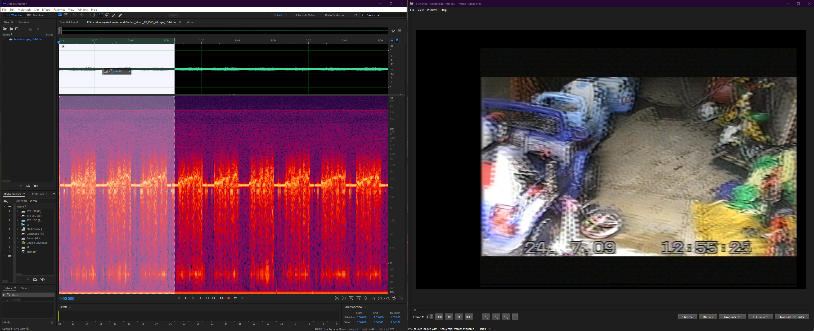

## Contact

Harry Munday (UK - GMT Time) (harry@opcomedia.com)

For questions, live demonstrations or just general support regarding the project I am the best to reach out to for directions.

Hello, I'm the documentation writer, I also direct software workflow developments, I also dabble in hardware side of the family of projects.

Software: LD-Decode, VHS-Decode, CVBS-Decode, HiFi-Decode, TBC-FL2K-Player, CXADC Driver, RTL-SDR HiFi-Decode, TBC-Video-Export.

Hardware: CX-Cards, DomesDay Duplicator, RTL-SDR, MISRC.

For quick keyword lookup and historical development references and links please see my old (semi-deprecated) [Google Doc](https://docs.google.com/document/d/1ZzR3gbW6iSVSNP0qoDIS0ExeRecKehlTQ0EJyx2g568/edit).

### Official Social Media Pages

- [Twitter](https://twitter.com/vhsdecode)
- [Instagram](https://www.instagram.com/vhsdecode/)
- [Odysee](https://odysee.com/@vhs-decode:7)
- [Reddit](https://www.reddit.com/r/vhsdecode/)
- [Discord](https://discord.gg/pVVrrxd)

## Wording and naming 

The order of explaining and demonstrating the projects one should bare this in mind.

3 step process is as follows:

`Hardware FM RF Capture` --> `Decoding FM Audio to PCM` & `Decoding FM Video to CVBS or S-Video .tbc files` 

`Decoding colour from CVBS or S-Video .tbc files` --> `Encoding digital YUV video files`.

## Capture

- `FM RF Capture` 

This should be referred to as the `FM RF Archival Method` as its the most direct and clear definition, as capture should not be conflated or limited by association with any particular hardware product or software processing chain, its just the ingest method for the decode projects, but an archival method in of its self using any [analogue to digital converters](Technical-Breakdowns.md) with enough sampling rate and suitable frequency input range per format.

Its the equivalent of just capturing PCM lossless audio from microphones or baseband tape directly in concept and data formatting is a standard waveform just like audio, you can literally open a FLAC compressed archive and cut individual fields/frames out of a signal and decode it via any standard audio editing tools.

{: style="width:600px"}

> Munday Demo Tape (30sec) selection and decoded fields from the start of the RF capture segment. 

## Processing

- `FM RF Decoding`

This should be accurately referred to as software defined decoding or demodulation, time base correction, baseband processing & colourising data. 

- Software Tape Decoding (FM RF to 4fsc S-Video/CVBS on file `.tbc`)
- Software VBI data reading, Dropout concealment, Audio Alinement
- Software Chroma/Comb Decoding (`.tbc` to YUV Video)
- FFmpeg based video rendering and export tool. (tbc-video-export)

So when stating a workflow of a example using the projects its best to state, RF captured via xyz at its msps rate and bit-depth, Decoded with vhs-decode & hifi-decode with xxx commit version. clear enough to replicate results if archives are provided.

This is a clear way of avoiding conflation as people have done in the past calling vhs-decode / ld-decode the "domesday method" which is wholesale misleading in both scope and accessibility of RF Capture and the current ever evolving state of decoding.

- `Post Processing`

Deinterlaced with QTGMC, encoded with Resolve or FFmpeg etc for example is also nice to be clear on alongside config as a poor config can lead to poor results no matter the initial quality source.

## Who is this document for and why?

This document is being made after a certain poorly written hack a day article, we love media coverage but hate when it promotes out of date information and lacks breaking down the most important aspect, that <u>the initial FM RF capture is the preservation method</u> and is very much so agnostic or universal on practically all analogue tape formats using FM modulation.

We can safely say that analogue capture has hit its end in terms of technological acquisition, and archival, now processing it into images, sound and digital data is what vhs-decode/hifi-decode/cvbs-decode/ld-decode endeavours to provide for those archival captures right now and into the far future with the suit being possible to deploy in a entirely self contained archive today on Windows for example, but with Linux based development and MacOS support.

It should be clearly stated that this is not just a single project, in fact it's a highly accessible media-preserving toolset with a family of projects and developers, tinkers & enthusiasts working together to improve archival and preservation of analogue media in the digital domain, entirely replacing lower quality, old and cost inflated methods, allowing anyone with standard computing hardware to get better then restoration house results at home.

The RF Capture projects & hardware in order of development is CXADC (Driver for PCI/PCIe 1x CX Cards) & DomesDayDuplicator (USB 3.0 based solution), The [RTLSDR](RTLSDR.md) has also been added for use in HiFi Audio capture and Realtime decoding via [GNU Radio](https://www.gnuradio.org/) scripts.

The Decoding projects and tools are in order of development [LD-Decode](https://github.com/happycube/ld-decode/wiki), [VHS-Decode](https://github.com/oyvindln/vhs-decode#readme), [CVBS-Decode](https://github.com/oyvindln/wiki/CVBS-Composite-Decode), [HiFi-Decode](003-Audio.md#hifi-decode-hifi-rf-into-audio-installation-and-usage), [TBC-To-Analogue-FL2K](TBC-to-Analogue.md), [RTLSDR-Decode](RTLSDR.md), [tbc-video-export](https://github.com/JuniorIsAJitterbug/tbc-video-export).

The projects are all under the DomesDay86 discord community umbrella with members sharing code, sample data and generally assisting and advancing each others work, with core members and developers in the United Kingdom, United States, Scandinavia & Mainland Europe.

## Tape Decoding & HiFi Decoding 

To see more expanded diagram examples see the [The Visual Diagrams Page](Diagram-Visuals.md).

{: style="width:800px"}

After FM RF capture analogue media can then be decoded to the Time Base Corrected format this uses [4fsc sampling](Signal-Sampling.md) in non-square pixels, this provides the full signal area, covering all possible information in the visible and non-visible areas, it also allows backwards support for playback to analogue systems as media see [Analogue Playback](TBC-to-Analogue.md) for more information.

Unlike conventional capture, Closed Captions, Teletext, VITC timecode, VITS test signals and more can all be recovered and even re-created digitally.

These TBC files can be played and inspected with `ld-analyse` (GNU radio too!), and easily 1 command encoded into standard colour or black & white video files in codec formats such as FFV1 for further use or direct archival.

### The Main Benefits

- Source Signal Archival (Tape FM information is preserved)

- Smaller Archives Compared to lossless V210 & JPEG2000 (FLAC FM RF Data)

- Full-Frame (4fsc) Composite & S-Video in a file format (full baseband processing in software)

- Software Time Base Correction

### Software extraction of Vertical Blanking Interval (VBI) data such as:

- [Closed Captions](NTSC-Closed-Captioning.md#FIXME) (CC) Subtitling found on broadcast airings and NTSC/PAL home TV/Movie releases.

- [Teletext](PAL-Teletext-Subtitles.md#FIXME) - UK/European Subtitles & Information Boards

- [VITC](VITC-SMPTE-Timecode.md) -  Vertical Interval TimeCode, widely found in broadcast and SVHS tapes.

- [VITS](VITS-Vertical-Interval-Test-Signals.md) - Vertical Interval Test Signals, widely found in broadcast.

### Is this new technology?

Nope, the analogue to digital converter in the DomesDayDuplicator and the CX Cards are both using hardware from 2000~2002 era, but this is the first fully open-source workflow that has a built up a hardware and software tool chain anyone can deploy and that is truly future proofed due to being entirely open-sourced using universal raw data and standard waveform data formats. 

Now anyone who is well informed will know Cube-Tec have there own version of RF capture called "RF Direct Transfer" under the "QUADRIGA" line but all processing is via a "black-box" solution using an FPGA based system, aimed primary at broadcast stable formats like BetaCam/BetaCam SP, witch vhs-decode has the ability to support, however what there solution fails to offer is an open source method to use the RF data captured, nor a universal decoded file format as they used DPX image sequence data rather then generic GREY16 data that can be piped to a DAC to produce CVBS/S-Video playback.

### The RF Capture Hardware

We have three standardised methods.

{: style="width:600px"}

>CX Card is propped up on a M.2 to PCIe 8x riser, this does not have any significance, but it can be used on the Pi5.

----

[DomesDayDuplicator (Left)](https://github.com/harrypm/DomesdayDuplicator) which is a plug and play USB 3.0 capture device that works on Windows/Linux/MacOS, with original fabrication & flashing docs having been re-made so that anyone can order and build at home without any reading past 1 page.

[CX Card (Right)](https://github.com/happycube/cxadc-linux3#where-to-find-current-pcie-1x-cx2388x-cards--notes) a PCIe 1x computer add-in card, PCIe version was standardised due to noise performance and ease of modification.

[Analogue Devices AD8367 (Green PCB)](CX-Cards.md#external-amplification) a basic RMS amplifier that allows you to replace the on-board gain stage of the CX Card or extend cabling.

------

[Clockgen Mod](Clockgen-Mod.md) Allows for multiple CX Cards to sample synchronised RF off Video/HiFi alongside linear or hifi baseband audio outputs from decks via off shelf ADC boards. 

{: style="width:650px"}{: style="width:280px"}

### Media Examples

RAW & Processed data can be directly obtained for viewing or presenting the projects [Here](Submitting-&-Downloading-Sample-Data.md).

!!! NOTE
    While this media is publicly available, we respectfully ask for it to be correctly attributed to the contributors of the community as this segment of the project is 100% community member driven.

There are a few people from the community/discord who have published their media online and their channels are listed below the reason why Odyssey is liked is due to zero processing or transcoding of media files witch makes it ideal compared to YouTube witch requires heavy upscaling or black image data will be utterly crushed by compression artefacts and SD video is quite unusable.

[Official Tape/CVBS Odysee](https://odysee.com/@vhs-decode:7) - Harry Munday

[The Rewinding](https://odysee.com/@therewinding:4) - MrCarter

[The Video Dump Channel](https://www.youtube.com/@videodumpchannel) - Jitterbug

[Zcooger](https://odysee.com/@Zcooger:1) - Zcooger
