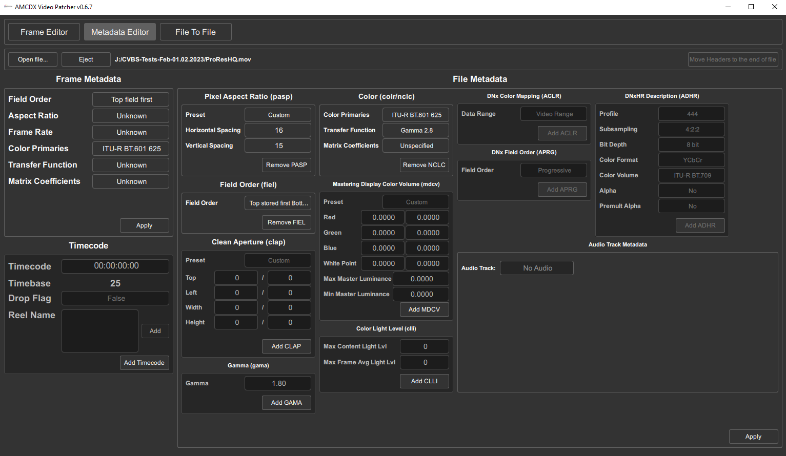
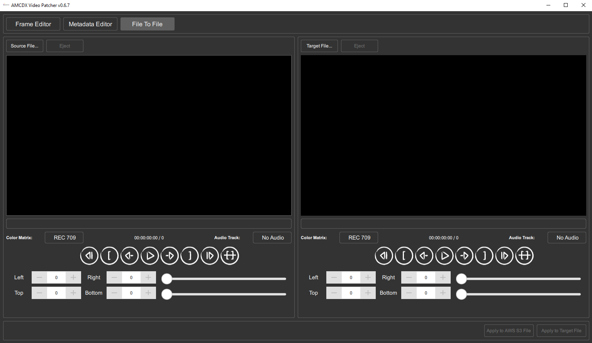
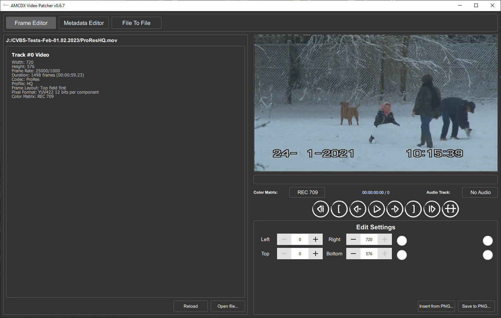

## A Definitive FFmpeg Guide By Harry Munday

Do you hate FFmpeg?

Life?

Lazy Software Developers?

Well I cant help you with that, but I can fix your ProRes encodes before you lose your mind or a job in some cases.

# What is a Codec & Container?

Just watch this YouTube video:

https://www.youtube.com/watch?v=-4NXxY4maYc

# What is ProRes?

An capture format for cameras (Mostly external recorders Atomos etc as it requires a licence)

Used widely in editing and professional distribution of masters or proxies of raw media.

It goes from lossy compressed to visually lossless compressed to 4444XQ 12-bit / ProRes RAW / ProRes RAW HQ

ProRes Raw and 12-bit modes for 4444 is not supported by FFmpeg for encoding as of writing this - July 2023 

## Tools You Need

[Media Info](https://mediaarea.net/en/MediaInfo)

[AMCDX Video Patcher](https://mogurenko.com/2021/01/29/amcdx-video-patcher-v0-6-7/) / [Archive Download](https://drive.google.com/open?id=1oZbpRDxrBZlvx-nl1FgK722InqhyeLKC)

[FFmpeg](https://ffmpeg.org/) (Best Installed as path by apt get / )

[StaxRip](https://github.com/staxrip/staxrip) Which is a [Avisynth](http://avisynth.nl/index.php/Main_Page) / [Vapoursynth](https://www.vapoursynth.com/) / [FFmpeg](https://ffmpeg.org/) Graphical Scripting Tool.

## Getting FFmpeg

You want it installed via path (i.e system wide on any terminal, also makes scripts just work)

- Linux `apt get ffmpeg`
- MacOS `brew install ffmpeg`
- Windows `choco install ffmpeg`

Brew on MacOS [follow your applicable install guide here](https://brew.sh/)

How to install choco on windows?

Open a PowerShell Terminal as administrator.

Install Choco (chocolatey package manager)

    Set-ExecutionPolicy Bypass -Scope Process -Force; [System.Net.ServicePointManager]::SecurityProtocol = [System.Net.ServicePointManager]::SecurityProtocol -bor 3072; iex ((New-Object System.Net.WebClient).DownloadString('https://community.chocolatey.org/install.ps1'))

## FFMPEG ProRes HQ Encoding (Interlaced)

*Premade commands to save time and suffering!*

This list includes 2 command sets, passthrough witch will use whatever input resolution the source clip is, and affixed scaled output for use with standard playback equipment or standard definition mastering.

## Rec 709 - HDTV (Passthough)

    ffmpeg -i input.mkv -vf setfield=tff -flags +ilme+ildct -c:v prores -profile:v 3 -vendor apl0 -bits_per_mb 8000 -quant_mat hq -mbs_per_slice 8 -pixel_format yuv422p10lep -vendor apl0 -bits_per_mb 8000 -color_range tv -color_primaries bt709 -color_trc bt709 -colorspace bt709 -vf setdar=4/3,setfield=tff output.mov

## bt470bg - PAL (Passthough)

    ffmpeg -i input.mkv -vf setfield=tff -flags +ilme+ildct -c:v prores -profile:v 3 -vendor apl0 -bits_per_mb 8000 -quant_mat hq -mbs_per_slice 8 -pix_fmt yuv422p10le -color_range tv -color_primaries bt470bg -colorspace bt470bg -vf setdar=4/3,setfield=tff output.mov

## smpte170m - NTSC (Passthough)

    ffmpeg -i input.mkv -vf setfield=tff -flags +ilme+ildct -c:v prores -profile:v 3 -vendor apl0 -bits_per_mb 8000 -quant_mat hq -mbs_per_slice 8 -pix_fmt yuv422p10le -color_range tv -color_primaries smpte170m -color_trc smpte170m -colorspace smpte170m -vf setdar=4/3,setfield=tff output.mov

## bt470bg PAL to Rec 709 HDTV (Passthough)

    ffmpeg -i input.mkv -vf setfield=tff -flags +ilme+ildct -c:v prores -profile:v 3 -vendor apl0 -bits_per_mb 8000 -quant_mat hq -mbs_per_slice 8 -pix_fmt yuv422p10le -color_range tv -color_primaries bt709 -color_trc bt709 -colorspace bt709 -vf scale=in_range=tv:out_range=tv:in_color_matrix=bt470bg:out_color_matrix=bt709 setdar=4/3,setfield=tff output.mov

## smpte170m NTSC to Rec 709 HDTV (Passthough)

    ffmpeg -i input.mkv -vf setfield=tff -flags +ilme+ildct -c:v prores -profile:v 3 -vendor apl0 -bits_per_mb 8000 -quant_mat hq -mbs_per_slice 8 -pix_fmt yuv422p10le -color_range tv -color_primaries bt709 -color_trc bt709 -colorspace bt709 -vf scale=in_range=tv:out_range=tv:in_color_matrix=smpte170m:out_color_matrix=bt709,setdar=4/3,setfield=tff output.mov

# Equipment SD Standard

## bt470bg - PAL (720x576)

    ffmpeg -i input.mkv -vf setfield=tff -flags +ilme+ildct -c:v prores -profile:v 3 -vendor apl0 -bits_per_mb 8000 -quant_mat hq -mbs_per_slice 8 -pix_fmt yuv422p10le -color_range tv -color_primaries bt470bg -colorspace bt470bg -vf setdar=4/3,setfield=tff,scale=720:576 output.mov

## smpte170m - NTSC (720x480)

    ffmpeg -i input.mkv -vf setfield=tff -flags +ilme+ildct -c:v prores -profile:v 3 -vendor apl0 -bits_per_mb 8000 -quant_mat hq -mbs_per_slice 8 -pix_fmt yuv422p10le -color_range tv -color_primaries smpte170m -color_trc smpte170m -colorspace smpte170m -vf setdar=4/3,setfield=tff,scale=720:576 output.mov

## bt470bg PAL to Rec 709 HDTV (720x576)

    ffmpeg -i input.mkv -vf setfield=tff -flags +ilme+ildct -c:v prores -profile:v 3 -vendor apl0 -bits_per_mb 8000 -quant_mat hq -mbs_per_slice 8 -pix_fmt yuv422p10le -color_range tv -color_primaries bt709 -color_trc bt470bg -colorspace bt709 -vf scale=in_range=tv:out_range=tv:in_color_matrix=bt470bg:out_color_matrix=bt709:720x576,setdar=4/3,setfield=tff output.mov

## smpte170m NTSC to Rec 709 HDTV (720x480)

    ffmpeg -i input.mkv -vf setfield=tff -flags +ilme+ildct -c:v prores -profile:v 3 -vendor apl0 -bits_per_mb 8000 -quant_mat hq -mbs_per_slice 8 -pix_fmt yuv422p10le -color_range tv -color_primaries bt709 -color_trc smpte170m -colorspace bt709 -vf scale=in_range=tv:out_range=tv:in_color_matrix=smpte170m:out_color_matrix=bt709:720x480,setdar=4/3,setfield=tff output.mov

# ProRes HQ StaxRip De-intelacing

Use StaxRip or AviSynth Directly.

Source Filter: FFVideoSource

Field Filter: Deinterlace --> QTGMC --> Placebo

Then we edit it to Sharpness 0.3 (and you can manually override threads if you have a high core chip i.e 16-64 cores etc)

Click Edit Code:

    QTGMC(preset="Placebo", InputType=0, sourceMatch=3, Lossless=2, sharpness=0.3, tr2=2, ediThreads=8)

Profile: ProRes

Container: QuickTime `.mov` / Material Exchange Format `.mxf`

Encoder Options:

    -vendor apl0 -bits_per_mb 8000 -quant_mat hq -mbs_per_slice 8 -pixel_format yuv422p10lep -vendor apl0 -bits_per_mb 8000 -color_range tv -color_primaries bt709 -color_trc bt709 -colorspace bt709

## Output Container can be the following

Generally with ProRes its recommended to stick to `.mov` as its the standard tools expect. 

* `.mov` (QuickTime)
* `.mxf` (Material eXchange Format)
* `.mkv` (Matroska)

However when archiving files the `.mkv` container is a better and much safer way to store files.

## Profiles can be the following

### 10-bit 4:2:2 Profiles

`-profile:v 0 -pixel_format yuv422p10lep` - ProRes Proxy

`-profile:v 1 -pixel_format yuv422p10lep` - ProRes LT

`-profile:v 2 -pixel_format yuv422p10lep` - ProRes 422 (Standard)

`-profile:v 3 -pixel_format yuv422p10lep` - ProRes HQ

### 10-bit 4:4:4 Profiles

`-profile:v 4 -pix_fmt yuva444p10le` ProRes 4444 (10-bit)

`-profile:v 5 -pix_fmt yuva444p10le` ProRes 4444QX (10-bit)

### 12-bit 4:4:4 Profiles

(Well when FFmpeg finally pushes a fix for ProRes 12-bit...)

`-profile:v 4 -pix_fmt yuva444p12le` ProRes 4444 (12-bit)

`-profile:v 5 -pix_fmt yuva444p12le` ProRes 4444QX (12-bit)

## Flagging interlaced `field store method` properly.

FFmpeg supports interlacing flagging but is very clunky and command orders need to be right or it just ignores things, after 2 weeks this is what worked.

4:3 Media

`ffmpeg -i input.mkv -vf setfield=tff -flags +ilme+ildct -c:v prores` Add your Profile and other arguments  `-vf setdar=4/3,setfield=tff output.mov`

16:9 Media

`ffmpeg -i input.mkv -vf setfield=tff -flags +ilme+ildct -c:v prores` Add your Profile and other arguments here   `-vf setdar=16/9,setfield=tff output.mov`

## ProRes Specific Arguments

The FourCC codec IDs for the different Apple ProRes variants:

| Codec         | Mode                     | FourCC big-endian | FourCC little-endian |
|---------------|--------------------------|-------------------|----------------------|
| Apple ProRes  | 422 High Quality         | apch              | hcpa                 |
| Apple ProRes  | 422 Standard Definition  | apcn              | ncpa                 |
| Apple ProRes  | 422 LT                   | apcs              | scpa                 |
| Apple ProRes  | 422 Proxy                | apco              | ocpa                 |
| Apple ProRes  | 4444                     | ap4h              | h4pa                 |
| Apple ProRes  | 4444XQ                   | ap4x              | x4pa                 |

* Apple ProRes 422 High Quality:        `apch` (`hcpa` in little-endian)
* Apple ProRes 422 Standard Definition: `apcn` (`ncpa` in little-endian)
* Apple ProRes 422 LT:                  `apcs` (`scpa` in little-endian)
* Apple ProRes 422 Proxy:               `apco` (`ocpa` in little-endian)
* Apple ProRes 4444:                    `ap4h` (`h4pa` in little-endian)
* Apple ProRes 4444XQ:                  `ap4x` (`x4pa` in little-endian)

## `-vf setdar=K:M`

Sets DAR or Aspect Ratio K:M can be 4:3 or 16:9

## `-r <integer>`

Sets frame rate value, 24/25/30/29.97/50/59.97/60 etc

## `-bits_per_mb <integer>`

Bitrate control defines how many bits to allot for coding one macroblock or MB. Different profiles use between 200 and 2400 bits per macroblock, the maximum is 8000.

The expected bitrate is capped by this math!

(frame_width/16) * (frame_height/16) * fps * bits_per_mb

## `-mbs_per_slice <integer>`

Number of macroblocks in each slice (1-8); the default value (8) should be good in almost all situations.

## `-vendor <string>`

Override the 4-byte vendor ID A custom vendor ID like the following:

`apl0` Apple Encoder

`atms` ATMOS Recorders

`adb0` Adobe Suite

`fmpg` FFmpeg

## `-alpha_bits <integer>`

Specify number of bits for alpha component. Possible values are 0, 8 and 16. Use 0 to disable alpha plane coding.

## `-quant_mat <integer>`

Selects quantization matrix. If this option is set to auto, the matrix matching the profile will be picked. If not set, the matrix providing the highest quality, default, will be picked.

auto / default / proxy / lt / standard / hq

## `-codec:v prores_videotoolbox`

Apple Silicone Encoder, now in the 2020s you can encode compliant ProRes on M1 and newer ARM based macs with FFmpeg.

`-codec:v prores_videotoolbox` enables the hardware encoder

`-profile:v hq` etc 

# Clean Aperture, Colr Data Atom & Timecode

This applies to anything using the QuickTime MOV Container, MP4, and MXF Material eXchange Format.

This has been the biggest pain in the ass during the development of this book then I had the solution handed to me by Wrapscallion (Ty) on the DD86 discord so all the credit in the world for sharing this tool thats practically lost to low google SEO scores.

[AMCDX Video Patcher](https://mogurenko.com/2021/01/29/amcdx-video-patcher-v0-6-7/) / [Archive Download](https://drive.google.com/open?id=1oZbpRDxrBZlvx-nl1FgK722InqhyeLKC) is a wonderful little tool that visually allows you to click your issues away with things like clean aperture or clap settings and full colour flagging.

## `qtff-parameter-editor` [Tool Link](https://github.com/bbc/qtff-parameter-editor)

This tool provided by the BBC allows for the editing and correction of ProRes files in the .MOV container mainly the colr Atom allowing you to have correct colour parameters for your media type.

Several post-production tools and utilities are now aware of the colour and transfer function parameters specified in [ITU-R BT.2100-0](https://www.itu.int/dms_pubrec/itu-r/rec/bt/R-REC-BT.2100-0-201607-I!!PDF-E.pdf). However, some tools are unable to correctly signal the correct parameters, and may result in a file with the incorrect video parameters. Subsequent tools or displays may then look at these video parameters and render the image incorrectly, for instance, video that this signalled as [ITU-R BT.709](https://www.itu.int/dms_pubrec/itu-r/rec/bt/R-REC-BT.709-6-201506-I!!PDF-E.pdf) colour primaries and in fact is [ITU-R BT.2020](https://www.itu.int/dms_pubrec/itu-r/rec/bt/R-REC-BT.2020-2-201510-I!!PDF-E.pdf) colour primary and then displayed on a monitor will look desaturated when the display is interpreting the signalling contained within the file. Incorrect signalling may also result in unnecessary and incorrect transcoding between colour spaces and transfer functions.

This document introduces a series of tools to allow editing of the colour primaries, colour matrix and transfer function characteristics in a [QuickTime File Format](https://developer.apple.com/library/content/documentation/QuickTime/QTFF/QTFFPreface/qtffPreface.html) (MOV) using a [ProRes](https://support.apple.com/en-gb/HT202410) video codec.

# QuickTime File Format (qtff)

The [QuickTime File Format](https://developer.apple.com/library/content/documentation/QuickTime/QTFF/QTFFPreface/qtffPreface.html) (qtff) is a container file supporting a wide range of video, audio and other data formats. The format itself is object-orientated, consisting of a collection of objects that can be parsed and expanded.

The basic data unit is known as an Atom. The Atom that defines the relevant information required to define the colour primaries, colour matrix and transfer function are found in the "colr" data Atom, which is located inside the [Video Media](https://developer.apple.com/library/content/documentation/QuickTime/QTFF/QTFFChap3/qtff3.html#//apple_ref/doc/uid/TP40000939-CH205-74522) Atom. The structure of the "colr" Atom is as follows:

| Colour Atom                    | Bytes  |
|--------------------------------|--------|
| Atom Size                      | 4      |
| Type = "colr"                  | 4      |
| Colour Parameter type = "nclc" | 4      |
| Primary index = 1              | 2      |
| Transfer Function index = 1    | 2      |
| Colour Matrix index = 1        | 2      |

# SMPTE RDD 36:2015 - Apple ProRes Bitstream Syntax and Decoding Process

[SMPTE RDD 36](http://ieeexplore.ieee.org/document/7438722/) describes the syntax and decoding process for the [Apple ProRes](https://support.apple.com/en-gb/HT202410) video compression scheme. It is an intra-frame codec, specifically designed for high-quality workflows and supports a variety of video formats, and is common usage.

In addition to the colour information carried within the Colour Atom, information regarding the transfer function, colour matrix and primaries are also stored within the frame header information of the ProRes elementary stream, alongside other parameters, such as frame rate, spatial resolution and chroma format. This header is repeated throughout the bitstream. Full details of the header layout can be found in the [SMPTE specification](http://ieeexplore.ieee.org/document/7438722/).

To avoid any ambiguity in any workflows, it is imperative that the the information in the header for the ProRes stream match that of the qtff colr Atom.

# Video Characteristics

The colour primaries can be selected from the list:

| No.   | Colour Primaries  |
|-------|-------------------|
| 0     | Reserved          |
| 1     | ITU-R BT.709      |
| 2     | Unspecified       |
| 3     | Reserved          |
| 4     | ITU-R BT.470M     |
| 5     | ITU-R BT.470BG    |
| 6     | SMPTE 170M        |
| 7     | SMPTE 240M        |
| 8     | FILM              |
| 9     | ITU-R BT.2020     |
| 10    | SMPTE ST 428-1    |
| 11    | DCI P3            |
| 12    | P3 D65            |

The transfer function can be selected from the list:

| No.   | Transfer Function                   |
|-------|-------------------------------------|
| 0     | Reserved                            |
| 1     | ITU-R BT.709                        |
| 2     | Unspecified                         |
| 3     | Reserved                            |
| 4     | Gamma 2.2 curve                     |
| 5     | Gamma 2.8 curve                     |
| 6     | SMPTE 170M                          |
| 7     | SMPTE 240M                          |
| 8     | Linear                              |
| 9     | Log                                 |
| 10    | Log Sqrt                            |
| 11    | IEC 61966-2-4                       |
| 12    | ITU-R BT.1361 Extended Colour Gamut |
| 13    | IEC 61966-2-1                       |
| 14    | ITU-R BT.2020 10 bit                |
| 15    | ITU-R BT.2020 12 bit                |
| 16    | SMPTE ST 2084 (PQ)                  |
| 17    | SMPTE ST 428-1                      |
| 18    | ARIB STD-B67 (HLG)                  |

The colour matrix can be selected from the list:

| No.  | Colour Matrix                   |
|------|---------------------------------|
| 0    | GBR                             |
| 1    | BT709                           |
| 2    | Unspecified                     |
| 3    | Reserved                        |
| 4    | FCC                             |
| 5    | BT470BG                         |
| 6    | SMPTE 170M                      |
| 7    | SMPTE 240M                      |
| 8    | YCOCG                           |
| 9    | BT2020 Non-constant Luminance   |
| 10   | BT2020 Constant Luminance       |

## [Apple Reference](https://support.apple.com/en-us/HT202410) 

Published Date: April 09, 2018

About Apple ProRes

Apple ProRes codecs provide an unparalleled combination of multistream, real-time editing performance, impressive image quality, and reduced storage rates. Apple ProRes codecs take full advantage of multicore processing and feature fast, reduced-resolution decoding modes.

All Apple ProRes codecs support all frame sizes (including SD, HD, 2K, 4K, and 5K) at full resolution. The data rates vary based on codec type, image content, frame size, and frame rate. Apple ProRes includes the following formats.

To bring the same performance, quality, and ease of use introduced by Apple ProRes to raw media, use Apple ProRes RAW. Learn more about ProRes RAW.

### Apple ProRes 4444 XQ*

Apple ProRes 4444 XQ is the highest-quality version of Apple ProRes for 4:4:4:4 image sources (including alpha channels). This format has a very high data rate to preserve the detail in high-dynamic-range imagery generated by today’s highest-quality digital image sensors. Apple ProRes 4444 XQ preserves dynamic ranges several times greater than the dynamic range of Rec. 709 imagery. This holds true even against the rigors of extreme visual effects processing in which tone-scale blacks or highlights are stretched significantly. Like standard Apple ProRes 4444, this codec supports up to 12 bits per image channel and up to 16 bits for the alpha channel. Apple ProRes 4444 XQ features a target data rate of approximately 500 Mbps for 4:4:4 sources at 1920x1080 and 29.97 fps.

ProRes 4444 XQ is supported on OS X Mountain Lion v10.8 or later.

### Apple ProRes 4444*
 

Apple ProRes 4444 is an extremely high-quality version of Apple ProRes for 4:4:4:4 image sources (including alpha channels). This codec features full-resolution, mastering-quality 4:4:4:4 RGBA color, and visual fidelity that is perceptually indistinguishable from the original material. Apple ProRes 4444 is a high-quality solution for storing and exchanging motion graphics and composites, with excellent multigeneration performance and a mathematically lossless alpha channel of up to 16 bits. This codec features a remarkably low data rate compared to uncompressed 4:4:4 HD. It has a target data rate of approximately 330 Mbps for 4:4:4 sources at 1920x1080 and 29.97 fps. It also offers direct encoding of and decoding to both RGB and Y’CBCR pixel formats.

### Apple ProRes 422 HQ

Apple ProRes 422 HQ is a higher-data-rate version of Apple ProRes 422 that preserves visual quality at the same high level as Apple ProRes 4444 but for 4:2:2 image sources. With widespread adoption across the video post-production industry, Apple ProRes 422 HQ offers visually lossless preservation of the highest-quality professional HD video that a single-link HD-SDI signal can carry. This codec supports full-width, 4:2:2 video sources at 10-bit pixel depths, while remaining visually lossless through many generations of decoding and reencoding. The target data rate is approximately 220 Mbps at 1920x1080 and 29.97 fps.

### Apple ProRes 422

Apple ProRes 422 is a high-quality compressed codec offering nearly all the benefits of Apple ProRes 422 HQ, but at 66 percent of the data rate for even better multistream, real-time editing performance. The target data rate is approximately 147 Mbps at 1920x1080 and 29.97 fps.

### Apple ProRes 422 LT

Apple ProRes 422 LT is a more highly compressed codec than Apple ProRes 422, with roughly 70 percent of the data rate and 30 percent smaller file sizes. This codec is perfect for environments where storage capacity and data rate are at a premium. The target data rate is approximately 102 Mbps at 1920x1080 and 29.97 fps.

### Apple ProRes 422 Proxy

Apple ProRes 422 Proxy is an even more highly compressed codec than Apple ProRes 422 LT, intended for use in offline workflows that require low data rates but full-resolution video. The target data rate is approximately 45 Mbps at 1920x1080 and 29.97 fps.

------------

* Apple ProRes 4444 and Apple ProRes 4444 XQ are ideal for the exchange of motion graphics media because they are virtually lossless. They are also the only Apple ProRes codecs that support alpha channels.

## Refrances:

https://support.apple.com/en-us/HT202410

https://forum.videohelp.com/threads/392009-ffmpeg-creating-prores-in-MOV-color-matrix-flagging

https://ottverse.com/ffmpeg-convert-to-apple-prores-422-4444-hq/

https://stackoverflow.com/questions/32922226/extract-every-audio-and-subtitles-from-a-video-with-ffmpeg

https://video.stackexchange.com/questions/16840/ffmpeg-explicitly-tag-h-264-as-bt-601-rather-than-leaving-unspecified

https://forum.doom9.org/showthread.php?t=133982

https://kdenlive.org/en/project/color-hell-ffmpeg-transcoding-and-preserving-bt-601/

https://github.com/bbc/qtff-parameter-editor

https://bavc.org/converting-ffv1mkv-v210mov

https://loc.gov/preservation/digital/formats/fdd/fdd000527.shtml

https://loc.gov/preservation/digital/formats/fdd/fdd000528.shtml

https://wiki.multimedia.cx/index.php?title=Apple_ProRes#ProRes_422_Standard_Definition_.2F_High_Quality_codec

-----

Clean Aperture (CLAP) & side data (atom)

Lazy FFmpeg developers did not implement this..........

<https://www.mail-archive.com/ffmpeg-devel@ffmpeg.org/msg101943.html>

<https://patchwork.ffmpeg.org/project/ffmpeg/patch/20200427042753.166716-1-neil.birkbeck@gmail.com/#54960>

<https://trac.ffmpeg.org/ticket/7437>

https://ffmpeg.org/

https://mogurenko.com/2021/01/29/amcdx-video-patcher-v0-6-7/#comments
