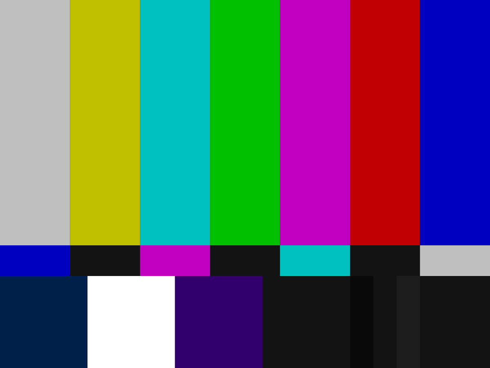

Previous Page [RF Capture Guide](RF-Capture-Guide.md)

Next Page [Exporting To Video Files](Video-Exporting-&-Gen-Chroma-Scripts.md)

# Welcome to the 21st, its the future.

Software decoding simply is just doing what was done on dedicated components, then on dedicated IC's and finally on FPGAs and all in one IC's, its not magic and its not black box hardware either its entirely software emulating the ability's of hardware with an order of magnitude more flexibility.

Do you need to know about programming? 

***No.***

Do you need to know how to use basic systems on a computer.

**Yes.**

Do you need to have a basic understanding of a VCR does and what a TBC does?

**Yes.**

**It makes life easier** and decoding a thoughtless copy-paste clean, new tape, clean, hit enter and decode workflow after hardware hook-up.

# What does decoding do?

[Technical Doc](Technical-Breakdowns.md)

For FM Video this creates a 4fsc sampled Composite `.tbc` or S-Video `.tbc` & `_chroma.tbc` pair ready for inspection inside ld-analyse during and after decoding, this is then chroma-decoded to standard video files in the Next Page [TBC-Video-Export Guide](TBC-to-Video-Export-Guide.md).

ld-decode produces only a Composite `.tbc` and `.pcm` for stereo/mono analogue audio, `.efm` for digital data, and digital audio data is decoded to `.dts` or `.ac3` with `ld-efm-decoder`.

For FM Audio (HiFi-Decode & RTLSDR)

HiFi-Decode Produces a PCM sampled audio stream 2:1 compressed with FLAC so a `.flac` audio file ready for playback or muxing into your final video files (44.1/48/92/192khz selectable output modes)

RTLSDR-Decode is a real-time GNURadio based decoder/encode script that creates a 8msps `.u8` RF file, a 48khz `.flac` audio file and decodes the signal live with a 1-3sec delay.

# Running the decoders 

There are 4 decoders are bundled inside vhs-decode repository and binary versions.

The prefix to run these decoders are as such:

## Linux/MacOS

`vhs-decode` / `ld-decode` / `cvbs-decode` / `hifi-decode`

`cd vhs-decode` - Enter the directory

Call the decoder with `vhs-decode` or `./vhs-decode` to run locally within the vhs-decode folder for example.

Example:

`vhs-decode --debug -p -t 8 --tf vhs --cxadc --recheck_phase my-tape.u8 my-tape-decoded`

As the decoders and scripts are normally installed to path you can decode files from and to any ware on the system.

## Windows

`decode.exe vhs` / `decode.exe ld` / `decode.exe cvbs` / `decode.exe hifi`

Followed by universal arguments you can read the [Full Command List](Command-List.md) for there use and effects.

Example:

`decode.exe vhs --tape_format VHS --system pal --threads 8 -Turkish_Video_AG5620_2023-12-06_02-28-09.lds Turkish_Video_AG5620_2023-12-06_02-28-09`

{: style="width:800px"}

VHS is the assumed format by default, and 40msps the DdD rate is assumed by default, but these defaults should never be taken for granted as its bad habit when dealing with other formats, but are helpful for short hand quick use.

## Mandatory Settings

- TV System i.g `--system pal`, `--system ntsc`, `--system palm`, `--system ntscj` (PAL-M - Brazil / NTSC-J - Japan)

- Tape format i.g  `--tape_format VHS` or `SVHS`, `UMATIC`, `UMATIC_HI`, `Hi8`, `Video8`, `BETAMAX`, `BETAMAX_HIFI`, `EIAJ`, `TYPEC`, `VCR`.

- Input Sample Rate `-f` or `--frequency` this is the msps value of your RF capture file. (40msps is the assumed/internal rate)

- Input file & Out file Name.

### Basic Command line Control:

<kbd>Ctrl</kbd>+<kbd>C</kbd> Will kill the current process, use this to stop the decode manually.

Press <kbd>Ctrl</kbd>+<kbd>C</kbd> to copy then <kbd>Ctrl</kbd>+<kbd>P</kbd> to past the command use <kbd><</kbd>+<kbd>></kbd> to move edit position on the command line to edit the name or command and <kbd>Enter</kbd> to run the command.

## Basic Decoding Command Examples

There is 2 ways to write commands, long hand and short hand such as `--tape_format` & `--tf` or `-f` & `--frequency` each version is documented together in the [command list](Command-List.md) master doc.

`--debug` for a slight speed hit gives more logging and better error reporting.

## VHS-Decode:

Example Long:  `vhs-decode --debug --tape_format vhs --system pal --cxadc --threads 8 --recheck_phase my-tape.u8 my-tape-decoded`

Example Short: `decode.exe vhs --debug -p -t 8 --tf vhs --cxadc --recheck_phase my-tape.u8 my-tape-decoded`

## LD-Decode:

Note: NTSC AC3 Audio discs need `--AC3` enabled to decode that data to a `.efm`.

`ld-process-efm` also needs a dedicated flag but for `DTS audio`, AC3 is automatic.

Example Long:  `ld-decode --system pal --threads 8 DdD_8.5_Gain.ldf First_Decoded_LD`

Example Short: `decode.exe ld -p -t 8 DdD_8.5_Gain.ldf First_Decoded_LD`

## CVBS-Decode:

[CVBS-Decode Wiki Page](https://github.com/oyvindln/vhs-decode/wiki/hifi-decode).

CVBS-Decode, decodes raw RF captured composite signals, you capture the normal composite video signal out of a device, in raw RF values then save it to file.

`-A` - Automatic is mandatory for decoding ot work currently.

Example Long:  `cvbs-decode --debug --threads 8 --system pal -A --cxadc CX_Blue_Level_0db_6db_off_CXADC.u8 CX_Blue_Level_0db_6db_off_CXADC`

Example Short: `decode.exe cvbs --debug -t 8 -p -A --cxadc CX_Blue_Level_0db_6db_off_CXADC.u8 CX_Blue_Level_0db_6db_off_CXADC`

You have full control over the baseband processing, fine control over how colour is processed with virtual vector scope and scan-line oscilloscope with the chroma-decoder in ld-analyse, you have a full 625/525 lines of image information to work with.

## HiFi-Decode:

[HiFi-Decode Wiki Page](https://github.com/oyvindln/vhs-decode/wiki/hifi-decode).

HiFi-Decode provides the FM audio decoding for VHS, SVHS, BetaMax, Video8, Hi8 

A single command decoder for HiFi RF to make playable FLAC files

Example Long:  `HiFi-decode --system pal -t 8 --audio_rate 48000 HiFi_Capture_40msps.s16 Tape-name_HiFi_Decode.flac`
 
Example Short: `decode.exe hifi -p -t 8 --audio_rate 48000 HiFi_Capture_40msps.s16 Tape-name_HiFi_Decode.flac`

## RTL-SDR Decode:

[RTL-SDR Decode Wiki Page](RTLSDR.md).

Primitive version of HiFi-Decode using a GNURadio script, open GNUradio load script, set output names, plug and play an RTLSDR device, hit run.

Ideal for testing HiFi tap points or tracking/physical calibration, and capture for DdD users.

!!! WARNING
    This will require manual sync alinement, not recommended for full captures without a reference capture.

## Audio Alinement

[Auto Audio Align](https://gitlab.com/wolfre/vhs-decode-auto-audio-align) can be used to sync audio based on your json metadata, if the audio is captured in sync.

AAA takes your following files:

`tbc-media.json` / `HiFi-Decode-48khz.wav` / `Linear.wav`

## Notes

The following commands are your key commands for speeding things up with vhs-decode.

`--no_resample` for example can speed up tape decodes drastically for non 40msps captures i.e 20msps as it skips internal re-sampling to 40msps.

`--level_detect_divisor` Currently, 1-6 value, 1 every sample, 2 every other sample and so on, changes vsync serration code only use every nth sample when determining sync/blank levels higher value lower accuracy. - set to 6 for speed.

`--use_saved_levels` Experimental Skips doing most of the level detect code on each frame and only does it at the start or if there are issues detecting syncs. Provides a speedup in decoding and seems to work okay on captures that only have one single recording of media.

## VBI Data Decoding

!!! TIP
    Always backup your `.json` file by making a quick zip/rar archive after decoding and processing.

**V**ertical **B**lanking **I**nterval Data.

| VBI Data Type                         | Support Level | Workflow Support Level |
|---------------------------------------|---------------|------------------------|
| CC   - Closed Captions                | Supported     | Export Supported       |
| VITC - Vertical Interval Timecode     | Supported     | Export Supported       |
| WSS  - Wide Screen Signalling         | Not Supported | Manually Supported     |
| VITS - Vertical Interval Test Signals | Supported     |                        |
| Teletext                              | Supported     |                        |
| XDS  - Extended Data Services         | Basic Support |                        |
| VIDEO ID (IEC 61880)                  | Supported     |                        |
| 40-bit FM Codes (LaserDisc)           | Supported     |                        |
| Philips Codes "White Flags"           | Supported     |                        |

!!! NOTE
    VITC timecode does not yet have full data stream embedded into video files, nor chapter marking based off resets.  

There is 3 tools for processing VBI data currently:

There is [VHS-Teletext](Teletext.md) for decoding Teletext data.

The Standard VBI Processor

    ld-process-vbi input.tbc

The Test Signals VBI Processor

    ld-prcoess-vits input.tbc

This data is decoded and stored in the updated `.json` file.

TBC-Video-Export automatically runs vbi processing and embeds the `.json` into mkv files for safety.

# Viewing TBC Files in ld-analyse

[Full Wiki Page For ld-analyse](ld-analyse-User-Guide.md)

Your available frames will update as the data is written to the JSON file.

You can open it as a standard GUI application or call it with `ld-analyse` in the terminal.

{: style="width:600px"}

# Determining Capture Quality 

There is 2 ways to assess the quality of a decode.

## Black Signal To Noise Ratio 

{: style="width:550px"}

(Open window & screenshot it currently)

Visually you can tell how noisy the signal is by how black the VBI space is if its a clear grey colour this means a high SNR.

LaserDiscs will normally have a curve to the graph ware as tape will mostly be level per each recorded segment.

Sudden dips in the graph are ware there are dropouts, interference or weak signal.

`60~70 dB` - Live Composite

`40~50 dB` - Great Signal

`30~40 dB` - Good Signal

`20~30 dB` - Weak Signal

`10~20 dB` - Poor Signal 

## Export Dropout Analysis 

(Open window & screenshot it currently)

{: style="width:600px"}

## Visually Checking

[Visual Video Errors Doc](Visual-Video-Signal-Errors.md) / [VBI Data Identification Doc](Identifying-vbi-data.md)

Very Bad Signal Example 

{: style="width:800px"}

Normal Good Signal Example

{: style="width:800px"}

!!! NOTE
    This example contains a dropout.

Clean Macrovision Example 

{: style="width:800px"}

## Adjusting your TBC in ld-analyse

As [ld-analyse](https://github.com/oyvindln/vhs-decode/wiki/ld-analyse-User-Guide) reads the `.tbc` & `_chroma.tbc` files and combines them together in real-time with the ld-chroma-decoder this allows you to play with different chroma decoders and filtering settings on a basic level.

With ld-analyse can adjust JSON metadata alongside reading it, you can ignore this step however it is useful to learn to make better finer adjusted exports.

PAL Transform 2D for VHS & 3D for CVBS sources for example.

This is to the same effect as [SoX combining commands](https://github.com/oyvindln/vhs-decode/wiki/ld-analyse-User-Guide#y--c-combining-with-sox) on some media consider it good enough for checking but make a short video export with `tbc-video-export --length 300 input-tbc-name` script to see the real media result.

* Black Level Adjust

* White Level Adjust

You can adjust these sliders and `save` an updated `.json` with these values that the `tbc-video-export` tool will read.

You can manually set the 16:9 Flag for widescreen content (`iswidescreen` inside the `.json`)

{: style="width:400px"}

## Vector Scope & Chroma Decoder 

!!! NOTE
    Final output will be determined by fully running the chroma-decoder so run a 10sec test export.

For media with test bar signals you can select 75% or 100% bars you can adjust your image with the chroma-decoder.

{: style="width:500px"}

| EBU 75% Colour Bars | EBU 100% Colour Bars | SMPTE 75% Color Bars | SMPTE 100% HDTV Color Bars |
|---------------------|----------------------|----------------------|----------------------------|
| {: style="width:500px"} | {: style="width:500px"} | {: style="width:500px"} | {: style="width:700px"} |

{: style="width:300px"} {: style="width:300px"}

* Chroma Gain (Intensity)

* Chroma Phase (Hue Control)

* Luma Noise Reduction (PAL/NTSC)

* Chroma Noise Reduction (NTSC Only)

## Resource Usage 

Chroma-Decoder can use around 20GB~33GB of ram with FFmpeg if a high thread queue size is used.

The decoders are CPU bound and will use normally less then 500MB of ram, and up to 6 threads, the bias is for single core & cache speed.

## HiFi-Decode Notes

FM Audio decoding has been normal for decades if you ever have used a car you know it has a radio and it picks up and decodes FM audio signals from local stations.

HiFi decode allows you to have full control over the de-modulation and noise filtering process this can remove and improve on sound quality drastically in some cases and or save you money if you don't have the best amplifiers or a decent audio interface capture solution, if you have good hearing you will notice the difference quickly with even 15USD Behringer ''studio'' headphones. 

You can use an cheep RTLSDR or the DdD & CX Cards for HiFi capture, it does not require very high bandwidth.

Linear Audio will have to be captured via standard ADC solutions, such as [the clockgen mod](Clockgen-Mod.md).

As decent quality conventional capture workflow hardware is mandatory on the linear audio front, this can range from an GV2-USB to an Blackmagic Analog to SDI setup or Zoom F3 field recorders for example, but modern 24-bit ADCs in basic recorders are very affordable and higher SNR then linear tape audio in most cases.

## Format Notes

Tape decoding can be broken into 3 types.

`FM Modulated Colour-Under` / `FM Modulated CVBS` / `RAW Baseband CVBS`

Composite Sources are always 1 CVBS TBC.

Colour-Under formats are 2 TBC files an S-Video (Y+C) TBC Pair.

VHS, SVHS, Betamax, Umatic, Umatic SP, EIAJ, Video8, Hi8, Philips VCR, Video2000 - Colour Under

SMPTE-A, SMPTE-B, SMPTE-C, 2" Quadruplex, LaserDisc - Composite Modulated

Betacam, Betacam SP, W-VHS - Duel Channel Component (Support not yet implemented)

W-VHS / HDVS, Hi-Vision are all under the MUSE system that we need more samples of.

# Page End 

Previous Page [RF Capture Guide](https://github.com/oyvindln/vhs-decode/wiki/RF-Capture-Guide)

Next Page [Video Export Guide](https://github.com/oyvindln/vhs-decode/wiki/TBC-to-Video-Export-Guide)