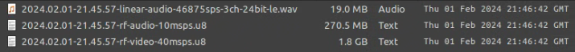

# RF Capture Guide

Previous Page [Hardware Installation Guide](Hardware-Installation-Guide.md)

Next Page [RF Compression & Decompression Guide](RF-Compression-&-Decompression-Guide.md)

This guide go's over what options you have for [FM RF](Acronyms-Guide.md) (Frequency Modulated Radio Frequency) capture and best practices.

RF Capture in practice is very simple.

## This guide assumes 2 things:

You know what USB 3.0 is and or can twist a screwdriver and install an basic PCIe Card inside a standard desktop or server chassis.

You have followed setup docs for your operating system and or hardware.

# Cleaning

!!! IMPORTANT
    It cant be stated enough a clean drum/mech = cleaner more reliable captures.

Its a complex concept involving (C6H1O5)n & C3H8O

**That's a joke**, its paper and rubbing alcohol. (99.9% IPA not 70%*)

Simply cut a paper strip printer paper works fine, fold once, wet with alcohol, press on the drum **lightly** and hand rotate **slowly** **don't go up and down** and always **gently pull away** from drum once you have rotated for 10 seconds repeat until clean.

Its recommended to first clean around the drum the whole cylinder, including its track then tape guides or rollers you can use swabs, don't ever use a cotton swab or Q-Tip on the video heads directly as the fibres will tare them off they are fine however for linear audio heads, that's it really clean heads and ensure lubricated mechanical tracks is all a happy VCR needs to ensure the best results, but be sure to clean before and after use to remove any contaminant.

VHS drums are quite robust, but for Beta it is best to only use paper, Sony 8mm camcorders chamois swabs are a go to.

# Capture Device Support

Hardware:

| Operating System  | DdD Support | CX Card Support | RTLSDR Support | MISRC Support | 
|-------------------|-------------|-----------------|----------------|---------------|
| Microsoft Windows | Yes*        | No*             | Yes            | Yes           |
| Apple MacOS       | Yes         | No              | Yes            | Yes           |
| Apple MacOS ARM   | Yes         | No              | Yes            | Yes           |
| Linux             | Yes         | Yes             | Yes            | Yes           | 
| Linux Arm         | No          | Yes*            | Yes            | Yes           |

*CX Cards driver may be implemented for windows in the future.

*DdD has sample drop issues on Windows at times & has not been tested or have a app build for Linux arm. 

Media:

| Media RF Type    | DdD Support | CX Card Support | RTLSDR Support | MISRC Support |
|------------------|-------------|-----------------|----------------|---------------|
| Video FM RF      | Yes         | Yes             | No             | Yes           |
| HiFi FM RF       | Yes         | Yes             | Yes            | Yes           |
| CVBS RF          | No          | Yes*            | No             | Yes           |

*CX Cards support CVBS capture with `sixdb` off and `level` set to 0, this is ideal for standard capture with a external amplifier also.

The RTLSDR does not have enough bandwidth for FM video.

The DomesDayDuplicator Rev 3, does not have the correct filtering for CVBS.

# Hardware

{: style="width:600px"}

[DomesDayDuplicator (DdD)](https://github.com/harrypm/DomesdayDuplicator) USB 3.0 Card

[CX Card White](https://github.com/oyvindln/vhs-decode/wiki/CX-Cards) PCIe 1x Card

[Analogue Devices AD8367](https://github.com/oyvindln/vhs-decode/wiki/CX-Cards#external-amplification)  RMS Amplifier with SMA Connectors.

{: style="width:600px"}

[RTLSDR](RTLSDR.md) is an affordable SDR radio that can capture HiFi signals for real-time decoding and saving to file. 

# Example Setup & Workflow

`Right-Click --> Open in new tab`

!!! CAUTION
    VHS, SVHS, BetaMax is 2 RF Test Points - HiFi RF & Video RF

{: style="width:400px"}

!!! NOTE
    Video8, Hi8 & LaserDisc are signal test point RF capture formats, Video/HiFi are on separate carriers on 1 capture file.

{: style="width:400px"}

# Cabling

If possible direct coupling is the best method with the DdD, but 1m of 50Ohm cable is normally fine but less cable = more signal.

If amplifiers are employed internally/externally directly after or before the RF Tap then 2-3m cabling can be used without issues.

!!! NOTE
    RFI or Radio Interference is a **real world thing**, keep AC power cables away from RF gear, cables etc, keep phones and radio based equipment out of direct line of sight to equipment at all times this is common sense that most people don't think about in the digital era less of an issue with full metal chassis decks however, a shielded DdD case and ideally an all metal PC case is meant to be providing shielding for the CX Cards.

## File Handling & Indexing

### [Naming Guide For RF Captures!](https://github.com/oyvindln/vhs-decode/wiki/Capture-Naming-Guide)

Name your captures properly, **ignore this at your own peril** as managing any media collection is a nightmare if you don't do it right from the start.

### Checksums

Many people don't know or care about checksums but they are used every signal day in every signal device you own, checksums are what allow us to sanity check if data is damaged in handling, or has started to data rot while being stored.

[Rapid CRC (Windows)](https://www.ov2.eu/programs/rapidcrc-unicode) & [Tera Copy (Windows & MacOS)](https://www.codesector.com/teracopy)

[GTK Hash (Linux / Universal)](https://github.com/tristanheaven/gtkhash/releases)

## Sampling Rates to use 

MSPS is the rate at which we sample high bandwidth analogue signals like video.

| **Type PAL/NTSC** | **Minimum ADC Rate Required** | Safe Capture ADC Rate |
| ----------------- | ----------------------------- | --------------------- |
| VHS               | 18msps                        | 28msps                |
| SVHS              | 24msps                        | 28msps                |
| Video 8           | 20msps                        | 28msps                |
| Hi8               | 28msps                        | 28msps                |
| UMatic            | 24msps                        | 28msps                |
| UMatic SP         | -                             | 28msps                |
| EIAJ              | 18msps                        | 28msps                |
| Philips VCR       | 18msps                        | 28msps                |
| Philips V2000     | 18msps                        | 28msps                |
| 1’’ Type C        | -                             | 40msps                |
| Beta 1            | 24msps                        | 28msps                |
| Beta 2/3          | 18msps                        | 28msps                |
| Super Beta        | 24msps                        | 40msps                |
| Betacam           | -                             | 40msps                |
| Betacam SP        | -                             | 40msps                |
| ED Beta           | 28msps                        | 40msps                |
| LaserDisc         | 40msps                        | 40msps                |
| DigiBeta          | SDI - V210 Digital YUV        |                       |
| DigiBeta SX       | SDI - V210 Digital YUV        |                       |
| D1                | SDI - V210 Digital YUV        |                       |
| D2                | SDI - V210 Digital YUV        |                       |
| D3                | SDI - V210 Digital YUV        |                       |

For `SDI - V210 Digital YUV` Read the [Digital Tape Guide](Digital-Tape-Guide.md)

DigiBeta = Digital Betacam

## CX Cards & CXADC

[Standard Driver Setup Docs](https://github.com/happycube/cxadc-linux3#readme)

[Synchronised Multi-Card Setup Docs](Clockgen-Mod.md)

Currently there are no modified Windows drivers so this is limited to a [Linux live install](https://www.youtube.com/watch?v=pwWfJwlZLWg) on a USB drive or a full install on a local drive in your system If you want to stick to windows and WSL2 for most stuff then the live USB option is your best bet with a internal drive formatted in exFat for captures allowing you to hop back and forth between systems without issues,

**Note you will want to disconnect your windows boot drive either way you go to avoid issues.**

These cards have a digital gain control of 0-31 range with a 6db "digital boost" option you want your digitally controlled gain around level 0-10 and 6dB set to off almost always to have a clean as possible capture as higher gain introduces internal noise from the CX Chips, though this varies based off signal strength of what your capturing.

!!! NOTE
    If gain is set above level 0 & sixdb is used you cant capture raw composite or CVBS on the cards though on modulated signals from VHS/BetaMax etc this does not matter as much.

!!! NOTE
    Ideally you can use an external amplifier and or upgrade the crystal or use the clockgen mod to get better performance on these CX Cards if you want the absolute best out of them its worth the small investment.

## Using CX Cards with the CXADC Driver

Ubuntu is standard but Mint Cinnamon is more user friendly these days capture can be done inside any location system wide that you open a terminal in.

Command Line Capture (CLI)

    timeout 10s cat /dev/cxadc0 |pv > CX_Card_28msps_8-bit.u8

Press <kbd>Ctrl</kbd>+<kbd>C</kbd> to copy then <kbd>Ctrl</kbd>+<kbd>P</kbd> to past the command use <kbd><</kbd>+<kbd>></kbd> to move edit position on the command line to edit the name or command and <kbd>Enter</kbd> to run the command.

`timeout 10s` defines the capture duration of 10 seconds, this can be defined in `h`ours `m`inutes or `s`econds if a timeout duration is not defined it will capture until storage space runs out.

<kbd>Ctrl</kbd>+<kbd>C</kbd> Will kill the current process, use this to stop the capture manually.

## Preview The Live Signal

To validate there is a signal going to the correct input on a CX Card (VMUX) you can use ffplay to read the data stream coming off the card in real time.

    sudo ffplay -hide_banner -async 1 -f rawvideo -pixel_format gray8 -video_size 1832x625 -i /dev/cxadc0 -vf scale=1135x625,eq=gamma=0.5:contrast=1.5

| No Signal                                                                                           | CVBS Signal                                                                                  | Modulated Video Signal                                                                           | Modulated HiFi Signal                                                                                   |
| --------------------------------------------------------------------------------------------------- | -------------------------------------------------------------------------------------------- | ------------------------------------------------------------------------------------------------ | ------------------------------------------------------------------------------------------------------- |
| {: style="width:550px"} | {: style="width:550px"} | {: style="width:500px"} | {: style="width:500px"} |

!!! NOTE
    - You need to set level to 0 and sixdb to 0 to capture for CVBS-Decode
    - You need to be in 28mhz mode for stock preview of CVBS signals to work.

## CX Cards & Clockgen 

Example:

`./cxadc-vhs-sync-capture.sh /home/harry/Desktop`

{: style="width:500px"}

The Resulting Output:

{: style="width:600px"}

## FLAC Compress Captures

!!! NOTE
    FLAC Compression can reduce file sizes by 40-60% and are still decode supported! 

See the CXADC FLAC Compression Doc [here](https://github.com/happycube/cxadc-linux3/wiki/FLAC-Compression-Guide)

Windows scripts for CXADC Captures can be found [here](https://github.com/happycube/cxadc-linux3/tree/master/CXADC-Compression-Scripts/Windows)

## Driver Config

List current configuration setting

Short Command

    cxvalues

Direct Command

    ls /dev |grep cxadc |sed -e's/dev//g'|xargs -I % bash -c 'find /sys/class/cxadc/%/device/parameters|grep -v parameters$'|xargs -I % bash -c 'echo -n "% "  && cat %'

This will look like

    /sys/class/cxadc/cxadc0/device/parameters/audsel -1
    /sys/class/cxadc/cxadc0/device/parameters/center_offset 8
    /sys/class/cxadc/cxadc0/device/parameters/crystal 28636363
    /sys/class/cxadc/cxadc0/device/parameters/latency -1
    /sys/class/cxadc/cxadc0/device/parameters/level 16
    /sys/class/cxadc/cxadc0/device/parameters/sixdb 1
    /sys/class/cxadc/cxadc0/device/parameters/tenbit 0
    /sys/class/cxadc/cxadc0/device/parameters/tenxfsc 0
    /sys/class/cxadc/cxadc0/device/parameters/vmux 1

`/sys/class/cxadc/cxadc0/` will change to `/sys/class/cxadc/cxadc1/` and so on for multiple installed cards.

## Config

`sudo echo x` - Is the part you edit.

`sudo echo 1 >/sys/class/cxadc/cxadc0/device/parameters/vmux`  - Physical Input (0-2)

`sudo echo 0 >/sys/class/cxadc/cxadc0/device/parameters/level` - Internal Gain (0-31)

`sudo echo 0 >/sys/class/cxadc/cxadc0/device/parameters/sixdb` - Digital Gain Boost (1 On / 0 Off)

Adjust level for capture, start playback of media, then run this command

`./leveladj`

To use this on different cards

`./leveladj -d 1` (1 means for device 2/3/4 and so on device 0 is assumed when `-d` is not used)

Decode the first 10 sec to see if all is working correctly, re-wind and start full capture.

If an RMS amplifier is employed set your gain level manually between `0~10` for best results and `sixdb off`. 

## GUI Capture (Alpha)

[Tony's CX Capture GUI](https://github.com/tandersn/cx_capture_app)

[Harry's Docs Fork](https://github.com/harrypm/CX-Card-GUI-Capture-App)

{: style="width:300px"}

## Fix Ownership

Use chmod command on your installation directory's and or the driver files under dev/cxadc if permissions are broken and you need to `sudo su` to enter root to even operate it. (<kbd>CTRL</kbd> + <kbd>D</kbd>)

    sudo chmod -R 777 home/vhs-decode

---

    sudo chmod -R 777 home/cxadc

## DomesDayDuplicator

- [Linux Install](https://github.com/happycube/ld-decode/wiki/Domesday-Duplicator)

The domes day duplicator or DdD is limited to just 1 RF device per system but is entirely USB 3.0 based allowing for universal support with modern systems of all formats and sizes.

Today the GUI application has 1024 sample amplitude readout this tells you if an input signal is too strong or too weak.

This is a 47 Second Rolling RMS Readout (During Capture Only)

{: style="width:400px"}{: style="width:440px"}

0 - Nothing (No movement)

0.1 - Something

0.180 - Acceptable

0.3~0.8 Good Signal

### Physical Gain Controls

The duplicator has one point of physical control this is a 4 DIP switch that controls the gain level of the amplifier.

`0000` is `1-2-3-4` dips, In orientation to bottom numbers up is 1 and down is 0

{: style="width:200px"}

All selected in this up position is 1111 or 2.02 Minimum Gain When dip’s 2-3-4 are down it's 1000 this is the maximum gain of 8.5, the table below shows all possible positions.

|**Configuration**|**Switch Position**|**Gain**|
|-----------------|-------------------|--------|
| 15              | 1111              | 2.02   |
| 7               | 0111              | 2.17   |
| 11              | 1011              | 2.27   |
| 13              | 1101              | 2.45   |
| 3               | 0011              | 2.54   |
| 14              | 1110              | 2.59   |
| 5               | 0101              | 2.79   |
| 6               | 0110              | 3.02   |
| 9               | 1001              | 3.04   |
| 10              | 1010              | 3.34   |
| 1               | 0001              | 3.8    |
| 12              | 1100              | 4      |
| 2               | 0010              | 4.4    |
| 4               | 0100              | 6      |
| 8               | 1000              | 8.5    |

RF Capture Mode: 10-bit packed

We use 10-bit packed as its the most space effective before FLAC compression, decoding can be done with 10-bit packed or FLAC compressed data as its basically the same as a ZIP file, on NVME SSDs this is a 5~10% decoding speed difference for a 40-60% space saving

Straight Forward GUI capture

## FLAC Compression of RF Captures - DomesDayDuplicator

To compress your 10-bit packed captures on Linux use this command

`ld-compress input.lds`

There is two ld-compress scripts `ld-compress.bat` &  `ld-compress-nvidia-gpu.bat` with the windows download bundle.

# Windows 7~11 Usage - DomesDayDuplicator

- [Install Windows Terminal](https://apps.microsoft.com/detail/9n0dx20hk701)
- [Download Decode Suite For Windows](https://github.com/oyvindln/vhs-decode/releases)
- [DdD Capture App For Windows](https://github.com/happycube/ld-decode/wiki/Domesday-Duplicator)

Rename the extracted folder decode and place it inside your C drives main directory or some ware you wont be moving it around, inside then pin ld-analyse to your task bar as its the only dedicated GUI app, but to use dark mode `ld-analyse.exe -style fusion` has to be run via Terminal or CMD.

Put the decode for windows build files into your capture directory, and open as CMD terminal

If this is a secondary drive it will be `cd /d J:\vhs-decode` for example.

### System Wide Tools In Windows

**If you ran though the WSL2 setup guide you already should have this installed**

Open PowerShell as an administrator. 

Install Choco Via (chocolatey package manager)

    Set-ExecutionPolicy Bypass -Scope Process -Force; [System.Net.ServicePointManager]::SecurityProtocol = [System.Net.ServicePointManager]::SecurityProtocol -bor 3072; iex ((New-Object System.Net.WebClient).DownloadString('https://community.chocolatey.org/install.ps1'))

Then you can install these system wide without any hassle.

Install FFmpeg

    choco install ffmpeg

Install FLAC

    choco install flac

Install SoX

    choco install sox.portable

## MacOS Usage?

Currently DdD is the only directly usable device on MacOS systems unless you have a desktop based mac with duel boot with Linux or thunderbolt 3/4 to PCIe Docks for laptops and AIO desktop units running Linux natively.

Some people have already built the decoders and tools on MacOS X86/M1 and we have done tests inside Ubuntu Virtual Machines its negligible in terms of performance slowdown with current speed optimised commands this can be as fast as 16fps.

There has yet to be full docs for current Intel hardware.

*Unless someone wants to donate a few units to the dev/hardware team :)*

## Issues 

!!! WARNING
    The CX Cards can drop samples if they over heat, with active fans and or heatsinks this is a easy physical fix.

!!! WARNING
    The DomesDayDuplicator can have issues with ground loops if put on top of metal VCR lids directly best to insulate them,

!!! WARNING
>EMI interference from microwaves and radios can affect any RF capture same for noise on the power line interfering with hardware normally, a shielded case for the DomesDayDuplicator is recommended.

# Page End

Next Page [RF Decoding Guide](RF-Capture-Decoding-Guide.md)

Sub Page [RF Compression & Decompression Guide](RF-Compression-&-Decompression-Guide.md)

Previous Page [Hardware Installation Guide](Hardware-Installation-Guide.md)
