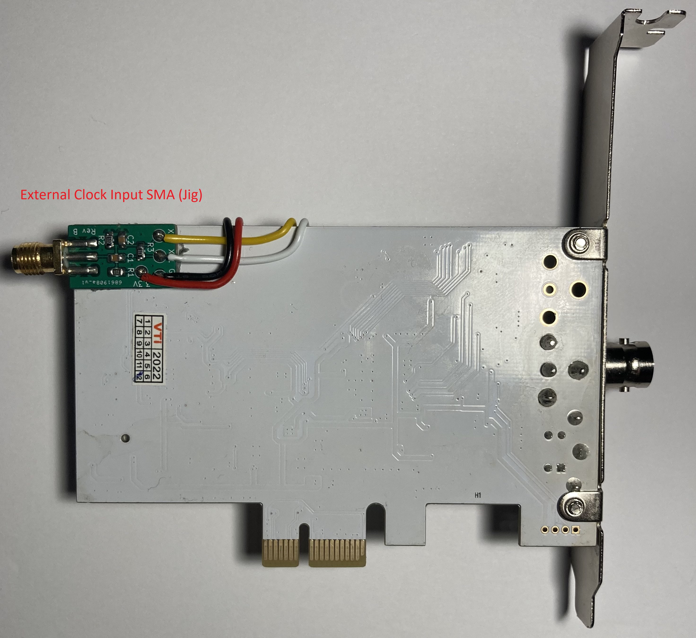
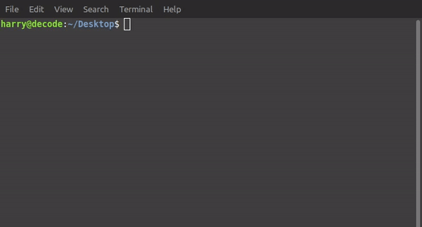

# RF Capture Hardware

Next Page [RF Capture Guide](RF-Capture-Guide.md)

Previous Page [Hardware Installation Guide](Hardware-Installation-Guide.md)

# What are we looking for?

This is a sub-doc about ADC's & SDRs that can be used for the decode projects this list includes standardised and validated methods and workflows and new options. 

You can help expand this list via posting on the Discord, Sub-Reddit or Emailing Harry directly.

## The Technical bit 

The input frequency range required for most of the signals from HiFi to CVBS video is 1Mhz to 10Mhz at least, this can go upwards of 30Mhz for MUSE RF.

2msps = 1 Mhz of Bandwidth

So most archival class solutions today will be based around the 28-40msps minimum range sampling wise, of course this is wholly format dependent with HiFi RF requiring less then 10msps.

Other factors such as input LPF (low pass filters) makes common SDRs a very mixed viability for straight to file and onto decoding with ease.

# Standardised 

## CX Card

[CX Cards Doc](CX-Cards.md)

{: style="width:317px"}{: style="width:400px"}

28.6msps 8-bit / 40msps 8-bit / 54msps 8-bit (upto 57msps on some cards)

FM RF capture via the CX Card method has been further improved with external amplifiers.

The off shelf go-to today is the Analog Devices [AD8367](https://www.analog.com/media/en/technical-documentation/data-sheets/AD8367.pdf) based boards using 3-5v:

{: style="width:400px"}

[Pot-less AliExpress Link](https://www.aliexpress.com/item/32860308324.html) / [With Pot AliExpress Link](https://www.aliexpress.com/item/1005003457407163.html?) / [4.5v AA Battery Holder](https://www.aliexpress.com/item/4001194487990.html) / [Wiki Setup Link](https://github.com/tandersn/cxadc-hw-mod/wiki/AD8367-RMS-Setup)

There is also other amplifiers available that are more fine tuned for FM capture with the CX Cards.

The newest is the [vhs-rf-amp-ada4857](https://gitlab.com/wolfre/vhs-rf-amp-ada4857) board by Rene Wolf using 12v. 

{: style="width:400px"}

## Duel Synchronised ADC CX Cards "Clockgen Mod"

[Clockgen mod simplified wiki](Clockgen-Mod.md)

- Software Defined Crystal Rate
- Hardware Synchronised Multi-Card Capture
- Hardware Synchronised Linear/Baseband Audio Capture

The most advanced mod available today, using an external crystal to generate the clock source we can have drift free capture with 2-4 CX Cards and audio feeds.

This allows duel channel video formats such as Betacam to be captured, or Video FM + HiFi FM + Linear for many other formats like VHS or Betamax.

Possible thanks to [cxadc-clock-generator-audio-adc](https://gitlab.com/wolfre/cxadc-clock-generator-audio-adc) By Rene Wolf

External crystal timing via 2 additional PCB boards, a Jig with an SMA and Mainboard has allowed for under 50USD multi card sync, using 2 or more CX Cards alongside a extra input for synchronised Linear/Reference audio capture also has a extra input for headswiching timing signals.

- [Raspberry Pi Pico](https://www.raspberrypi.com/products/raspberry-pi-pico/) as the interface and control board.

- [Adafruit Si5351A](https://www.adafruit.com/product/2045) for generating the shared clock source with 5 potential inputs.

- [PCM1802](https://www.ti.com/product/PCM1802) ADC for L/R input Linear/HiFi audio capture.

{: style="width:442px"}{: style="width:400px"}

{: style="width:400px"}

Audio inputs and head switch input is on a dedicated bracket you can 3D print.

{: style="width:600px"}{: style="width:260px"}

Clock Speed & Audio is controlled by Alsamixer, and synchronised capture via script.

{: style="width:500px"}

{: style="width:600px"}

{: style="width:600px"}

## DomesDay Duplicator (DdD)

[DomesDay Duplicator Docs](https://github.com/happycube/ld-decode/wiki/Domesday-Duplicator)

40msps 10-bit

DE0-Nano FPGA / FX3 USB 3.0 Board

- TI ADS825 ADC
- OPA690 OP-AMP
- Selectable 4 Position DIP gain control

{: style="width:400px"}

{: style="width:400px"}

{: style="width:350px"}

## RTLSDR

Used for [HiFi-Decode](003-Audio.md) & [RTL-SDR Decode](RTLSDR.md).

{: style="width:500px"}

Pictured Order: TNC Male to SMA Male / TNC Female to SMA Male / BNC Male to SMA Male / BNC Female to SMA Male / [Nooelec RTL-SDR v5](https://www.amazon.co.uk/dp/B01HA642SW/)

[RTLSDR Page](https://github.com/oyvindln/vhs-decode/wiki/RTLSDR)

# Currently Being Standardised

## MISRC - Multi Input Simultaneous Raw RF Capture

Formerly called adc_usb3 / **SMIRF** - Simultaneous Multi Input RF Capture. - [DD86 Discord](https://discord.com/channels/665557267189334046/676084498097766451/1176979162536366111)

[GitHub](https://github.com/Stefan-Olt/MISRC) [GitHub Wiki](https://github.com/Stefan-Olt/MISRC/wiki)

PCB: 20-30USD / Parts 100-120USD

Mainboard + FX3 USB 3.0 board

[PCBway Order Link](https://www.pcbway.com/project/shareproject/MISRC_Multi_Input_Simultaneous_Raw_RF_Capture_Rev_1_0.html)

Features 

- Off shelf FX3 USB 3.0 board (same as DdD)
- External Clock Source Output
- 6 Extra Aux inputs for audio ADC modules etc
- Duel ADC / Duel Input
- Physically adjustable input filters
- 12-Bit, 20/40/65msps sampling
- AD8138 Driver, Op-Amp / SN74ls541 Buffer / AD9235 ADC

{: style="width:500px"}

# Non-Standardised 

## RX888 MKII / RX-888 MKII 

{: style="width:317px"}{: style="width:400px"}

LTC2208 ADC - 16-Bit, 130Msps

CYUSB3014

USB 3.0

Limited capture software support

[Taredown & Performance](https://elekitsorparts.com/some-truths-about-rx-888-mk2-sdr/)

[Info](https://www.sdr-radio.com/rx-666) / [AliExpress (Global/MSRP)](https://www.aliexpress.com/item/1005003963199464.html) / [Amazon UK](https://www.amazon.co.uk/Jeanoko-Software-Defined-Receiver-Transceivers/dp/B09TNHTGGG) / [Amazon US](https://www.amazon.com/Software-Receiver-Aluminum-Enclosure-1kHz%E2%80%9164Mhz/dp/B09FB425CQ/)

Limited Linux Support, developing slowly, working windows support more testing and testers required.

## HackRF One 

[Original](https://greatscottgadgets.com/hackrf/one/) / [AliExpress Clone](https://www.aliexpress.com/item/1005003422032409.html?)

{: style="width:330px"}{: style="width:400px"}

{: style="width:300px"}

The original has been used by several members for testing but the clones that are under half the price.

## RSP1 / MSI-SDR / Msi2500 / Msi001

[RSP1 RF Capture & Decoding](RSP1.md)

8-bit 20msps ADC

{: style="width:400px"}

{: style="width:400px"}

There is two main physical versions, the physical multi input and the compact DIP switch configurable ones.

[AliExpress Compact DIP Bare](https://www.aliexpress.com/item/1005004898879316.html?)

[AliExpress Compact DIP With Shell](https://www.aliexpress.com/item/1005003800470360.html)

[AliExpress Physical Breakout](https://www.aliexpress.com/item/1005005585598816.html?)

[Extensive Docs](https://github.com/EndlessEden/msiSDR/commit/b96ffa89716914aed1496883bd6110a02c6373cc)

https://revspace.nl/Msi2500SDR

https://www.jotrin.com/product/parts/MSI001

[Follow The Original Discussion On Discord](https://discord.com/channels/665557267189334046/665834485975351307/1131763326624468992)

[07.08.2023 Continued Discussion On Discord](https://discord.com/channels/665557267189334046/665834485975351307/1138198002822037504)

Notes

The msi2500 is a variable bit (8 to 14 bit) ADC and DSP with USB interface. (See: msi2500-BlockDiagram.jpg)

The result is:
a range from 10 kHz to 1 GHz (with a hole at 250-400 MHz)
a bandwidth of up to 10 MHz,

MSPS from 2 to 6 MHz  (14-bit)
MSPS from 6 to 8 MHz  (12-bit)
MSPS from 8 to 9 MHz  (10 bits)
MSPS from 9 to 10 MHz (8 bits)

With a SNR of 60 dB.

## ThunderScope 

One of the most early open-source ADCs eyed by the members of the decode projects during the early hifi days.

[GitHub](https://github.com/EEVengers/ThunderScope) / [CrowdSupply](https://www.crowdsupply.com/eevengers/thunderscope) / [Discord Server](https://discord.gg/pds7k3WrpK)

{: style="width:500px"}

{: style="width:500px"}{: style="width:500px"}

## Hantek Oscilloscopes

[HanTek SDR](https://github.com/steve-m/sigrok-firmware-fx2lafw)

[First Discord Notation](https://discord.com/channels/665557267189334046/782578245408653313/1195292273013948466)

PSO2020 [Wiki](https://sigrok.org/wiki/Hantek_PSO2020) / [AliExpress](https://www.aliexpress.com/item/1005006035963552.html?)

8-bit 30MSPS

[Cypress FX2](https://www.infineon.com/cms/en/product/universal-serial-bus/usb-2.0-peripheral-controllers/ez-usb-fx2lp-fx2g2-usb-2.0-peripheral-controller) / [AD9288](https://www.analog.com/media/en/technical-documentation/data-sheets/AD9288.pdf)

Software;

sigrok-firmware-fx2lafw with librtlsdr modified for continuous write mode.

This can also apply to the 6022BE a duel input BNC Oscilloscope.

# Page End 

Next Page [RF Capture Guide](RF-Capture-Guide.md)

Previous Page [Hardware Installation Guide](Hardware-Installation-Guide.md)
