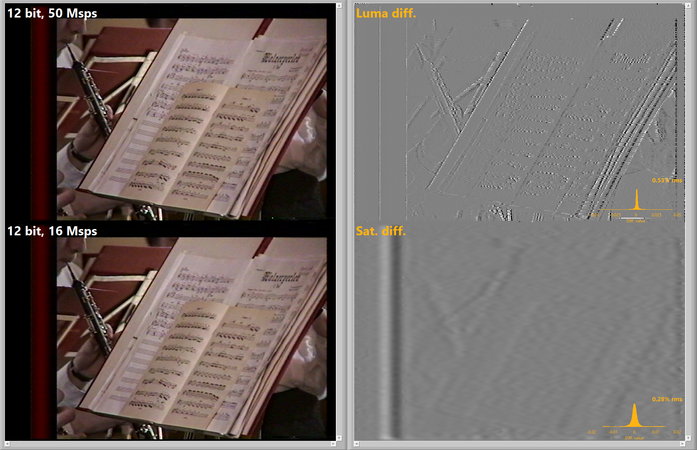
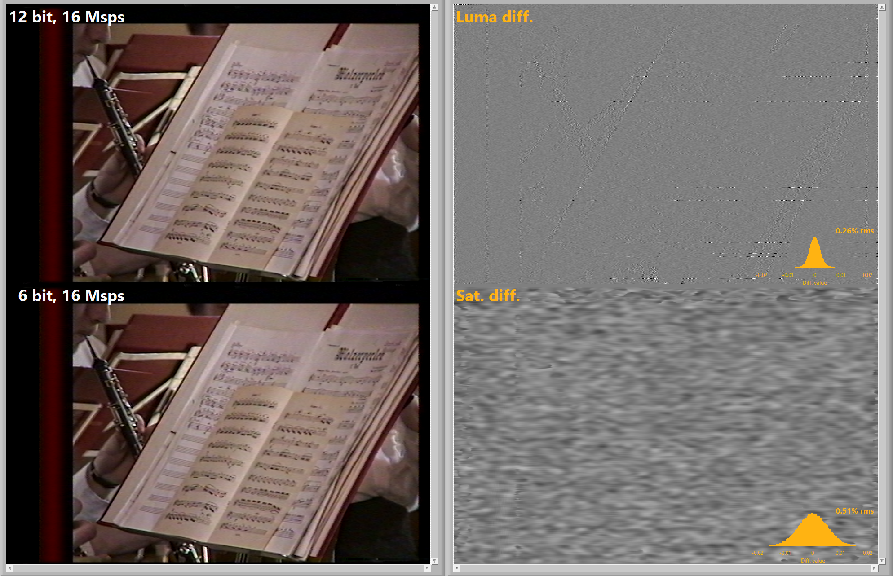
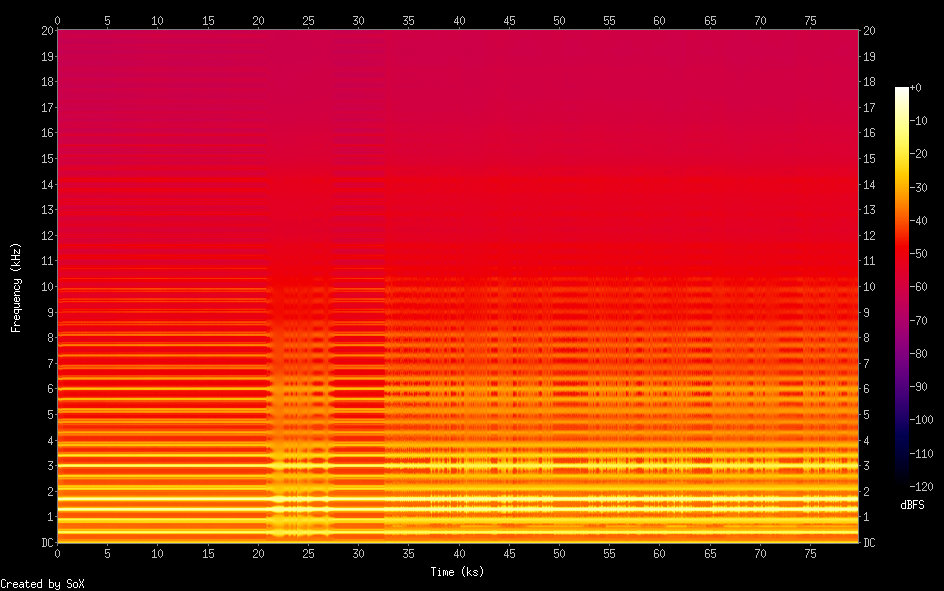

# FLAC Compression & De-Compression Guide 

Previous Page [RF Capture Guide](https://github.com/oyvindln/vhs-decode/wiki/RF-Capture-Guide)

Sub-Page [Speed & Decoding Testing](https://github.com/oyvindln/vhs-decode/wiki/Speed-Testing)

Next Page [RF Decoding Guide](https://github.com/oyvindln/vhs-decode/wiki/RF-Capture-Decoding-Guide)

## What is RF Compression & Down-Sampling?

RF captures of tape formats are normally oversampled, meaning in the case of formats like VHS the total actual signal range tops out at 8mhz or 16msps so when using [RF capture hardware](RF-Capture-Hardware.md) at rates of 28-40msps we are technically oversampling, but this is not a bad thing due to filtering and aliasing of side bands on initial sampling.

Capturing more then the minimum allows for some redundancy from minor drops during capture to bit-flips in active storage devices but for archives going to solid mediums like optical discs, ware currently space is at a premium, down sampling allows users to cut RF captures down on a per format basis to the minimum needed for that signal.

The benefits of this also include, better SNR as there is less noise outside of the signal range, faster decoding times and smaller final files as there is less data to look though.

{: style="width:480px"}{: style="width:480px"}

You can read the study [here](Technical-Breakdowns.md) in the technical breakdowns doc.

!!! CAUTION
    16msps does work on PAL samples but can have issues with some cases, i.e damaged tapes or dropped sample captures, 18msps is considered the bare minimum, and 20msps is considered the hard safe minimum for all VHS flavours, and at least a minimum of 24msps for SVHS and Video8 initial sampling.

## Basics of RF and RF Compression 

FM RF captures commonly called samples or sampled data etc is just like audio data just electrical signal values digitised into binary bits of information, but this is brightness and colour information in a different waveform pattern than normal sound waves, as such we can use lossless audio codecs like FLAC to compress captured FM RF data down A LOT or lossy ones to just break the files in fun ways too! 

In terms of software support 8-bit and 16-bit singed/unsigned are what's common and universally used by most tools, including the decode suit, these data files are equivocal to audio files but with MHz of information instead of KHz.

But lets say our ADC captures 10-bit / 14-bit etc then normally you get scaled 16-bit data, then you have the DdD which uses the 10-bit packed format (which ld-lds-reader enables reading of in real-time to the decoders).

FLAC compression essentially drops those extra 6 values to 0 in the case of 16-bit files alongside its standard compression methods.

Now in the real world 8-bit is more then enough for tape formats initial sampling, its the msps or million samples per second rate that actually matters and as low as 6-bit is enough to store VHS and Video8.

## How does it work?

`RF Data at 40msps in 10-bit packed` --> `ld-lds-converter` --> `16-bit singed unpacked data` --> `Down Sampling via SoX or GNURadio with lowpass filtering` --> `16msps 8-bit unsinged FLAC output`

**D**own-**S**ampling is a method of cutting file size down with controlled loss of data more accurately removing background noise or dead space for example a 10-bit ADC only has 10-bits of information but can only be saved in a 16-bit format FLAC will remove those 6 extra bits of essentially 0 value information, alongside filtering cut off removing anything else recorded outside of the real-world usable signal range for said particular audio or video format, simmer to how a XLR microphone will have a cut off for 75hz to remove buzzing sounds from lights or power transformers.

This process can be done for low bandwidth formats like HiFi FM signals with little worry but with video formats its more a stricter practice and the bandwidth also changes between PAL/NTSC and tape formats.

## Compression Rate Tables

40msps 10-bit Packed (DdD) (16-bit) (2.81GB/min) **VHS PAL SP**

 

| Runtime | File Size |       Storage Medium Note       |
|---------|-----------|---------------------------------|
| 45min   | 126.45GB  | 128GB Sony Quad Layer BDXL Max  |
| 60min   | 168.6GB   |                                 |
| 75min   | 210.75GB  |                                 |
| 90min   | 252.9GB   |                                 |
| 120min  | 337.2GB   |                                 |
| 150min  | 421.5GB   |                                 |
| 3-hour  | 505.8GB   |                                 |
| 240min  | 674.4GB   |                                 |
| 5-hour  | 843GB     |                                 |
| 6-hour  | 1011.6GB  |                                 |

40msps 10-bit FLAC compressed (DdD) (16-bit) (1.48GB/min) **VHS PAL SP**

 

| Runtime | File Size |       Storage Medium Note       |
|---------|-----------|---------------------------------|
| 45min   |  66.6GB   |                                 |
| 60min   |  88.8GB   |                                 |
| 75min   |  111GB    | 128GB Sony Quad Layer BDXL Max  |
| 90min   |  133.2GB  |                                 |
| 120min  |  177.60GB |                                 |
| 150min  |  222GB    |                                 |
| 3-hour  |  266.4GB  |                                 |
| 240min  |  355.2GB  |                                 |
| 5-hour  |  444GB    |                                 |
| 6-hour  |  532.8GB  |                                 |

!!! NOTE
    - Rates based off 60sec live capture.
    - Rates are relative not absolute

16msps 8-bit with FLAC compression for **VHS NTSC**

 

[Imgsli Slider Comparison 54msps vs 16msps](https://imgsli.com/MTQ5ODI1)

| Runtime | File Size |             Storage Medium Note             |
|---------|-----------|---------------------------------------------|
| 45min   |  15 GB    |                                             |
| 60min   |  19.44GB  |                                             |
| 75min   |  24.30GB  | 25GB M-Disk/GlassMasterDisc                 |
| 90min   |  29.16GB  | S-VHS/VHS-C tape max                        |
| 120min  |  38.88GB  |                                             |
| 150min  |  48.6GB   | 50GB M-Disk / 50GB GlassMasterDisc Max      |
| 3-hour  |  58.32GB  | VHS SP Max                                  |
| 240min  |  77.76GB  |                                             |
| 5-hour  |  97.2GB   | 100GB M-Disk Max                            |
| 6-hour  |  116.64GB | 128GB Sony Quad Layer BDXL Max / VHS LP Max |

!!! NOTE
    Compression rates are amplitude relative not absolute.

!!! NOTE
    Video8/Hi8 is a single modulated signal, video & hifi are just on different carriers so you use 1 file for both video/hifi decoding like LaserDiscs, down sampling is not recommended for the formats at this time.

# DomesDay Duplicator (DdD)

    ld-compress DdD-capture.lds

Will just compress your capture to a lossless 40msps 16-bit FLAC file in `.ldf` this is the standard Linux command.

The DdD samples data at 40msps 10-bit 

You have 2 working capture modes

16-bit Scaled Signed (uncompressed)

10-bit packed (compressed)

!!! NOTE
    - 10-bit packed initial capture is ideal due to space savings.
    - FLAC compression (16-bit) lowers size and makes the data highly compatible with audio tools.

## Linux Scripts

Copy the scripts below into a text document, save and then add `.sh` extension to the end of the file, you can use these in any directory witch the script file is put inside of, you can name the scripts however you like but the below example is clear enough.

`./40msps-DdD-16msps-8bit.sh DdD-capture.lds`

Will make `DdD-capture_NTSC_16msps_8-bit.flac`

The scripts below automatically append the sample rate/bit-depth/TV System accordingly.

## `.lds` 10-bit Packed to FLAC

There is two drag and drop ld-compress scripts `ld-compress.bat` & `ld-compress-nvidia-gpu`.

Simply drag and drop your RF capture on the script and it will automatically run the compression commands on your file.

## `s16` 16-bit Signed to FLAC 

Since this is uncompressed data it is easy to handle, the captures save to `.raw` but should be renamed to `.s16`.

`ffmpeg INPUT.s16 -i -f s16le -ar 40k -ac 1 -acodec flac -compression_level 11 -f ogg OUTPUT.flac`

Drag and Drop Script `16-bit-singed-to-flac.bat`

    @echo off
    title Compressing : %~n1
    ffmpeg -i "%~1" -f s16le -ar 40k -ac 1 -acodec flac -compression_level 11 -f ogg "%~dp1%~n1.ldf"

## Linux Down-Sampling Scripts

!!! NOTE
    - FM signals can be down sampled to save some space though this could potentially be risky if not enough headroom is left over.
    - Only stable media that is within spec of the format is recommended to ever be down sampled.

### 40msps to 24msps 8-bit - NTSC/PAL 

    #!/bin/bash

    echo "Conversion of 10-bit 40msps .lds to 8-bit 24msps PAL .flac has 
    started"

    ld-lds-converter -i $1 | sox -r 40000 -b 16 -c 1 -e signed -t raw - -b 8 -r 24000 -c 1 -t flac $1_24msps_8-bit.flac sinc -n 2500 0-9400
 

### 40msps to 20msps 8-bit - NTSC/PAL VHS 

    #!/bin/bash

    echo "Conversion of 10-bit 40msps .lds to 8-bit 20msps PAL .flac has 
    started"

    ld-lds-converter -i $1 | sox -r 40000 -b 8 -c 1 -e signed -t raw - -b 8 -r 20000 -c 1 -t flac $1_20msps_8-bit.flac sinc -n 2500 0-9650

### 40msps to 10msps 8-bit (S)VHS-HiFi

    #!/bin/bash

    echo "Conversion of 10-bit 40msps .lds to 8-bit 10msps PAL .flac has 
    started"

    ld-lds-converter -i $1 | sox -r 40000 -b 16 -c 1 -e signed -t raw - -b 8 -r 10000 -c 1 -t flac $1_VHS_HiFi_10msps_8-bit.flac sinc -n 2500 0-3050

# SoX Commands

Initial application call command

Linux: `sox`

Windows `"C:\Program Files (x86)\sox-14-4-2\sox.exe"`

## Export Spectrogram

    sox Input.flac -n spectrogram

SoX can export a handy spectrogram chart of RF & Audio waveform data.

{: style="width:600px"}

## 28msps 8-bit to 18msps 8-bit FLAC

    sox -r 286363 -b 8 -c 1 -e unsigned -t raw infile.u8 -b 8 -r 18000 -c 1 -t flac outfile_18msps_8-bit.flac sinc -n 2500 0-8670

## 40msps 8-bit to 18msps 8-bit FLAC

    sox -r 40000 -b 8 -c 1 -e unsigned -t raw infile.u8 -b 8 -r 18000 -c 1 -t flac outfile_18msps_8-bit.flac sinc -n 2500 0-8670

## 40msps 16bit to 10msps 8-bit FLAC

    sox -r 40000 -b 8 -c 1 -e signed -t raw infile.s16 -b 8 -r 10000 -c 1 -t flac outfile_10msps_8-bit.flac sinc -n 2500 0-8670

## RF Compression & Resampling Commands - Windows Users

Download Windows scripts for CXADC Captures can be found [here!](https://github.com/happycube/cxadc-linux3/tree/master/CXADC-Compression-Scripts/Windows)

Manual Downloads [SoX](https://www.videohelp.com/download/sox-14.4.2-win32.zip) / [FLAC](https://ftp.osuosl.org/pub/xiph/releases/flac/flac-1.4.2-win.zip) / [FFmpeg](https://www.gyan.dev/ffmpeg/builds/ffmpeg-git-full.7z)

# Windows Scripts 

Included with windows build bundle is the following scripts:

- lds-compress.bat
- lds-compress-nvidia-gpu.bat
- lds-unpack.bat
- s16-to-flac.bat

# Bit Crushing 

The minimum you can down sample data to is 7-6 bit before visual degradation in a video signal this is a extreme compression method 

Applies to VHS/Beta/Video8/EIAJ level formats and has not been tested on Hi8/SVHS etc.

1. Run `ffmpeg -i input.flac -af astats -f null -` and take note of `RMS level dB`

2. if you're using a CX card and the number is less than -9.12, or you're using a DdD and the number is less than -21.2 then stop, you have less data than this'd keep, so it would only increase size.

3. Run `ffmpeg -i input.flac -af "volume=precision=fixed:volume=<your level without the minus here>dB*0.7071*0.5,aformat=sample_fmts=u8" -compression_level 12 small.flac` (you can skip `-compression_level 12` for much faster compression and very slightly bigger filesize)

# Naming & Formatting Your Files

Ensure the following is stated

- Sample Rate
- Bit Depth
- Media Format

Optionally but very useful 

- Time & Date
- Capture Device Used
- Gain Setting Used
- Playback Hardware Used

You can also rename the `.flac` to your media format name using [standard designators & standard naming guide](https://github.com/oyvindln/vhs-decode/wiki/Capture-Naming-Guide) that can be very useful for mass .xxx extension lookup for archives, if you want to keep things simple ignore this and ensure format is in file name.

# Page End

Sub-Page [Speed & Decoding Testing](https://github.com/oyvindln/vhs-decode/wiki/Speed-Testing)

Previous Page [RF Capture Guide](https://github.com/oyvindln/vhs-decode/wiki/RF-Capture-Guide)

Next Page [RF Decoding Guide](https://github.com/oyvindln/vhs-decode/wiki/RF-Capture-Decoding-Guide)