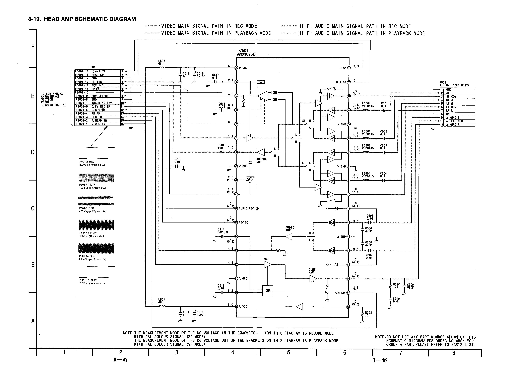

This is a semi-depricated overview information page about the concept and process of RF Tapping

[RF Capture Guide](RF-Capture-Guide.md) / [The Tap List](004-The-Tap-List.md) / [Hardware Installation Guide](Hardware-Installation-Guide.md)

## Complete Hardware Signal Chain of a VCR 

Tape Inside VCR Running across Drum --> Drum With Magnetic Heads Reading Tape Signals -> Drum Connection Board -> Ribbon Cable -> Board with Control IC Chip (Internal Signal Tracking & Pre-Amplfication) -> Tracked RF Output -> Pushdown/Ribbon (Could also be all on Mainboard) -> Mainboard or Processing Boards (Test Points) -> Demodulation -> Possibly TBC & DNR systems -> Baseband Composite Playback (1 RCA/BNC CVBS/Composite or S-Video/Y+C separated)

(Prosumer~Pro decks have control/amplification on a dedicated shielded board next to the drum unit)

The signal range of any usable information across all formats of VHS is approx. 250khz-8mhz, this extends into the 9-10mhz range for Beta tape formats so any SDR that covers this range and can do 16msps but ideally 20-28msps like the CX Cards can do a perfectly good job here more data on inital capture is not wasteful as it can always be resampled down and as always FLAC compressed stright away.

## Signal Location Types

There are several locations to tap a VCR for its modulated video & HiFi audio, [The Tap List](004-The-Tap-List.md) has all relevant data on the physical points located on various common VCRs and how to cable them, this list is updated as members of the DD86 discord collectively contribute more information.

We are tapping into and capturing the tracked full video signal that's a pre-amplified signal this needs to contain both Y/C (Luminance & Chrominance) signals so when looking at a schematic the RF-C test point or Video ENV is mostly the current go-to default tap as it normally has a full signal.

### Test Point Names

**Video FM RF Signal:**

`RF C`, `RF Y`, `RF Y+C`, `V RF`, `PB`, `PB.FM`, `V ENV`, `ENV`, `ENVE`, `ENVELOPE`, `VIDEO ENVE`, `VIDEO ENVELOPE`

**HiFi Audio FM Signal:**

`HiFi`, `A.PB`, `A FM`, `A.PB.FM`, `Audio FM`, `A-Out`, `A ENV`, `HIFI Envelope`, `FM Mix Out`

These are all valid points for tap testing and creating amplified or non-amplified BNC backports if signal issues occur try a 0.1uf~100uf 16-25v capacitor in-line Electrolytic/Polymer is recommended normally 10uf is a good coverall point to start with if you get visually good looking captures after test decodes leave it as is.

### How to read service manuals

**Follow the yellow brick road (The Contrasting Line Indicators)**

{: style="width:800px"}

In modern manuals the servicing book will directly correspond to labels physically on the boards in older manuals, they will look like TW1000 but be TW1 on the boards label or silkscreen.

For example, HiFi on the AG-7150 is TP4707 in the manual but just 707 on the label it's sometimes confusing if you're not used to reading them or probing every test point.

There is always contrasting arrows showing the signal path on service manual diagrams, trace the line to find test points along the signal path.

`Heads --> Amplfication --> Test Points --> Video Processing --> Video Playback`

**Note:** Sometimes both test points can be called ENV.
Pro Decks: Some have external RF output for duplication use these ports need further testing.

### What is a good capture? 

Good stable first genaration media is normally 38-45dB SNR under the Back SNR tab in `ld-analyse` ware as lower then 20 on VHS is pretty terrible less then 10 is normally unwatchable but SNR values dont 100% reflect "visual quality" in all cases.

Visually you can tell the noise level in ld-analyse the VBI space will be pure black with higher SNR to grainy with lower SNR.

### Outher Tap Methods

1. Mainboard & Processing Boards (Test Point Method)

While audio test points are always findable on the main PCB for HIFI VCR's, higher-end units have their demodulation/time base corrector's on separated boards usually alongside a full array of test probe points that can also be better flittered and have higher amplification in some locations but can also cause issues if components are degraded or if cracked solder joints are found.

2. Post Control/Head Amplifier (Direct Method)

As higher-end units normally have their control and amplification unit on a user-removable board of note the Panasonic K-Deck (FS-200/NV-HS1000/NV-HS950/950B etc) allows you to either run cables directly from said amp before it sends to the rest of the system with some amplification boards are easier to access allowing for a direct amplified SMA soldered male ports on the amp its self allowing for a very clean and self-contained setup.

(Note: On the NV-HS950B this works fine for VHS but needs a 10-100uf cap for SVHS)

3. Direct Head Drum (R&D Fun Method)

This method will require either a modified control board or an external amplifier as its the "True Raw" untouched unamplified signal this tapping method is intended for **testing and development only**, as such its easier to do later generation VCRs that expose the solder points with topside control boards allowing for ease of direct solder tap to 50Ohm SMA or DIN 1.0/2.3 connectors to be run off of said points then amplified for direct capture, with multi-card CX setups viable as of 2022 this is now a viable R&D segment.

### Types of Cable and Connectors And Length!

The only set standard here is 50Ohm cable and connectors.

So for cable, the general recommendation is the common RG316 & RG178 is more ideal to be routed internally and broadly obtainable in bulk or via off-shelf cables so that's the reference this wiki will be using but common RG58 can be used just fine for example. 

For Decks with header or pin connectors getting DuPont pin cables might be more optimal then soldering.

For RF capture of some devices, some have standard pins such as test headers on LD or VHS players for example.

https://www.amazon.com/dp/B09VB9TS89/ - DuPont to Female BNC

https://www.amazon.com/dp/B09VBC7611/ - DuPont Male BNC

## Connector Types To Consider

**Full-BNC** is the best for fixed backports with a locking and reliable connector used in everything from 1960's communications gear to current-day cine cameras, this is the most preferred connector due to reliability.

**SMA** is a flat external-sided, threaded locking connector found in almost all common consumer RF devices such as 4G/Handset radio units.

**SMB** is the lesser-known sibling of SMA but it's a tighter than TS-9 style non-locking connector.

**Micro-BNC** (DIN 1.0/2.3) Is the smallest locking knock safe connector seen on portable equipment. (Reference Part Number: 45K201-400L5)

## Amplification

While there are few benefits for maintaining the signal level and lowering noise for weak output VCR most benefit is for extended cabling and for CX Card users having sixdb (6dB Digital Gain) set to off level set to 0 on the CX cards for cleaner RF captures & VCRs with a low signal output from a test point at the lowest settings CVBS raw captures are also possible.

The DomesDayDuplicator can be set to max gain for best results on tape formats genarally.

Listed below are chips that are available for off-shelf part use and premade boards are widely available.

1. Analog Devices Dual Channel OPA AD605 (In-testing)

2. Analog Devices Linear Technology LT1252 Low-Cost Video Amplifier (built for application)

3. Texas Instruments OPA657 (Confirmed on LD players)

4. Texas Instruments OPA690 (Used by the DomesDayDuplicator)

5. Analogue Devices AD8367 An tested amplifier that could be used for future solutions.
