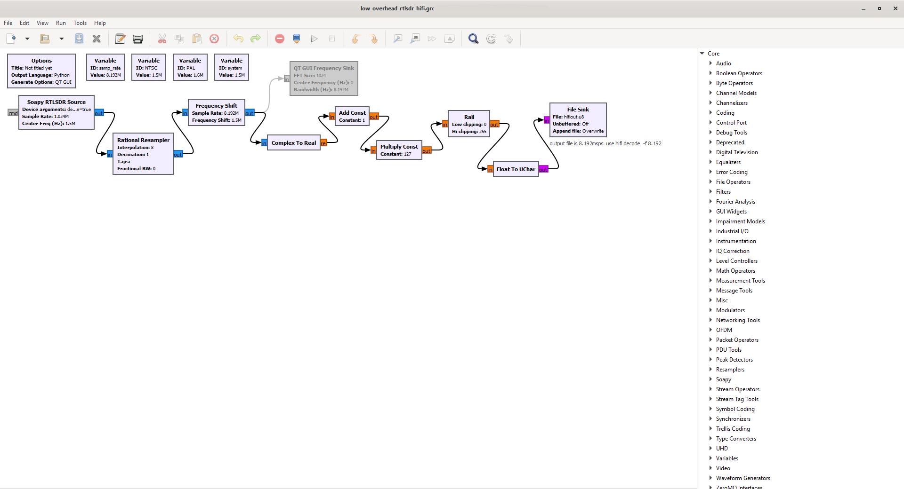

# RTL SDR

RTL SDRs are one of the cheapest and most generic USB 2.0 Software Defined Radio (SDR) devices on the market while not enough sampling for video has become quite useful for HiFi decoding and calibration.

### RF Connector Adapters BNC Male to SMA Male [Aliexpress Link](https://www.aliexpress.com/item/1005003752819752.html?)

Pictured Order: TNC Male to SMA Male / TNC Female to SMA Male / BNC Male to SMA Male / BNC Female to SMA Male / [Nooelec RTL-SDR v5](https://www.amazon.co.uk/dp/B01HA642SW/)

# RTL-SDR HiFi-Decode 

These 2 GNU Radio Scripts (NTSC/PAL) will automatically connect to the RTL-SDR and use it as an RF input.

## Features

- Real-Time Playback

- FLAC 24-bit 48khz

- 8msps 8-bit Unsinged (.u8) 

This GNU Radio script is capable of real-time sound playback alongside decoding to a 24-bit 48khz FLAC file and outputting an FM 8msps 8-bit u8 file.

This allows for fine adjusting of HiFi FM tracking before doing a full capture with a CX Card or DdD for example.

[Example FLAC File Output](https://drive.google.com/u/1/uc?id=1DHR3vZYgDFcDiITpXyChp5JhdPWVKOIM&export=download)

## RTL SDR Driver Windows Install

The RTL SDR (and clones) will show up as "Bulk-In, Interface (Interface 0)

Simply select the device, then click install WinUSB.

[Zadig Tool Download](https://zadig.akeo.ie/)

## Usage 

Install GNU Radio [Linux](https://wiki.gnuradio.org/index.php/InstallingGR) / [Windows](https://github.com/ryanvolz/radioconda/releases/)

Connect an RTLSDR to the HiFi Test Point on your VCR. 

Simply run GNU radio companion then file --> Open --> Select the NTSC/PAL Script

<kbd>F6</kbd> Will Export the script to a python `.py` file.

<kbd>F6</kbd> Will run the script.

<kbd>F7</kbd> Will stop the script. 

The FM RF output is defined by the `File Sink` 

The FLAC audio output is defined by the `Wav File Sink`

 

You need to set the output location, to do this double click on a module and set the location you wish to save your files to, be sure to name them differently each time or the script will overwrite the previous file.

 

## The Scripts

There are 2 standard `.grc` GNU radio scripts are provided below.

[RTLSDR HiFi NTSC Download](https://drive.google.com/uc?id=1DFdm2zgPnR6fxxDzJgTO0SHLCmLlsjuo&export=download)

[RTLSDR HiFi PAL Download](https://drive.google.com/uc?id=1DDvQH6GuRWzJOi4usA9-06BKMpcsDVF6&export=download)

[RTLSDR HiFi NTSC/PAL Low Overhead Download](https://github.com/tandersn/GNRC-Flowgraphs/blob/main/low_overhead_rtlsdr_hifi/low_overhead_rtlsdr_hifi.grc) - Capture Only (8.192msps)

## RTL SDR Sample Rates

The max sample rate of the RTLSDR is 3.2 MSPS I/Q or 3.2 MHz of total bandwidth.

You can change this with the `sample_rate` module. (Bottom Left)

RTL-SDR Rates In GNU Radio

`250000.000000`, `1024000.000000`, `1536000.000000`, `1792000.000000`, `1920000.000000`, 
`2048000.000000`, `2160000.000000`, `2560000.000000`, `2880000.000000`, `3200000.000000`.

## Working sample rates for Real-Time HiFi-Decode PAL (GNU Radio)

3 sample rates work with the script before it starts skipping (Tested on Ryzen 5800x) 

1   MSPS = `1024000.000000`

1.5 MSPS = `1536000.000000`

1.9 MSPS = `1920000.000000`

## Credit 

[Adam R](https://github.com/AR1972) for creating these scripts and [Tony Andersan](https://github.com/tandersn) for R&D. 

