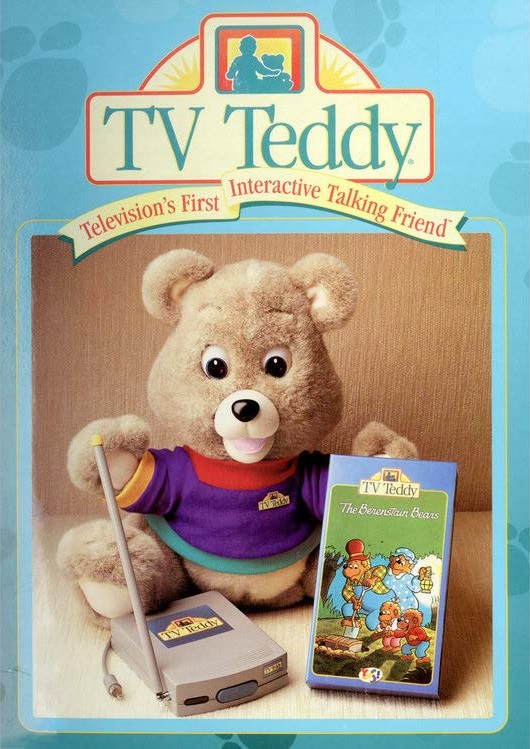
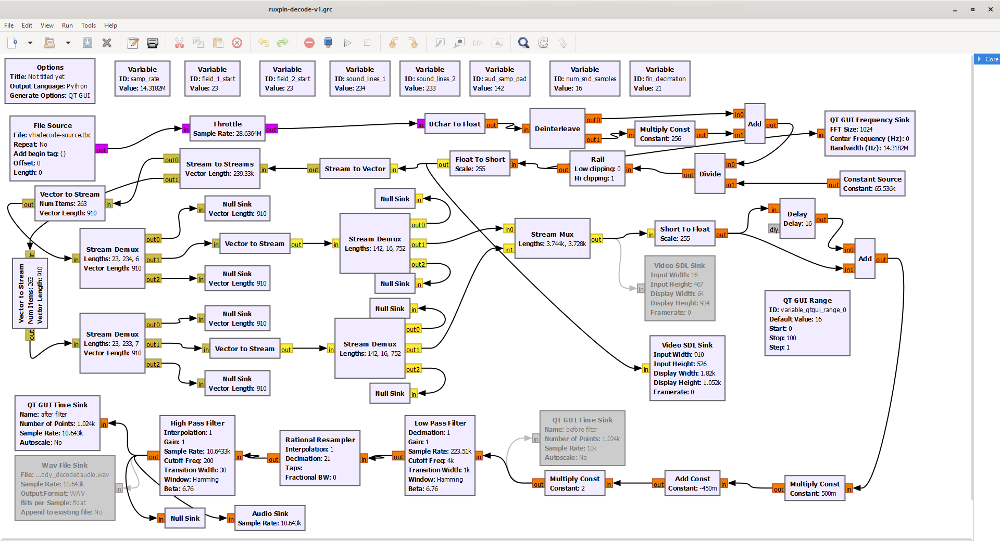
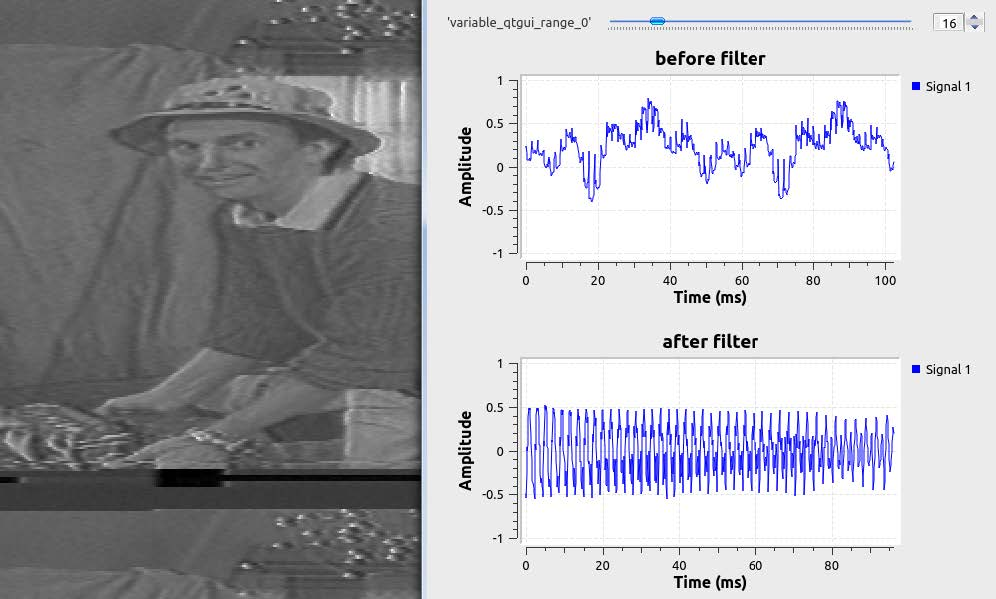
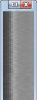
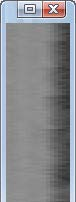

# Ruxpin Decode

{: style="width:200px"}

# Archive Data 

The TV Teddy Tape FM RF archive is published on [The Internet Archive](https://archive.org/details/tv-teddy-yankee-doodle-cricket-vhs-rf-capture) for public download and decoding.

# Background

TV Teddy is an interactive Teddy Ruxpin children’s toy
developed and sold by Shoot the Moon Products, Inc. in 1993.
Shoot the Moon was founded in 1991 by David Small and Paul
Rago. 

Its purpose is to give children a talking friend they can
hold and enjoy while watching live action home videos starring
Douglas Manes. The ongoing theme was “Anthony’s Attic”
where Teddy would spectate and make comments on the
adventures in Anthony’s house and said attic. Each episode
often featured another animated cartoon presented in the form
of “edutainment.” These were created, written, and produced by
Dave Wollert.

The toy itself was battery operated and its eyes also
animated when speaking. The kit included a transmitter as well
as a single Berenstain Bears VHS video tape. Several other
tapes could also be purchased.

{: style="width:250px"}

# Theory of Operation

According to Shoot the Moon's website, two patents behind
the main technology were filed: 5,808,689 and 6,040,870.
The purpose being to develop a 'Method and apparatus for
nesting secondary signals within a television signal." This
ultimately was implemented as a single device to both
decode and transmit Teddy's voice to the directly to the toy.

The voice signal is stored after the horizontal blanking
interval of the video signal. This appears as an animated
gradient vertical bar on the far left side of the image. This is
typically not visible on traditional CRT TVs of the time, as
It lives in the overscan area of the picture tube.

The decoder appears to utilize a buffer to ensure a constant
stream of audio samples is fed to the onboard DAC.
Although the Teddy audio used a fixed sample rate, it is still
an imperfect analog signal.

# Specification

{: style="width:250px"}

The audio subcarrier is a simple stream of
brightness values, sampled once per line within the active
video overscan area. Not every line has a sample, as the
vertical blanking interval has to remain in tact. This limits
the overall sample rate to 14,010Hz, providing about 7kHz
of audio bandwidth. This is more than enough to represent
speech, and all 7kHz does not appear to be used.

To be more specific, each interlaced frame has two fields
with one field containing 233 samples and the other field
containing 234. Each field begins with two digital bits on
lines 21 and 22, with the audio starting on line 23. The first
bit of the preamble is always high, likely for sync. The
second bit is high when Teddy is silent and only low when
Teddy is speaking and animating. The transmitter had a
red power LED and a green activity LED when speaking.

------

{: style="width:500px"}

 Each audio sample is approximately
the length of the colorburst. At maximum
amplitude it is at peak white, and at minimum
it is at black. Zero amplitude is gray. Dynamic
range is good, but is limited as sync level
black cannot be used, or the video signal
sync becomes corrupt. This technically may
violate the NTSC video standard, but does
not produce any adverse affects on any
consumer equipment.

# Software Implementation

Software decoding of the tapes is achieved with [vhs-decode](https://github.com/oyvindln/vhs-decode#readme) & [GNU Radio](https://wiki.gnuradio.org/index.php?title=InstallingGR).

You can [Download this GNU Radio Flow Graph Here](https://drive.google.com/open?id=1TRokSrYx1cy4qiabEFE2QOUyQDBRyWMB&)

Audio Samples are also avalible [Sample 1](https://drive.google.com/open?id=1TQRb-vd32Aoaz0Ja6y6G11g7cdLID2fq&) / [Sample 2](https://drive.google.com/open?id=1TQK5QcCNH4Yhotj2FNI7WQb9byL-Ouw4&)

{: style="width:800px"}

{: style="width:600px"}

GNU Radio Companion 3.9.5.0 is used to view the flow graph and make adjustments to settings, if needed
(more on adjustments later). 

It takes a vhs-decode time base corrected luminance waveform (.TBC file) as an input. 

Ruxpin decode then converts this unsigned 16-bit integer stream into a more standard signed 16-bit stream.

From here, the audio is sampled as 16 digital samples per analog sample and buffered
in a pair of vectors which feed to a pair of stream demux blocks. Next, the data goes to a
stream mux block which feeds a low pass filter, resampler, and high pass filter before feeding
to the final audio sink and WAV file sink. 

The final filtered and resampled WAV file sample rate is approximately 10kHz. 

Optional QT GUI and video SDL sinks can also be enabled for further real time analysis, but only one video SDL sink can be enabled at a time. The flow graph decodes in real time at 1x playback speed.

For best results, it’s recommended to run the luminance TBC file through the
ld-dropout-correct utility before decoding audio with Ruxpin decode. This will mask pops,
crackles, and static caused by tape dropouts. The dropout correction process substitutes a line
with dropouts with the last known good line.

# Adjustments and Troubleshooting

Ruxpin decode may not produce ideal results at first. Because of the nature of analog
video, you may get a high pitched noise or buzzing/crackling sounds. Three main factors can
cause this: field order, phase alignment, and head switching.

{: style="width:300px"}

The flow graph assumes a specific
field order (even/odd or odd/even). If the field
order is incorrect, this can cause a 30Hz
popping or buzzing sound. If you are hearing
this in the output, you can look for spikes in
the QT GUI time sink. If you see spikes, this
confirms the field order is wrong.

To correct this, reverse the values
of the sound_lines_1 and sound_lines_
variables (swap 233 and 234, essentially).

---------

Phase alignment is also critical. This
ensures the 16 sample points per line are
lined up with the beginning and end of the
audio sample period in the video signal.
Simply, the bar for the audio needs to be
lined up horizontally. The vertically stacked
video SDL sink can be used to visually
inspect this. When the alignment is off, a
high frequency tone can be heard.

------

To correct this, adjust the value of the
aud_sample_pad variable. Then run the flow
graph. Repeat this process until the bar is
perfectly centered in the preview and the
noise is gone.

Too Far Left / Centered / Too Far Right 

{: style="width:70px"} {: style="width:70px"} {: style="width:70px"} 

-------

{: style="width:300px"}

VCR video head switching is
necessary to obtain a seamless RF signal
from the tape. When this switch occurs, a
small amount of distortion is created on the
bottom of the image. The distortion is due to
the time base corrector adjusting to the
opposite head. The timing is VCR specific.

The head switch distortion must be
several lines below the last line in the audio
signal. If it is too close, noise will result. 4

-------

# Credits

Original concept and technology:
Shoot the Moon Products, Inc., YES! Entertainment

### Development:

9954tony on lddb.com forums / DD86 Discord

### Feedback and testing:

titan91 on lddb.com forums / videohelp.com forums / DD86 Discord

# Disclaimer

This flow chart and people involved in its development are not affiliated with Shoot the
Moon Products, Inc., YES! Entertainment, or Family Home Entertainment. 

This is a 100% “clean room” reverse engineering effort based purely on guess work, as the publicly available
patents also lack the fine detail needed to reproduce the technology in software. 

The patents are listed in this documentation for background purposes only. 

This flow chart may be freely redistributed and modified, and is unlicensed.

# Reference Materials

[Orignal PDF of This Page](https://drive.google.com/open?id=1TOYZxVq45zxYQjZLn_waJXQvuNmOU_WX&)

“Decoding TV Teddy – Part One: Discovery”
[Live](https://www.nicklansley.com/post/decoding-tv-teddy-part-one-discovery) / [Archive](https://web.archive.org/web/20230318110147/https://www.nicklansley.com/post/decoding-tv-teddy-part-one-discovery)

“Decoding TV Teddy – Part Two: Programming and Audio Output”
[Live](https://www.nicklansley.com/post/decoding-tv-teddy-part-two-programming-and-audio-output) / [Archive](https://web.archive.org/web/20230318110216/https://www.nicklansley.com/post/decoding-tv-teddy-part-two-programming-and-audio-output)

“VHS VCR Talking Teddy Bear”
[Live](https://www.youtube.com/watch?v=e5eH4wG9IgI) / [Archive](https://drive.google.com/open?id=1TMm8-VOG71eacZ3wvBTSOGZ0TOZwXv9A&)

“TV Teddy Featured on the BBC”

[Live (Dead)](https://www.youtube.com/watch?v=OVBQFxR6yhw) / [Archive To Be Aquired]()

