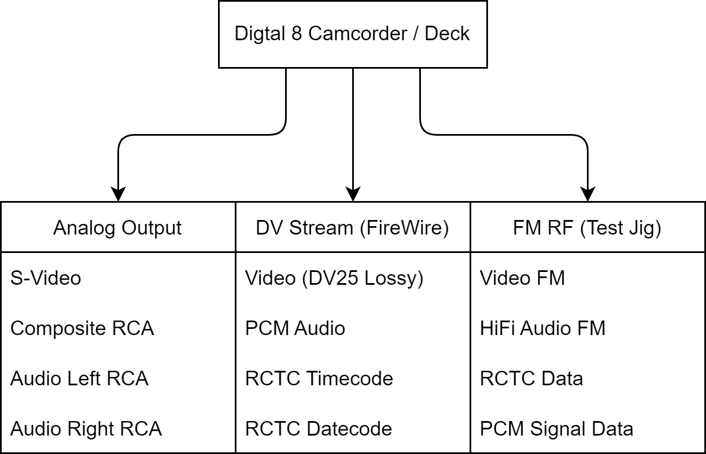
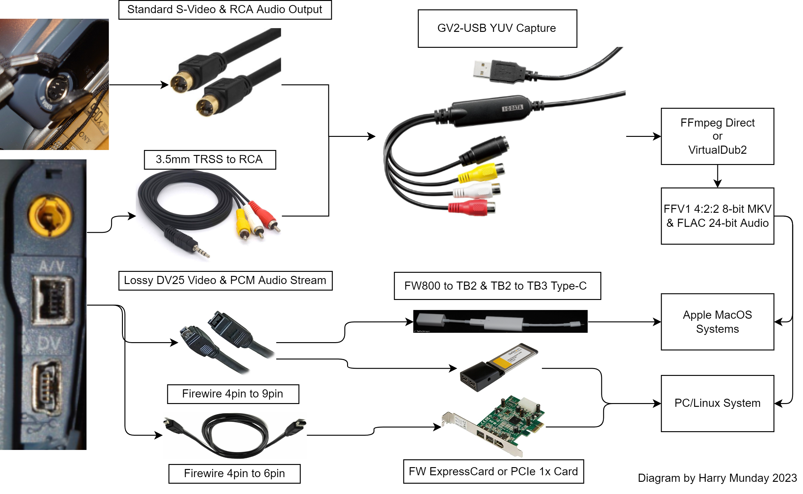
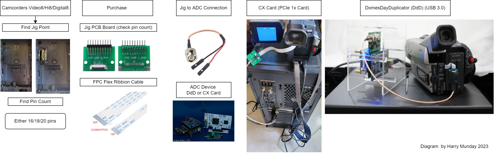

## Sony 8mm Formats

This is Video8, Hi8 and its transition/phase out format Digital8.

For Digital8 and DV25 capture read [Digital Tape Guide](Digital-Tape-Guide.md).

## Sony 8mm Capture 

!!! WARNING
    Not all 3.5mm TRSS to A/V or L/R/CVBS/GND cables are correct pinout for Sony camcorders, or use standard pinout headphone output ports.

    Always check that video is not being sent on the audio connection cable this will cause issues with both standard capture and FM RF capture.

Overview

{: style="width:400px"}

Conventional Capture Workflow 

{: style="width:800px"}

FM RF Capture Workflow

{: style="width:800px"}

### What is a Jig?

It is 2 things a ribbon cable, and a basic PCB that breaks out the connection points to large test probe points or standard header pins which are not practical to install into such small camcorder devices.

### What is a Flex or Ribbon Cable? 

Copper traces wrapped in plastic with exposed connection ends normally coated in silver or tin.

The Pitch is the thickness of the flex ribbon cable Sony use 0.5mm pitch cables.

## RF Capture Jig Setup (Camcorder/Portable Players)

{: style="width:400px"}

On most Sony Digital8 camcorders that support backwards playback, at the battery area, there is a rubber grommet or screw down plate once removed this exposes the Jig connection point for testing this is normally 16/18/20 pin ribbon connectors with a 0.5mm pitch, a readily available and generic interface this is the go-to method for Video8/High8 tape formats.

Simply visually check your pin amount and buy the correct jig with the links below.

Check the service manual to see what pins have the RF signal. A cap may be required in-line to get a workable signal depending on setup and device. Some users on the dd86 have had some trouble with getting good output from the newer Sony camcorders so what capacitor values and setups are optimal are not quite ironed out yet.

[Jigs (Unpopulated)](https://www.aliexpress.com/item/4001156449357.html?) / [Jigs (With 2.54mm pins)](https://www.aliexpress.com/item/1005003713202720.html?) / [Flex Cable 0.5mm Pitch](https://www.aliexpress.com/item/32916422564.html?) / [DuPont to BNC](https://www.aliexpress.com/item/1005004394809131.html?) [Type 2 USB Power Adapter](https://www.aliexpress.com/item/33033058175.html?) / [Type 1 USB Power Adapter](https://www.aliexpress.com/item/32963987768.html?)

# LANC Control 

Build your own control interface! 

Thanks to [Novgorod's Arduino LANC to USB](https://github.com/Novgorod/LANC-USB-GUI)

{: style="width:500px"}

# Digital8

!!! WARNING
    Ensure never to "hot plug" FireWire if doing duel capture this can damage equipment, if detection issues then turn camcorder off, then on again, but only plug/unplug live firewire with the playback device off. 

Digital8 Camcorders had backwards Support for Video8 and Hi8 and could digitise them to a DV25 stream via firewire which it natively uses for recording.

Note it is a very `Lossy Compressed` codec the minimum for no artefacts is considered DVCPro50 which is SD at 50-60mbps with 4:2:2 colour sampling and FFV1 10-bit 4:2:2 at 70-90mbps `Lossless Compressed`.

| Format     | Sub Sampling | Resolution    | Frame Rate | Bitrate       | Audio         | Date Code | Timecode  | Interface | Analogue Outputs    | Cross Support     |
|------------|--------------|---------------|------------|---------------|---------------|-----------|-----------|-----------|---------------------|-------------------|
| DV25 NTSC  | 4:1:1 8-bit  | 720x480       | i29.97     | 25-30mbps     | PCM 12/16-Bit | Yes       | Sub-Code  | FireWire  | 525-Line NTSC 3.58  | PAL               |
| DV25 PAL   | 4:2:0 8-bit  | 720x576       | i25        | 25-30mbps     | PCM 12/16-Bit | Yes       | Sub-Code  | FireWire  | 625-Line PAL        | NTSC 4.43 / PAL60 |

# Field Player/Recorders 

| Model	     | Type      | TV System    | User Manual  | Service Manual | Video8 / Hi8 Support | Service Jig Point | Tapped & Tested      |
|------------|-----------|--------------|--------------|----------------|----------------------|-------------------|----------------------|
| GV-D800    | Digital 8 | PAL          | Not Indexed  | Not Indexed    | Yes                  | Unknown           | None Documented      |
| GV-D200    | Digital 8 | PAL          | Not Indexed  | Not Indexed    | Yes                  | Unknown           | None Documented      |
| GV-A500    | Hi8       | NTSC         | Not Indexed  | Not Indexed    | Yes?                 | Unknown           | None Documented      |
| GV-500     | Video8    | NTSC         | Not Indexed  | Not Indexed    | Video8               | Unknown           | None Documented      |
| EV-DT1     | Video8    | NTSC         | Not Indexed  | Not Indexed    | Video8               | Unknown           | None Documented      | 
| GV-8       | Video8    | PAL          | Not Indexed  | Not Indexed    | Video8               | Unknown           | None Documented      | 

## NTSC (29.97i)

| Model	     | User Manual  | Service Manual | Video8 / Hi8 Support | Service Jig Point | Tapped & Tested      |
|------------|--------------|----------------|----------------------|-------------------|----------------------|
| DCR-TR7000 | Not Indexed  | Not Indexed    | Yes                  | Unknown           | None Documented      |
| DCR-TRV103 | Not Indexed  | Not Indexed    | Yes                  | Unknown           | None Documented      |
| DCR-TRV110 | Not Indexed  | Not Indexed    | Yes                  | Unknown           | None Documented      |
| DCR-TRV120 | Not Indexed  | Not Indexed    | Yes                  | Unknown           | None Documented      |
| DCR-TRV203 | Not Indexed  | Not Indexed    | Yes                  | Unknown           | None Documented      |
| DCR-TRV210 | Not Indexed  | Not Indexed    | Yes                  | Unknown           | None Documented      |
| DCR-TRV230 | Not Indexed  | Not Indexed    | Yes                  | Unknown           | None Documented      |
| DCR-TRV240 | Not Indexed  | Not Indexed    | Yes                  | Unknown           | None Documented      |
| DCR-TRV310 | Not Indexed  | Not Indexed    | Yes                  | Unknown           | None Documented      |
| DCR-TRV315 | Not Indexed  | Not Indexed    | Yes                  | Unknown           | None Documented      |
| DCR-TRV318 | Not Indexed  | Not Indexed    | Yes                  | 16pin 0.5mm Pitch | Yes 100uF Cap Added  |
| DCR-TRV320 | Not Indexed  | Not Indexed    | Yes                  | Unknown           | None Documented      |
| DCR-TRV330 | Not Indexed  | Not Indexed    | Yes                  | Unknown           | None Documented      |
| DCR-TRV340 | Not Indexed  | Not Indexed    | Yes                  | Unknown           | None Documented      |
| DCR-TRV350 | Not Indexed  | Not Indexed    | Yes                  | Unknown           | None Documented      |
| DCR-TRV351 | Not Indexed  | Not Indexed    | Yes                  | Unknown           | None Documented      |
| DCR-TRV360 | Not Indexed  | Not Indexed    | Yes                  | Unknown           | None Documented      |
| DCR-TRV361 | Not Indexed  | Not Indexed    | Yes                  | Unknown           | None Documented      |
| DCR-TRV380 | Not Indexed  | Not Indexed    | Yes                  | Unknown           | None Documented      |
| DCR-TRV460 | Not Indexed  | Not Indexed    | Yes                  | Unknown           | None Documented      |
| DCR-TRV480 | Not Indexed  | Not Indexed    | Yes                  | Unknown           | None Documented      |
| DCR-TRV520 | Not Indexed  | Not Indexed    | Yes                  | Unknown           | None Documented      |
| DCR-TRV525 | Not Indexed  | Not Indexed    | Yes                  | Unknown           | None Documented      |
| DCR-TRV530 | Not Indexed  | Not Indexed    | Yes                  | Unknown           | None Documented      |
| DCR-TRV730 | Not Indexed  | Not Indexed    | Yes                  | Unknown           | None Documented      |
| DCR-TRV740 | Not Indexed  | Not Indexed    | Yes                  | Unknown           | None Documented      |
| DCR-TRV828 | Not Indexed  | Not Indexed    | Yes                  | Unknown           | None Documented      |
| DCR-TRV830 | Not Indexed  | Not Indexed    | Yes                  | Unknown           | None Documented      |
| DCR-TRV840 | Not Indexed  | Not Indexed    | Yes                  | 20pin 0.5mm Pitch | Yes Direct           |
| DCR-TRV130 | Not Indexed  | Not Indexed    | No                   | Unknown           | None Documented      |
| DCR-TRV140 | Not Indexed  | Not Indexed    | No                   | Unknown           | None Documented      |
| DCR-TRV150 | Not Indexed  | Not Indexed    | No                   | Unknown           | None Documented      |
| DCR-TRV250 | Not Indexed  | Not Indexed    | No                   | Unknown           | None Documented      |
| DCR-TRV260 | Not Indexed  | Not Indexed    | No                   | Unknown           | None Documented      |
| DCR-TRV265 | Not Indexed  | Not Indexed    | No                   | Unknown           | None Documented      |
| DCR-TRV280 | Not Indexed  | Not Indexed    | No                   | Unknown           | None Documented      |

## PAL (25i)

These European camcorder models end with an “E”, the list below is backward compatible and can still playback Video8 and Hi8 PAL tapes originally recorded at 25 frames per second. 

Again if you are outside the US these are the camcorders for you, and if you can find one of these in the US they should also work for you as they all have duel PAL/NTSC support like most later PAL analogue equipment which is not seen on MiniDV however.

| Model	      | User Manual  | Service Manual | Video8 / Hi8 Support | FireWire Interface | Service Jig Point | Tapped & Tested |
|-------------|--------------|----------------|----------------------|--------------------|-------------------|-----------------|
| DCR-TR7000E | Not Indexed  | Not Indexed    | Yes                  |                    |                   |                 |
| DCR-TR7100E | Not Indexed  | Not Indexed    | Yes                  |                    |                   |                 |
| DCR-TRV738E | Not Indexed  | Not Indexed    | Yes                  |                    |                   |                 |
| DCR-TRV320E | [User Manual](https://www.manualslib.com/manual/157846/Sony-Handycam-Dcr-Trv320e.html)  | Not Indexed    | Yes                  | Yes                | Unknown           | No              |
| DCR-TRV330E  | Not Indexed  | Not Indexed    | Yes                  | Yes                | Unknown           | No                 |
| DCR-TRV340E  | Not Indexed  | Not Indexed    | Yes                  |                    |                   |                    |
| DCR-TRV460E  | Not Indexed  | Not Indexed    | Yes                  |                    |                   |                    |
| DCR-TRV461E  | Not Indexed  | Not Indexed    | Yes                  |                    |                   |                    |
| DCR-TRV238E  | Not Indexed  | Not Indexed    | Yes                  | Yes                | 20pin 0.5mm Pitch | Yes Direct         | 
| DCR-TRV239E  | Not Indexed  | Not Indexed    | Yes                  |                    |                   |                    |
| DCR-TRV8000E | Indexed      | Not Indexed    | Yes                  | Yes                | 20pin 0.5mm Pitch | Yes 10uf Cap Added |

Not confirmed.

| Model	      | User Manual  | Service Manual | Video8 / Hi8 Support | FireWire Interface | Service Jig Point | Tapped & Tested |
|-------------|--------------|----------------|----------------------|--------------------|-------------------|-----------------|
| DCR-TRV325E | Not Indexed  | Not Indexed    | Unknown              | Yes                | Unknown           | No              |
| DCR-TRV530E | Not Indexed  | Not Indexed    | Unknown              | Yes                | Unknown           | No              |
| DCR-TRV430E | Not Indexed  | Not Indexed    | Unknown              | Yes                | Unknown           | No              |
| DCR-TRV230E | Not Indexed  | Not Indexed    | Unknown              | Yes                | Unknown           | No              |
| DCR-TRV235E | Not Indexed  | Not Indexed    | Unknown              | Yes                | Unknown           | No              |
| DCR-TRV325E | Not Indexed  | Not Indexed    | Unknown              | Yes                | Unknown           | No              |
| DCR-TVR250E | Not Indexed  | Not Indexed    | No                   | Yes                | Known             | No              | 
| DCR-TRV255E | Not Indexed  | Not Indexed    | No                   | Yes                | Unknown           | No              |
| DCR-TRV265E | Not Indexed  | Not Indexed    | No                   | Yes                |                   | No              |

# Dedicated Recorders/Players

Model / Format / Sound / PCM / DCF / Year / € / Drive Comments

## Video 8 PAL

| Model	      | Format Support | Sound Support  | Year      | Price EUR | Drive Type | Frank Hirsinger's Notes                                                                                                |          
|-------------|----------------|----------------|-----------|-----------|------------|------------------------------------------------------------------------------------------------------------------------|
| CCD-V8      | V8             | o - -          | 1985      | €1500     | O          | originally camcorder; complete VCR, however, with Timer-Tuner Unit TT-V8E                                              |
| EV-C8       | V8             | o - -          | 1985-1986 | €900      | O          | first mobile V8 VCR for CCD M8E or as VCR for Timer/Tuner TT-V8E                                                       |
| EV-P10      | V8             | o - -          | 1987-1988 | €380      | O          | first V8 player (no record function!), designed for camcorder without playback option                                  | 
| EV-A300     | V8             | o (oo) + -     | 1986      | €850      | O          | with optional PCM Processor (PCM-EV10E) capable of 1 Track PCM                                                         |
| EV-S700     | V8             | oo 6tr. -      | 1986      | €1400     | O          | identical to EV-S600; rounded front panel                                                                              |
| EV-S600     | V8             | oo 6Dr. -      | 1987      | €1350     | O          | also marketed by Pioneer with some different functions and RC                                                          |
| EV-A200     | V8             | o - -          | 1987-1990 | €800      | O          | the standard V8 VCR following the 300 model, after the first Multi PCM models were on the market                       |
| EV-S650     | V8             | oo 6tr. -      | 1988-1989 | €1200     | O          | designed especially for DAV PCM recording and playback                                                                 |
| EV-S850     | V8             | oo 6Tr. -      | 1987-1990 | €1500     | O          | Sony's first model with Jog Shuttle                                                                                    |
| EV-S550     | V8             | oo st 1Tr. -   | 1990-1992 | €1400     | U          | precursor of the 1000; marks the end of the 6 track DAV standard (5 year run...); built in camcorder power source      |
| EV-C3       | V8             | o - -          | 1990-1993 | €400      | U          | first handy VCR for cutting and editing videos with a camcorder                                                        |
| EV-C45      | V8             | st - -         | 1992-1994 | €500      | U          | developed from the C3E, now with stereo sound                                                                              

## Hi8 PAL

| Model	      | Format Support | Sound Support  | Year      | Price EUR | Drive Type | Frank Hirsinger's Notes                                                                                                    |
|-------------|----------------|----------------|-----------|-----------|------------|----------------------------------------------------------------------------------------------------------------------------|
| EV-S1000    | V8 & Hi8       | oo st 1Tr      | 1990-1994 | €1500     | U          | probably the best selling Hi8 video cut VCR with PIP and separated pictures for input and output picture on one screen     |
| EV-S880     | V8 & Hi8       | st - yes       | 1993-1994 | €1100     | U          | developed from the 1000 with new designed circuit boards for mechanics and electronics                                     |
| EV-C500     | V8 & Hi8       | st - -         | 1993-1998 | €700      | U          | first handy hi8 VCR developed from the C45 (long time in the market)                                                       |
| EV-P25      | V8             | st - -         | 1994-1995 | €380      | U          | inexpensive V8 player (no recorder!)                                                                                       |
| EV-P300     | V8 & Hi8       | st - -         | 1994-1995 | €500      | U          | first inexpensive Hi8 player, developed from the P25                                                                       |
| EV-C400     | V8 & Hi8       | st - -         | 1996-2000 | €500      | F          | Hi8 VCR developed from the P series, however with the new F mechanics                                                      |
| EV-C2000    | V8 & Hi8       | st - yes       | 1995-2000 | €900      | F          | cheap version of the 9000 model, however without the motor driven panel. Capable of viewing and recording the RTC Timecode |
| EV-S9000    | V8 & Hi8       | oost 1Tr. yes  | 1995-1999 | €1750     | F          | last PCM VCR with digital pic. improvements like drop-out filter, digital comb filter; RTC ; Time Base Corrector           |
| EV-T1       | V8 & Hi8       | VHS st - yes   | 1996-1997 | €1650     | F          | Twin Recorder with Hi8 and VHS mechanics; very good picture due to DCF                                                     |
| SLV-T2000   | V8 & Hi8       | VHSst - -      | 1997-2001 | €1000     | F          | Inexpensive successor of the EV-T1VC                                                                                       |

## Explanations:

`o  ` = HiFi Mono via FM head signal   

`oo ` = Stereo via PCM; Mono over FM head signal  

`st ` = Stereo sound over polarized FM head signal  

`PCM` = Pulse Code Modulation. Here analogue signals are converted into binary signals. With this method, the carrier signal is in pulse form, the modulation signal is digital. 

`1Tr` = 1 Audio Track. 

`6tr` = 6 Audio Track.

`RTC` = Sony Re-Writable Consumer Timecode

`DNR` = Dynamic Noise Reduction = electronic noise reduction: The Dolby noise reduction system is well-known for audio cassette recorders.                                                    

`DCF` = Digital Comb Filter: Enables clean separation of interleaved colour and B/W signals. This prevents colour streaks and unsteady colour edges and enables crystal-clear and precise images.

PCM technology samples the analogue signal 8,000 times per second and converts it into an 8-bit signal, resulting in a sample every 125 µs. The resulting transmission speed is 64 kbit/s.      
1 Track is the 1 track PCM method that uses an additional track to dub V8 tapes. 

Sound recordings can also be made without a picture `6 track` refers to the `6 track PCM process`, which is only possible with DAV (Digital Audio Video) devices and enables 6 parallel tracks on one tape. Disadvantage: you can only listen to or record one track at a time. So no real multitrack method!                        

With the O-drive, the tape is wound counter clockwise around the head drum with a pin. 

With the U drive, 2 pins loop the tape around the head drum from both sides and "write" a "U". The F drive is a further development of the U drive. It has a more stable capstan shaft and also offers the option of very fast tape rewinding of just 1 minute (90s cassette) without wrapping around the head drum (tape protection). Some other weaknesses of the U drive have also been skilfully improved!                                                 

## References 

Thanks to [Bob Hennessey](https://transfervideotapes.com/digital8-camcorders-with-8mm-and-hi8-playback/) & [Frank Hirsinger](http://www.1ivanka.de/) for there charts, materials and collected manuals.

https://forum.videohelp.com/threads/355121-List-of-Sony-Handycam-Digital8-camcorders-with-analog-digital-passthru

