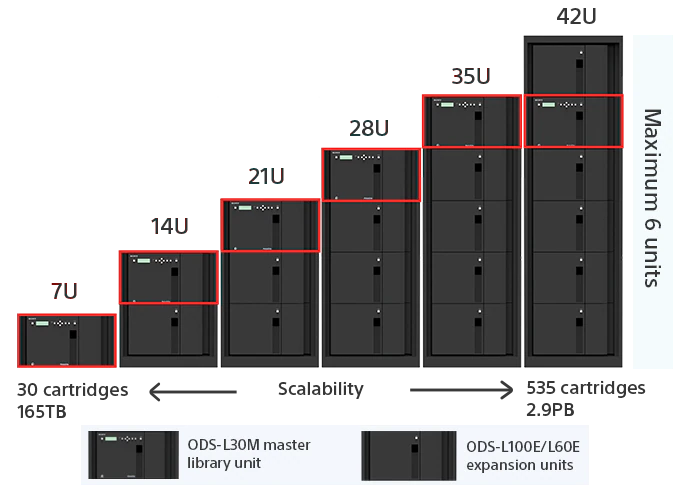

    
https://pro.sony/en_GB/products/optical-disc

* Discontinued support as of May 2023, (Will update if changes occur as this was quite popular as a one time migration workflow from LTO)

Sony has there own in-house version of M-Disk starting from 2006 with XDCAM discs to today with there Archive Disc, a translucent high-density duel sided write once disc.

{: style="width:300px"}

Using a platter of 12 (500GB) duel sided disks in a cartridge at 200USD per 5.5TB 

{: style="width:300px"}

A very cost-effective solution for large archives i.e 100+ 3-6 hour tapes, but at a cost of 4000-5000USD for the desktop reader/writer units these have a high entry adoption cost, the software suite is free and self-contained for Linux/MacOS/Windows but not open source however, disks do use the UDF (Universal Disk Format) system so can be read easily later on rated for a 50-100+ year shelf life.

{: style="width:300px"}

Rackmount scale in 7U units [PetaSite](https://pro.sony/en_GB/products/optical-disc/petasite-solutions) system with automated loading and unloading of cartridges providing a full-scale optical version of LTO, meant primarily for permanent offline or recovery backup storage as they can't be overwritten by software and require mechanical destruction to be erased, water chemical and electronic interference cant damage this format in most real-world disaster situations.

| Product	| Capacity (GB)	| Write Type | Generation |
|-----------|---------------|------------|------------|
| ODC300R	| 300	        | Write-Once | 1          |
| ODC300RE	| 300	        | Rewritable | 1          |
| ODC600R	| 600	        | Write-Once | 1          |
| ODC600RE	| 600	        | Rewritable | 1          |
| ODC1200RE	| 1200	        | Rewritable | 2          |
| ODC1500R	| 1500          | Write-Once | 2          |
| ODC3300R	| 3300	        | Write-Once | 2          |
| ODC5500R	| 5500	        | Write-Once | 3          |

The Interface is `SAS`, or `Fiber Channel`, however desktop units are `USB 3.0 Type-B`, `USB 3.2 (20Gbps) Type-C` or `Fiber` & `MiniSAS` with 19.5V power.
