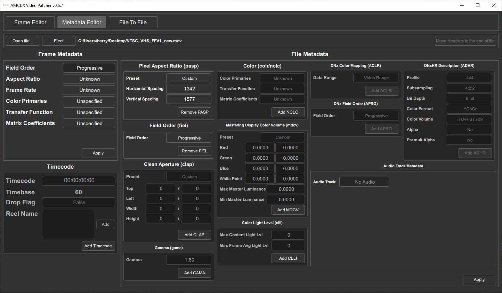
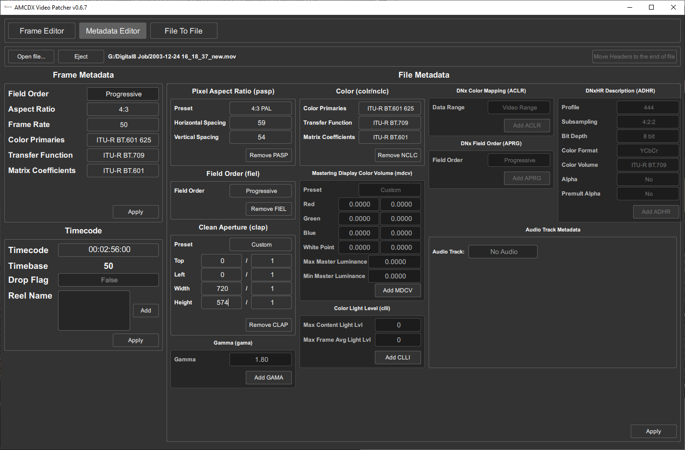
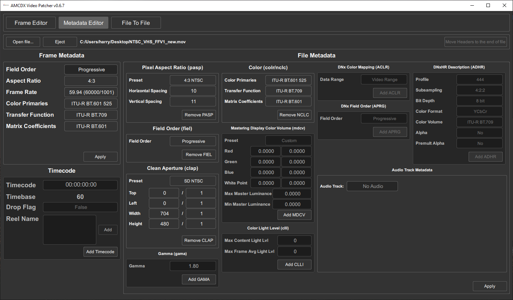

Back Page [RF Capture Decoding Guide](https://github.com/oyvindln/vhs-decode/wiki/RF-Capture-Decoding-Guide) 

Forward Page [Post Processing](https://github.com/oyvindln/vhs-decode/wiki/Post-Processing-Guide)

Sub-Page [Jitterbugs TBC-Video-Export Releases Page](https://github.com/JuniorIsAJitterbug/tbc-video-export/releases)

# Video Exporting

{: style="width:600px"}

## Breakdown

This is the part ware you take your luma & chroma data to the `ld-chroma-decoder` which combines it and then decodes it to a RGB or YUV stream with `FFmpeg` using the merge planes function, resulting in a final colour video stream that is encoded to FFV1 or to any other FFmpeg supported codec and container output format you wish to use.

You can add your own encoding profiles in the `tbc-video-export.json` file, which when present will be the profile options available to the export tool.

## **Notes!** 

Key Secondary Guide [Read Pre-Export LD-Analyse Guide Here](https://github.com/oyvindln/vhs-decode/wiki/RF-Capture-Decoding-Guide#adjusting-your-tbc-in-ld-analyse)

Colour-Under formats `VHS, Umatic, BetaMax, Video8, Hi8` etc are a `.tbc`/`_chroma.tbc` file (Y+C) set.

CVBS formats `Composite, LaserDisc, SMPTE 1" Type C` are 1 single `.tbc` file.

Always backup & keep your `.log` & `.json` files even if you delete your TBC files after you are happy with your export these still contain key metadata.

# Basic Use

!!! TIP
    The output name and directory will the the same as the input unless manually defined by the user.

Linux & MacOS

    tbc-video-export Input-Media.tbc

Windows

    tbc-video-export.exe Input-Media.tbc

The export tool takes `filename.tbc` / `filename_chroma.tbc` and metadata from the `.json` and create video files automatically for PAL or NTSC it can also timecode based off VITC data if present.

The default output format is:

- `Aspect Ratio 4:3` 
- `760x488 NTSC` or `928x576 PAL`
- `Interlaced Top Field First`
- `Video Codec: FFV1 10-bit 4:2:2` (70-100 Mb/s)
- `Audio Codec: FLAC`
  

Ideal starting point for post processing footage without VBI data, but will require [de-interlacing](https://github.com/oyvindln/vhs-decode/wiki/Deinterlacing) for online use.

## File Paths

Defining input location and output location is useful if your data is not inside the same folder as the export tool.

For Linux/MacOS based systems this is like:

`/home/harry/desktop/vhs-decode/Input.tbc`

For Windows this looks like

`"C:\Users\harry\Desktop\Decode\Input.tbc"`

## Time & Location Control

- `--skip`, `-s` Skips number of frames `-s 25` for example skips 1 second of PAL video.

- `--length`, `-l` Defines length to export so `-l 1500` is 1 minute of PAL video at 25fps.

## Audio 

Capture --> Decode --> [Auto Audio Align](https://gitlab.com/wolfre/vhs-decode-auto-audio-align) --> Mux with Video File

On tape Audio can be Mono, Stereo, Linear Timecode 

Head Switching can also be stored in audio from [cxadc-clock-generator-audio-adc](https://gitlab.com/wolfre/cxadc-clock-generator-audio-adc/).

You have 4 possible channels, 2 Linear & 2 HiFi FM - in SVHS and VHS HiFI camcorders and decks this audio is normally mirrored.

LaserDisc has 2 Analog channels which one can be populated with AC-3 or DTS digital this can be 4.0 or 5.1 surround.

Video8/Hi8 can have FM HiFi Audio and in some cases PCM audio.

Video8/Hi8/LaserDisc are always single clocked source capture so sync issues are a lot less of an issue.

--------

To embed an audio file use `--audio-track`

Example: 

`--audio-track HiFi_24-bit_48khz.flac` `--audio-track Linear_24-bit_48khz.flac`

To set the input file name, track name and language flags use `--audio-track-advanced`

Good to read: [FFmpeg Audio Channel Mapping](https://trac.ffmpeg.org/wiki/AudioChannelManipulation).

Language of the audio track i.g `en`, `jpn`, `cn`, `de` etc

`[file_name, title, language, rate, format, channels, channel_layout, time_offset]`

Example: 

`--audio-track-advanced '["tests/files/HiFi_24-bit_48khz.flac", "HiFi", "eng", "48000", "2", "00:00:00.000"]'` 

Example Basic 

    tbc-video-export --audio-track HiFi_24-bit_48khz.flac --audio-track Linear_24-bit_48khz.flac

Example Advanced

     tbc-video-export Input.tbc --audio-track-advanced '["tests/files/HiFi_24-bit_48khz.flac", "HiFi", "eng"]' --audio-track-advanced '["tests/files/HiFi_24-bit_48khz.flac", "Linear", "eng"]' output-name

## Audio Muxing LaserDisc 

`--process-efm` Decodes 4.0 or 5.1 AC3 to file 

`--process-efm-dts` Decodes 5.1 DTS to file.

## FFmpeg Profiles

!!! CAUTION
    Progressive video files will be 2x the size of interlaced files.

FFmpeg profile based de-interlacing can be done with `bwdif` & `w3dif` (see the tbc-video-export.json formatting for how to apply it to new profiles) for 50p/59.94p progressive files although [QTGMC](https://github.com/oyvindln/vhs-decode/wiki/Deinterlacing) is recommended for the best results today.

We have implemented ProRes & PCM audio modes for better support in [NLEs](https://en.wikipedia.org/wiki/Non-linear_editing) such as Davinchi Resolve.

!!! NOTE
    You can make/share you own FFmpeg profiles by editing the `tbc-video-export.json` as needed, however it may need to be edited every major update.

Define your profile with for example: `--profile ffv1_8bit_pcm`

Standard Profiles:

| Profile Name  | Codec         | Compression Type     | Bit-Depth | Chroma Sub-Sampling | Audio Format | Container | File Extension | Bitrate    |
|---------------|---------------|----------------------|-----------|---------------------|--------------|-----------|----------------|------------|
| ffv1          | FFV1          | Lossless Compressed  | 10-bit    | 4:2:2               | FLAC Audio   | Matroska  | .mkv           | 70-100mbps |
| ffv1_8bit     | FFV1          | Lossless Compressed  | 8-bit     | 4:2:2               | FLAC Audio   | Matroska  | .mkv           | 40-60mbps  |
| ffv1_pcm      | FFV1          | Lossless Compressed  | 10-bit    | 4:2:2               | PCM Audio    | Matroska  | .mkv           | 70-100mbps |
| ffv1_8bit_pcm | FFV1          | Lossless Compressed  | 8-bit     | 4:2:2               | PCM Audio    | Matroska  | .mkv           | 40-60mbps  |

Editing Profiles:

| Profile Name  | Codec         | Compression Type     | Bit-Depth | Chroma Sub-Sampling | Audio Format | Container | File Extension | Bitrate    |
|---------------|---------------|----------------------|-----------|---------------------|--------------|-----------|----------------|------------|
| prores_hq_422 | ProRes HQ     | Compressed           | 10-bit    | 4:2:2               | PCM Audio    | QuickTime | .mov           | 55-70mbps  |
| prores_4444xq | ProRes 4444XQ | Compressed           | 10-bit    | 4:4:4               | PCM Audio    | QuickTime | .mov           | 80-110mbps |
| v210          | V210          | Uncompressed         | 10-bit    | 4:2:2               | PCM Audio    | QuickTime | .mov           | 200mbps    |
| v410          | V410          | Uncompressed         | 10-bit    | 4:4:4               | PCM Audio    | QuickTime | .mov           | 400mbps    |

Web Profiles:

| Profile Name  | Codec         | Compression Type     | Bit-Depth | Chroma Sub-Sampling | Audio Format | Container | File Extension | Bitrate    |
|---------------|---------------|----------------------|-----------|---------------------|--------------|-----------|----------------|------------|
| x264_web      | AVC/H.264     | Lossy                | 8-bit     | 4:2:0               | AAC Audio    | QuickTime | .mov           | 8mbps      |
| x265_web      | HEVC/H.265    | Lossy                | 8-bit     | 4:2:0               | AAC Audio    | QuickTime | .mov           | 8mbps      |

Broadcast Profiles:

| Profile Name | Codec      | Compression Type | Bit-Depth | Chroma Sub-Sampling | Audio Format | Container                | File Extension | Bitrate |
| ------------ | ---------- | ---------------- | --------- | ------------------- | ------------ |--------------------------| -------------- | ------- |
| D10 PAL      | MPEG2      | Lossy            | 8-bit     | 4:2:2               | PCM Audio    | Material eXchange Format | .mxf           | 50mbps  |
| D10 NTSC     | MPEG2      | Lossy            | 8-bit     | 4:2:2               | PCM Audio    | Material eXchange Format | .mxf           | 50mbps  |

!!! NOTE
    The D10 or IMX50 standard is 720x512 NTSC & 720x608 PAL (SD + 32 lines for VBI area) standard for SD archive delivery and used by the BBC archive and many other broadcasters.

## Chroma-Decoder

Adjust values in ld-analyse to have your rough numbers

`--chroma-gain`    Chroma Level (Gain) factor applied to chroma components. `0 to 2` (Default `1`)

`--chroma-phase`   Phase rotation applied to chroma components (degrees) `-180 to 180` (Default `0`)

`--luma-nr`        Luma noise reduction level in dB. (decimal range) `0 to 10`  (Default `0`)

`--transform-threshold` Transform PAL chroma sensitivity (decimal range) `0 to 1` (Default `0.4`) 

Select Chroma decoder to use. 

`--chroma-decoder decoder` 

Defaults: 

PAL:
                        
- `transform2d` (default for PAL/PAL-M S-Video)
- `transform3d` (default for PAL/PAL-M CVBS)

NTSC:

- `ntsc2d` (default for NTSC S-Video and CVBS)
- `ntsc3d` (default for NTSC CVBS LD)

Available Decoders:

Monochrome: `mono`

PAL: `pal2d`, `transform2d`, `transform3d`

NTSC: `ntsc1d`, `ntsc2d`, `ntsc3d`, `ntsc3dnoadapt`

## Metadata 

`--export-metadata` 

Run ld-export-metadata before export. (default: no)

!!! NOTE
    The generated subtitles (closed captions) and ffmetadata will be used when encoding.

This is data such as `Title`, `Year`, `Camara`, `Tape Tape` and so on can be added to the final video files metadata.

Example:

`--metadata [{"title": "Birthday 2008", "JVC-GX250": "LP"}, {"year": 2008}]` 

Too add a custom or standard field to the metadata you can do as such for each article manually:

`--metadata "Video System" "PAL"` & `-metadata title="my title"`

Full Example:

`tbc-video-export Munday-Walking-Around-Garden.tbc --metadata "Tape Format" "VHS-C" --metadata "Video System" "PAL" --metadata "Tape Mode" "SP" --metadata "Title" "Munday Walking Around Garden" --metadata "Date" "2009-07-24" --metadata "Capture Date" "2022-09-08"`

Resulting Media Info Metadata Readout:

    General
    Unique ID                                : 189262425709654888565939284128344460936 (0x8E629E0783A839695528477CEDD64E88)
    Complete name                            : Munday-Walking-Around-Garden.mkv
    Format                                   : Matroska
    Format version                           : Version 4
    File size                                : 386 MiB
    Duration                                 : 30 s 160 ms
    Overall bit rate mode                    : Variable
    Overall bit rate                         : 107 Mb/s
    Frame rate                               : 25.000 FPS
    Movie name                               : Munday Walking Around Garden
    Writing application                      : Lavf60.3.100
    Writing library                          : Lavf60.3.100
    ErrorDetectionType                       : Per level 1
    Attachments                              : Munday-Walking-Around-Garden.tbc.json
    CAPTURE_DATE                             : 2022-09-08
    DATE                                     : 2009-07-24
    TAPE_FORMAT                              : VHS-C
    TAPE_MODE                                : SP
    Time code of first frame                 : 00:00:00:00
    Time code source                         : Matroska tags
    VIDEO_SYSTEM                             : PAL

# Frame Size Options

## Standard Export (4:3 Standard)

    tbc-video-export input.tbc

Standard 4:3 `760x488 NTSC` & `928x576 PAL`

{: style="width:500px"}

## `--luma-only`

Makes a Monochrome or Black & White Image using the Y channel or strips the colour carrier from a CVBS TBC.

{: style="width:500px"}

## `--letterbox`

16:9 Widescreen Letterbox Crop `928x432 PAL` & `760x432 NTSC`

These commands work well for 16:9 widescreen letterbox crop tapes rendering only the centre making a ideal image for scaling/de-interlacing to 720p 50/59.94p for progressive Blu-Ray mastering.

{: style="width:550px"}

## `--vbi`

Scaled `720x608 PAL` & `720x508 NTSC` (IMX/D10)

{: style="width:550px"}

## `--full-vertical`

Unscaled `928x608 PAL` & `760x508 NTSC`

!!! NOTE
    This is not perfect currently due to the lack of horizontal adjustment, this produces an full-vertical image frame allowing you to visually see VBI data, and syncs however, if your image is not centred properly this may crop the data.

{: style="width:550px"}

## `--full-frame` 

Full 4fsc Signal Frame  `910x524 NTSC` & `1135x624 PAL`

!!! NOTE
> Due to current code with the chroma-decoder this option is not available on current builds. 

{: style="width:600px"}

## `--luma-4fsc`

This option passes the TBC files to FFmpeg directly and exports only luma information.

Composite (Live CVBS Source)

{: style="width:620px"}

S-Video (Y with C Ignored) (VHS PAL SP Source)

{: style="width:620px"}

# Viewing Video Files On Computers

| `0-255` PC Black Levels | `16-235` TV Black Levels |
| ------------------------------------------------------------------------------------- | -------------------------------------------------------------------------------- |
| {: style="width:600px"} | {: style="width:600px"} |

### We recommend [Media Player Classic](https://codecguide.com/download_k-lite_codec_pack_mega.htm) & [VLC](https://www.videolan.org/)

Due to displays on TV and PC displays using different levels, you need to convert `16-235` to `0-255` this can be done via a simple shader filter in MPC for example.

Example Filter Settings:

{: style="width:500px"}

## Export Level Control 

The chroma-decoder can produce images that are not to correct black levels for PC use.

This can be corrected very primitively with initial export (no recommended if re-mastering in Resolve)

Example: `--force-video-black-level 32`

If a single value is defined such as `32` this will uniformly apply to `R`/`G`/`B` colour if 3 values are defined it will adjust each channel.

This should only be used for PC as it will break TV Legal levels of `16-255`

## DaVinchi Resolve Manual Curve Adjustment

{: style="width:1000px"}

(**NOTE** BetaMax media releases will have ColourBars at the start for reference use with a vector scope to do proper corrections.)

# Test your images on different displays 

Depending on the colour accuracy of your display these images can look bright white in the yellows this is called `white level clipping` you need to adjust your display.

The example here is `2 sRGB photos taken of 2 displays`

| This one should be clean and even exposure  | This one should look clipped in the right corner |
| ------------------------------------------------------------------------------------- | --------------------------------------------------------- |
| {: style="width:600px"} | {: style="width:600px"} |

## Colr & CLAP Atom Setting

This is for altering the flagging data inside the `mov`, `mp4` & `mxf` containers.

This is the reason why proper mastered media will only show above the active head switch area when displayed on a TV/System with standard video flag support.

AMCDX Video Patcher [Live Link](https://mogurenko.com/2021/01/29/amcdx-video-patcher-v0-6-7/) / [Archive Link](https://drive.google.com/open?id=1oZbpRDxrBZlvx-nl1FgK722InqhyeLKC) This tool is dead simple to use and allows you to correctly flag recordings colour/timecode information, this allows files to be hardware & industry standard software compatible.

Example of a blank and correctly flagged progressive exports for NTSC & PAL using ProRes HQ / V210.
 
| Blank: | PAL:  | NTSC: |
|--------|-------|-------|
| {: style="width:600px"} | {: style="width:600px"} | {: style="width:600px"} |

## YouTube Upload 

Firstly, the correct way to word a video involving the projects is to state its an `FM RF Capture`.

That RF Capture is decoded with `VHS-Decode`, `LD-Decode` and or `HiFi-Decode` etc for example.

Its always best to separate the hardware archival method from the current software generated video files when representing the projects.

RF capture files are the archive, not the decode results as they can always be improved so never be considered a "final" so if possible its recommended to always share source FLAC compressed RF on [The Internet Archive](The-Internet-Archive.md).

To upload anything on YouTube you will need to upscale to the 2160p or "4k" bracket `2880x2176` to avoid horrible macro blocking due to forced re-compression its best to start with lossless FFV1 10-bit export and then do your upscaling and de-interlacing via StaxRip or Hybrid or Vapoursynth directly.

Here is 2 very basic all FFmpeg based scripts but QTGMC is normally better and IVTC for 24p wrapped media.

PAL

`ffmpeg.exe -hwaccel auto -i "%~1" yuv422p10le -vf scale=2880:2176 -c:v ffv1 -aspect 4:3 -vf bdwif auto -c:a copy -color_range tv -color_primaries bt470bg -colorspace bt470bg -color_trc bt709 "%~n1_YT_4k_Scaled.mkv"`

NTSC

`ffmpeg.exe -hwaccel auto -i "%~1" yuv422p10le -vf scale=2880:2176 -c:v ffv1 -aspect 4:3 -vf bdwif auto -c:a copy -color_range tv -color_primaries smpte170m -colorspace smpte170m -color_trc bt709 "%~n1_YT_4k_Scaled.mkv"`

For use on Odysee

You can pick either `x264_web` or `x265_web` depending on how much system/client support of streaming you want.

    tbc-video-export --profile x264_web example_decoded_media

!!! NOTE
    Odysee uses direct streaming, no on the fly transcode/re-encoding so care has to be taken to avoid client side playback issues, i.g non phone users.

## Export Tool Features 

- .tbc and extension-less file input
- S-Video & CVBS TBC file set input support
- Automatic PCM Muxing for LD-Decode
- Automatic Timecode from VITC
- Audio Language & Track Name setting Support
- PCM Audio profiles for editing support
- Lossless compressed FFV1 Profiles
- ProRes HQ & 4444XQ Profiles
- V210 & V410 Uncompressed Profiles
- AVC/H.264 & HEVC/H.265 De-interlaced Web Profiles

## Credits

- [Jitterbug](https://github.com/JuniorIsAJitterbug) / [Video Dump Channel](https://www.youtube.com/@videodumpchannel/videos) for making tbc-video-export!

- [Harry Munday](https://github.com/harrypm) for tbc-video-export's development direction, feature testing and its icon.

- `Wrapscallion (Ty)` on the DD86 Discord for showing `AMDCX Videop Patcher` this truly invaluable and easy-to-use cross-platform tool.

# Page End 

Next Page [Post Processing](https://github.com/oyvindln/vhs-decode/wiki/Post-Processing-Guide)

Sub-Page [Jitterbugs TBC-Video-Export Releases Page](https://github.com/JuniorIsAJitterbug/tbc-video-export/releases)

Back Page [RF Capture Decoding Guide](https://github.com/oyvindln/vhs-decode/wiki/RF-Capture-Decoding-Guide) 