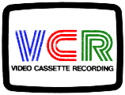

# WE NEED SAMPLES!

[Support List (Issue #20)](https://github.com/oyvindln/vhs-decode/issues/20)

Ideally 1-5min FLAC compressed, at 28-40msps or higher upload samples to [Telegram](https://t.me/decode_samples) or email (harry@opcomedia.com)

BetaMax NTSC/PAL needs more samples from fresh media and old media.

Betacam/Betacam SP & MI/MII

W-VHS/MUSE. 

Video2000

2" Quadruplex (any and all format versions)

1" SMPTE A/B/C

# Index 

- [CVBS Composite](#composite-video)

## Open Reel Formats

   - [EIAJ-1](#eiaj)
   - [EIAJ-2](#eiaj)

## Colour Under Formats

   - [VHS](#vhs)
   - [SVHS](#s-vhs-super-vhs)
   - [Betamax](#betamax-eta)
   - [Sony 8mm](#sony-8mm)
     - [Video8](#video8)
     - [HI8](#hi8)
   - [Umatic](#umatic)
   - [VCR](#philips-vcr)
   - [Video2000](#philips-video-2000)

## Broadcast Formats

   - [1" Type C](#1-smpte-type-c)
   - [Betacam](#betacam)
   - [Betacam SP](#betacam-sp)

## Toy Formats

  - [PLX2000](#pxl-2000)

## Types Of TV Systems 

525 Lines (NTSC)

625 Lines (PAL)

405 Lines / 819 Lines / 655 Lines (Older/Obscure now)

NTSC / NTSC-J (Black level difference is all)

PAL / PAL-M (525 line with PAL colour encoding)

SECAM / MESECAM (The French being [French](https://en.wikipedia.org/wiki/SECAM))

HDVS/MUSE/Hi-Vision (1125-lines 1035-lines active 1035i)

# Composite Video

| Signal Format | Resolution | Field System | TV System | Aspect Ratio | RF Capture Support | Decoding Support |
|---------------|------------|--------------|-----------|--------------|--------------------|------------------|
| CVBS          | 525 Lines  | Interlaced   | 525 NTSC  | 4:3 / 16:9   | Yes*               | Yes*             |
| CVBS          | 625 Lines  | Interlaced   | 625 PAL   | 4:3 / 16:9   | Yes*               | Yes*             |
| CVBS 240p     | 240 Lines  | Progressive  | NTSC      | 4:3 / 16:9   | Yes*               | Yes*             |
| CVBS 288p     | 288 Lines  | Progressive  | PAL       | 4:3 / 16:9   | Yes*               | Yes*             |
| 960h CCTV     | 960 x 576  | Interlaced   | N/A       | 16:9 Only    | Yes*               | Not Tested       |

*Capture is currently only reliable with the [MISRC](MISRC-Multi-Input-Simultaneous-RF-Capture.md#FIXME)

Capture is possible via [CX Cards](CX-Cards.md) currently (Other SDR units may also work with the correct input filter range)

# VHS

{: style="width:200px;height:100px"}

| Tape Format | Resolution | Tape Speed | TV System   | RF Capture Support | Decoding Support |
|-------------|------------|------------|-------------|--------------------|------------------|
| JVC VHS     | 240 Lines  | SP         | 625 PAL     | Yes                | Yes              |
| JVC VHS     | 240 Lines  | LP         | 625 PAL     | Yes                | Yes              |
| JVC VHS     | 240 Lines  | EP         | 625 PAL     | Yes                | Yes              |
| JVC VHS     | 240 Lines  | SP         | 525 PAL-M   | Yes                | Yes              |
| JVC VHS     | 240 Lines  | LP         | 525 PAL-M   | Yes                | Yes              |
| JVC VHS     | 240 Lines  | EP         | 525 PAL-M   | Yes                | Yes              |
| JVC VHS     | 240 Lines  | SP         | 625 MESECAM | Yes                | Yes              |
| JVC VHS     | 240 Lines  | LP         | 625 MESECAM | Yes                | Yes              |
| JVC VHS     | 240 Lines  | EP         | 625 MESECAM | Yes                | Yes              |
| JVC VHS     | 240 Lines  | SP         | 525 NTSC    | Yes                | Yes              |
| JVC VHS     | 240 Lines  | LP         | 525 NTSC    | Yes                | Yes              |
| JVC VHS     | 240 Lines  | EP         | 525 NTSC    | Yes                | Yes              |
| JVC VHS     | 240 Lines  | SP         | 525 NTSC-J  | Yes                | Yes              |
| JVC VHS     | 240 Lines  | LP         | 525 NTSC-J  | Yes                | Yes              |
| JVC VHS     | 240 Lines  | EP         | 525 NTSC-J  | Yes                | Yes              |

Ruxpin Tapes **GNU Radio Scripts available** [PDF Info](https://github.com/oyvindln/vhs-decode/blob/695d7d7afff524883c71c5d3ebedd0765fab6de8/tools/ruxpin-decode/readme.pdf) / [Lost Media Link](https://www.lostmediawiki.com/The_New_World_of_Teddy_Ruxpin_(partially_lost_animatronic_voiceovers_for_VHS_and_TV_content;_1998))

# S-VHS (Super VHS)

{: style="width:200px;height:90"}

| Tape Format | Resolution | Tape Speed | TV System | RF Capture Support | Decoding Support |
|-------------|------------|------------|-----------|--------------------|------------------|
| JVC SVHS    | 400 Lines  | SP         | 625 PAL   | Yes                | Yes              |
| JVC SVHS    | 400 Lines  | LP         | 625 PAL   | Yes                | Yes              |
| JVC SVHS    | 400 Lines  | EP         | 625 PAL   | Yes                | Yes              |
| JVC SVHS    | 400 Lines  | SP         | 525 NTSC  | Yes                | Yes              |
| JVC SVHS    | 400 Lines  | LP         | 525 NTSC  | Yes                | Yes              |
| JVC SVHS    | 400 Lines  | EP         | 525 NTSC  | Yes                | Yes              |

# BetaMax (βeta)

{: style="width:px"}

| Tape Format | Resolution | Tape Speed | TV System | RF Capture Support | Decoding Support |
|-------------|------------|------------|-----------|--------------------|------------------|
| Betamax     | 250 Lines  | βI         | PAL       | Yes                | Yes              |
| Betamax     | 250 Lines  | βI         | NTSC      | Yes                | Yes              |
| Betamax     | 250 Lines  | βII        | NTSC      | Yes                | Untested         |

!!! NOTE
   Betamax HiFi is very different between PAL and NTSC.  

   - NTSC Betamax works like LaserDisc Video8/Hi8 - with the FM HiFi audio fitted in between the colour-under chroma and the FM modulated luminance, with >the video heads capturing everything via a single RF path. 

   - PAL Betamax however works like VHS HiFi with depth multiplex and separate heads with different azimuth to the video heads, requiring two physical RF taps and two capture paths - one for video, one for HiFi audio. (There's no space in the video RF to squeeze the HiFi audio in PAL Betamax) 

# ED Beta 

Extended Definition Betamax

{: style="width:200px"}

| Tape Format | Resolution | Tape Speed | TV System | RF Capture Support | Decoding Support |
|-------------|------------|------------|-----------|--------------------|------------------|
| ED Beta     | 500 Lines  | βI         | PAL       | Yes                | Not implemented  |
| ED Beta     | 500 Lines  | βI         | NTSC      | Yes                | Not implemented  |

# Umatic

More Samples & Testing Required!

{: style="width:px"}

| Tape Format | Resolution | Tape Mode | TV System | RF Capture Support | Decoding Support |
|-------------|------------|-----------|-----------|--------------------|------------------|
| Sony Umatic | 250 lines  | LoBand    | 525 NTSC  | Yes                | Yes              |
| Sony Umatic | 250 lines  | LoBand    | 625 PAL   | Yes                | Yes              |
| Sony Umatic | 250 lines  | HiBand    | 625 PAL   | Yes                | Yes              |

{: style="width:250px"}

| Tape Format | Resolution | Tape Mode | TV System | RF Capture Support | Decoding Support |
|-------------|------------|-----------|-----------|--------------------|------------------|
| Sony Umatic | 320 lines  | HiBand SP | 525 NTSC  | Yes                | Implemented      |
| Sony Umatic | 320 lines  | HiBand SP | 625 PAL   | Yes                | Implemented      |

# Sony 8mm

Sony's portable consumer format had both camcorders and a limited range of VCRs.

Video8/Hi8 Runtime & File Sizes

| Format  | Time Minutes | Time Hours | DdD 10-bit Packed 40msps .lds | DdD 16-bit FLAC 40msps .ldf |
|---------|--------------|------------|-------------------------------|-----------------------------|
| PAL-SP  | 120 minutes  | 2 Hours    | 400GB +-                      | 150GB +-                    |
| PAL-LP  | 240 minutes  | 4 Hours    | 700GB +-                      | 250GB +-                    |
| NTSC-SP | 150 minutes  | 2.5 Hours  |                               |                             |
| NTSC-LP | 300 minutes  | 5 Hours    |                               |                             |

## Video8

{: style="width:140px"}

| Tape Format | Resolution | Tape Speed | TV System | RF Capture Support | Video Decoding Support | HiFi Audio Decoding Support |
|-------------|------------|------------|-----------|--------------------|------------------------|-----------------------------|
| Sony Video8 | 280 Lines  | SP/LP      | 625 PAL   | Yes                | Yes*                   | Yes*                        |
| Sony Video8 | 280 Lines  | SP/LP      | 525 NTSC  | Yes                | Yes*                   | Yes                         |

## HI8

{: style="width:180px"}

| Tape Format | Resolution | Tape Speed | TV System | RF Capture Support | Video Decoding Support | HiFi Audio Decoding Support |
|-------------|------------|------------|-----------|--------------------|------------------------|-----------------------------|
| Sony Hi8    | 415 Lines  | SP/LP      | 625 PAL   | Yes                | Yes*                   | Yes*                        |
| Sony Hi8    | 415 Lines  | SP/LP      | 525 NTSC  | Yes                | Yes*                   | Yes                         |

*Hi8 requires more work, but video8 is virtually near native hardware decoding for SP tapes. 

*HiFi PAL needs fine tuning. 

# EIAJ

| Tape Format | Resolution | Tape Mode  | TV System | RF Capture Support | Decoding Support |
|-------------|------------|------------|-----------|--------------------|------------------|
| EIAJ        | 300 Lines  | Monocrome  | 405 PAL   | Yes                | Preliminary      |
| EIAJ        | 300 Lines  | Monocrome  | 405 NTSC  | Yes                | Not implemented  |
| EIAJ        | 300 Lines  | Monocrome  | 625 PAL   | Yes                | Preliminary      |
| EIAJ        | 300 Lines  | Monocrome  | 525 NTSC  | Yes                | Not implemented  |
| EIAJ        | 300 Lines  | Colour     | 625 PAL   | Yes                | Preliminary      |
| EIAJ        | 300 Lines  | Colour     | 525 NTSC  | Yes                | Not implemented  |

# 1" SMPTE Type C

| Tape Format | Resolution | TV System | RF Capture Support | Decoding Support |
|-------------|------------|-----------|--------------------|------------------|
| Type C      | 430 Lines  | 525 NTSC  | Yes                | Preliminary*     |
| Type C      | 430 Lines  | 625 PAL   | Yes                | Preliminary*     |
| Type C      | 430 Lines  | 625 SECAM | Yes                | Not implemented  |

*Requires `--fallback_vsync` currently

# 1" SMPTE Type B

| Tape Format | Resolution | TV System | RF Capture Support | Decoding Support |
|-------------|------------|-----------|--------------------|------------------|
| Type B      | 430 Lines  | 625 PAL   | Yes                | Not implemented  |
| Type B      | 430 Lines  | 525 NTSC  | Yes                | Not implemented  |
| Type B      | 430 Lines  | 625 SECAM | Yes                | Not implemented  |

# Philips VCR 

Philips N1500, Philips N1700

{: style="width:150px"}

| Tape Format | Resolution | TV System | RF Capture Support | Decoding Support |
|-------------|------------|-----------|--------------------|------------------|
| VCR SP      | 200 Lines? | 625 PAL   | Yes                | Preliminary      |
| VCR LP      | 200 Lines? | 625 PAL   | Yes                | Preliminary      |

# Philips Video 2000

| Tape Format | Resolution | TV System | RF Capture Support | Decoding Support |
|-------------|------------|-----------|--------------------|------------------|
| Video 2000  | 230 Lines  | 625 PAL   | Yes                | Not implemented  |

{: style="width:150px"}

# BetaCam

{: style="width:250px"}

Samples are Required!

| Tape Format | Resolution | TV System | RF Capture Support | Decoding Support |
|-------------|------------|-----------|--------------------|------------------|
| PAL         | 320 Lines  | 625 PAL   | Yes*               | Not implemented  |
| NTSC        | 320 Lines  | 525 NTSC  | Yes*               | Not implemented  |

RF capture requires MISRC or CX Cards with Clockgen Mod as this requires 2 channels for Video.

# BetaCam SP

{: style="width:250px"}

Samples are Required!

| Tape Format | Resolution | TV System | RF Capture Support | Decoding Support |
|-------------|------------|-----------|--------------------|------------------|
| PAL         | 360 Lines  | 625 PAL   | Yes*               | Not implemented  |
| NTSC        | 360 Lines  | 525 NTSC  | Yes*               | Not implemented  |

RF capture requires MISRC or CX Cards with Clockgen Mod as this requires 2 channels for Video.

4ch Baseband Capture but AFM could be RF Captured and run though HiFi-Decode, samples are required. 

## MII

{: style="width:130px"}

Samples are Required!

| Tape Format | Resolution | TV System | RF Capture Support | Decoding Support |
| ----------- | ---------- | --------- | ------------------ | ---------------- |
| PAL         |     Lines  | 625 PAL   | Yes*               | Not implemented  |
| NTSC        |     Lines  | 525 NTSC  | Yes*               | Not implemented  |

RF capture requires MISRC or CX Cards with Clockgen Mod as this requires 2 channels for Video.

# PXL-2000

There is already a [decoder](https://github.com/sevkeifert/pxl-2000-decoder) and [YouTube Documentation](https://www.youtube.com/watch?v=G4hM5X7m5_k) on this.

# Page End 

Next Page [Hardware Installation Guide](Hardware-Installation-Guide.md)

Sub-Page [Identifying VBI Data](Identifying-vbi-data.md)