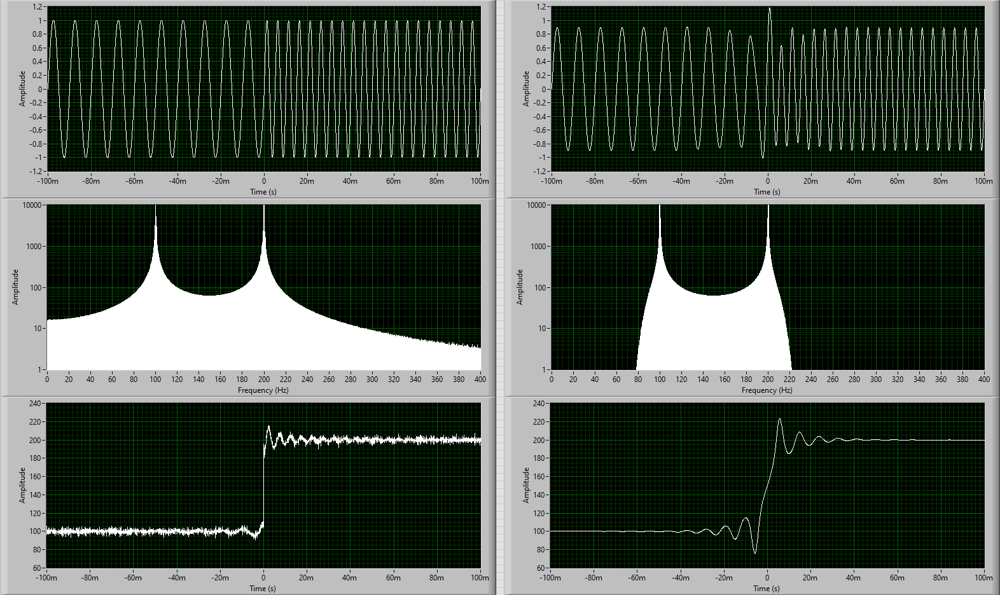
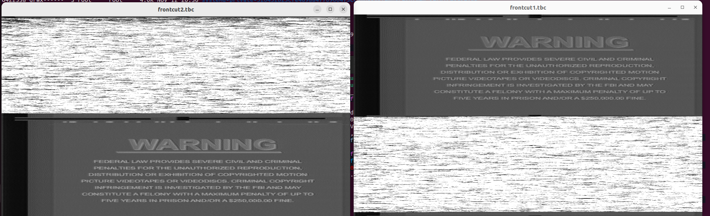
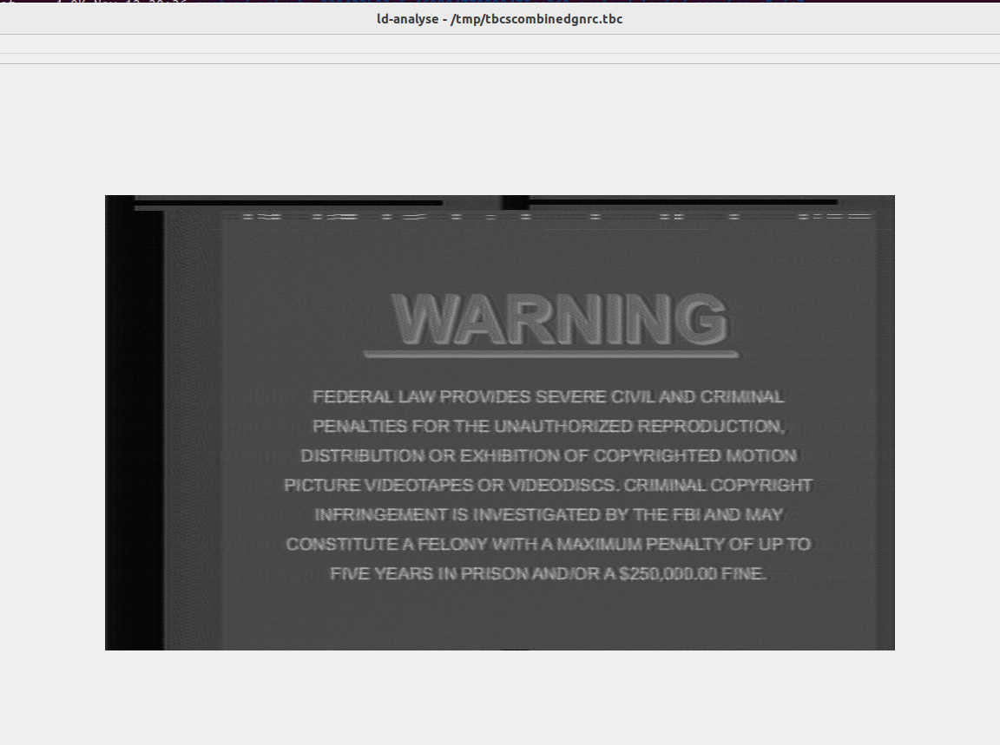
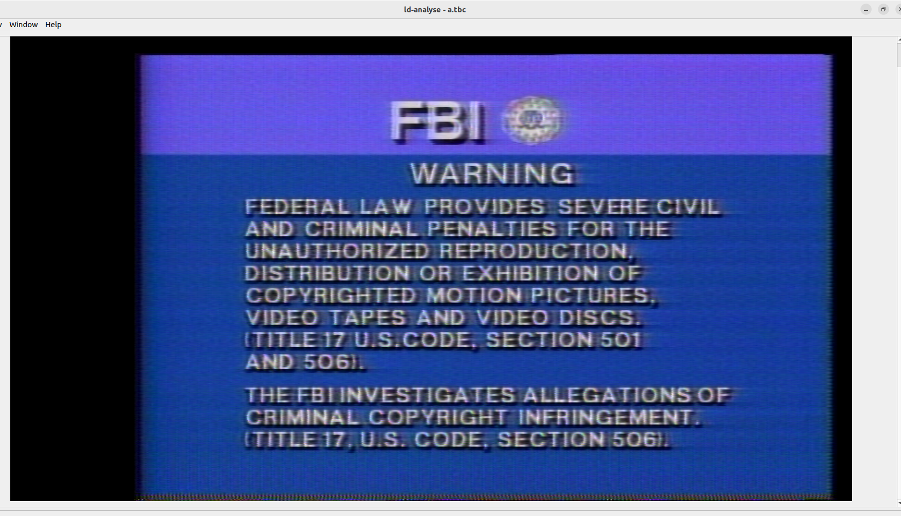
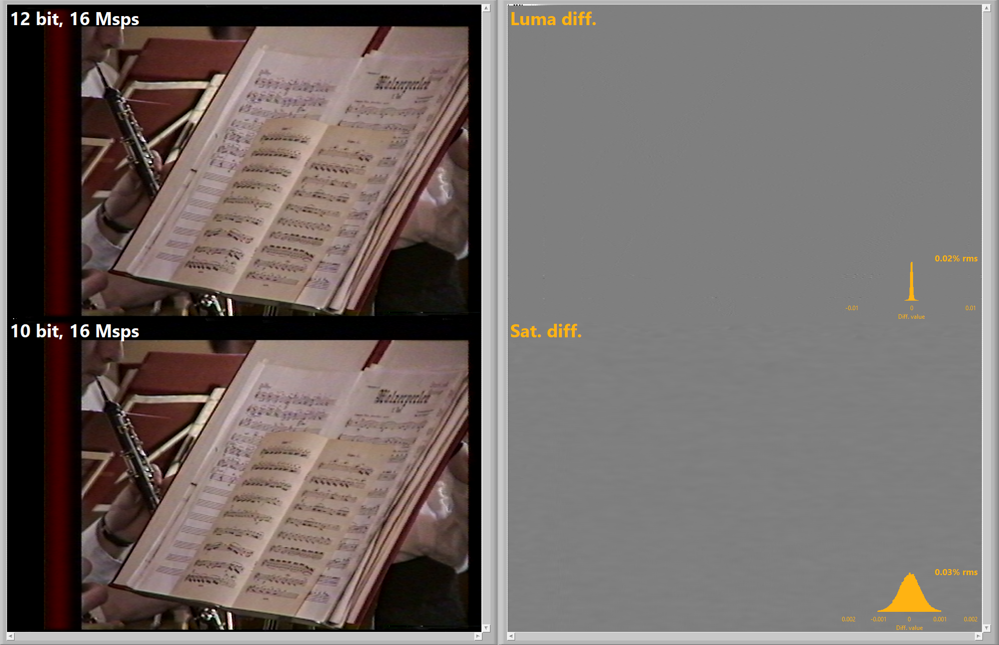
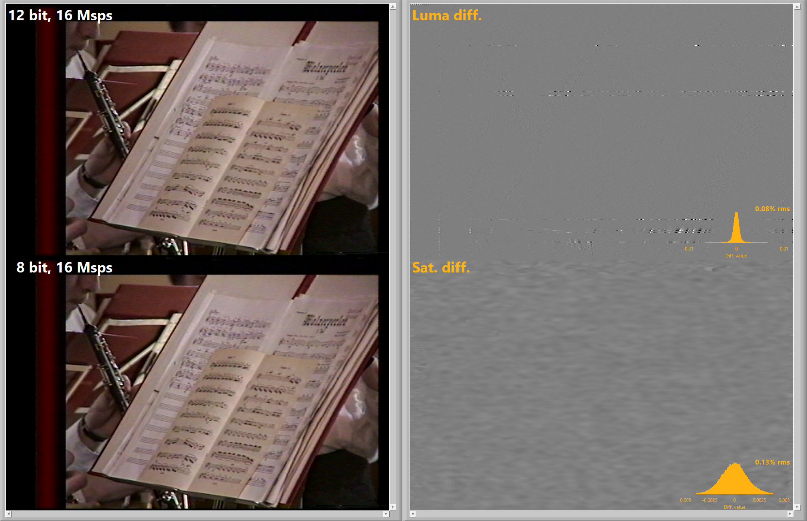
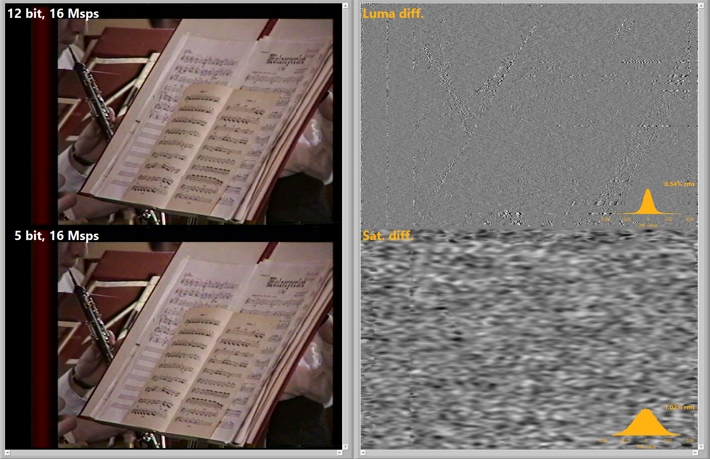
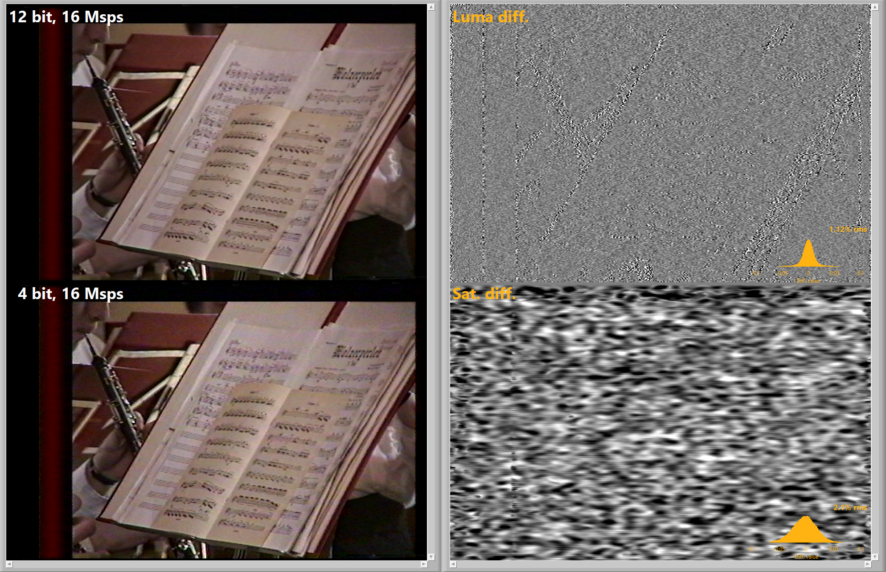
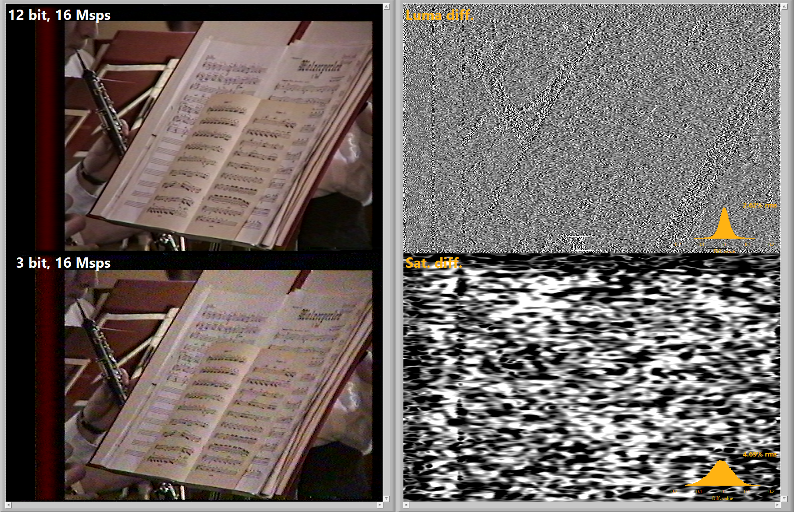

A collection of technical breakdowns and explainers about FM RF signals.

## Nyquist Shannon Sampling

[Interactive Webpage](http://195.134.76.37/applets/AppletNyquist/Appl_Nyquist2.html)

[Analogue to Digital Converter ADC](https://www.electronics-tutorials.ws/combination/analogue-to-digital-converter.html)

[D/A and A/D | Digital Show and Tell - Monty Montgomery](https://www.youtube.com/watch?v=cIQ9IXSUzuM)

[Introduction to ADC and DAC](https://www.youtube.com/watch?v=HicZcgdGxZY&)

## Sampling & Down-Sampling

Tony Anderson:

!!! CAUTION
    There needs to be a strong distinction made between acquisition and storage.  This is very important.  

You can't only consider "the signal you want to capture", but must also consider the stray and errant signals that are always present in the real world.  

You can "store" VHS at 16/18/20 msps, but only after running it through a software filter in SoX or GNURadio. 

Unless you have an effective 8mhz or 9mhz physical (hardware) low pass filter, you are going to get aliasing. I repeat "you are going to get aliasing". 

How much depends on the setup and varies from setup to setup. You "might possibly" end up with a perfect VCR in a location with no errant EMI, but that is going to be the exception and not the norm.  You can "store" the VHS captures at 20msps AFTER software low pass filtering.

In ADC design, you generally want a hardware filter that is strong well before Nyquist of the sampling rate.  Look at the sample rate of the ddd and filter curve.  The cx card on board filter is very weak, it will not filter signals over 10mhz that much.  the sxlp13+ will not either, as that is in the passband. 
imagine trying to audio record only your friends voice in a crowded room.

Going further, let's say you wanted to capture at a lower sample rate and were going to get a hardware low pass filter to do it (I've tried this, have the sxlp8+).  Mini-circuits has the sxlp8+, which is what you'd need for VHS, however, at 10mhz (Nyquist of 20msps), it's only at -6.61db. 

That's not enough, you want more attenuation than that at Nyquist. I like >  -30db at Nyquist.   In the analog domain, filters have slopes.

## FM RF Signals 

Quality of tape media is in direct correlation to bandwidth used and signal to noise ratio (SNR) lower bandwidth the lower potential SNR etc.

Thanks to Novgood for the explanation

In the frequency domain, you have to think in sine waves  - everything can be expressed as some (simple or super complex) combination of different sine waves .. Imagine you have 2 patches with different grey levels next to each other in a scan line.

 Each one has an "exact" FM frequency (or a perfect sine wave) to represent it, that means a constant grey level is ideally "infinitely" narrow-band (a single frequency). In this ideal case you'll get a signal discontinuity at the transition between the 2 sine waves where one wave "ends" and the next "starts". 

Even if you match the phase perfectly so that there's no jump in amplitude at the transition point, you'll still have a "kink" (that is, a jump in the derivative). Mathematically, you need "infinite" bandwidth to reproduce this perfect discontinuity with a superposition of different sine waves (that's what Fourier/spectral analysis does). 

In reality, this transition between the 2 frequencies takes some finite amount of time (the edge of a PWM or clock signal is not perfectly vertical) - or translated to FM, the sine waveform gets bent to close the discontinuity gap between the 2 frequencies. In this transition region it looks more like the edge of a pulse than a sine/cosine function, which requires a whole bunch of superimposed sine waves with different frequencies to produce. 

In fact, it takes the whole available bandwidth to approximate a sharp transition, and the "sharpness" of it reflects merely how much bandwidth was available.. Don't know if this makes it clearer or adds to the confusion - just think in sine waves ...

## FM Deviation Range 

The FM deviation range (4.2-5.4MHz for Video8) refers to **static** signals, like pure grey or pure white. Whenever you have quick transitions between brightness levels, i.e. the FM frequency has to change rapidly from one value to another, it creates sidebands (higher and lower frequencies), which go far beyond the FM deviation range and the required bandwidth to capture these transitions only depends on how quick the transition is in the time domain - that's the reason Hi8 captures finer features, because it supports faster FM transitions due to the higher overall bandwidth (not just the static deviation range). 

It's the classic time-bandwidth relationship: the shorter the pulse, the more bandwidth you need to capture it. So the only practical way is to look at spectrograms of different RF samples and see where either the tape or the recorder has capped the usable bandwidth. 

That's how I came up with 8MHz for Video8 and 10MHz for Hi8 (-> eyeballing). Of course you can extend the margins based on gut feeling, but digital band-limiting filters can be made very narrow, so there shouldn't be any issue with artefacts at the HF edge.

## Ghosting & Ringing 

Yes, the jump causes ringing, even in my "ideal" example, because the transition happens within 1 sample and not mathematically instantaneously (that would require infinite bandwidth or an infinitely long signal). Limiting the bandwidth further doesn't really change the ringing, it primarily makes the transition less sharp. There are special filter shapes to minimize ringing (which I didn't use here).

In case anybody wonders, I added a little bit of noise to the FM signal, which is visible in the demodulated signal and seems to be gone in the filtered signal. That's because the noise is broadband (present at all frequencies) and the filter removes the majority of frequencies contributing to the signal and therefore also removes the majority of the noise..

ifb - You sometimes hear that square waves need infinite bandwidth.  This is why.  Transitions aren't instantaneous.

## Visual Example 

Top: Modulated / Middle: Peaks / Bottom: De-Modulated 

{: style="width:px"}

Left side: 2 distinct sine waves with a mathematically "perfect" transition (within a single sample) - that's the bandwidth required to represent this transition. 

Right: if the bandwidth is limited around each signal, the transition is forced to be more mixed and gradual

## Time Base Correction 

{: style="width:px"}

### The Decode Process 

[Discord Note](https://discord.com/channels/665557267189334046/665834485975351307/1147712663489630268)

RF -> FFT -> RF Filter -> iFFT -> Demod -> FFT -> VideoFilter(Deemphasis) -> iFFT -> Sync Detection(find fields) -> TBC

TBC (CVBS or Y+C) --> Chroma-Decoder -->  RGB48 or YUV44416P --> FFmpeg Merge Planes --> Standard Video Files. 

### Software Decoding

- Detect sync/blank level from reference
- Find 50% point between sync tip and 0 ire (black level)
- Detect Vertical Sync Pulse to define sync

It starts out by trying to detect an approximate sync/blank level (using the level from the format specs as a starting point/reference), then looks for where the half-way point between sync tip/0 ire are crossed, then tries to determine what type each detected pulse is. 

Then it tries to first detect where the vertical sync is by looking for the vertical sync pulse sequence (depending on format). 

For vhs also, if `--fallback_vsync` is specified, it will also do a more primitive search for just long pulses if that fails. it will also guess something based on earlier vsync if it exists and none is found.

When that is done it will try to align the horizontal sync pulses it found to expected line starts using the falling edge (i think). It goes through and tries to refine the starting point by approximating where the half-way point of the falling edge is between the level of the back porch and vsync is. 

vhs-decode has code that will do the same refinement but using the rising (right) edge instead (can be disabled with `--drh` option). 

Using the right edge is usually better as the left one tends to be more affected by overshoot, especially on dubbed recordings but it can cause issues if hsync length is abnormal since it won't line up properly. 

the refine code sometimes still fails a bit as well and doesn't always manage to detect that it failed so I recently added an option to skip it in those cases too (which helps in those cases but results in a bit more jitter otherwise).

For laserdisc there is additional code that also aligns using burst on NTSC and pilot signal on PAL but using burst is a bit trickier on tape formats (and won't work on dubbed tapes due to playback AFC messing with it) and pilot signal only exists on certain formats (and only for PAL) so not added as of now.

### Novagood non-linear de-emphasis 

[Discord Note](https://discord.com/channels/665557267189334046/665834485975351307/1151941027809206363)

Instead of pseudo-code, here is a more detailed documentation of my (current) nonlinear de-emphasis function. The signals at each steps are uniquely numbered so it should be easier to keep track.

Inputs:
FM-demodulated luma (time domain array, real)
Static de-emph filter (frequency domain, complex)
HPF used for expander (frequency domain, complex)

I use FFT filters, so the filters are defined as complex transmission functions (magnitude/phase) in the frequency domain and are generated externally before calling this function (e.g. by evaluating the IIR coefficients at every frequency step). The de-emphasis filter is a shelf filter and the HPF is a standard butterworth (or similar) filter with adjustable order and corner frequency. The filter generation routine runs only once when parameters are changed and the filters are buffered and re-used for every call of the de-emph function (i.e. for every field/frame/chunk).

Main de-emphasis:
Take FFT of demodulated luma
Multiply (4) with (2); result is de-emph'd luma in the frequency domain
Take real-valued IFFT of (5), which is the de-emph'd luma in the time domain

Nonlinear "sub-de-emphasis":
Multiply (5) with (3); result is a high-pass filtered version of the de-emph'd luma, still in the frequency domain
Take complex IFFT of (7) to get the time-domain version; the complex IFFT recovers the imaginary part of the time-domain signal like the Hilbert transform does

Up to this step you could also use IIR filters (and a Hilbert transform for step 8) instead of FFT filters as long as you end up with two time-domain signals, the statically de-emph'd luma (6, real) and a high-pass filtered version of it (8, complex). The actual expander operates in the time domain using these two signals. (edited)
[19:03]
Take the magnitude of (8) which is the instantaneous signal level for the expander and apply some scaling; I use a linear (multiply by some number) and a nonlinear (take to some power) scaling parameter
Take the real part of (8) which is the actual HF luma signal and multiply it with (9); as a result, the HF luma signal gets (nonlinearly) dampened wherever its instantaneous level is high
Subtract (10) from (6); that's the second (nonlinear) de-emphasis step

Output: (11)

There are certainly more elegant ways to implement this, especially making the parameter choice more convenient. Anyway, the basic idea is that the second (dynamic) de-emphasis step reduces the HF part of the luma signal (just like the first static step), but now the amount of reduction depends on the instantaneous level of this same HF part (signal 9). Imagine in step 10 you just take the high-pass filtered luma and subtract it as-is from the (statically) de-emph'd luma (signal 6) - that's the same as simply low-pass filtering (6) with the inverse of (3) and you lose all HF detail. By level-dependent scaling of (10) you can control how much of the HF part you subtract, i.e. most of it when the HF-level is low (e.g. noise) and none of it when the HF-level is high (e.g. bright/dark edge). The nonlinear scaling approach in step 9 is a simple empirical approximation which seems to work reasonably well. This can (and should) be replaced if someone comes across the actual specs of the expander circuits used for the different tape formats (including the shape of filter 3) and a smart way to implement it digitally...

### Individual Head Capture 

[DomesDay86 Discord Note](https://discord.com/channels/665557267189334046/782578245408653313/1192172101495443526)

1st try was tapping before the head amp, didn't work very well, the signal is weak and the circuit is balanced. I ended up completely disconnecting the head from the VCR. This meant tracking was solely by the control track, and no auto envelope tracking was done. 

2nd try was i rigged up a manual head selection switch to send a constant signal to the head amp IC rather than the square wave head switch signal, and did a 2 pass capture, one of each head. Then decoded and combined the resulting tbc files.  This mostly worked but there are obvious drawbacks for 2 pass captures and not sure the auto tracking was working.

3rd try was going to be on an older vcr that has amplified test points for each individual head (pre all in one head amp IC).  However, VCR arrived in too poor of condition to bother with.  The video was distorted and it ate my best test tape.  Further, these types of VCRs in working condition are kind of rare, and this one at least doesn't have hifi.  Therefore, even if it did work, the info isn't very helpful for others as obtaining such VCR is difficult to impossible. 

It just seemed that if you wanted to do it, moving the head switch is just way less work and supported on lots of VCRs. (edited)

@rewolf
I just had a thought: what if you change the time of the head switch, i.e. move it forward or delay it ... would this improve the few distorted lines at the bottom? could you push it to the top blanking of the next frame even?

The 2 pass method.  Note that the color below the normal headswitch location is still not correct. The software doesn't handle that currently.

The decoded individual head pictures are illustrative of what each head captures, and you can easily ascertain the overlap

{: style="width:800px"}

{: style="width:430px"}{: style="width:550px"}

### Why Not use more bit depth?

https://discord.com/channels/665557267189334046/665834485975351307/1192297281953734677

In tape world sampling (msps) > bit-depth for vhs. 

You don't have much choice in bit depth - either 8bit (ubiquitous), 10bit (tricky), 12bit (expensive) or 16bit (unobtainable); you have much more flexibility with sampling rate as was already mentioned (and what's the best trade-off). 

Bit depth corresponds to dynamic range of your signal, and that depends on the noise floor of your recording. Noise is still noise even if you record it with higher resolution. For most VHS tapes, the noise floor doesn't warrant more than 256 dynamic levels (8bit). Higher quality recordings (V8, Hi8, SVHS) may benefit from a higher dynamic range (more bits) and also higher sampling rates due to higher bandwidth, but in general anything beyond 12bit is complete overkill for analog video. 

If you only do VHS, you'll be perfectly fine with an 8bit CX card, so don't worry about it. Mostly, the purpose of "more bits" is to give some leeway for the signal preamp: in order to use "all the bits", your RF signal amplitude must exactly fit into the min/max voltage range of your ADC. 

Of course you want to avoid clipping, so there is some safety margin which costs some fraction of a bit; or if you can't really control the preamp or only in coarse steps, then the signal will be either clipping or very weak. 

With a 12bit ADC, your signal can be as small as ~6% of the full range and you still get 8bits of resolution. So it's entirely a practical consideration and you don't need more bits if you condition your signal properly..

## Technical Analysis of Bit-Depth with FM Tape

!!! NOTE
    TLDR; 6-bit from 12-8 bit ADC sources is good enough with down-sampling with higher MSPS not having a visual impact when viewing colour decoded images.

[Discord Note](https://discord.com/channels/665557267189334046/665834485975351307/1215152358749900861)

Ok, I've answered once and for all the pressing question of how many bits of vertical resolution are enough for archiving RF captures - with science! 😄 .. 

This also applies to the requirements of capturing hardware to some extent, but there more bits also provide more flexibility to handle different or drifting signal levels without clipping or sacrificing dynamic range. 

Essentially, this "study" relates vertical resolution (in bits) to the RF signal's SNR, which is the single most crucial metric of the entire acquisition chain (from the tape to the ADC). 

Test Setup Case:

I used a Video8 LP sample recorded with a scientific grade [ADC ATS9130](https://www.alazartech.com/en/product/ats9130/18/) running at 12-bit 50MSPS, resulting in a ~40dB SNR of the RF signal, limited only by the fidelity of the signal coming out of the camcorder. 

Then I did down-sampling to 16MSPS (with a steep LPF to avoid aliasing artefacts) because the signal because that's more or less where the signal transitions into noise. 

As the last step, I downscaled the vertical resolution for every field by mapping the min/max limits of the raw signal into the 0 to 2^N-1 integer range (N is the number of bits to scale down to). 

That means, the maximum gain is applied to the signal without clipping for every field in order to most efficiently use the full N bit range. With the dynamic range maximized in that way, the achievable FLAC compression ratio is about 75% of the uncompressed bits per sample.

### The Final Conclusion 

With this test dataset's findings `6-bit 16msps` is the lowest viable minimum storage format for Video8 LP and VHS, but this has not been tested on all formats and should be cross checked on SVHS/Hi8/SuperBeta/SMPTE-C formats.

{: style="width:800px"}

Attached is the image results of these tests:

{: style="width:480px"}
{: style="width:480px"}
{: style="width:480px"}
{: style="width:480px"}
{: style="width:480px"}
{: style="width:480px"}
