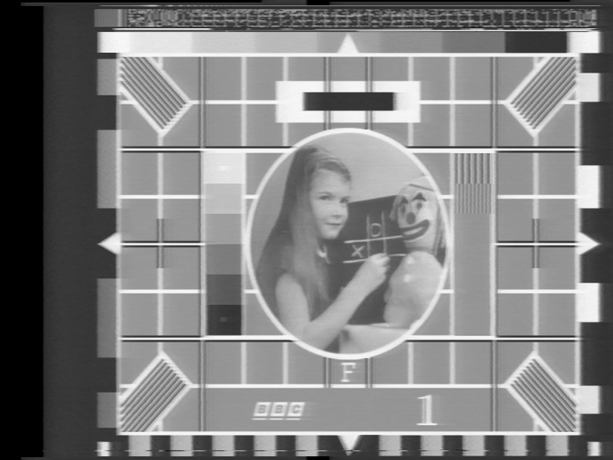
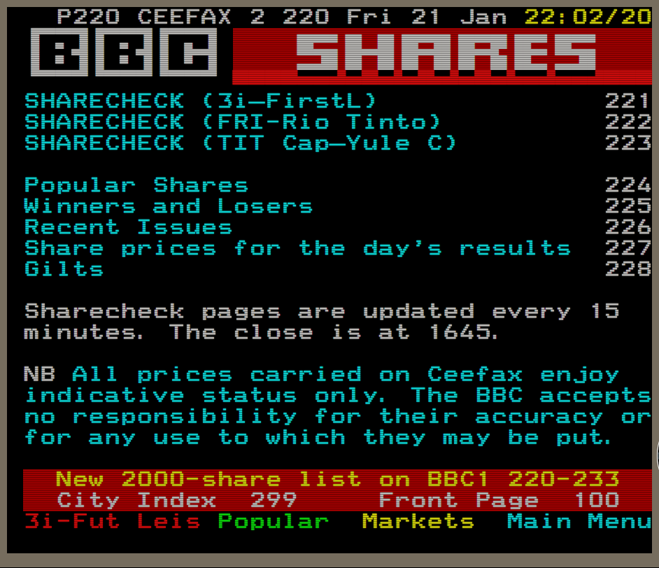

## Teletext

Previous Page [Identifying VBI data](Identifying-vbi-data.md)

Next Page [Decoding RF Captures](RF-Capture-Decoding-Guide.md)

{: style="width:800px"}

*BBC Testcard F 1994 PAL VHS sample with teletext in the VBI space.*

## What Is & Was Teletext?

Starting in the 1970's and ending in 2009~2015 it was an information system widely used in the United Kingdom & Mainland Europe, with some very limited use in North America. 

(Still in use in some European/Eastern nations)

Teletext data packets were embedded into the top VBI picture area on live broadcasts, this was used daily for the news, weather, BBS boards, being highly regraded for same day stocks and sports information at a users fingertips in the analogue era there was even interactive games.

{: style="width:394px"}{: style="width:400px"}

# Teletext Decoding

{: style="width:800px"}

Thanks to [Ali1234](https://github.com/ali1234/) for the R&D into this.

Teletext decoding has NVidia CUDA/OpenGL acceleration available alongside CPU if no GPU is available.

* [Teletext Decoder](https://github.com/ali1234/vhs-teletext/wiki)
* [Interactive Data dump](https://al.zerostem.io/~al/teletext/bbc1/1982-12-19-0027.0/)

Decode "Deconvolve" Teletext Data With 

    teletext deconvolve -c ddd-tbc INPUT.tbc

View Teletext Data With

    teletext vbiview -c ddd-tbc INPUT.tbc

This will eventually have a proper GUI viwer for extracted data.

{: style="width:600px"}

# Generating Teletext

[Raspberry Pi Teletext](https://github.com/ali1234/raspi-teletext)

Raspberry Pi based Closed Captions & Teletext generator tool that uses the composite output, this can be used with a TRRS 3.5mm breakout jack with current pi boards or older pi models with a dedicated yellow composite RCA jack.

[HackTV](https://github.com/fsphil/hacktv#readme) / [Windows & GUI](https://github.com/steeviebops/hacktv-gui)

The HackTV application can generate CVBS or modulated TV signals to file or pipe them to SDRs such as the FL2K & HackRF units.

## Teletext Viewer Tools

[Zapping](https://zapping.sourceforge.net/Zapping/Zapzilla.html) - Linux

# Page End 

Previous Page [Identifying VBI data](Identifying-vbi-data.md)

Next Page [Decoding RF Captures](RF-Capture-Decoding-Guide.md)