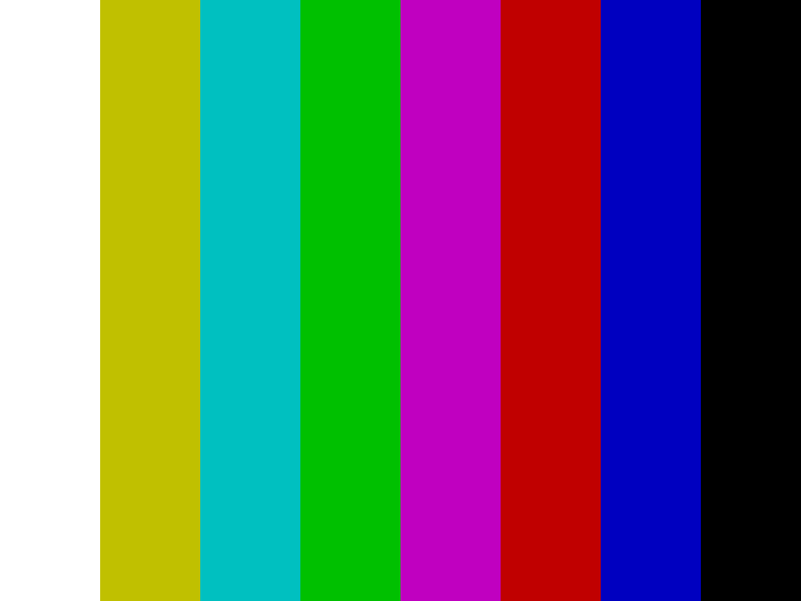
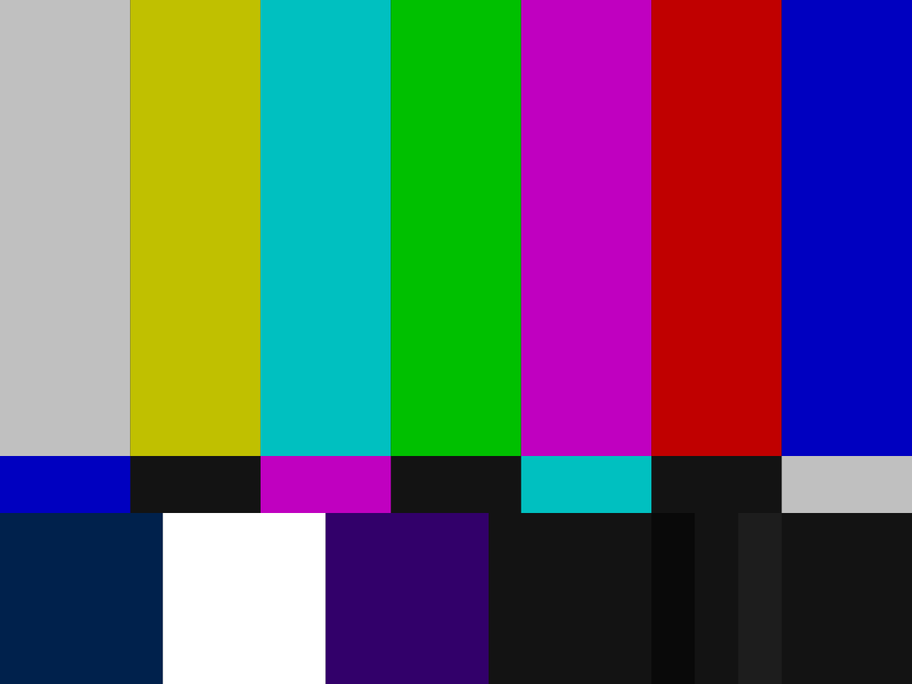
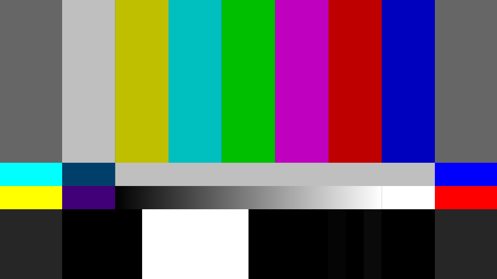

This doc provides testing assets that are useful for creating test tapes or testing equipment. 

## Creating Test TBC Files

### Pick a Test Pattern

`Right click --> Open In New Tab --> Save to File`

| EBU 75% Colour Bars                                                                 | EBU 100% Colour Bars                                                                  | SMPTE 75% Color Bars                                                                   | SMPTE 100% HDTV Color Bars                                                                      |
| ----------------------------------------------------------------------------------- | ------------------------------------------------------------------------------------- | -------------------------------------------------------------------------------------- | ----------------------------------------------------------------------------------------------- |
| {: style="width:500px"} | {: style="width:500px"} | {: style="width:500px"} | {: style="width:700px"} |

### Format Data

Convert a picture to a raw rgb48 file with ffmpeg:

`ffmpeg -loop 1 -i SMPTE_Colourbars_75.png -vcodec rawvideo -t 15 -pix_fmt rgb48 928_576_rgb48.rgb`

### Encode Data

Run the ld-chroma-encoder:
   
`ld-chroma-encoder 928_576_rgb48.rgb 928_576_rgb48.rgb.tbc`

Then link the output `.tbc` file to a `.u16` file so cvbs-decode knows the format of the data:
   
`ln -s 928_576_rgb48.rgb.tbc 928_576_rgb48.rgb.tbc.u16`

### Decode Data

Run the output though cvbs-decode:
   
`cvbs-decode 928_576_rgb48.rgb.tbc.u16 out/928_576_rgb48.rgb.tbc.u16 -f 4fscpal --pal`

Black SNR should be in the 95~98dB range when viewed in ld-analyse.

### Test Tones

[1khz Sine Wave Tone](assets/test-data/1kHz_44100Hz_16bit_05sec.wav#FIXME)

[GLITZ Tone](assets/test-data/2minGLITS.ogg#FIXME)

[BLITS 5.1 Lineup](assets/test-data/BLITS_5.1Lineup_Demonstration.ogg#FIXME)

[BLITS 5.1 Lineup](assets/test-data/BLITS_5.1Lineup_Demonstration.ogg#FIXME)

### Docs

[Multichannel Audio Line-up Tones](assets/test-data/Multichannel-Audio-Line-up-Tones-tech3304.pdf#FIXME)

[BLITS Surround Sound Ident](assets/test-data/03_BLITS_Surround_Sound_Ident.pdf#FIXME)
