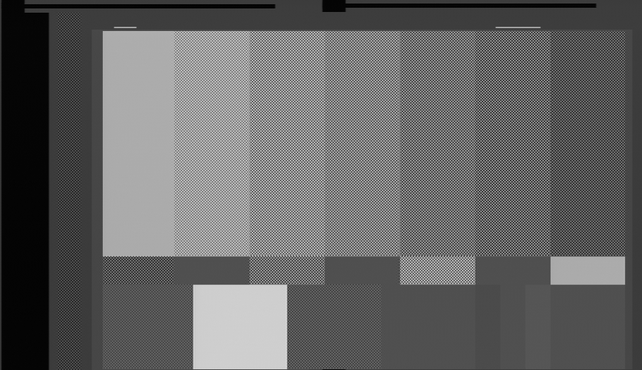

# VIDEO ID (IEC 61880)

{: style="width:600px"}

## Summary

NTSC only. 

PAL uses WSS to provide similar functionality.

Extraction is supported by `ld-process-vbi`.

## aspect ratio

- 4:3
- 16:9
- Letterbox

## CGMS-A

Copy Generation Management System – Analog (CGMS-A)

- Copying is permitted without restriction
- Condition not to be used
- One generation of copies may be made
- No copying is permitted

## APS trigger bits

- PSP off
- PSP on, split burst off
- PSP on, 2-line split burst on
- PSP on, 4-line split burst on

## Notes

Of the 14-bit payload, only 6 bits are defined in IEC 61880