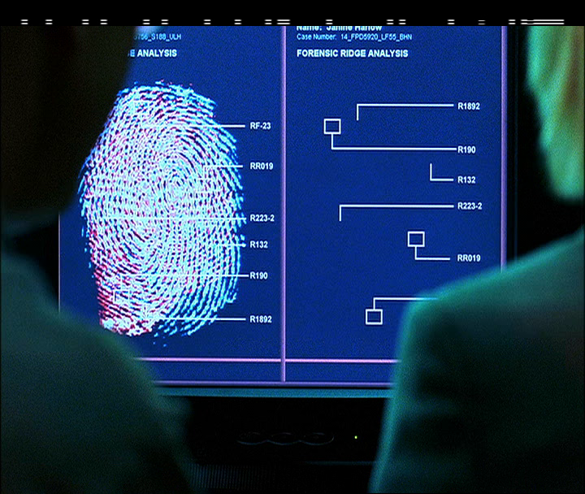

Back Page [Identifying VBI Data](Identifying-vbi-data.md)

# What is Time Code?

Timecode typically looks like this:

01:03:03:12

Hours:Minutes:Seconds:Frames

1 Hours : 3 Minutes : 3 Seconds : 12 Frames

Commonly it will be referred to as just "**TC**"

## What is SMPTE **V**ertical **I**nterval **T**ime**C**ode?

SMPTE = Society of Motion Picture and Television Engineers, the standardisation body that created the standard.

VITC timecode is in simple terms a method of visually embedding timecode data into a video signal, using 2 redundant rows of white lines that make square data blocks when extracted this example below is from QCTools via FFMPEGs filter, however we now this data with `ld-process-vbi`.

It will typically be time of day or running time of that tape segment typically in ''free running'' mode in consumer usage.

There are 2 versions non-drop frame & drop frame this can tell you if there is frame loss or not.

For consumers, VITC was used for exact frame editing or exact record time information on a frame-by-frame basis.

**25 FPS VITC Digitally Rendered** 

VITC Timecode on a SVHS camcorder:

## An example frame of FFMPEG VITC readout from an SVHS-C tape

    lavfi.readvitc.found=1
    lavfi.readvitc.tc_str=01:18:41:00
    frame:629  pts:25160   pts_time:25.16

# Extracting VITC VBI Data

    ld-process-vbi input.tbc

This will scan the VBI area for data and add VITC timecode fields to the .JSON which can be read inside ld-analyse.

    ld-export-metadata input.json

Will have options later to export this data externally, so save your .JSON files!

# How do I create VITC?

There is currently [Unai VITC](https://github.com/unai-d/Unai.VITC) which allows you to create video streams with VITC timecode for embedding into files. 

And hardware generators are still available on sites like eBay which can use VITC/LTC cross-translation.

## SMPTE VITC and Analogue Tapes

Formats like S-VHS, Betacam, 1 Inch Type C all use VITC when recorded on a higher-end device or in production or broadcast environments it will normally have SMPTE VITC in every single frame it looks like this notice the lines at the top above the video frame.

This is what normal digital PAL 720x608 / NTSC 720x508 SD archive feeds will look like where just the top VBI data is exposed.

Modern usage of VITC will look very sharp from digital Betacam tapes etc

At the top of the visible image there are dots and dashes these represent bits of data that can embed timecode data for the absolute position of media on a tape.

## Conventional VITC Capture

Today AJA, Blackmagic & Magewell SDI and PCIe A/D units ([ADV-7850 Based](https://www.analog.com/media/en/technical-documentation/data-sheets/adv7850.pdf))
have VBI Data slicers which means they have Teletext/Closed Captions & VITC processing capability if using industry-standard equipment for reference captures you will most likely have SMPTE TC mixed into your video stream if properly handled.

!!! NOTE
    Blackmagic's stock capture application "Media Express" won't use the full real-time timecode stream just use the first frame timecode, external SDI recorders or using [VRecord](https://github.com/amiaopensource/vrecord) can allow for full timecode streams to be preserved.

!!! NOTE
    Broadcast level capture cards like those from Odysee can provide VBI area data on a software pin.

## VITC Technical Data

This is how ld-process-vbi outputs the data into the .JSON metadata file.

This object represents Vertical Interval Timecode data for a field.

| **Name** | **Type** | **Description** |
| --- | --- | --- |
| vitcData | Integer Array | VITC raw data as 8 values |

Each of the values in `vitcData` represents 8 bits of the raw VITC data, without the framing bits or CRC. The LSB of `vitcData[0]` is VITC bit 2 (the LSB of the frame number), and the MSB of `vitcData[7]` is VITC bit 79.

# Exporting VITC to file (Manually)

### Note!

To use commands in Windows use ffmpeg.exe at the beginning of the command with FFMPEG inside the video files directory.

Thanks to FFMPEG we have a useful filter to read this data in software, although it is technically human readable.

Simply edit the below commands and replace "input.tbc" / "input.mkv" and "output.mkv" / "vitc.txt" with your input files and desired output name.

## ld-chroma-decoder direct luma export:

PAL Extract .TBC to Luma only

    ld-chroma-decoder --ffll 2 --lfll 308 --ffrl 2 --lfrl 620 input.tbc

NTSC Extract .TBC to Luma only

    ld-chroma-decoder --ffll 2 --lfll 308 --ffrl 2 --lfrl 520 input.tbc

## Gen Chroma Script Export Video with full top VBI Area.

Linux/MacOS

    python3 tbc-video-export.py --vbi Input.tbc

Windows
    tbc-video-export.exe --vbi Input.tbc

## Extract VITC from video file with a VBI area.

    ffmpeg -i datainput.mkv -vf "readvitc=scan_max=-1,metadata=print:file=vitc.txt" -f null -

##  Extract VITC from .TBC (Luma) to .TXT

PAL:

    ffmpeg -hide_banner -y -async 1 -f rawvideo -pix_fmt gray16 -video_size 1135x626 -i "input.tbc" -vf "readvitc=scan_max=-1,metadata=print:file=vitc.txt" -f null -

NTSC:

    ffmpeg -hide_banner -y -async 1 -f rawvideo -pix_fmt gray16 -video_size 910x526 -i "input.tbc" -vf "readvitc=scan_max=-1,metadata=print:file=vitc.txt" -f null -

## FFMPEG Quick Export Luma B/W FFV1 .MKV

PAL:

    ffmpeg -hide_banner -y -async 1 -f rawvideo -pix_fmt gray16 -video_size 1135x626 -i "input.tbc" -vf "il=l='i':c='i',bwdif" -c ffv1 -pix_fmt gray16le -aspect 939:626 -r 50 "output.mkv"

NTSC:

    ffmpeg -hide_banner -y -async 1 -f rawvideo -pix_fmt gray16 -video_size 910x526 -i "input.tbc" -vf "il=l='i':c='i',bwdif" -c ffv1 -pix_fmt gray16le -aspect 760:526 -r 60000/1001 "output.mkv"

## Video8 & Hi8

Video8 & Hi8 may contain VITC but primarily use Sony's RCTC (Rewritable Consumer Timecode) while there is not currently support for this with decode/tools however that data is embedded inside the RF and can be recovered.

The RCTC Timecode/Date system looks like this:

    0:00:01 03:45:51PM FEB 6 1994
    0:00:02 03:45:52PM FEB 6 1994
    0:00:03 03:45:53PM FEB 6 1994

Runtime - hours:minutes:seconds  Time Of Date - hours:minutes:seconds MMM D YYYY 

(Timecode should be currently extractable with firewire transfers on a digital8 camcorder/deck? - needs checking)

## Digital8 & MiniDV

Digital8 & DV/DVCam firewire transfers will give you ATC or Absolute Time Code called in metadata "Subcode Time Code" which is easily transferable to normal SMTPE or QuickTime TC via transcoding/remuxing if Final Cut Pro is used for import this will be done automatically, if not the data is still embedded into the .DV or .AVI file.

**Note!** HDV has SMPTE timecode with full 24-hour support as all HDV cameras had full TC generators in the prosumer/broadcast market.

## [SMTPE LTC **L**inear **T**ime**C**ode](https://en.wikipedia.org/wiki/Linear_timecode)

This form of timecode is common in modern use in prosumer-broadcast, as it is embedded into a single audio channel.

libltc tools can handle the generation and decoding of LTC timecode.

https://x42.github.io/libltc/

https://github.com/x42/ltc-tools

https://github.com/x42/libltc

# Page End 

Back Page [Identifying VBI Data](Identifying-vbi-data.md)