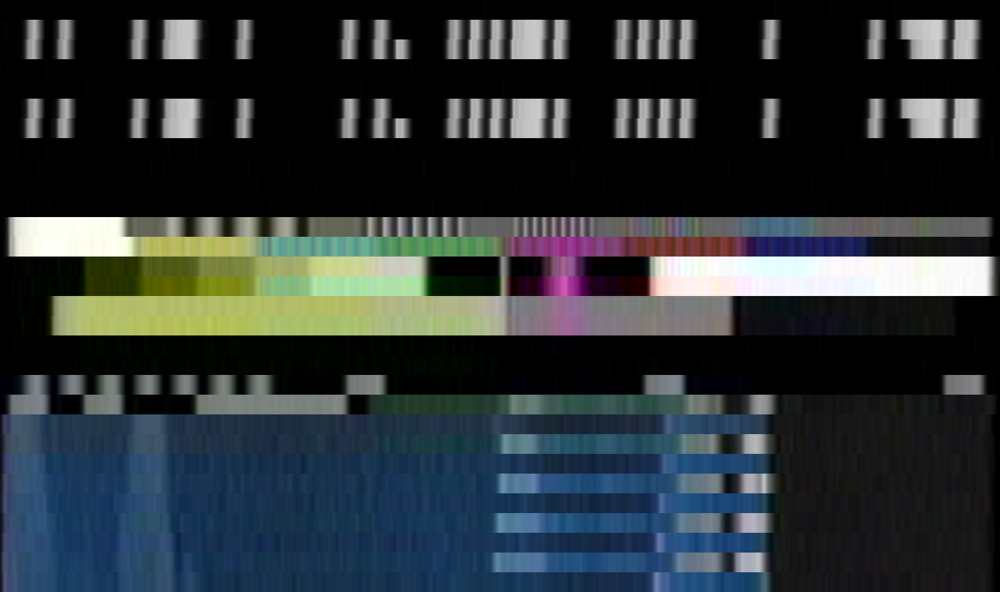

# What is VITS?


**V**ertical **I**nterval **T**est **S**ignals

Not to be confused with [Test Patterns](Test-Patterns-&-Test-Signals.md) VITS is a test signal that has information for white level, black level and can be used to re-calibrate signal to noise ratio metadata.

Standard View

{: style="width:500px"}

Expanded View

{: style="width:500px"}


# Useful Resources 


[Detailed Interactive Breakdown](http://www.kmlab.co.jp/menu_16_vits.html)


# Using it in ld-process-vits


This application performs an analysis of the VITS (Vertical Interval Test Signals) and recalculates the white and black SNR values in the metadata.  Note that any TBC file will already have this metadata provided by ld-decode.  

This tool is generally used along with dropout correction and stacking as the video content of the TBC is modified - running ld-process-vits therefore allows you update the SNR metadata in order to analyse the result (using ld-analyse).

Use the tool by specifying the required input .tbc file.  The tool will backup the previous JSON file (to .vbup) before proceeding.

    ld-process-vits <input>

Help Command Options

```
Options:
  -h, --help                Displays this help.
  -v, --version             Displays version information.
  -d, --debug               Show debug
  -q, --quiet               Suppress info and warning messages
  --input-json <filename>   Specify the input JSON file (default input.json)
  --output-json <filename>  Specify the output JSON file (default same as
                            input)
  -n, --nobackup            Do not create a backup of the input JSON metadata
  -t, --threads <number>    Specify the number of concurrent threads (default
                            is the number of logical CPUs)

Arguments:
  input                     Specify input TBC file

```

# Page End

Back Page [Identifying VBI Data](Identifying-vbi-data.md)