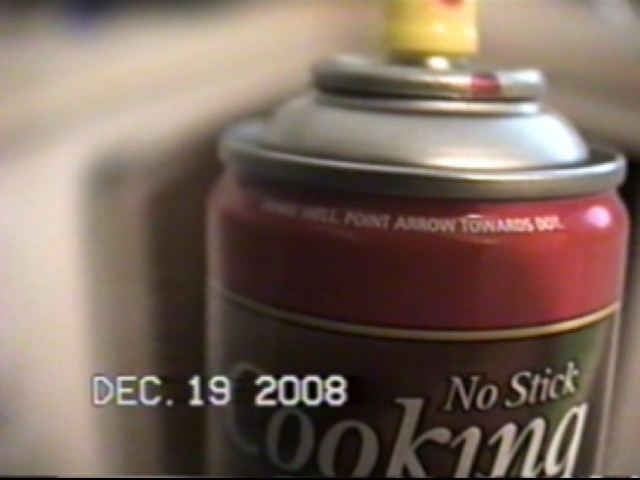

## Conventional Vs Decode

This doc has a list of basic visual examples of the same frames from the same media via conventional methods and FM RF decoded images, these examples vary from setup to TV System.

# Media Examples

RAW & Processed data can be directly obtained for viewing, testing and or presenting the projects [Here](https://github.com/oyvindln/vhs-decode/wiki/Submitting-&-Downloading-Sample-Data).

[Offical Tape/CVBS Odysee](https://odysee.com/@vhs-decode:7) - TheRealHarrypm

[TheRealHarrypm](https://www.youtube.com/channel/UCamq62X7K1bRB-CBhnKMDLA) - Harry Munday (YouTube)

[The Rewinding](https://odysee.com/@therewinding:4) - MrCarter (Odysee)

[The Video Dump Channel](https://www.youtube.com/@videodumpchannel) - Jitterbug (YouTube)

[Zcooger](https://odysee.com/@Zcooger:1) - Zcooger (Odysee)

## Titan91

Conventional (Left) vs VHS-Decode (Right) 

Composite DVD/VCR combo, Hauppauge HD PVR, H.264/AVC compression at 5Mbps

(NTSC) VHS [Discord Reference](https://discord.com/channels/665557267189334046/687532251868823553/1145710463389278260)

https://imgsli.com/MjAxNTE4

{: style="width:455px"}{: style="width:500px"}

https://imgsli.com/MjAxNTE5

{: style="width:455px"}{: style="width:500px"}

https://imgsli.com/MjAxNTIw

{: style="width:455px"}{: style="width:500px"}

## Harrypm

Lorrane Wedding Tape VHS PAL SP.

Conventional (Left) vs VHS-Decode (Right) 

Panasonic NV-HS950B, TBC On, 3D NR off.

S-Video to Blackmagic Analogue to SDI (*ADV7842 Based Unit*) V210 4:2:2 10-bit (720x576)

VHS-Decode --> Chroma-Decoder PAL transform2d --> FFV1 4:2:2 10-bit (928x576)

Decoded RF from ENV Point (TBC Card)

https://imgsli.com/MjI4MjEx

{: style="width:478px"} {: style="width:470px"}

## DoaJC_Blogger

Conventional (Left) vs VHS-Decode (Right) 

Pinnacle 710 USB 8mbps MPEG2 vs VHS-Decode 2023

https://imgsli.com/MjI4MTk4

{: style="width:482px"}{: style="width:488px"}

https://imgsli.com/MjI4MjAx

{: style="width:482px"}{: style="width:488px"}

https://imgsli.com/MjI4MjA0

{: style="width:482px"}{: style="width:488px"}

https://imgsli.com/MjI4MjA1

{: style="width:482px"}{: style="width:488px"}

https://imgsli.com/MjI4MjA2

{: style="width:482px"}{: style="width:488px"}

https://imgsli.com/MjI4MjA3

{: style="width:482px"}{: style="width:488px"}

https://imgsli.com/MjI4MjA4

{: style="width:482px"}{: style="width:488px"}

https://imgsli.com/MjI4MjA5

{: style="width:482px"}{: style="width:488px"}

https://imgsli.com/MjI4MjEw

{: style="width:482px"}{: style="width:488px"}