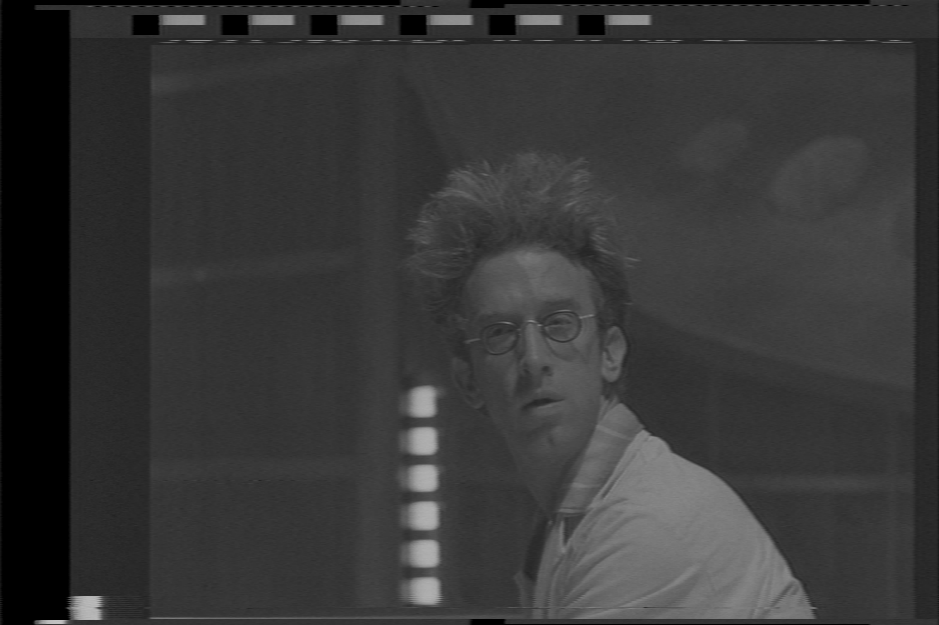
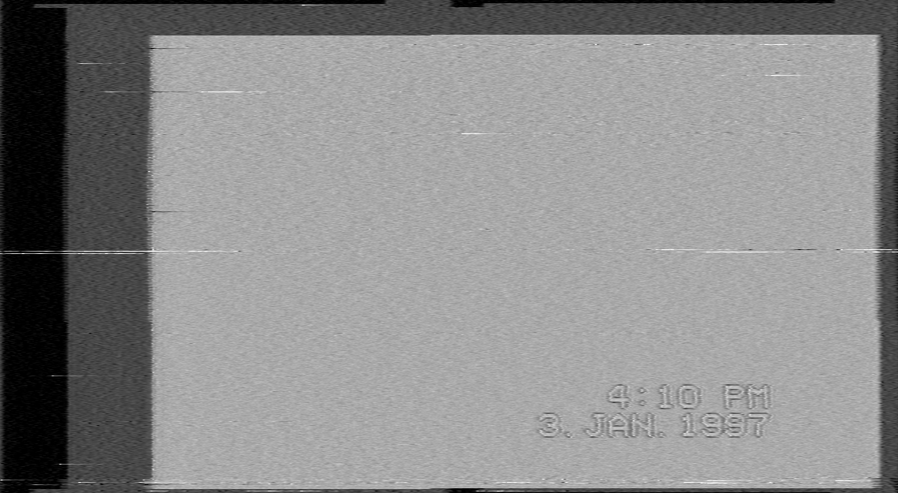
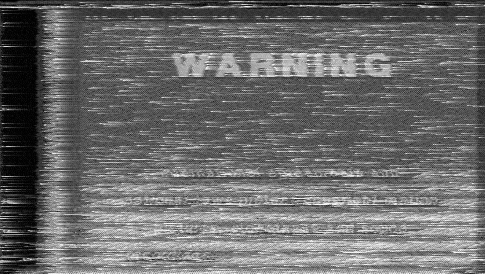
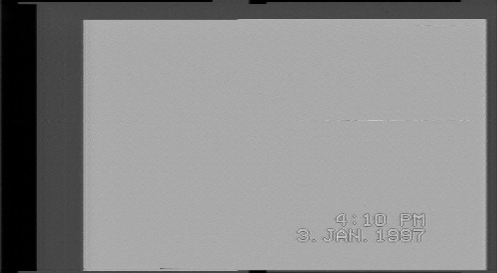
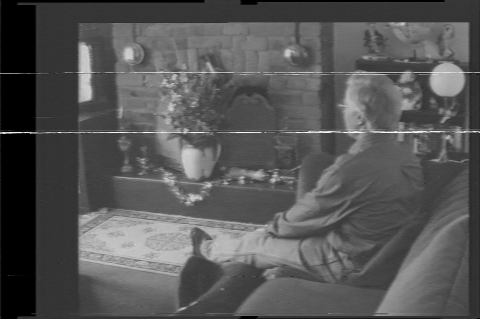
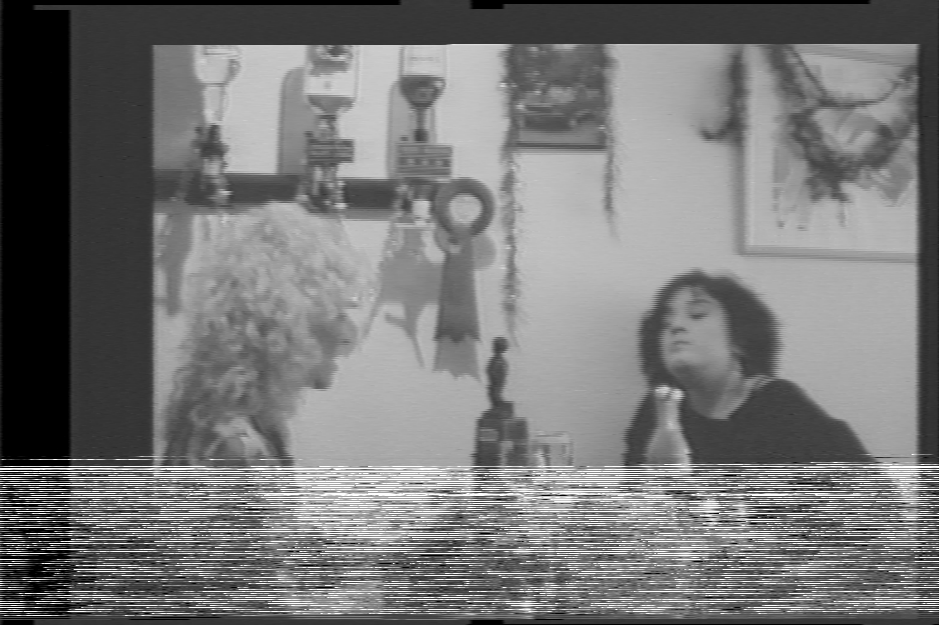
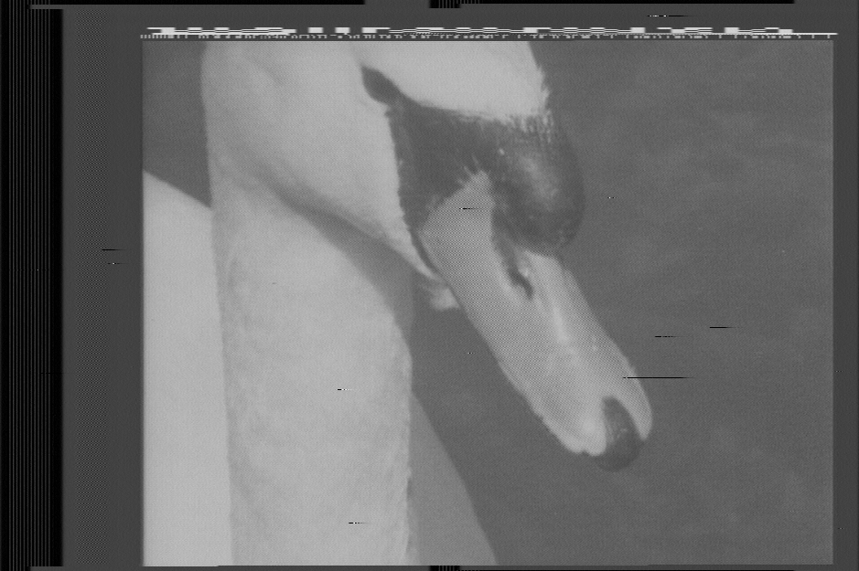
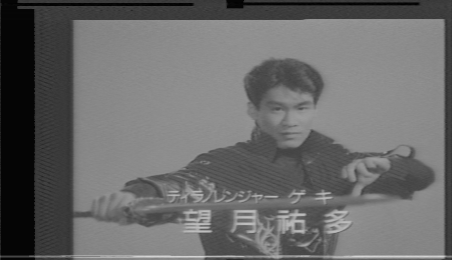
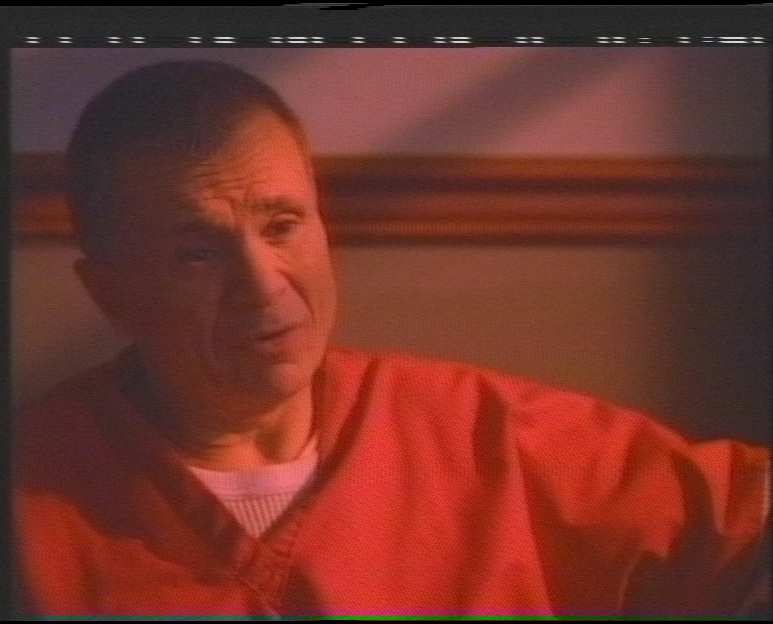
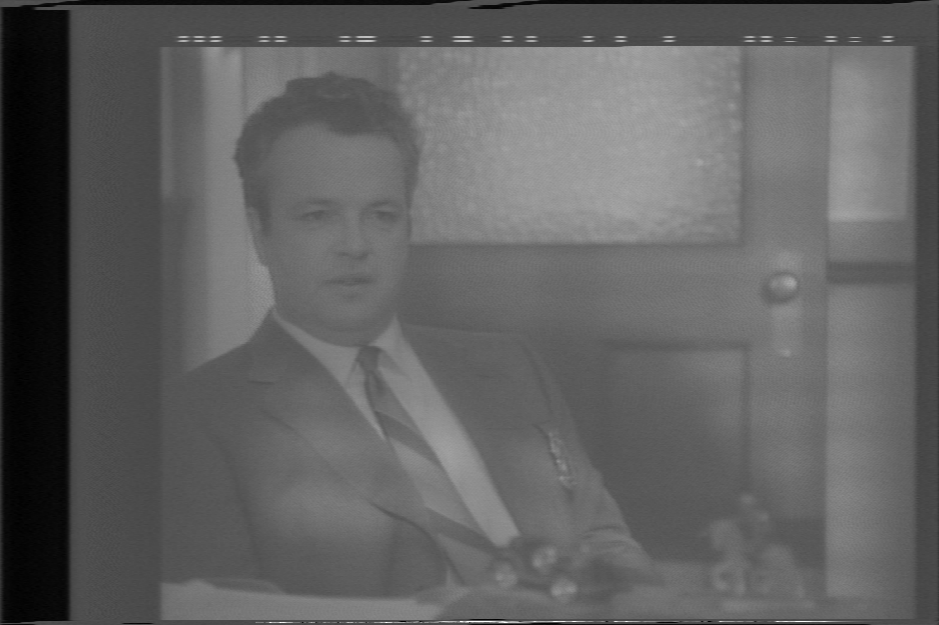

This is doc much required for archival, understanding what is a result of errors of recording onto media, physical damage on the media to errors of capture and software decoding visually knowing what your looking at is key to getting the best possible results out of any media preservation or analysis.

!!! NOTE
    Right Click & Open Image In a new tab to view full-size images.

## How to make an export

Inside ld-analyse do <kbd>CTRL</kbd>+<kbd>S</kbd> to save the current frame as a PNG file, this will save what's displayed, we use the luma channel only for error examples mostly, but errors are more variable for colour as it has to interact with the chroma-decoder, and a fully decoded to video file colour image should be made before calling it an actual error.

## Clean Capture & Decode

This is achieved there are little to no errors in the top VBI area or the active picture area, and the lines are consistent with each other.

{: style="width:400px"}

(Inspector Gadget 1999 - With MacroVison & Closed Captions)

## TBC Failure

This is where the image is skewed, fields are miss-aligned, and there is lots of grainy noise in the image.

{: style="width:400px"}

This is a *simulated image* from a 40msps source, down-sampled RF data can result in loss of key signal information and result in issues like this.

## RF Signal Loss

When a heavy signal loss occurs this is called "snowing" as it's similar to looking at a snowstorm through a window.

Note the white line is harder than a normal dropout.

{: style="width:400px"}

## RF Signal Dropout 

These are dropouts or hard information loss on the physical tape, assuming there is no video head damage.

Small

{: style="width:400px"}

Medium

{: style="width:400px"}

Large 

{: style="width:400px"}

LaserDisc

{: style="width:400px"}

Dropouts are normally due to disc rot and are normally hard black.

## Cross Hatch (Diamond)

More common on NTSC Media

{: style="width:400px"}

## Waving RF Interference

This is a very fine pattern to notice in motion very apparent on digital displays.

Chroma-Decoded Colour

{: style="width:400px"}

Luma TBC Image

{: style="width:400px"}

Note: This capture has the head switch position moved into the H-Sync area.

## Sync Loss Error 

https://github.com/oyvindln/vhs-decode/assets/3205312/20f50c02-f510-47ad-babc-99ed2ac41c85

## Horizontal Frame Jitter

https://github.com/oyvindln/vhs-decode/assets/3205312/2580d6d2-dc29-4541-a6df-c2a618802843

## Credit & References

[AV Artefacts Atlas](https://www.avartifactatlas.com/)

Compendium Of Image Errors In Analogue Video / Kompendium Der Bildstorungen Beim Analogen Video 2012 - ISBN 978-3-85861-381-7

Harry Munday - Personal Archives 

DomesDay86 - Community & Members
