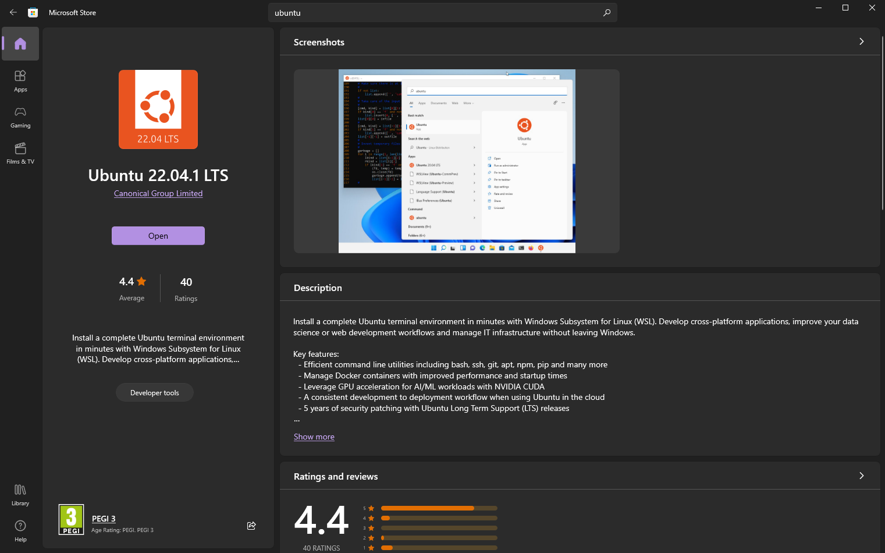

!!! NOTE
    You can find the latest decode suite ready to go self contained binaries for Windows [here](https://github.com/oyvindln/vhs-decode/releases).

!!! IMPORTANT
    This doc is now considered legacy with the current workflow, but will be updated and maintained on request. 
    This guide may be broken and may not work/may need updates

## Quick WSL2 Use

Stock install location in Windows File Explorer:

`\\wsl$\Ubuntu-20.04\home\your user name here\vhs-decode`

Move data into the directory or capture it in the directory

Open your WSL2 terminal example Ubuntu 20.04

`cd vhs-decode` (Press Enter)

For DdD Use:

`vhs-decode --debug -t 8 -tf VHS -p --recheck_phase YourTapeName.lds YourTapeName`

Compress the .lds to FLAC with

`ld-compress YourTapeName.lds`

Output will be YourTapeName.ldf

For CXADC Use: (Edit based on your capture setup config)

`vhs-decode --debug -t 8 --cxadc --tf VHS -p --recheck_phase YourTapeName6.u8 YourTapeName`

Quickly Export TBC files to Video

Linux/MacOS

    tbc-video-export YourTapeName

Windows

    tbc-video-export.exe YourTapeName

The resulting output is:

`YourTapeName.mkv`

In interlaced FFV1 10-bit 4:2:2 Top Field First.

## Installation

### Enable WSL2 (Windows Sub-System For Linux)

Tested on Ubuntu 20.04 & 22.04.1 LTS, On Windows 10.

WSL2 install YouTube video: https://youtu.be/IL7Jd9rjgrM

While this is mostly copy-paste, this is still a very borky thing.

### Enable the ability to install and run WSL2

Open Power Shell as Administrator and run

    dism.exe /online /enable-feature /featurename:Microsoft-Windows-Subsystem-Linux /all /norestart
    dism.exe /online /enable-feature /featurename:VirtualMachinePlatform /all /norestart
    wsl --set-default-version 2

### Install FFmpeg/SoX/FLAC inside windows

These commands will install these in `PATH` so the tools are available system-wide.

Install Choco (chocolatey package manager)

    Set-ExecutionPolicy Bypass -Scope Process -Force; [System.Net.ServicePointManager]::SecurityProtocol = [System.Net.ServicePointManager]::SecurityProtocol -bor 3072; iex ((New-Object System.Net.WebClient).DownloadString('https://community.chocolatey.org/install.ps1'))

Then you can install the following system-wide without any hassle.

Install FFmpeg

    choco install ffmpeg

Install FLAC

    choco install flac

Install SoX

    choco install sox.portable

### Install Ubuntu 22.04.1 LTS (Windows Store)

Install via Windows Store and then restart your computer.

{: style="width:800px"}

## Open Ubuntu

Total install setup size will be around 3~5GB.

### Create your user account

Run update

    sudo apt update

Then run

    sudo apt install software-properties-common

### Install Utility Tools

Sox

    sudo apt install sox

PV

    sudo apt install pv

FLAC

    sudo apt install flac

### Compressing via WSL2

`ld-compress /mnt/j/RF-Data/EXAMPLE-CAPTURE_VHS_PAL_DdD_Gain_8.5_2023-03-01_15-29-18.lds`

`/mnt/j/` is your drive path based on the windows side drive letter. 

!!! CAUTION
    250GB disk limit, issues with larger captures i.g 180gb+ will require manlly expanding the default [virtual disk size](https://docs.microsoft.com/en-us/windows/wsl/vhd-size) if using data internally.

## Install VHS-Decode 

(Also installs ld-decode/cvbs-decode/hifi-decode) 

**Run through the current [README Install Commands](https://github.com/oyvindln/vhs-decode#installation-and-running-the-software-on-ubuntudebian) as normal**

Fix QT5 installation Dependencies

    sudo apt-get install libqt5svg5-dev
&

    sudo apt install -y qtcreator qtbase5-dev qt5-qmake cmake
&

    sudo apt install --reinstall libqt5widgets5 libqt5gui5 libqt5dbus5 libqt5network5 libqt5core5a

Then

    sudo strip --remove-section=.note.ABI-tag /usr/lib/x86_64-linux-gnu/libQt5Core.so.5

### Using the Terminal

Right-click to paste copied commands on your current windows clipboard

Then enter root use

    sudo su

Then exit root with <kbd>Ctrl</kbd>+<kbd>D</kbd>

Enter a directory

    cd /home/vhs-decode

Go back or exit a directory

    cd ..

Discover what files are in a directory using

    ls

Then when inside the vhs-decode directory you can use

`./vhs-decode` / `./cvbs-decode` / `./ld-decode` / `./hifi-decode`

To run the decoders

## How to use storage drives and locations

WSL2 can be used as a self-contained system, this, however, is limited to a 250GB virtual disk as such you want to ideally use storage inside of windows in the NTFS file system this has two benefits, it keeps things easy to access and you can embed checksums into the files with [RapidCRC](https://www.ov2.eu/programs/rapidcrc-unicode) with ease to check for any errors in the data later.

Acsesss Windows storage via WSL2 Command Line:

`/mnt/c/Users/USERNAME/Desktop`

Access WSL2 Linux storage via Windows Explorer:

 `\\wsl.localhost\Ubuntu-22.04`

Access WSL2 Linux storage via Windows Directly (Stock Install Only):

`C:\Users\YOUR-USER-NAME\AppData\Local\Packages`

You will see something like

`CanonicalGroupLimited.Ubuntu22.04LTS_79rhkp1fndgsc`

Then go to your home directory

`\LocalState\rootfs\home`

### Example of using windows mounted drives

You want to keep spaces out of folders & file names `like-this-for-example` if you want a fluid copy-paste experience with Linux.

Drive letters are always under case C is c and J is j for example.

In order to keep data outside of the WSL2 virtual directory you need to always define an input path with an input file and an output path with an output file name.

In this example we have an internally mounted 8TB drive with RF captures made with the DomesDayDuplicator with a full capture date stamp.

`./vhs-decode --threads 4 --pal /mnt/j/vhs-decode/test-capture-DdD-Gain-Max_2022-12-11_03-06-23.lds /mnt/j/vhs-decode/test-capture-DdD-Gain-Max_2022-12-11_03-06-23`

**IF THIS STOPS WORKING**

Open CMD

`wsl.exe --shutdown`

### How do I dump/backup my WSL2 Install?

This video covers all that.

https://www.youtube.com/watch?v=ON_dPAO4KZs&t

### Copy / Paste - Fixes

If any issues pop up run through this install command list until errors no longer occur.

---------------------------------

    sudo apt update

---------------------------------

    sudo apt install software-properties-common

---------------------------------

    sudo apt install build-essential zlib1g-dev libncurses5-dev libgdbm-dev libnss3-dev libssl-dev libreadline-dev libffi-dev wget

---------------------------------

    sudo apt-get install pip

---------------------------------

    sudo apt-get install pip3

---------------------------------

    sudo apt install build-essential git ffmpeg flac libavcodec-dev libavformat-dev libqwt-qt5-dev qt5-qmake qtbase5-dev python3 python3-pip python3-
    setutools libfftw3-dev openssl

---------------------------------

    sudo pip install numba pandas matplotlib scipy numpy==1.21.5 samplerate pyhht

---------------------------------

    sudo apt-get install build-essential dpkg-dev freeglut3-dev libgl1-mesa-dev libglu1-mesa-dev

---------------------------------

    sudo apt install libgstreamer-plugins-base1.0-dev libgtk-3-dev libjpeg-dev libnotify-dev

---------------------------------

    sudo apt install libpng-dev libsdl2-dev libsm-dev libtiff-dev libwebkit2gtk-4.0-dev libxtst-dev

---------------------------------

    sudo apt install python3.9-dev libpython3.9-dev

### For GUI (not needed really as its 3 command copy paste oprations)

    sudo pip install Gooey
---------------------------------
    sudo pip3 install Gooey

### GUI Deployment On Windows

Windows 11 has a native GUI passthrough so ld-analyse will work out of the box and with gooey installed the basic vhs-decode GUI should not be an issue

For Windows 10 users, however, the issue of no GUI support is practically irrelevant as ld-analyse has a windows version and once you understand how to use it's 3 copy-paste-edit commands per tape so sticking to mixed use with the command line is normally less hassle.

### Installing xfce and using xrdp (Remote Desktop Protocol)

    sudo apt update && sudo apt -y upgrade
    sudo apt-get purge xrdp
    sudo apt install -y xrdp
    sudo apt install -y xfce4
    sudo apt install -y xfce4-goodies
    sudo cp /etc/xrdp/xrdp.ini /etc/xrdp/xrdp.ini.bak
    sudo sed -i 's/3389/3390/g' /etc/xrdp/xrdp.ini
    sudo sed -i 's/max_bpp=32/#max_bpp=32\nmax_bpp=128/g' /etc/xrdp/xrdp.ini`

    sudo sed -i 's/xserverbpp=24/#xserverbpp=24\nxserverbpp=128/g' /etc/xrdp/xrdp.ini
    echo xfce4-session > ~/.xsession`

    sudo nano /etc/xrdp/startwm.sh

**Comment these lines to:**

    #test -x /etc/X11/Xsession && exec /etc/X11/Xsession
    #exec /bin/sh /etc/X11/Xsession

**Scroll down via the arrow key to the bottom and add these lines:**

Press Control X To save the file then press Esc to exit back to the terminal  

You will need to run the following command to start the service every time the WSL2 is closed/opened.

    sudo /etc/init.d/xrdp start

Now in Windows, use Remote Desktop Connection to access the virtual desktop.

    localhost:3390

Then log in using your username and password used for your WSL2 install.

### Helpful Links:

Mount a storage drive: https://learn.microsoft.com/en-gb/windows/wsl/wsl2-mount-disk

Finding Local Windows Drive in WSL2: https://superuser.com/questions/1107618/where-is-the-c-drive-in-the-wsl

Microsoft GUI announcement: https://devblogs.microsoft.com/commandline/the-windows-subsystem-for-linux-build-2020-summary/

Ubuntu WSL2 GUI Install: https://dev.to/darksmile92/linux-on-windows-wsl-with-desktop-environment-via-rdp-522g

WSL 2 install: https://docs.microsoft.com/en-us/windows/wsl/install-win10

Docker for WSL2: https://docs.docker.com/docker-for-windows/wsl/

What is WSL? https://docs.microsoft.com/en-us/windows/wsl/about

WSL documentation: https://docs.microsoft.com/en-us/windows/wsl/

WSL 2 Announcement: https://devblogs.microsoft.com/commandline/announcing-wsl-2/

File Names With Spaces: https://linuxhandbook.com/filename-spaces-linux/

libqt5core Issues: <https://superuser.com/questions/1347723/arch-on-wsl-libqt5core-so-5-not-found-despite-being-installed> & <https://stackoverflow.com/questions/63627955/cant-load-shared-library-libqt5core-so-5>
