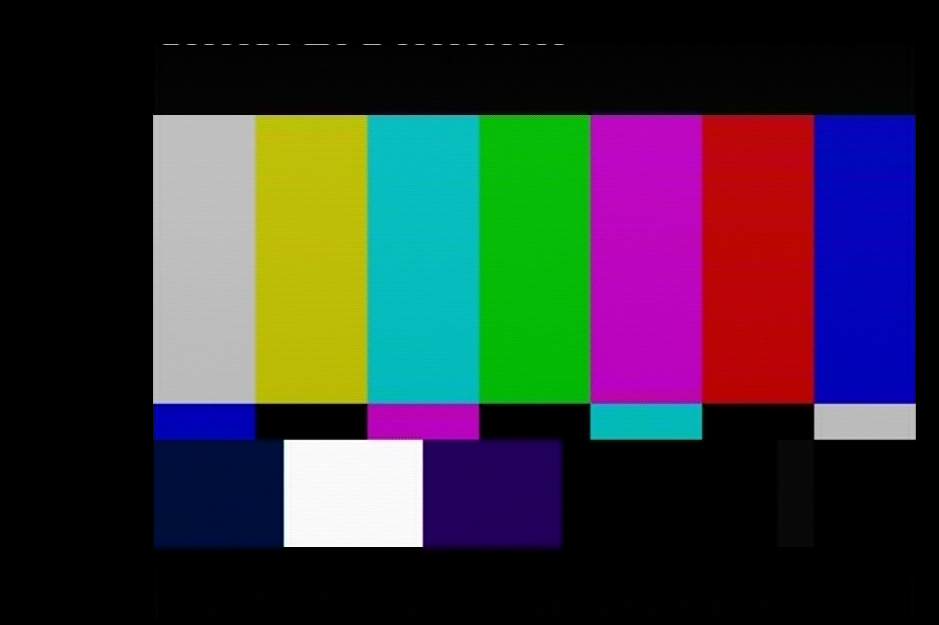
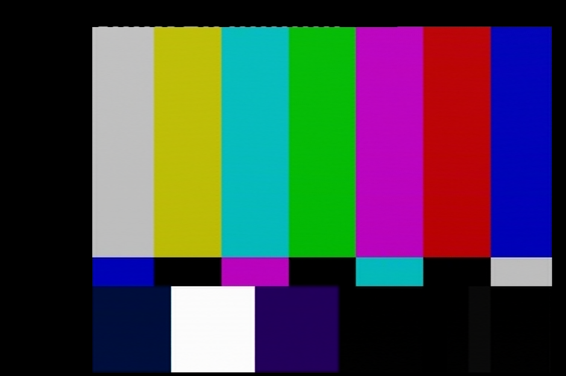

## What is WSS or Wide Screen Signalling?

It tells you what format the media is via vertical Interval code.

Layman: simply put its an line of white dashes to discriminate aspect ratio format with composite signals.

This tells you Letterbox mode or 16:9 / 4:3 mode.

Wide Screen Signalling (WSS) is digital metadata embedded in the top left  part of analogue TV signals describing qualities of the video signal, in particular the intended aspect ratio of the image.

This allows television broadcasters to enable both 4:3 and 16:9 television sets to optimally present pictures transmitted in either format, by displaying them in full screen, letterbox, widescreen, pillar-box, zoomed letterbox, etc

On broadcast camcorders with Composite/S-Video output you will see this signalling is quite common.

### Does the decoders support this?

Not currently but there is flags for 16:9 called `isWidesceen` in the .JSON format for this but its not a critical issue as this can be adjusted and flagged on render to file.

## Examples of Wide Screen Signalling

(Example reference CVBS RF/TBC/Video files) [Google Drive Mirror](https://drive.google.com/open?id=1PVKRyKeu74RXmwJSAc4Zm2CXZomfhMc9) / [Internet Archive Mirror](https://archive.org/details/wss-wide-screen-signaling)

LetterBox

Squeezed (Viewed in 4:3) (16:9 Anamorphic)

De-Squeezed (Viewed in 1:1) (16:9 Anamorphic)

### Technical

Line 23 is its standard position typically observed.

[EN 300 294 V1.3.2 (1998-04)](https://drive.google.com/file/d/1NxInDRUjqwMWRO-bPhlvjoDdAMTcWkCK/view?usp=sharing)

[Rec. ITU-R BT.1119-2 (1994-1995-1998)](https://drive.google.com/file/d/1rNbw4W7QkFQqij7EgMFXB2w5mJzJ_n5f/view?usp=share_link)

[Wikipedia Page](https://en.wikipedia.org/wiki/Widescreen_signaling)

The common use today is 16:9 mode to trigger on detection of the pattern.

Example of how this is used take last generation Sony Camcorders with composite/s-video outputs these will have WSS for 16:9 display triggering even if recorded to an analogue source like VHS.

(Note on older digital TV's it will automatically switch to 16:9)

### WSS Basic Flags

* full format 4:3

* full format 16:9 (anamorphic)

* letterbox

* pillar-box

* zoomed letterbox

### WSS Full Flags

### Raster Example

