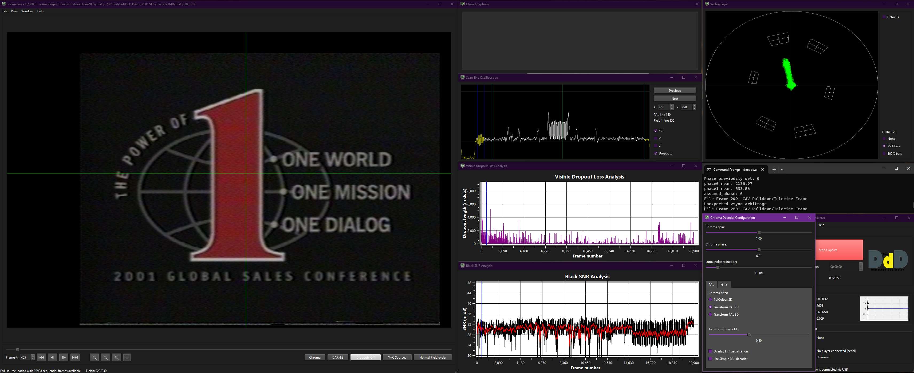
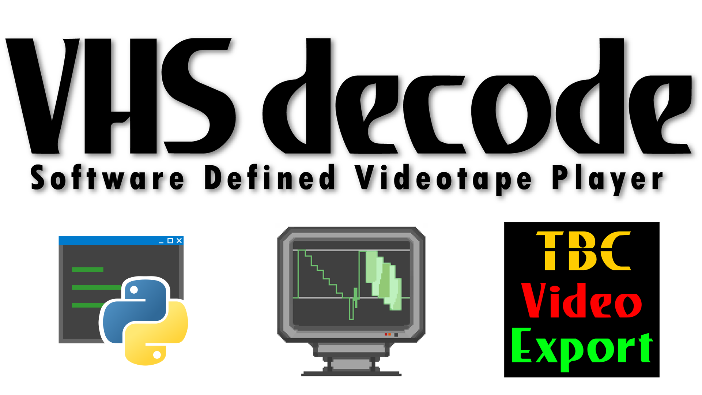
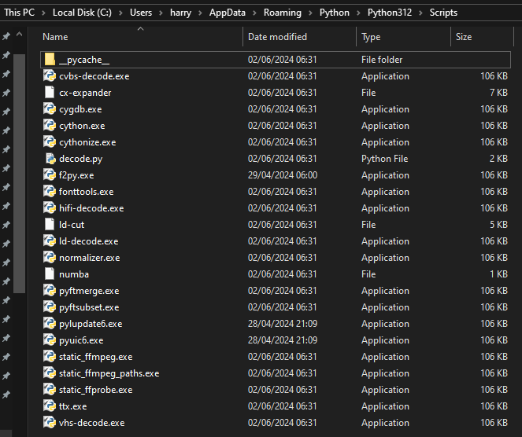

# Windows Native Builds 


{: style="width:800px"}


## YouTube Video

Basic rundown of how to use the workflow:

[{: style="width:500px"}](http://www.youtube.com/watch?v=Xb128g617sg)


## Downloads


The RF Decoders, Tools Suite & Export Tool are bundled into one easy to use release.

[Download Binary Bundle Here](https://github.com/oyvindln/vhs-decode/releases/)

[Read The Readme For Basic Use](https://github.com/oyvindln/vhs-decode#readme)


## Dependencies


- [Microsoft Visual C++ 2022 Redistributable](https://aka.ms/vs/17/release/vc_redist.x64.exe) to be installed (Often already installed by other apps)

- [GNU Radio Companion](https://wiki.gnuradio.org/index.php/InstallingGR)


## Usage


[Windows Terminal](https://apps.microsoft.com/detail/windows-terminal/9N0DX20HK701?hl=en-gb&gl=US) is the quickest way, to have it always open as CMD go into `settings --> default profile --> command prompt.` then right click and `open in terminal` inside the decode directory.

You can also use `CMD` Command Prompt / `Powershell` directly and just `cd` to the directory.

Once your inside `decode` folder and run `decode.exe` followed by a space with the `vhs` / `ld` / `cvbs` / `hifi` for the respective decoders.

Example:

    decode.exe vhs --frequency 16 --system pal family-cut-16msps-8bit.flac Windows-Test-Decode-2023

!!! NOTE
    Decoder commands long and short from are all universal, all normal docs apply for usage and handling.

To make a basic export simply run the export tool inside the folder via CMD or drag and drop.

    tbc-video-export.exe Input.tbc

This will make a FFV1 10-bit 4:2:2 .mkv file for any CVBS or S-Video type TBC file set please read the [Standard Export Guide](TBC-to-Video-Export-Guide.md) for usage on profiles for more codec options and audio muxing.


## Install FFmpeg/SoX/FLAC inside windows


These commands will install these in `PATH` so the tools are available system-wide.

Open a PowerShell Terminal as administrator.

Install Choco (chocolatey package manager) 

    Set-ExecutionPolicy Bypass -Scope Process -Force; [System.Net.ServicePointManager]::SecurityProtocol = [System.Net.ServicePointManager]::SecurityProtocol -bor 3072; iex ((New-Object System.Net.WebClient).DownloadString('https://community.chocolatey.org/install.ps1'))

Then you can install the following system-wide without any hassle.

Install FFmpeg

    choco install ffmpeg

Install FLAC

    choco install flac

Install [SoX 14.4.2](https://sourceforge.net/projects/sox/files/sox/14.4.2/) manually. 


# Quality of Life Improvements 


Setting `.tbc` files to always open with ld-analyse via `right click --> open with` then at the bottom `look for anouther app on this PC` then after browsing to `ld-analyse.exe` in your decode or ld-tools folder `always use this app to open .tbc files` and your done!

Dark mode for ld-analyse can be run with `ld-analyse -style fusion` via CMD, or you can modify a shortcut for it.


## Compressing FM RF Captures


There is `ld-compress.bat`, `ld-compress-nvidia-gpu.bat`, `s16-to-flac.bat`

The first 2 scripts take DomesDay Duplicator 40msps 10-bit packed captures to 16-bit FLAC compressed files from 2.8GB to 625MB per min +- a few MB basically `.lds` to `.ldf` in simple terms.

**NOTE:** These scripts only work with your `.lds` files inside the decode folder unless ld-lds-converter/FFmpeg path is fully defined, making it no longer portable.

!!! NOTE
    There is also [Compression Scripts for CX Card captures](https://github.com/happycube/cxadc-linux3/tree/master/CXADC-Compression-Scripts/Windows)


## Issues & Level of Support


Windows builds are fully working for ld-decode, vhs-decode, cvbs-decode, hifi-decode. Alongside ld-tools and tbc-video-export.

The workflows are mirroring the native Linux experience with standard RAW or FLAC compressed RF data files, tbc file reading viewing and metadata exporting, and encoding and export to video files is a fluid "copy-paste" experience today for basic use.

Analogue playback (CVBS/S-Video) for TBC files is also somewhat supported via [FL2K USB 3.0 adapters](TBC-to-Analogue.md).

[RTLSDR Decode](RTLSDR.md) is also fully supported as GNU-Radio has universal platform support.

CVBS & S-Video RAW capture can be provided via the [MISRC](MISRC-Multi-Input-Simultaneous-RF-Capture.md#FIXME).

!!! WARNING
    The DomesDay Duplicator can have sample drop issues on Windows, this has not been observed on MacOS or Linux builds however.

!!! NOTE
    The DomesDayDuplicator (Rev 3) does not work for CVBS capture.

!!! NOTE
    The use of Linux via Live USB or dedicated secondary install on a SSD is recommended for capture however decoding/compressing/export can be done all windows side without issue today.


# Manually Building on Windows (WIP)


Install Python then run inside a windows terminal:

## Install via pypy package

    py -m pip install vhs-decode[hifi-gui]


https://github.com/oyvindln/vhs-decode/assets/56382624/f9a90f5b-7a32-48bb-b79c-0deceb8e49e4


{: style="width:500px"}


###  Python parts (vhs-decode/ld-decode/cvbs-decode/hifi-decode)


## Installing dependencies


Install Git:
https://gitforwindows.org/

Install Python for windows :
https://www.python.org/downloads/windows/
(Note that due to the numba dependency which takes some time to support new major python releases you can not always use the latest major release, though currently the latest released is supported.)

Install the version of Microsoft Visual Studio that corresponds to the version of python (using the wrong version will cause linker failures when building cython modules.) For Python 3.11 and 3.12 that is Visual Studio 17.x meaning the latest release will work.

!!! NOTE
    Not needed now but noted here as they can be installed as part of MSVC

CMake (Can be installed bundled as part of recent versions of MSVC):
https://cmake.org/

vcpkg (Can be installed bundled as part of recent versions of MSVC):
https://vcpkg.io/en/


#### Downloading source and building


Launch the git gui, chose ```https://github.com/oyvindln/vhs-decode.git``` as source and your preferred location to store the source code on your system as destination (note the source will be stored in the root of this folder) and click clone.

From the start menu, launch "x64 Native Tools Command prompt for VS 2022" (If you have multiple versions of Visual studio installed make sure you are launching the one from the tools you just installed) This will launch a command prompt.

Navigate to a folder to use as a working folder using the ```cd``` command (e.g ```cd d:\programming\```).

Run ```py -m venv decode``` to create a virtual python environment to use, then run ```decode\Scripts\activate``` to activate it.

Now, navigate to the source folder you checked out earlier with ```cd```. Once there, run ```pip install .[hifi_gui]```. This should build and install vhs-decode into the virtual environment. 

You only have to use the MSVC tools command prompt when building the package, otherwise you can simply open a normal powershell session and activate the python virtual environment with ```path\to\virtual\environment\Scripts\activate``` to be able to run vhs-decode/ld-decode etc as the MSVC tools promt is only needed for the C compiler for compiling the cython modules.


#### Building cython modules in-place


- For running the tools from the source directory and/or making pyinstaller packages

From the MSVC tools command prompt, with the virtual environment activated either go through the normal install, or run cd to the source directory and run ```pip install -r /requirements.txt``` and ```pip install setuptools cython``` to install the needed dependencies. Optionally also run ```pip install pyqt5``` if you want to be able to use the gui part of hifi-decode. Then run
```python setup.py build_ext --inplace``` in the source directory.


### Building Tools


Install needed tools:

MS Visual Studio (Only C++):
https://visualstudio.microsoft.com/

CMake (Can be installed bundled as part of recent versions of MSVC):
https://cmake.org/

vcpkg (Can be installed bundled as part of recent versions of MSVC):
https://vcpkg.io/en/

Navigate to the vhs-decode source folder and open a powershell session.

Replace the paths in the command in the next line with corrects paths for your system
If you installed vcpkg via visual studio the first one is likely correct if you used the default install location, if not you have to modify it. If you did not install vcpkg via visual studio there may be some extra steps to set it up.

The second path has to be a short one used as a temporary folder, it is due to a bug that may or may not still be present and may or may not still be needed, see
https://github.com/microsoft/vcpkg/issues/30446

```
cmake -B build -S . -DBUILD_PYTHON=OFF -DCMAKE_TOOLCHAIN_FILE="c:/Program Files/Microsoft Visual Studio/2022/Community/VC/vcpkg/scripts/buildsystems/vcpkg.cmake" -DVCPKG_INSTALL_OPTIONS="--x-buildtrees-root=D:\vcpkg_vs"```

Now run the command, if the paths were set up correctly, this will set up cmake and start downloading and building dependencies via vcpkg - this will take a very long time (many hours or even more on a slow system) as it involves buiding parts of Qt.

Once finished, navigate into the build directory with ```cd build``` and run:
```msbuild /nologo -m .\ld-decode-tools.sln /property:Configuration=Release``` to compile the tools themselves.

MSVC will put some, but not all the needed .dll files together with the tools into the sub-directories where the .exe files end up, so you will have to manually copy some dll files and .dll plugins over from the ```<vhs-decode-source>/build/vcpkg_installed/x64-windows/bin>``` directory to get them to run. (Qt Plugins will be under the ```<vhs-decode-source>/build/vcpkg_installed/x64-windows/Qt6>```directory). There may be some ways to automate this in the future.


# Page End