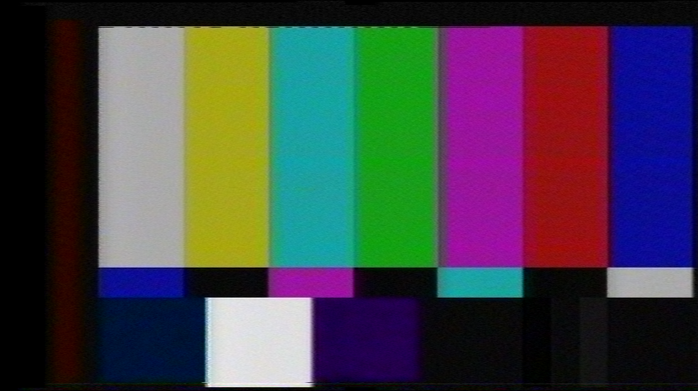

{: style="width:300px"}

# VHS-Decode Wiki 

This is the VHS-Decode Wiki written and maintained by [Harry Munday](https://github.com/harrypm) (harry@opcomedia.com),
Inside this wiki and its pages, you will find everything! from easy-to-understand technical guidance and notations for getting a signal out of VCRs, capturing original [FM RF](Signal-Sampling.md) signals off of tapes, storing them and finally processing them into lossless digital media archives.

Want to support the work? visit [Donations](Donations.md)

VHS-Decode is part of a family of software sharing the same tools & developers!

[CVBS (Composite) Decode](CVBS-Composite-Decode.md) / [HiFi Decode](HiFi-Decode.md) / [RTLSDR HiFi Decode](RTLSDR.md) / [LaserDisc Decode](https://github.com/happycube/ld-decode) / [CD-Decode](https://github.com/happycube/cd-decode) / [FL2K TBC Player](TBC-to-Analogue.md)

## Start Here!

- [The Frequently Asked Questions](FAQ.md)
- [Discord Community](https://discord.gg/pVVrrxd)

## Features of Decode

- Full Signal Software Time Base Correction "TBC"
- Cross Platform Support
- Full Post Signal Decoding Control
- Advanced dropout detection and concealment
- Advanced VBI Data Reader & Metadata Extraction
- Backwards Support to analogue systems
- Wide Range of Tape Formats Supported
- Easy profile based video file exporting

## VHS-Decode Example Videos

We have a overview YouTube video!

[{: style="width:500px"}](http://www.youtube.com/watch?v=Xb128g617sg)

Odysee [Official VHS-Decode](https://odysee.com/@vhs-decode:7) - TheRealHarrypm

Odysee [The Rewinding](https://odysee.com/@therewinding:4) - MrCarter

YouTube [The Video Dump Channel](https://www.youtube.com/@videodumpchannel) - Jitterbug

## Summary

Thanks to low-cost analogue to digital converters [CX Cards](CX-Cards.md) & [RTLSDR](RTLSDR.md) alongside the [DomesDayDuplicator](https://github.com/harrypm/DomesdayDuplicator#readme) direct digitisation and archival of many magnetic analouge media formats can be done not only properly but affordably with original FM RF (Frequency Modualted Radio Frequency) signals being captured and preserved in the digital file realm this is dubbed as the "FM RF Archival" method. 

Unlike limited baked-in standard S-Video/Composite, baseband video & audio capture, FM RF capture allows the original tape signals to be stored making a true digital master copy of your analogue media removing the need for expensive time base correctors and even working physical players in the future.

The decode family of tools brings you a state of the art archival toolchain to make use of these FM RF archives today!

## Benefits

FM RF capture and subsequent software decoding provides anyone with a standard desktop or laptop a complete software-defined videotape player with a full suite of "after the fact" broadcast level processing & manipulation tools with a full-frame software-based time base corrector, drop out detection, and compensation practically speaking near endless remastering potential. 

Simpler digitisation, with conversion to baseband and then video files being a fluid copy-paste drag and drop experience for [many tape formats](Tape-Format-Support-List.md) not limited to just VHS or SVHS, the burden of effort is no longer tied to high cost real-time equipment allowing for near endless remastering possibility's only limited to the potential of the media format and not the hardware used to capture it.

## Breakdown of FM RF Archival

*Bypass all non-essential hardware, and process it all in software directly.* 

*Capture today decode tomorrow!*

{: style="width:800px"}

To see more expanded examples see the [The Visual Diagrams Page](Diagram-Visuals.md).

!!! NOTE
    Sony's 8mm formats Video8 & Hi8 is only 1 RF signal point that contains Video/HiFI FM/RCTC-Timecode, but VHS & Betamax are two separate FM RF test points. 

## Capture & Decode Workflow

For various tape media formats we create what we call an "RF Tap" and its as simple as the following: 

- VCR/VTR Player --> Find FM RF Test Points --> Add a Decoupling 10uf Ceramic Capacitor --> 50Ohm RG316/RG178 Cabling --> BNC or SMA Bulkhead Connector.

- RF Tap (Bulkhead) --> [Amplifier](Amplificaiton-R&D.md) or Direct --> RF Capture Hardware (CX Card, DdD, MIRSC, RLTSDR or outher ADC) -> 8-bit or 16-bit stream of RF Samples --> RF Data File --> Software Chain.

-----

1. [Practically Any VCR/VTR/Camcorder](004-The-Tap-List.md#index) --> [Analog to Digital Converter "ADC" 28-40msps](RF-Capture-Guide.md) --> [Generic RF File of Video/HiFi Signals](File-&-Data-Formats.md).

2. [RF File of Tape](File-&-Data-Formats.md) --> [FLAC Compression](RF-Compression-&-Decompression-Guide.md) --> [Optical Archive](Media-Archival-Guide.md) or [LTO Tape Archive](Media-Archival-Guide.md#lto-linear-tape-open).

3.  HiFi FM File (RAW or FLAC) -> [HiFi Decode](HiFi-Decode.md) -> Demodulation & Noise Reduction -> FLAC 24-bit 48khz audio file.

4.  Video FM File (RAW or FLAC) -> [VHS-Decode](RF-Capture-Decoding-Guide.md) ->  Demodulation & Time Base Correction -> Composite or S-Video [.TBC Files](File-&-Data-Formats.md) `video.tbc` & `video_chroma.tbc` -> [VBI Data Extraction](Identifying-vbi-data.md) `ld-process-vbi` -> `ld-analyse` Inspection & adjustment -> [TBC Video Export](TBC-to-Video-Export-Guide.md) FFmpeg & Chroma-Decoder -> RGB/YUV Uncompressed Colour Stream ->  FFmpeg Encode -> Final Interlaced Video File.

5.  Interlaced Video Files -> [Deinterlacing](Deinterlacing.md) -> Use on modern devices.

# Full 4fsc Composite & S-Video in a digital format! 

Unlike conventional methods software decoding provides [4fsc sampling](Signal-Sampling.md) in non-square pixels so not only the visual picture area but the entire signal frame including the vertical blanking area (VBI) so information such as [Closed Captions](NTSC-Closed-Captioning.md), [VITC Timecode](VITC-SMPTE-Timecode.md) and [Teletext](PAL-Teletext-Subtitles.md) can be visually inspected and some can be digitally decoded automatically via `ld-process-vbi` to a standard `.JSON` [metadata file](JSON-Metadata-format.md) or via 3rd party tools like [VHS-Teletext](https://github.com/ali1234/vhs-teletext/wiki).

{: style="width:600px"} 

Thanks to the [Time Base Corrected Format](File-&-Data-Formats.md)

| TV System | Full-Frame 4fsc | Frequency      | Frame Rate | Field Rate | Data Rate CVBS      | Data Rate Y+C      | 
|-----------|-----------------|----------------|------------|------------|---------------------|--------------------| 
| PAL       | 1135x624        | 17727262 Hz    | 25i        | 50i        | 280mbps 2.1GB/min   | 560mbps 4.2GB/min  |
| NTSC      | 910x524         | 14318181 Hz    | 29.97i     | 59.94i     | 226.5mbps 1.7GB/min | 453mbps 3.4GB/min  |

The `.tbc` format is a fully open standard method of containing the full 4fsc sampled contents of a composite or Y/C separated video signal, this is similar to the 4fsc D2/D3 lossless SD broadcast tape formats but in a binary digital file format ready for software chroma decoding or playback back to analogue systems via DACs.

The data is stored in the 16-bit `GREY16` format and Luminance (Y) files can be used with FFmpeg directly to render a greyscale full frame "open-matte" video, however the Chrominance (C) is QAM modulated hence "Digital S-Video" being a apt term.

This baseband signal file or file set can also be opened in GNUradio it also allows backwards support for playback to analogue systems as media see [Analogue Playback](TBC-to-Analogue.md) for more information.

# Post Inspection & Levels Adjustment

Thanks to the ld-tools and [LD-Analyse](ld-analyse-User-Guide.md) (TBC Inspection Tool) complete software control over black & white levels and fully software defined 1/2/3D chroma decoders for NTSC & PAL Composite/S-Video provide a massive amount of adjustment in the baseband signal domain. 

{: style="width:900px"}

# Video File Output

After decoding and inspection/adjustment the `.tbc` files can then run through the `chroma-decoder` (comb-filter in NTSC speak) which recovers the original colour and can output it as a `RGB` or `YUV` stream this is virtually hands off with `tbc-video-export` with a wide range of FFmpeg profiles for producing [interlaced](Deinterlacing.md) files ready for playback and further post processing.

For viewing media we recommend players such as [Media Player Classic](https://www.codecguide.com/download_kl.htm) or [VLC](https://www.videolan.org/).

| Standard `760x488 NTSC` & `928x576 PAL` | Standard + VBI `760x512 NTSC` & `928x608 PAL`|
|-----------------------------------------|----------------------------------------------|
| {: style="width:400px"} | {: style="width:400px"} |

The default output is lossless compressed archival ready `FFV1` & `FLAC` video and audio streams in the reliable `.mkv` (Matroska) container, but many [FFmpeg Profiles](TBC-to-Video-Export-Guide.md#ffmpeg-profiles) are available.

## Software Post Processing

- [Lossless Cut](https://github.com/mifi/lossless-cut) & [DaVinci Resolve](https://www.blackmagicdesign.com/nz/products/davinciresolve/) are recommended For editing.

- [Interlacing & Deinterlacing Guide](Deinterlacing.md)

After the interlaced video files are created they can then be de-interlaced quickly with [bwdif](https://ffmpeg.org/ffmpeg-filters.html#toc-bwdif) but today more powerful deinterlacers like [QTGMC](http://avisynth.nl/index.php/QTGMC) can be easily used inside of [StaxRip](https://github.com/staxrip/staxrip/releases/) or [Hybrid](https://www.selur.de/downloads) with a few clicks providing a very high-quality motion accurate progressive video files.

# Current State & Development

- VHS-Decode has self-contained cross platform support, and has standardised multi channel RF capture workflows - 2023

- VHS-Decode supports decoding both stable and especially unstable media incredibly well with added support for SMPTE-C/Umatic SP/EIAJ/Philips VCR - 2023

- VHS-Decode has support added for Video8, Hi8 - 2022

- VHS-Decode beats out Panasonics & JVC's prosumer and professional internal TBC cards such as the ones found inside the NV-HS950B, AG-1980P, AG-7650, and well-known external TBCs like the Data Video TBC-1000/TBC-3000 and the FORA FA-310P - 2021

## Limitations

FM RF capture and post software decoding just cuts out the signal handling, not the physical handling.

Your VCR needs to be mechanically stable and able to track the tape this means decks that are dramatically out of spec will have to be serviced/adjusted that's about it, standard capture rules of thumb such as tracking adjustment per tape/segment with channel up/down buttons/sliders or knobs on pro decks and keeping the heads/guides clean still applies.

## Future Ideas & Plans

In the future, It would be ideal to capture all head drum signals with a custom amp/capture board and then do tracking in software, but for now, refining an already tried and working test point path based capture and increasing format support is the clear priority alongside increasing the processing speed, and building on standardised workflows.